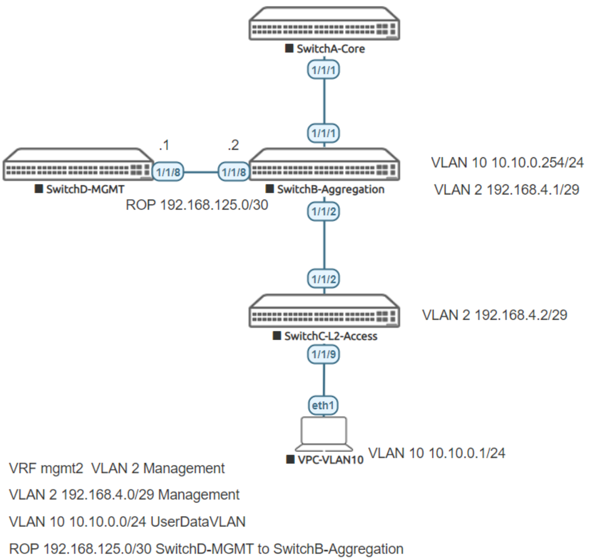

# Lab Guide: Layer 2 Access Switch Management & Connectivity
> [!NOTE]
> This lab is based on the AOS-CX Switch Simulator Labs. A ```topology.clab.yaml``` file was added to use the lab with [containerlab](https://github.com/srl-labs/containerlab). 

> [!IMPORTANT]
> This guide assumes that the AOS-CX Switch Simulator is available as a docker container. You can use [vrnetlab](https://github.com/hellt/vrnetlab) to accomplish this.

>[!NOTE]
> This description is based on the AOS-CX Switch Simulator Lab Guide [L2 Access Switch Management & Connectivity](https://community.arubanetworks.com/HigherLogic/System/DownloadDocumentFile.ashx?DocumentFileKey=d3ad45e8-007c-407b-8812-236bc5b27524) and includes all necessary changes to use the lab with [containerlab](https://github.com/srl-labs/containerlab).

## Lab Objective

The lab will enable the user to gain hands on knowledge and experience in setup basic management
reachability and connectivity to access Layer 2 switches such as the Aruba CX 6100 to and from an upstream
network.

To simulate the Aruba CX 6100, we will limit the features we use in the simulator to replicate this product, such
as using default VRF and static routing.

For further details on Aruba CX 6100 switches and other features please refer to the latest Aruba
documentation located on https://asp.arubanetworks.com/

## Lab Overview

This lab set up is as shown in Figure 1. Aruba CX simulator will be used at both Access, Aggregation and
Management, the Core switch is not used in this lab and is provided for completeness to replicate a possible 3
tier topology and will be used as a follow up in another lab.

At the end of the lab you will be able to Manage the Layer 2 access switch from the upstream management
network as well as send traffic from an endpoint to the upstream network.

In the overall network architecture, we trunk VLANS from Access to Aggregation for User Data, and make one
VLAN have a Layer 3 address on the Access switch to make it reachable for management purposes.

## Lab Network Layout



## Lab Tasks

### Task 1: Lab Setup

- Deploy the containerlab topology file: ```sudo containerlab deploy -t topology.clab.yaml```
  - All the connections between nodes are already set-up
  - Check that sufficient numbers of CPUs and RAM is available for three AOS-CX nodes (at least 1 vCPU and 2048 MB per node)
- Open SSH session to switch B, C, D and log in with user “admin”, password "admin"
- Enter configuration mode from switch prompt

On **Switch B, C, D**:
```
Switch[B-D]# configure terminal
Switch[B-D](config)#
```

- Apply (copy/paste) the baseline configuration to each switch as proposed below

On **Switch B** bring up ```interface 1/1/2``` and ```interface 1/1/8```:

```
interface 1/1/2
  no shutdown
interface 1/1/8
  no shutdown
```
Leave configuration mode by pressing ```Ctrl-z```.

On **Switch C** bring up ```interface 1/1/2```:

```
interface 1/1/2
  no shutdown
```
Leave configuration mode by pressing ```Ctrl-z```.

On **Switch D** bring up ```interface 1/1/8```:

```
interface 1/1/8
  no shutdown
```
Leave configuration mode by pressing ```Ctrl-z```.

Validate LLDP neighbors appear as expected on each switch. Here we show Switch B output only.

```
SwitchB# show lldp neighbor-info

LLDP Neighbor Information 
=========================

Total Neighbor Entries          : 2
Total Neighbor Entries Deleted  : 0
Total Neighbor Entries Dropped  : 0
Total Neighbor Entries Aged-Out : 0

LOCAL-PORT  CHASSIS-ID         PORT-ID                      PORT-DESC                    TTL      SYS-NAME    
-----------------------------------------------------------------------------------------------------------
1/1/2       08:00:09:0a:19:65  1/1/2                        1/1/2                        120      SwitchC                            
1/1/8       08:00:09:1a:6c:ce  1/1/8                        1/1/8                        120      SwitchD  
```

### Task 2: Configure VLANS, IP, VRF and Static Routing

On **Switch B** Aggregation configure:

- Two Vlans 2 and 10, and trunk them on 1/1/2
- Single VRF mgmt2
- Two VLAN interfaces
- Basic IP addressing as per topology, and put VLAN2 in VRF mgmt2 as well as IP of interface 1/1/8

```
SwitchB# configure terminal
SwitchB(config)#
```
Copy/Paste configuration:
```
vlan 2,10
  exit
vlan 2
  description management
vlan 10
  description UserData
  exit
vrf mgmt2
  exit
int vlan 2
  vrf attach mgmt2
  ip address 192.168.4.1/29
int vlan 10
  ip address 10.10.0.254/24
int 1/1/2
  no routing
  vlan trunk allowed 2,10
int 1/1/8
  ip address 192.168.125.2/30
  vrf attach mgmt2
```
Leave configuration mode by pressing ```Ctrl-z```.

On **Switch C** L2 Access configure:

- Two Vlans 2 and 10, and trunk them on 1/1/2
- One VLAN interface (VLAN2) with an IP address applied for management
- Access port 1/1/9 for user data, VLAN 10
- Create a static route to next hop to Switch Aggregation for VLAN 2 ( CX 6100 only has static routes)
- Enable SSH in the default VRF (CX 6100 only has default VRF)
- Test connectivity

```
SwitchB# configure terminal
SwitchB(config)#
```
Copy/Paste configuration:
```
vlan 2,10
  exit
vlan 2
  description management
vlan 10
  description UserData
interface 1/1/2
  no routing
  vlan trunk allowed 2,10
int vlan 2
  ip address 192.168.4.2/29
int 1/1/9
  no routing
  no shut
vlan access 10
  exit
ip route 0.0.0.0/0 192.168.4.1
ssh server vrf default
```
Leave configuration mode by pressing ```Ctrl-z```.

- Validate basic connectivity on VLAN 2, both 192.168.4.1 and 192.168.125.2 on Switch B should be reachable from Switch C:

```
SwitchC# ping 192.168.4.1
PING 192.168.4.1 (192.168.4.1) 100(128) bytes of data.
108 bytes from 192.168.4.1: icmp_seq=1 ttl=64 time=2.50 ms
108 bytes from 192.168.4.1: icmp_seq=2 ttl=64 time=3.63 ms
108 bytes from 192.168.4.1: icmp_seq=3 ttl=64 time=12.7 ms
108 bytes from 192.168.4.1: icmp_seq=4 ttl=64 time=6.45 ms
108 bytes from 192.168.4.1: icmp_seq=5 ttl=64 time=5.84 ms

--- 192.168.4.1 ping statistics ---
5 packets transmitted, 5 received, 0% packet loss, time 4005ms
rtt min/avg/max/mdev = 2.504/6.223/12.704/3.543 ms
SwitchC# 
SwitchC# ping 192.168.125.2
PING 192.168.125.2 (192.168.125.2) 100(128) bytes of data.
108 bytes from 192.168.125.2: icmp_seq=1 ttl=64 time=7.00 ms
108 bytes from 192.168.125.2: icmp_seq=2 ttl=64 time=7.22 ms
108 bytes from 192.168.125.2: icmp_seq=3 ttl=64 time=10.9 ms
108 bytes from 192.168.125.2: icmp_seq=4 ttl=64 time=8.44 ms
108 bytes from 192.168.125.2: icmp_seq=5 ttl=64 time=6.44 ms

--- 192.168.125.2 ping statistics ---
5 packets transmitted, 5 received, 0% packet loss, time 4005ms
rtt min/avg/max/mdev = 6.444/8.000/10.900/1.590 ms
```

On **Switch D** Management configure:

- IP for 1/1/8
- Default Static route to Switch B
- Test SSH connectivity to L2 access

```
SwitchB# configure terminal
SwitchB(config)#
```
Copy/Paste configuration:
```
int 1/1/8
  ip address 192.168.125.1/30
  exit
ip route 0.0.0.0/0 192.168.125.2
```
Leave configuration mode by pressing ```Ctrl-z```.

- Validate basic connectivity from Switch D to Switch C:

```
SwitchD# ping 192.168.4.2
PING 192.168.4.2 (192.168.4.2) 100(128) bytes of data.
108 bytes from 192.168.4.2: icmp_seq=1 ttl=63 time=7.96 ms
108 bytes from 192.168.4.2: icmp_seq=2 ttl=63 time=5.47 ms
108 bytes from 192.168.4.2: icmp_seq=3 ttl=63 time=4.43 ms
108 bytes from 192.168.4.2: icmp_seq=4 ttl=63 time=3.94 ms
108 bytes from 192.168.4.2: icmp_seq=5 ttl=63 time=3.81 ms

--- 192.168.4.2 ping statistics ---
5 packets transmitted, 5 received, 0% packet loss, time 4004ms
rtt min/avg/max/mdev = 3.813/5.121/7.960/1.533 ms
```

- The above essentially shows we have access to the Access switch from our management network. Now
test SSH connectivity from Switch D to Switch C:

```
SwitchD# ssh admin@192.168.4.2
The authenticity of host '192.168.4.2 (192.168.4.2)' can't be established.
ED25519 key fingerprint is SHA256:hzQiak2HkVchubf1Fh+GTaeiQXjEkvJzYaKGelBpOJA.
This key is not known by any other names.
Are you sure you want to continue connecting (yes/no/[fingerprint])? yes
Warning: Permanently added '192.168.4.2' (ED25519) to the list of known hosts.

 The End User License Agreement (EULA) and Additional License Authorization 
 (ALA) documents are available at the following URL: 
 www.arubanetworks.com/arubaos-cx-ova 
 By downloading, copying, or using the AOS-CX OVA you agree to both the 
 End User License Agreement and the Additional License Authorization. 
 AOS-CX Virtual Platform is provided for Training purposes only. 
 As a reminder, there is no support or warranty associated with this platform.

 (C) Copyright 2017-2024 Hewlett Packard Enterprise Development LP

                      RESTRICTED RIGHTS LEGEND
 Confidential computer software. Valid license from Hewlett Packard Enterprise
 Development LP required for possession, use, or copying. License found at
  https://www.arubanetworks.com/assets/legal/EULA.pdf and
  https://www.hpe.com/software/SWLicensing.
 By using the software, you acknowledge that you have read and understand
 the license, represent you are authorized to accept this license, and agree
 to be bound by its terms. If you do not agree to these terms, do not use the
 software. Consistent with FAR 12.211 and 12.212, Commercial Computer Software,
 Computer Software Documentation, and Technical Data for Commercial Items are
 licensed to the U.S. Government under vendor's standard commercial license.


admin@192.168.4.2's password: 
Last login: 2025-02-06 21:22:40 from 172.10.103.1
User "admin" has logged in 2 times in the past 30 days
SwitchC# exit
Connection to 192.168.4.2 closed.
SwitchD# 
```

### Task 3: Test User Connectivity from Virtual PC (VPC)

- Connect to VPC and test Vlan 10 connectivity to upstream Aggregation 10.10.0.254:

```
/ # ping -c 5 10.10.0.254
[*]─[VPC]─[~]
└──> ping -c 5 10.10.0.254
PING 10.10.0.254 (10.10.0.254) 56(84) bytes of data.
64 bytes from 10.10.0.254: icmp_seq=1 ttl=64 time=6.96 ms
64 bytes from 10.10.0.254: icmp_seq=2 ttl=64 time=5.76 ms
64 bytes from 10.10.0.254: icmp_seq=3 ttl=64 time=4.30 ms
64 bytes from 10.10.0.254: icmp_seq=4 ttl=64 time=4.45 ms
64 bytes from 10.10.0.254: icmp_seq=5 ttl=64 time=6.74 ms

--- 10.10.0.254 ping statistics ---
5 packets transmitted, 5 received, 0% packet loss, time 4004ms
rtt min/avg/max/mdev = 4.295/5.639/6.955/1.112 ms

[*]─[VPC]─[~]
└──> 
```

## Appendix: Complete Configurations

If you face issues during your lab, you can verify your configuration with the configuration extract listed in this section.

### Switch B

```
hostname SwitchB
user admin group administrators password ciphertext AQBapcvbxKFLhaWjWGlzvVLos/KlAEHN44Ps8Q+IXYk5SG85YgAAALSdkJ38oP/LJeZrUCydJ9H3ZFKPCE+HRp5vgF/TTF23ExJd6fhNeI2QNTh8nRJOlRvgHPDTJNiK54g7GbU1RTy0nmh9WaOWk8Dyo9eY6kFD5+jWgeLoEr4AAQ/J6EIRRdgh
vrf mgmt2
ntp server pool.ntp.org minpoll 4 maxpoll 4 iburst
ntp enable
ntp vrf mgmt
!
!
!
!
!
!
ssh server vrf mgmt
vlan 1
vlan 2
    description management
vlan 10
    description UserData
interface mgmt
    no shutdown
    ip static 10.0.0.15/24
    default-gateway 10.0.0.2
interface 1/1/2
    no shutdown
    no routing
    vlan trunk native 1
    vlan trunk allowed 2,10
interface 1/1/8                                                
    no shutdown
    vrf attach mgmt2
    ip address 192.168.125.2/30
interface vlan 2
    vrf attach mgmt2
    ip address 192.168.4.1/29
interface vlan 10
    ip address 10.10.0.254/24
!
!
!
!
!
https-server vrf mgmt
```
### SwitchC
```
hostname SwitchC
user admin group administrators password ciphertext AQBapeegWlbYv9gNryXfvhOrpZSO8In9baXxT/nUIMX6gFmiYgAAABQ1ICrqfNTjchQg25wkiEKulStdZuw/a5/czzq/VJNHg4k5QiGkRaTutCJqT1TVvr8UxG6QeL7dLX4UthY8x4zaTONxO269O4ZJycRp+/GVREWYwDA+8Qjz0cCoVBTIQesI
ntp server pool.ntp.org minpoll 4 maxpoll 4 iburst
ntp enable
ntp vrf mgmt
!
!
!
!
!
!
ssh server vrf default
ssh server vrf mgmt
vlan 1
vlan 2
    description management
vlan 10
    description UserData
interface mgmt
    no shutdown
    ip static 10.0.0.15/24
    default-gateway 10.0.0.2
interface 1/1/2
    no shutdown
    no routing
    vlan trunk native 1
    vlan trunk allowed 2,10
interface 1/1/9
    no shutdown
    no routing
    vlan access 10
interface vlan 2
    ip address 192.168.4.2/29
ip route 0.0.0.0/0 192.168.4.1
!
!
!
!
!
https-server vrf mgmt
```
### SwitchD
```
hostname SwitchD
user admin group administrators password ciphertext AQBapcH3ftPvMuGOFbs1bVLJy1noTJChj9tMl4Xoa38eIHkqYgAAAAv82T4gMUYruxY+vvH8ttXZ6HscIFA2zNMC1xogu5gEhaBOsqi5/npzqy8KZe51v4EFD5MKUyFvY8JHOMTR16jQwSk7hz1u/bXMGAXtC9Co0b8n5VfGToy/bywY1H8e6OUZ
ntp server pool.ntp.org minpoll 4 maxpoll 4 iburst
ntp enable
ntp vrf mgmt
!
!
!
!
!
!
ssh server vrf mgmt
vlan 1
interface mgmt
    no shutdown
    ip static 10.0.0.15/24
    default-gateway 10.0.0.2
interface 1/1/8
    no shutdown
    ip address 192.168.125.1/30
ip route 0.0.0.0/0 192.168.125.2
!
!
!
!
!
https-server vrf mgmt
```
