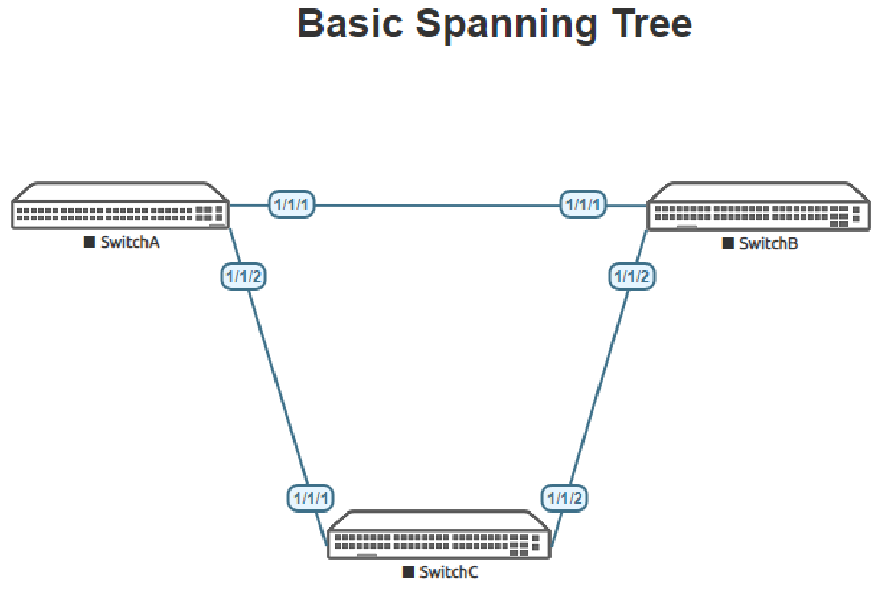
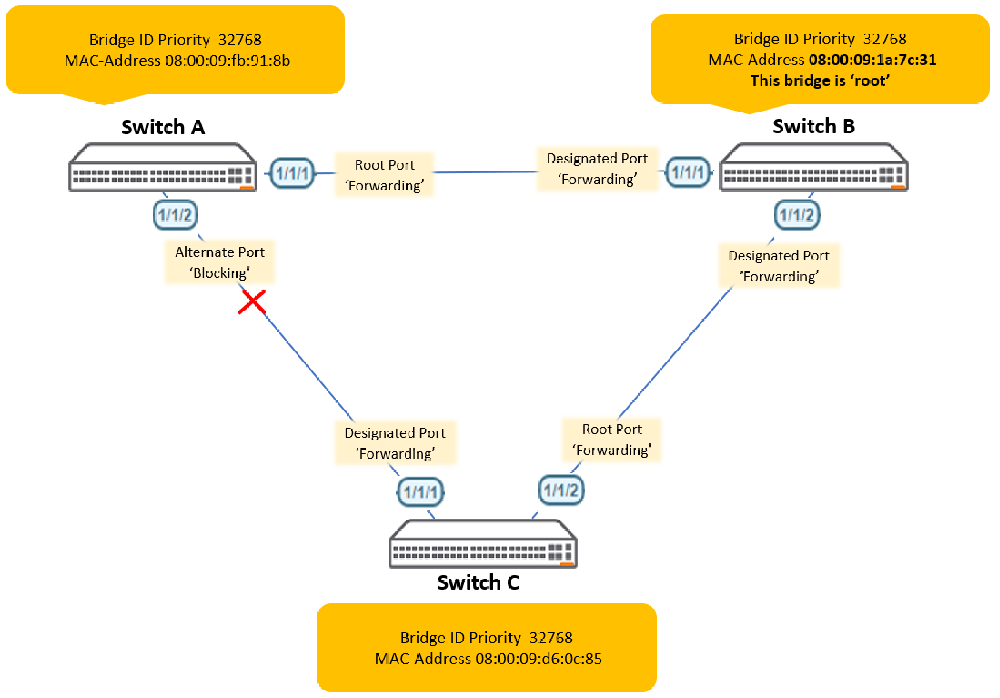
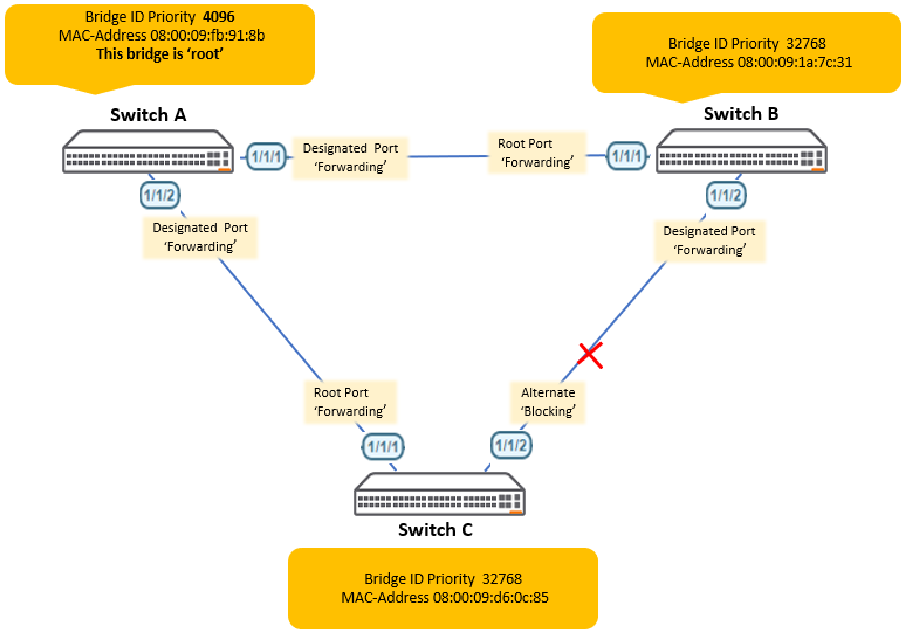
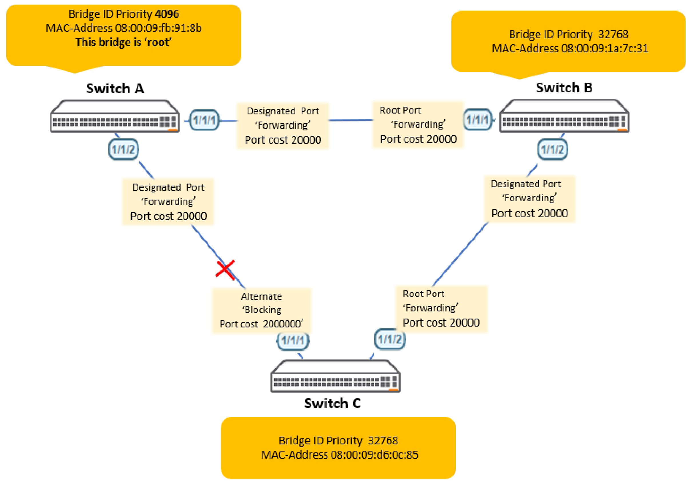

# Lab Guide: Deploying Basic STP
> [!NOTE]
> This lab is based on the AOS-CX Switch Simulator Labs. A ```topology.clab.yaml``` file was added to use the lab with [containerlab](https://github.com/srl-labs/containerlab). 

> [!IMPORTANT]
> This guide assumes that the AOS-CX Switch Simulator is available as a docker container. You can use [vrnetlab](https://github.com/hellt/vrnetlab) to accomplish this.

>[!NOTE]
> This description is based on the AOS-CX Switch Simulator Lab Guide [Deploying Basic STP](https://community.arubanetworks.com/HigherLogic/System/DownloadDocumentFile.ashx?DocumentFileKey=eff7fe89-cf47-46ad-a853-980c80768b66) and includes all necessary changes to use the lab with [containerlab](https://github.com/srl-labs/containerlab).

## Lab Objective

This lab is aimed at audiences who have little knowledge of spanning-tree or wish to have a ‘refresh’ on the key spanning tree
concepts. At the end of this workshop, you will be able to implement and understand the basic configuration to enable the Spanning Tree
Protocol (STP).

The main goal of this lab is to deploy a basic LAN Topology with redundant links, configure and enable spanning -tree and
observe the STP status and behavior under normal conditions.

The key STP concepts of spanning tree root bridge, root port, designated bridge and designated port, path cost and STP timers
are introduced to consolidate understanding.

This lab concentrates on the STP protocol leveraging MSTP with a default region 0 to simplify configuration. MSTP is backwardly
compatible with STP (based on the IEEE 802.1d standard of to eliminate loops at the data link layer in a LAN) and it this
configuration profile which is used in the lab.

In a narrow sense, STP refers to IEEE 802.1d STP. In a broad sense, STP refers to the IEEE 802.1d STP and various enhanced
spanning tree protocols derived from that protocol, such as RPVST+ and MSTP.

The underlying concepts of STP apply to all Spanning tree protocols and it is these fundamental concepts that are the focus of
this lab.

## Lab Overview

LANs often have redundant links as backups in case of failures, but loops are a very serious problem. Devices running STP
detect loops in the network by exchanging information with one another. They eliminate loops by selectively blocking certain
ports to prune the loop structure into a loop-free tree structure. This avoids proliferation and infinite cycling of packets that would
occur in a loop network.

In the lab, MSTP with region 0 , the default region, will be enabled on all switches to participate in the spanning-tree.
- A root bridge will be identified
- Bridge priorities will be changed
- Port costs will be changed

### BPDUs
STP uses bridge protocol data units (BPDUs), also known as configuration messages, as its protocol packets. STP-enabled
network devices exchange BPDUs to establish a spanning tree. STP uses the following types of BPDUs:
- Configuration BPDUs: Used by the network devices to calculate a spanning tree and maintain the spanning tree
topology.
- Topology change notification (TCN) BPDUs: Use to notify network devices of network topology changes.

### Root Bridge
A tree network must have a root bridge. The entire network contains only one root bridge, and all the other
bridges in the network are called leaf nodes. The root bridge is not permanent, but can change with changes
of the network topology.

Upon initialization of a network, each switch device generates and periodically sends configuration BPDUs, with
itself as the root bridge. After network convergence, only the root bridge generates and periodically sends
configuration BPDUs. The other devices only forward the BPDUs.

### Root Port
On a non-root bridge, the port which has the least cost to reach the root bridge is the root port.

The root port communicates with the root bridge. Each non-root bridge has only one root port. The root
bridge has no root port.

### Designated port
A designated port is a not a root port but is it permitted to forward traffic . Designated ports are selected per segment based on
the ‘port’ cost on either side of the segment and used by STP for the total cost calculation back to the root bridge. If one end of a
switch link (segment) is a designated port then the other end is a root port or a ‘blocked’ port. All ports on the root bridge are
assigned as designated ports.

### Alternate port
An alternate port relates to the blocking state of spanning tree (802.1D) . A blocked port is neither the root port or the designated
port.

### Path cost
Path cost is a reference value used fo link selection in STP. STP calculates the path costs to select the preferred links and
blocks redundant links to prune the network into a loop free tree.

## Lab Network Layout

<a name="network-layout"></a>

_Figure 1: MSTP Lab Topology_

## Lab Tasks

### Task 1: Lab Setup

MAC addressing and forwarding states will vary between labs and are presented as examples for illustration along with the
interface forwarding states..

For this lab refer to [Figure 1](#network-layout) for topology.
- Deploy the containerlab topology file: ```sudo containerlab deploy -t topology.clab.yaml```
  - All the connections between nodes are already set-up
  - Check that sufficient numbers of CPUs and RAM is available for three AOS-CX nodes (at least 1 vCPU and 2048 MB per node)
  - Ensure that the environment variable ```AOS_CX_VERSION``` is set to a value that matches the image version (default is ```latest```)
    - If ```AOS_CX_VERSION``` is not set, image ```vrnetlab/aruba_arubaos-cx:latest``` will be deployed
    - If ```AOS_CX_VERSION=20241115202521```, image ```vrnetlab/aruba_arubaos-cx:20241115202521``` will be deployed
- Open SSH session to switch A, B, C and log in with user “admin”, password "admin"
- Enter configuration mode from switch prompt
```
Switch[A-C]# configure terminal
Switch[A-C](config)#
```
On all devices, bring up required ports and remove routing:
```
int 1/1/1-1/1/2
  no shutdown
  no routing
```
Leave configuration mode by pressing ```Ctrl-z```.

Validate LLDP neighbors appear as expected (on SwitchA):
```
show lldp neighbor
```

#### SwitchA

```
SwitchA# sh lldp neighbor-info 

LLDP Neighbor Information 
=========================

Total Neighbor Entries          : 2
Total Neighbor Entries Deleted  : 0
Total Neighbor Entries Dropped  : 0
Total Neighbor Entries Aged-Out : 0

LOCAL-PORT  CHASSIS-ID         PORT-ID                      PORT-DESC                    TTL      SYS-NAME    
-----------------------------------------------------------------------------------------------------------
1/1/1       08:00:09:47:97:db  1/1/1                        1/1/1                        120      SwitchB                            
1/1/2       08:00:09:e4:3b:cf  1/1/1                        1/1/1                        120      SwitchC  
```
## Task 2: Enable Spanning Tree on Switch A, B & C and Review Output
- On all switches, enable spanning tree and set the spanning tree mode to MSTP
- Identify the current root bridge within the topology using the ‘sh spanning-tree’ command

Enter configuration mode on switch A, B, C:
```
Switch[A-C]# configure terminal
Switch[A-C](config)#
```
Enable spanning-tree on all switches:
```
spanning-tree mode mstp
spanning-tree
```
Leave configuration mode by pressing ```Ctrl-z```.

Identify the current root bridge on all switches:
```
show spanning-tree
```
### Example Output

Examine the output. In this case SwitchB was selected as root bridge. In your lab this might be different.

#### SwitchA
```
SwitchA# show spanning-tree
Spanning tree status      : Enabled Protocol: MSTP

MST0
  Root ID    Priority   : 32768
             MAC-Address: 08:00:09:1a:7c:31
             Hello time(in seconds):2  Max Age(in seconds):20
             Forward Delay(in seconds):15

  Bridge ID  Priority   : 32768
             MAC-Address: 08:00:09:fb:91:8b
             Hello time(in seconds):2 Max Age(in seconds):20
             Forward Delay(in seconds):15

Port         Role           State      Cost           Priority   Type             BPDU-Tx    BPDU-Rx    TCN-Tx     TCN-Rx
------------ -------------- ---------- -------------- ---------- ---------------- ---------- ---------- ---------- ----------
1/1/1        Root           Forwarding 20000          128        P2P Bound        39         104        2          2
1/1/2        Alternate      Blocking   20000          128        P2P Bound        21         125        3          4
```

#### SwitchB
```
SwitchB# show spanning-tree 
Spanning tree status      : Enabled Protocol: MSTP

MST0
  Root ID    Priority   : 32768               
             MAC-Address: 08:00:09:1a:7c:31   
             This bridge is the root
             Hello time(in seconds):2  Max Age(in seconds):20
             Forward Delay(in seconds):15

  Bridge ID  Priority  : 32768               
             MAC-Address: 08:00:09:1a:7c:31   
             Hello time(in seconds):2  Max Age(in seconds):20
             Forward Delay(in seconds):15

Port         Role           State      Cost           Priority   Type             BPDU-Tx    BPDU-Rx    TCN-Tx     TCN-Rx
------------ -------------- ---------- -------------- ---------- ---------------- ---------- ---------- ---------- ----------
1/1/1        Designated     Forwarding 20000          128        P2P              359        2          2          2
1/1/2        Designated     Forwarding 20000          128        P2P              359        3          2          2

```

#### SwitchC
```
SwitchC# show spanning-tree 
Spanning tree status      : Enabled Protocol: MSTP

MST0
  Root ID    Priority   : 32768               
             MAC-Address: 08:00:09:1a:7c:31   
             Hello time(in seconds):2  Max Age(in seconds):20
             Forward Delay(in seconds):15

  Bridge ID  Priority  : 32768               
             MAC-Address: 08:00:09:d6:0c:85   
             Hello time(in seconds):2  Max Age(in seconds):20
             Forward Delay(in seconds):15

Port         Role           State      Cost           Priority   Type             BPDU-Tx    BPDU-Rx    TCN-Tx     TCN-Rx
------------ -------------- ---------- -------------- ---------- ---------------- ---------- ---------- ---------- ----------
1/1/1        Designated     Blocking   20000          128        P2P              586        4          4          3
1/1/2        Root           Forwarding 20000          128        P2P Bound        23         564        2          2
```

#### Bridge Priorities
Every switch participating spanning tree has a bridge priority. The switch with the lowest bridge priority becomes the ‘root’ bridge.
The default bridge priority is 37268 and all switches in this example have the default bridge priority of 32768.

- The tie break if each spanning tree switch ‘bridge’ has the same bridge priority is the bridge mac address.
- If all switches have the same spanning tree bridge priority the switch with the lowest bridge mac address becomes the
root bridge.

In the example, Switch A, Switch B & Switch C output is shown. All switches have the same bridge priority, but Switch B has a lower
bridge mac address and becomes the root bridge.

#### Switch A STP Interface Port Status
```
Port         Role           State      Cost           Priority   Type             BPDU-Tx    BPDU-Rx    TCN-Tx     TCN-Rx
------------ -------------- ---------- -------------- ---------- ---------------- ---------- ---------- ---------- ----------
1/1/1        Root           Forwarding 20000          128        P2P Bound        39         104        2          2
1/1/2        Alternate      Blocking   20000          128        P2P Bound        21         125        3          4
```
Port 1/1/1 is in the ‘Root‘ port role and is in the 'Forwarding' state to the root bridge – to Switch B.
Port 1/1/2 is in the ‘Alternate’ port role and is in the ‘Blocking’ state – to Switch C.

#### Switch B STP Interface Port Status
```
Port         Role           State      Cost           Priority   Type             BPDU-Tx    BPDU-Rx    TCN-Tx     TCN-Rx
------------ -------------- ---------- -------------- ---------- ---------------- ---------- ---------- ---------- ----------
1/1/1        Designated     Forwarding 20000          128        P2P              359        2          2          2
1/1/2        Designated     Forwarding 20000          128        P2P              359        3          2          2
```
Ports 1/1/1 & 1/1/2 are both in the ‘Designated’ port role and are forwarding to Switch A and Switch C respectively.

#### Switch C STP Interface Port Status
```
Port         Role           State      Cost           Priority   Type             BPDU-Tx    BPDU-Rx    TCN-Tx     TCN-Rx
------------ -------------- ---------- -------------- ---------- ---------------- ---------- ---------- ---------- ----------
1/1/1        Designated     Forwarding 20000          128        P2P              586        4          4          3
1/1/2        Root           Forwarding 20000          128        P2P Bound        23         564        2          2
```
Port 1/1/2 is the root forwarding port. The port with the least cost to the root bridge.
Port 1/1/1 is in the designated forwarding state.

Switch A port 1/1/2 is in the alternate blocking state to provide a loop free network.

The spanning tree topology in this example will look like the example below (exact port forwarding states in other labs may vary
from this example):



- The STP root bridge will have all STP ports in the ‘designated forwarding’ Role.
- Other switches, non-root bridges, participating in STP will have 1 port designated as the ‘Root Port Forwarding’. This is
the port which has the least cost to reach the root bridge and is the root port
- Other ports on non-root bridges will either be in the ‘Designated Port Forwarding ‘ role which is a non-root port but
permitted to forward traffic or in the alternate port ‘blocking’ state to prevent a bridging ‘loop’.

## Task 3: Changing Bridge Priorities
On Switch A change the spanning priority to make Switch A the ‘root’ bridge by changing the ‘bridge priority’. Switch A may
already be the root bridge by having the lowest mac address.

```
SwitchA# configure terminal
SwitchA(config)# spanning-tree priority 1
SwitchA(config)# exit
SwitchA# show spanning-tree
```
The root bridge priority will change to 4096 and Switch A will become the ‘root’ bridge and interfaces 1/1/1 and 1/1/2 will both be
in the ‘designated forwarding’ role.

The CX-OS spanning priorities range from 0-15. Each number has a value of ‘4096’ . The default bridge priority id 32768,
equaling the value 8, as the default spanning priority (8*4096=32768).

### SwitchA
```
SwitchA# show spanning-tree 
Spanning tree status      : Enabled Protocol: MSTP

MST0
  Root ID    Priority   : 4096                
             MAC-Address: 08:00:09:fb:91:8b   
             This bridge is the root
             Hello time(in seconds):2  Max Age(in seconds):20
             Forward Delay(in seconds):15

  Bridge ID  Priority  : 4096                
             MAC-Address: 08:00:09:fb:91:8b   
             Hello time(in seconds):2  Max Age(in seconds):20
             Forward Delay(in seconds):15

Port         Role           State      Cost           Priority   Type             BPDU-Tx    BPDU-Rx    TCN-Tx     TCN-Rx
------------ -------------- ---------- -------------- ---------- ---------------- ---------- ---------- ---------- ----------
1/1/1        Designated     Forwarding 20000          128        P2P              52         1212       6          4
1/1/2        Designated     Forwarding 20000          128        P2P              1258       4          4          3
```
Enter the ```show spanning-tree``` command on switch B & C and identify which port is in the ‘alternate port blocking’ state
Each switch bridge should recognize a change in the STP root bridge priority, a change in the root bridge mac address and the
STP port role state will change on each switch for each port participating in STP.

### SwitchB
```
SwitchB# show spanning-tree 
Spanning tree status      : Enabled Protocol: MSTP

MST0
  Root ID    Priority   : 4096                
             MAC-Address: 08:00:09:fb:91:8b   
             Hello time(in seconds):2  Max Age(in seconds):20
             Forward Delay(in seconds):15

  Bridge ID  Priority  : 32768               
             MAC-Address: 08:00:09:1a:7c:31   
             Hello time(in seconds):2  Max Age(in seconds):20
             Forward Delay(in seconds):15

Port         Role           State      Cost           Priority   Type             BPDU-Tx    BPDU-Rx    TCN-Tx     TCN-Rx
------------ -------------- ---------- -------------- ---------- ---------------- ---------- ---------- ---------- ----------
1/1/1        Root           Forwarding 20000          128        P2P Bound        1212       117        4          6
1/1/2        Designated     Forwarding 20000          128        P2P              1323       6          4          2
```
### SwitchC
```
SwitchC# show spanning-tree 
Spanning tree status      : Enabled Protocol: MSTP

MST0
  Root ID    Priority   : 4096                
             MAC-Address: 08:00:09:fb:91:8b   
             Hello time(in seconds):2  Max Age(in seconds):20
             Forward Delay(in seconds):15

  Bridge ID  Priority  : 32768               
             MAC-Address: 08:00:09:d6:0c:85  
             Hello time(in seconds):2  Max Age(in seconds):20
             Forward Delay(in seconds):15

Port         Role           State      Cost           Priority   Type             BPDU-Tx    BPDU-Rx    TCN-Tx     TCN-Rx
------------ -------------- ---------- -------------- ---------- ---------------- ---------- ---------- ---------- ----------
1/1/1        Root           Forwarding 20000          128        P2P Bound        4          1367       3          4
1/1/2        Alternate      Blocking   20000          128        P2P Bound        6          1367       3          4
```
The spanning tree topology in this example will now look like the example below(exact port forwarding states in other labs ma y
vary from this example):



## Task 4: Changing Port Costs
There may be situations where the forwarding root port may not be the preferred interface to forward data and the alternate
blocking or designated forwarding ports maybe the preferable STP ‘root’ forwarding port on a switch. Port costs can be changed
on each interface which can alter the forwarding/blocking STP roles.

- On Switch C, change the ‘root’ port forwarding interface cost from the default cost of 20000 (10Gbps) to 2000000
(10mbps). This will be on the interface directly connect to the root bridge.(interface 1/1/1)

An example below on Switch C with Switch A as root using the default port costs:
```
Port         Role           State      Cost           Priority   Type             BPDU-Tx    BPDU-Rx    TCN-Tx     TCN-Rx
------------ -------------- ---------- -------------- ---------- ---------------- ---------- ---------- ---------- ----------
1/1/1        Root           Forwarding 20000          128        P2P Bound        4          1367       3          4
1/1/2        Alternate      Blocking   20000          128        P2P Bound        6          1367       3          4
```
### On Switch C
Change interface 1/1/1 to reflect a port cost of 2000000 (to reflect a low speed 10mbps link):
```
SwitchC(config)# interface 1/1/1
SwitchC(config-if)# spanning-tree cost 2000000
SwitchC(config-if)# exit
SwitchC(config)# exit
SwitchC#
```
Review the changed port cost with the ‘show spanning-tree’ command:
```
Port         Role           State      Cost           Priority   Type             BPDU-Tx    BPDU-Rx    TCN-Tx     TCN-Rx
------------ -------------- ---------- -------------- ---------- ---------------- ---------- ---------- ---------- ----------
1/1/1        Alternate      Blocking   2000000        128        P2P Bound        6          1713       4          6
1/1/2        Root           Forwarding 20000          128        P2P Bound        10         1712       5          6
```

The STP port roles are now reversed as interface 1/1/1 is now perceived to be further away from the root bridge with a higher
path cost back to the root even though it is directly connected to the root bridge.

By default, a port cost is defined by the speed at which the port operates and is directly related to the ports associated
bandwidth. A port with the lowest accumulated cost to the root bridge will become the ‘root ‘ forwarding port. If an interface cost
is not configured, the cost is determined by the interface link speed and the number of ‘hops’ to the root bridge.

The default interface port costs are:
- 10 Mbps link speed equals a path cost of 2,000,000.
- 100 Mbps link speed equals a path cost of 200,000.
- 1 Gbps link speed equals a path cost of 20,000.
- 2 Gbps link speed equals a path cost of 10,000.
- 10 Gbps link speed equals a path cost of 2,000.
- 100 Gbps link speed equals a path cost of 200.
- 1 Tbps link speed equals a path cost of 20.

The final STP topology in the lab will look like:



## Appendix: Complete Configurations
### SwitchA
```
hostname SwitchA
user admin group administrators password ciphertext AQBapRP4eyWA5tEEa6qeQgQ12QprME60gsSKGJQm9nxKAkABYgAAABFGsJwyivdAQo33rFOjUF3xebqiSFN2MpE7rA2PwLaXysFXQoRFO9BrJPve89xqYP/Vjcikz7HsQrR/v2AvbIDVIzRvLYXWNuQ3NJD3a4/i+lX2NVmGx0zP0KB8gf5Z50/l
ntp server pool.ntp.org minpoll 4 maxpoll 4 iburst
ntp enable
ntp vrf mgmt
!
!
!
!
!
!
ssh server vrf mgmt
vlan 1
spanning-tree
spanning-tree priority 1
interface mgmt
    no shutdown
    ip static 10.0.0.15/24
    default-gateway 10.0.0.2
interface 1/1/1
    no shutdown
    no routing
    vlan access 1
interface 1/1/2
    no shutdown
    no routing
    vlan access 1
!
!
!
!
!
https-server vrf mgmt
```
### SwitchB
```
hostname SwitchB
user admin group administrators password ciphertext AQBapfJvMitywDNljmBbw1QaDx7Gp4Hom8uUfDM99ukhn6QpYgAAAGnDmW91DrEdFrmfOxAtnjLHeuL65SbuHS4hdeE8KUeVSwqVlC6zTSa8dPU/G95/zjb2IGyX8QaZLM5cG8PYcX3BxdQgPRrZD3H4VpozccFBZv+yXH7lI/gCcpPGY2ZzJ2Bk
ntp server pool.ntp.org minpoll 4 maxpoll 4 iburst
ntp enable
ntp vrf mgmt
!
!
!
!
!
!
ssh server vrf mgmt
vlan 1
spanning-tree
interface mgmt
    no shutdown
    ip static 10.0.0.15/24
    default-gateway 10.0.0.2
interface 1/1/1
    no shutdown
    no routing
    vlan access 1
interface 1/1/2
    no shutdown
    no routing
    vlan access 1
!
!
!
!
!
https-server vrf mgmt
```
### SwitchC
```
hostname SwitchC
user admin group administrators password ciphertext AQBapca4r/Gr4cNw1Bjr/nIo+fLQWFwwSkm3/u3OBlmt8VWcYgAAADiuhwUlt7sFK40UpMhKR8JKzt2H3g9B4DrJTlG4IqZHksnozJrSUnnca5CNYK+A7GsFUEPeGkxwWKubZTQqhc7HbglBYikdBVlPlOnFezR8CrefWXqR37XonSi07+T0Sh+/
ntp server pool.ntp.org minpoll 4 maxpoll 4 iburst
ntp enable
ntp vrf mgmt
!
!
!
!
!
!
ssh server vrf mgmt
vlan 1
spanning-tree
interface mgmt
    no shutdown
    ip static 10.0.0.15/24
    default-gateway 10.0.0.2
interface 1/1/1
    no shutdown
    no routing
    vlan access 1
    spanning-tree cost 2000000
interface 1/1/2
    no shutdown
    no routing
    vlan access 1
!
!
!
!
!
https-server vrf mgmt
```

