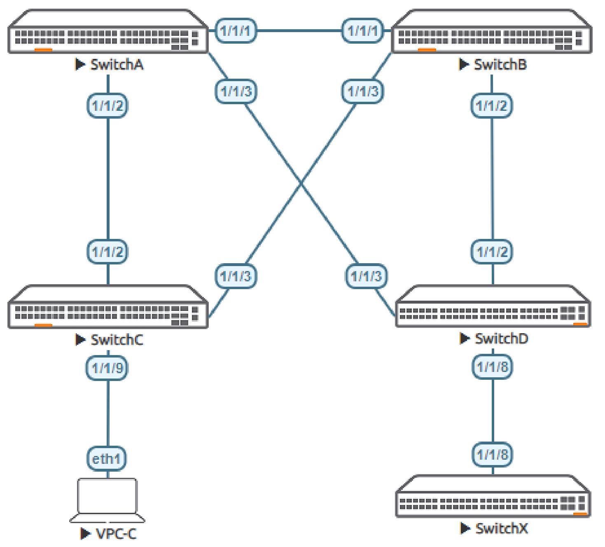
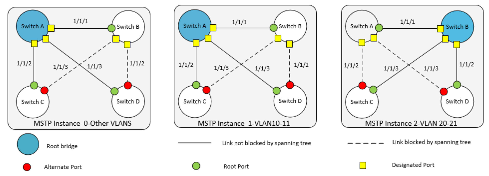
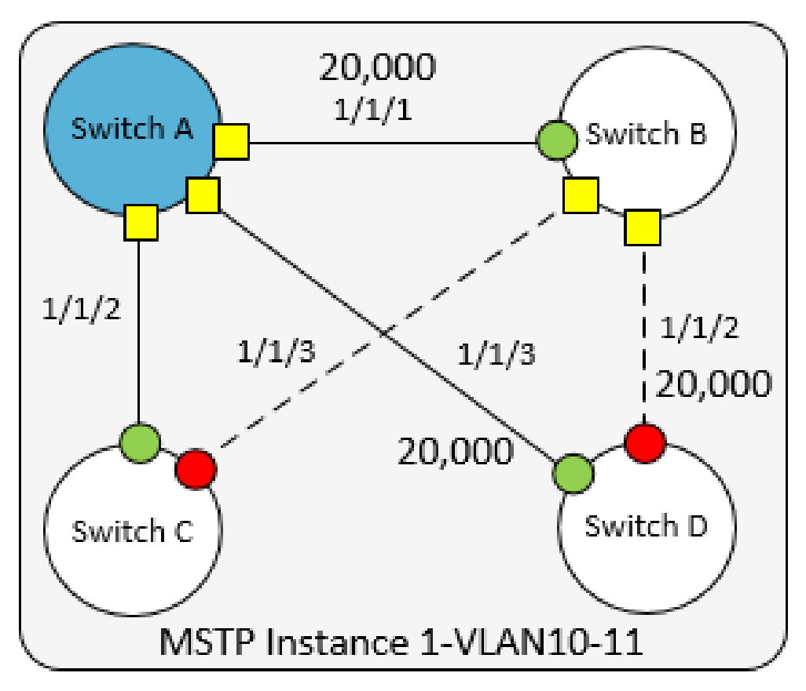

# Lab Guide: MSTP Fundamentals
> [!NOTE]
> This lab is based on the AOS-CX Switch Simulator Labs. A ```topology.clab.yaml``` file was added to use the lab with [containerlab](https://github.com/srl-labs/containerlab). 

> [!IMPORTANT]
> This guide assumes that the AOS-CX Switch Simulator is available as a docker container. You can use [vrnetlab](https://github.com/hellt/vrnetlab) to accomplish this.

>[!NOTE]
> This description is based on the AOS-CX Switch Simulator Lab Guide [MSTP Fundamentals](https://community.arubanetworks.com/HigherLogic/System/DownloadDocumentFile.ashx?DocumentFileKey=2c13c379-10c6-432c-9454-41691e5b6c3b) and includes all necessary changes to use the lab with [containerlab](https://github.com/srl-labs/containerlab).

## Lab Objective
At the end of this lab you will be able to implement the basic configuration of Multiple Spanning Tree Protocol (MSTP) and
show how MSTP creates a loop free VLAN topology with other Aruba CX switches.

The use case for MSTP is to provide a loop free redundant multipath Layer 2 network. MSTP is the default Spanning Tree
Protocol for Aruba CX switches

For further details on MSTP please refer to the latest Aruba documentation located on https://asp.arubanetworks.com/

## Lab Overview
This lab set up is as shown in [Figure 1](#network-layout) and [Figure 2](#mstp-topology).This will allow the reader to observe the behavior of MSTP
This lab covers configuration of the following:

- MSTP and VLAN mappings. (MSTP is the default STP for Aruba CX switches.)
- Root bridge placement and Identification
- STP timers and edge ports
- STP protection mechanisms

## Lab Network Layout

<a name="network-layout"></a>

_Figure 1: MSTP Lab Topology_

## Lab Tasks

### Task 1: Lab Setup
For this lab refer to [Figure 1](lab-network-layout) for topology setup. Open each switch console and log in with user 'admin' and password 'admin'.

Note: Switch X will be configured later in the lab. The Virtual PC (VPC-C) is not required to be configured and just shown to
represent an access port.
- Change all hostnames as shown in the topology:

On Switch A and B bring up required ports:
```
Switch[A-B]# configure terminal
Switch[A-B](config)#
```
Copy/Paste the configuration to Switch A and Switch B:
```
int 1/1/1-1/1/3
  no routing
  no shutdown
``` 
Leave configuration mode by pressing ```Ctrl-z```.

On Switch C and D bring up required ports:
```
SwitchC# configure terminal
SwitchC(config)#
```
Copy/Paste the configuration to Switch C and Switch D:
```
int 1/1/2-1/1/3
  no routing
  no shutdown
```
Leave configuration mode by pressing ```Ctrl-z```.

Validate LLDP neighbors appear as expected on each switch. Here we show Switch A output only.

If all switches have been configured as shown in [Figure 1](#lab-network-layout) you should see Switch B, C and D via Switch A as shown
below using LLDP. It is left to the reader to check other switches respectively.

```
SwitchA# show lldp neighbor-info 

LLDP Neighbor Information 
=========================

Total Neighbor Entries          : 3
Total Neighbor Entries Deleted  : 0
Total Neighbor Entries Dropped  : 0
Total Neighbor Entries Aged-Out : 0

LOCAL-PORT  CHASSIS-ID         PORT-ID                      PORT-DESC                    TTL      SYS-NAME    
-----------------------------------------------------------------------------------------------------------
1/1/1       08:00:09:d4:06:2b  1/1/1                        1/1/1                        120      SwitchB                            
1/1/2       08:00:09:ad:14:df  1/1/2                        1/1/2                        120      SwitchC                            
1/1/3       08:00:09:28:77:6b  1/1/3                        1/1/3                        120      SwitchD 
```

### Task 2: Configure MSTP and VLAN Mappings
Now set up MSTP, Root bridges and map VLANs as per [Figure 2](#mstp-topology):
- VLAN 10-11 assigned to MSTP instance 1, Root bridge Switch A, Secondary Root bridge Switch B
- VLAN 20-21 assigned to MSTP instance 2 Root bridge Switch B, Secondary Root bridge Switch A
- All other VLANs assigned to the default MSTP 0 as shown below Switch A

> [!NOTE] Having deterministic Root and Secondary Root bridges is a typically accepted design, these are placed at the Core of the Layer 2 domain, as shown in Figure 2, where Switch A and Switch B are the core/center of the Layer 2 domain as well as providing Root redundancy for one another.

<a name="mstp-topology"></a>

_Figure 2: MSTP Topology_

On Switch A add VLAN 10-11 and 20-21. Configure STP making Switch A Root for VLAN 10-11 instance 1 and Secondary Root for 20-21 instance 2, then trunk all VLANs for interface 1/1/1 to 1/1/3. Here also make Switch A the Root for the CIST:

```
SwitchA# configure terminal
SwitchA(config)#
```
Copy/Paste the configuration to Switch A:
```
vlan 10-11,20-21
  exit
spanning-tree
spanning-tree config-name sp1
spanning-tree config-revision 1
spanning-tree instance 1 vlan 10-11
spanning-tree instance 2 vlan 20-21
spanning-tree priority 0
spanning-tree instance 1 priority 0
spanning-tree instance 2 priority 1
int 1/1/1-1/1/3
  vlan trunk allowed all
  vlan trunk native 1
  exit
```
Leave configuration mode by pressing ```Ctrl-z```.

Command description:
- ```spanning-tree instance 1 vlan 10-11``` => Map vlans to instance 1
- ```spanning-tree instance 2 vlan 20-21``` => Map vlans to instance 1
- ```spanning-tree priority 0```=> MST 0 Root
- ```spanning-tree instance 1 priority 0``` => MST 1 Root
- ```spanning-tree instance 2 priority 1``` => MST 2 Secondary Root

On Switch B add VLAN 10-11 and 20-21. Configure STP making Switch B Root for VLAN 20-11 instance 2 and Secondary Root for 10-11 instance 1,then trunk all VLANs for interface 1/1/1 to 1/1/3:

```
SwitchB# configure terminal
SwitchB(config)#
```
Copy/Paste the configuration to Switch B:
```
vlan 10-11,20-21
  exit
spanning-tree
spanning-tree config-name sp1
spanning-tree config-revision 1
spanning-tree instance 1 vlan 10-11
spanning-tree instance 2 vlan 20-21
spanning-tree instance 1 priority 1
spanning-tree instance 2 priority 0
int 1/1/1-1/1/3
  vlan trunk allowed all
  vlan trunk native 1
  exit
```
Leave configuration mode by pressing ```Ctrl-z```.

Command description:
- ```spanning-tree instance 1 priority 1``` => MST 1 Secondary Root
- ```spanning-tree instance 2 priority 0``` => MST 2 Root

On Switch C and D define the VLANs and add MSTP mapping to VLANs:
```
Switch[C-D]# configure terminal
Switch[C-D](config)#
```
Copy/Paste the configuration to Switch C and Switch D:
```
vlan 10-11,20-21
  exit
spanning-tree
spanning-tree config-name sp1
spanning-tree config-revision 1
spanning-tree instance 1 vlan 10-11
spanning-tree instance 2 vlan 20-21
int 1/1/2-1/1/3
  vlan trunk allowed all
  vlan trunk native 1
  exit
```
Leave configuration mode by pressing ```Ctrl-z```.

### Taks 3: Check Configurations and Output

Examine and check configuration and mappings from Switch A:

```
SwitchA# show spanning-tree summary root
STP status                   : Enabled
Protocol                     : MSTP
System ID                    : 08:00:09:6d:18:fc

Root bridge for STP Instance : 0,1

                                                Root Hello Max Fwd              
Instance ID     Priority Root ID                cost  Time Age Dly    Root Port
--------------- -------- ----------------- --------- ----- --- --- ------------
0                      0 08:00:09:6d:18:fc         0     2  20  15            0
1                      0 08:00:09:6d:18:fc         0     2  20  15            0
2                      0 08:00:09:d4:06:2b     20000     2  20  15        1/1/1
```
As shown above Switch A is Root for Instance 0 and 1 identified by the System ID, and Instance 2 Root is another device
which is expected to be Switch B based on previous configurations.

Examine switch B and check Root switches are as expected:

```
SwitchB# show spanning-tree summary root 
STP status                   : Enabled
Protocol                     : MSTP
System ID                    : 08:00:09:d4:06:2b

Root bridge for STP Instance : 2

                                                Root Hello Max Fwd              
Instance ID     Priority Root ID                cost  Time Age Dly    Root Port
--------------- -------- ----------------- --------- ----- --- --- ------------
0                      0 08:00:09:6d:18:fc     20000     2  20  15        1/1/1
1                      0 08:00:09:6d:18:fc     20000     2  20  15        1/1/1
2                      0 08:00:09:d4:06:2b         0     2  20  15            0
```
As shown above Switch B is Root for Instance 2 based on the identified System ID, and Instance 0 and 1 Root is SwitchA
System ID.

Continue to check switch C and D in a similar fashion (not shown in this lab guide).

Now examine the behavior of ports and their state by examining spanning tree state. The logical topology in [Figure 2](#mstp-topology) for each switch can be observed showing a loop free Layer 2 topology.

```
SwitchA# show spanning-tree mst
#### MST0      
Vlans mapped:  1-9,12-19,22-4094
Bridge         Address:08:00:09:6d:18:fc    priority:0
Root          
Regional Root 
Operational    Hello time(in seconds): 2  Forward delay(in seconds):15  Max-age(in seconds):20  txHoldCount(in pps): 6
Configured     Hello time(in seconds): 2  Forward delay(in seconds):15  Max-age(in seconds):20  Max-Hops:20
Root           Address:08:00:09:6d:18:fc  Priority:0
               Port:0                     Path cost:0
Regional Root  Address:08:00:09:6d:18:fc  Priority:0
               Internal cost:0            Rem Hops:20

Port           Role           State      Cost       Priority   Type             BPDU-Tx    BPDU-Rx    TCN-Tx     TCN-Rx
-------------- -------------- ---------- ---------- ---------- ---------------- ---------- ---------- ---------- ----------
1/1/1          Designated     Forwarding 20000      128        P2P              600        478        11         8
1/1/2          Designated     Forwarding 20000      128        P2P              599        8          8          4
1/1/3          Designated     Forwarding 20000      128        P2P              597        10         3          4

Topology change flag          : True
Number of topology changes    : 8
Last topology change occurred : 864 seconds ago


#### MST1
Vlans mapped:  10,11
Bridge         Address:08:00:09:6d:18:fc    Priority:0
Root           Address:08:00:09:6d:18:fc    Priority:0
               Port:0, Cost:0, Rem Hops:20

Port           Role           State      Cost       Priority   Type             BPDU-Tx    BPDU-Rx    TCN-Tx     TCN-Rx
-------------- -------------- ---------- ---------- ---------- ---------------- ---------- ---------- ---------- ----------
1/1/1          Designated     Forwarding 20000      128        P2P              600        478        11         8
1/1/2          Designated     Forwarding 20000      128        P2P              599        8          8          4
1/1/3          Designated     Forwarding 20000      128        P2P              597        10         3          4

Topology change flag          : True
Number of topology changes    : 8
Last topology change occurred : 864 seconds ago


#### MST2
Vlans mapped:  20,21
Bridge         Address:08:00:09:6d:18:fc    Priority:4096
Root           Address:08:00:09:d4:06:2b    Priority:0
               Port:1/1/1, Cost:20000, Rem Hops:19

Port           Role           State      Cost       Priority   Type             BPDU-Tx    BPDU-Rx    TCN-Tx     TCN-Rx
-------------- -------------- ---------- ---------- ---------- ---------------- ---------- ---------- ---------- ----------
1/1/1          Root           Forwarding 20000      128        P2P              600        478        11         8
1/1/2          Designated     Forwarding 20000      128        P2P              599        8          8          4
1/1/3          Designated     Forwarding 20000      128        P2P              597        10         3          4

Topology change flag          : True
Number of topology changes    : 6
Last topology change occurred : 867 seconds ago
```
As shown above Switch A for instance 0 and 1 all ports are Designated and Forwarding, instance 2 has a Root port 1/1/1
towards Switch B the Root switch for VLANs 20-21, and other ports are Designated Forwarding leading to Switch C and D
respectively.

The reader can continue to check switch B, C and D in a similar fashion (not shown in this lab guide) and build a logical
picture of the MSTP instances as shown in [Figure 2](#mstp-topology).

### Task 4: Path Cost
Now examine path cost and the MSTP port state from Switch D perspective in MSTP instance 1.

- In Figure 3 below the Root port path cost to the Root Switch A from Switch D perspective is 20,000 via port 1/1/3
- The next alternate path is via 1/1/2 with the next lowest path being through Switch B port 1/1/1 . This next alternate
best path cost is 40,000 (_20,000 (Switch D interface 1/1/2) + 20,000 (Switch B interface 1/1/1)_) and is the
summation of associated link cost.

<a name="network-layout"></a>

_Figure 3: MSTP path cost from Switch D_


Check the port roles and cost from Switch D perspective:

```
SwitchD# show spanning-tree mst 1


#### MST1
Vlans mapped:  10,11
Bridge         Address:08:00:09:28:77:6b    Priority:32768
Root           Address:08:00:09:6d:18:fc    Priority:0
               Port:1/1/3, Cost:20000, Rem Hops:19

Port           Role           State      Cost       Priority   Type             BPDU-Tx    BPDU-Rx    TCN-Tx     TCN-Rx
-------------- -------------- ---------- ---------- ---------- ---------------- ---------- ---------- ---------- ----------
1/1/2          Alternate      Blocking   20000      128        P2P              726        722        5          2
1/1/3          Root           Forwarding 20000      128        P2P              10         719        4          3

Topology change flag          : True
Number of topology changes    : 3
Last topology change occurred : 1437 seconds ago
```
Above we see the local path costs on Switch D, port 1/1/3 being the Forwarding Root port and 1/1/2 being the Blocked
Alternate port.

Now manipulate the cost to change the MSTP instance 1 topology from Switch D perspective, by changing the cost
on Root port. To influence a change in this topology we need to increase cost to greater than 40,000, based on our
earlier calculation:

```
SwitchD# configure terminal
SwitchD(config)#
```
Copy/Paste the configuration to Switch D:
```
int 1/1/3
  spanning-tree instance 1 cost 40001
```
Leave configuration mode by pressing ```Ctrl-z```.

Command description:
- ```spanning-tree instance 1 cost 40001``` => change the path cost on the interface to 40001 or more

Check port roles on Switch D:
```
SwitchD# show spanning-tree mst 1


#### MST1
Vlans mapped:  10,11
Bridge         Address:08:00:09:28:77:6b    Priority:32768
Root           Address:08:00:09:6d:18:fc    Priority:0
               Port:1/1/2, Cost:40000, Rem Hops:18

Port           Role           State      Cost       Priority   Type             BPDU-Tx    BPDU-Rx    TCN-Tx     TCN-Rx
-------------- -------------- ---------- ---------- ---------- ---------------- ---------- ---------- ---------- ----------
1/1/2          Root           Forwarding 20000      128        P2P              901        895        5          2
1/1/3          Alternate      Blocking   40001      128        P2P              13         894        4          3

Topology change flag          : True
Number of topology changes    : 4
Last topology change occurred : 15 seconds ago
```
As shown above by manipulating the path cost the behavior of the ports roles were changed.

> [!NOTE] Default cost is calculated based on port link speed for the Aruba CX OVA the ports simulate 1GbEs and are set to
20,000. Please refer to Layer 2 birding guide to get the path cost for various speed ports.

### Task 5: MSTP Timers and Tuning

Detailed information around STP timers is beyond the scope of this lab guide. However, it is possible to change some MSTP
timers to tune and improve convergence time. However, use of such parameters depends on design and architecture of a
network as it can impact switch resources under certain conditions.

- spanning-tree forward-delay is the time spent in the listening and learning state. This time is equal to 15
seconds by default, and can be tuned between 4 and 30 seconds
- spanning-tree hello-time is the time between each Bridge Protocol Data Unit (BPDU) that are sent on a port.
The default is 2 seconds and can be tuned between 2 and 10 sec.
- spanning-tree max-age is the interval, specified in the BPDU, that BPDU data remains valid after its reception.
The bridge re-computes the spanning tree topology if it does not receive a new BPDU before max-age expiry.
Default is 20 Seconds and can be changed between 6 and 20 Seconds.

The above three parameters are mentioned for completeness. For this lab guide we will explore:
- spanning-tree port-type admin-edge which is primarily designed to optimize ports that are connected to end
points to allow the ports to transition directly to forwarding, circumventing the learning and listening phase.

On Switch C configure the following:

```
SwitchC# configure terminal
SwitchC(config)#
```
Copy/Paste the configuration to Switch C:
```
int 1/1/9
  no shut
  no routing
  vlan access 10
```
Leave configuration mode by pressing ```Ctrl-z```.

Now examine the ports on Switch C:
```
SwitchC# show spanning-tree mst 1


#### MST1
Vlans mapped:  10,11
Bridge         Address:08:00:09:ad:14:df    Priority:32768
Root           Address:08:00:09:6d:18:fc    Priority:0
               Port:1/1/2, Cost:20000, Rem Hops:19

Port           Role           State      Cost       Priority   Type             BPDU-Tx    BPDU-Rx    TCN-Tx     TCN-Rx
-------------- -------------- ---------- ---------- ---------- ---------------- ---------- ---------- ---------- ----------
1/1/2          Root           Forwarding 20000      128        P2P              8          1079       4          8
1/1/3          Alternate      Blocking   20000      128        P2P              1083       1079       6          1
1/1/9          Designated     Forwarding 20000      128        P2P              25         0          0          0

Topology change flag          : True
Number of topology changes    : 1
Last topology change occurred : 2149 seconds ago
```
In the above we can see the newly configured switch port act like a regular P2P port and we know that it will go into a
learning and listening phase which is undesirable for ports connected to endpoints.

On Switch C configure the following:

```
SwitchC# configure terminal
SwitchC(config)#
```
Copy/Paste the configuration to Switch C:
```
int 1/1/9
  spanning-tree port-type admin-edge
```
Leave configuration mode by pressing ```Ctrl-z```.

Now examine the ports on Switch C:
```
SwitchC# show spanning-tree mst 1


#### MST1
Vlans mapped:  10,11
Bridge         Address:08:00:09:ad:14:df    Priority:32768
Root           Address:08:00:09:6d:18:fc    Priority:0
               Port:1/1/2, Cost:20000, Rem Hops:19

Port           Role           State      Cost       Priority   Type             BPDU-Tx    BPDU-Rx    TCN-Tx     TCN-Rx
-------------- -------------- ---------- ---------- ---------- ---------------- ---------- ---------- ---------- ----------
1/1/2          Root           Forwarding 20000      128        P2P              40         1167       4          21
1/1/3          Alternate      Blocking   20000      128        P2P              1197       1157       27         1
1/1/9          Designated     Forwarding 20000      128        P2P Edge         117        0          0          0

Topology change flag          : True
Number of topology changes    : 7
Last topology change occurred : 7 seconds ago
```
In the above we can now see the newly configured switch port is in a different mode 'P2P Edge'. This port will now go into
forwarding mode when an endpoint is connected.

### Task 6: Spanning Tree Protection

Various security mechanisms are in place to protect spanning true configurations from interference and protect from rouge
devices. We will explore both BPDU guard and Root guard.

**BPDU protection** secures the active MSTP topology by preventing spoofed BPDU packets from entering the MSTP
domain. Typically BPDU protection would be applied to edge ports connected to end user devices that do not run MSTP. If
MSTP BPDU packets are received on a protected port, this feature disables the port and an alerts can be sent out
accordingly.

On Switch D configure BPDU guard:
```
SwitchD# configure terminal
SwitchD(config)#
```
Copy/Paste the configuration to Switch D:
```
interface 1/1/8
  no shutdown
  no routing
  vlan access 10
  spanning-tree bpdu-guard
```
Leave configuration mode by pressing ```Ctrl-z```.

Activate console logging in SSH-session of Switch D:
```
SwitchD# terminal-monitor  
Terminal-monitor is enabled successfully
```

On Switch X configure the following:
```
SwitchX# configure terminal
SwitchX(config)#
```
Copy/Paste the configuration to Switch X:
```
spanning-tree
interface 1/1/8
  no shutdown
  no routing
  vlan access 1
  exit 
```
Leave configuration mode by pressing ```Ctrl-z```.

Observe the output on Switch D. It can be observed that the port 1/1/8 is disabled as we received a BPDU on port 1/1/8
from Switch X. Timeouts can be configured to re-enable the port, not covered in this guide.

```
2025-02-08T20:29:54.176953+00:00 SwitchD hpe-mstpd[889]: Event|2007|LOG_WARN|AMM|1/1|Port 1/1/8 disabled - BPDU received on protected port
```

Below port 1/1/8 is disabled due to “Bpdu-Error”:
```
SwitchD# show spanning-tree mst 1


#### MST1
Vlans mapped:  10,11
Bridge         Address:08:00:09:28:77:6b    Priority:32768
Root           Address:08:00:09:6d:18:fc    Priority:0
               Port:1/1/2, Cost:40000, Rem Hops:18

Port           Role           State      Cost       Priority   Type             BPDU-Tx    BPDU-Rx    TCN-Tx     TCN-Rx
-------------- -------------- ---------- ---------- ---------- ---------------- ---------- ---------- ---------- ----------
1/1/2          Root           Forwarding 20000      128        P2P              1450       1391       19         13
1/1/3          Alternate      Blocking   40001      128        P2P              135        1358       17         17
1/1/8          Disabled       Bpdu-Error 20000      128        P2P              29         0          0          0

Topology change flag          : True
Number of topology changes    : 25
Last topology change occurred : 73 seconds ago
```
Below observe the state of the interface 1/1/8 on Switch D is down as expected, due to Bpdu-Error:
```
Interface 1/1/8 is down 
 Admin state is up
 ...
```
Deactivate console logging in SSH-session of Switch D:
```
SwitchD# no terminal-monitor  
```

> [!NOTE]
> On Switch X OVA Simulator toggle the port “shut” to “no shut” may be required to enable BPDU initially.

**Root Protection** secures the active MSTP topology by preventing other switches declaring their ability to propagate
superior BPDU, containing both better information on the root bridge and path cost to the root bridge,
which would normally replace the current root bridge selection.

In this lab setup enable Root guard on Switch A 1/1/2 and Switch B 1/1/3 respectively and then try and make Switch C the
Root for Instance 1 and observe the behavior:

```
SwitchA# configure terminal
SwitchA(config)#
```
Copy/Paste the configuration to Switch A:
```
interface 1/1/2
  spanning-tree root-guard
  exit
```
Leave configuration mode by pressing ```Ctrl-z```.

```
SwitchB# configure terminal
SwitchB(config)#
```
Copy/Paste the configuration to Switch B:
```
interface 1/1/3
  spanning-tree root-guard
  exit
```
Leave configuration mode by pressing ```Ctrl-z```.

Make Switch C Root for instance 1:
```
SwitchC# configure terminal
SwitchC(config)#
```
Copy/Paste the configuration to Switch C:
```
spanning-tree instance 1 priority 0
```
Leave configuration mode by pressing ```Ctrl-z```.

Below observe that on instance 1 both Switch A and B ports go into Root Inconsistent Alternate for instance 1. Thus
protecting the rest of the network from the information that Switch C is sending 'better' BPDUs, and maintaining Layer 2
stability.

```
SwitchA# sh spanning-tree mst
#### MST0      
Vlans mapped:  1-9,12-19,22-4094
Bridge         Address:08:00:09:d6:83:2f    priority:0
Root          
Regional Root 
Operational    Hello time(in seconds): 2  Forward delay(in seconds):15  Max-age(in seconds):20  txHoldCount(in pps): 6
Configured     Hello time(in seconds): 2  Forward delay(in seconds):15  Max-age(in seconds):20  Max-Hops:20
Root           Address:08:00:09:d6:83:2f  Priority:0
               Port:0                     Path cost:0
Regional Root  Address:08:00:09:d6:83:2f  Priority:0
               Internal cost:0            Rem Hops:20

Port           Role           State      Cost       Priority   Type             BPDU-Tx    BPDU-Rx    TCN-Tx     TCN-Rx
-------------- -------------- ---------- ---------- ---------- ---------------- ---------- ---------- ---------- ----------
1/1/1          Designated     Forwarding 20000      128        P2P              142        138        5          4
1/1/2          Designated     Forwarding 20000      128        P2P              144        18         6          5
1/1/3          Designated     Forwarding 20000      128        P2P              142        5          3          3

Topology change flag          : True
Number of topology changes    : 6
Last topology change occurred : 268 seconds ago


#### MST1
Vlans mapped:  10,11
Bridge         Address:08:00:09:d6:83:2f    Priority:0
Root           Address:08:00:09:d6:83:2f    Priority:0
               Port:0, Cost:0, Rem Hops:20

Port           Role           State      Cost       Priority   Type             BPDU-Tx    BPDU-Rx    TCN-Tx     TCN-Rx
-------------- -------------- ---------- ---------- ---------- ---------------- ---------- ---------- ---------- ----------
1/1/1          Designated     Forwarding 20000      128        P2P              142        138        5          4
1/1/2          Alternate      Root-Inc   20000      128        P2P              144        18         6          5
1/1/3          Designated     Forwarding 20000      128        P2P              142        5          3          3

Topology change flag          : True
Number of topology changes    : 6
Last topology change occurred : 268 seconds ago


#### MST2
Vlans mapped:  20,21
Bridge         Address:08:00:09:d6:83:2f    Priority:4096
Root           Address:08:00:09:b2:b6:b5    Priority:0
               Port:1/1/1, Cost:20000, Rem Hops:19

Port           Role           State      Cost       Priority   Type             BPDU-Tx    BPDU-Rx    TCN-Tx     TCN-Rx
-------------- -------------- ---------- ---------- ---------- ---------------- ---------- ---------- ---------- ----------
1/1/1          Root           Forwarding 20000      128        P2P              142        138        5          4
1/1/2          Designated     Forwarding 20000      128        P2P              144        18         6          5
1/1/3          Designated     Forwarding 20000      128        P2P              142        5          3          3

Topology change flag          : True
Number of topology changes    : 6
Last topology change occurred : 268 seconds ago
```

```
SwitchB# sh spanning-tree mst
#### MST0      
Vlans mapped:  1-9,12-19,22-4094
Bridge         Address:08:00:09:b2:b6:b5    priority:32768
Operational    Hello time(in seconds): 2  Forward delay(in seconds):15  Max-age(in seconds):20  txHoldCount(in pps): 6
Configured     Hello time(in seconds): 2  Forward delay(in seconds):15  Max-age(in seconds):20  Max-Hops:20
Root           Address:08:00:09:d6:83:2f  Priority:0
               Port:1/1/1                 Path cost:0
Regional Root  Address:08:00:09:d6:83:2f  Priority:0
               Internal cost:20000        Rem Hops:19

Port           Role           State      Cost       Priority   Type             BPDU-Tx    BPDU-Rx    TCN-Tx     TCN-Rx
-------------- -------------- ---------- ---------- ---------- ---------------- ---------- ---------- ---------- ----------
1/1/1          Root           Forwarding 20000      128        P2P              141        141        4          5
1/1/2          Designated     Forwarding 20000      128        P2P              143        7          4          2
1/1/3          Alternate      Blocking   20000      128        P2P              143        142        0          5

Topology change flag          : True
Number of topology changes    : 3
Last topology change occurred : 275 seconds ago


#### MST1
Vlans mapped:  10,11
Bridge         Address:08:00:09:b2:b6:b5    Priority:4096
Root           Address:08:00:09:d6:83:2f    Priority:0
               Port:1/1/1, Cost:20000, Rem Hops:19

Port           Role           State      Cost       Priority   Type             BPDU-Tx    BPDU-Rx    TCN-Tx     TCN-Rx
-------------- -------------- ---------- ---------- ---------- ---------------- ---------- ---------- ---------- ----------
1/1/1          Root           Forwarding 20000      128        P2P              141        141        4          5
1/1/2          Designated     Forwarding 20000      128        P2P              143        7          4          2
1/1/3          Alternate      Root-Inc   20000      128        P2P              143        142        0          5

Topology change flag          : True
Number of topology changes    : 5
Last topology change occurred : 275 seconds ago


#### MST2
Vlans mapped:  20,21
Bridge         Address:08:00:09:b2:b6:b5    Priority:0
Root           Address:08:00:09:b2:b6:b5    Priority:0
               Port:0, Cost:0, Rem Hops:20

Port           Role           State      Cost       Priority   Type             BPDU-Tx    BPDU-Rx    TCN-Tx     TCN-Rx
-------------- -------------- ---------- ---------- ---------- ---------------- ---------- ---------- ---------- ----------
1/1/1          Designated     Forwarding 20000      128        P2P              141        141        4          5
1/1/2          Designated     Forwarding 20000      128        P2P              143        7          4          2
1/1/3          Designated     Forwarding 20000      128        P2P              143        142        0          5

Topology change flag          : True
Number of topology changes    : 5
Last topology change occurred : 275 seconds ago
```

## Appendix: Complete Configurations

- If you face issues during your lab, you can verify your configs with the configs listed in this section

### SwitchA
```
hostname SwitchA
user admin group administrators password ciphertext AQBapYc3sIom1gGTwNTqpA8HU+91kzyHkQd8rPUwuo6QCn/AYgAAAFikc91gBBBN5qMNJBxdQDlmZ/KEtGRFjXlsTAYLpA0RIPZhH4NdBdKSUAsrFR435/fQ9oR+9HrnsNgNZmyRofaJ4BkSh9ZA4rjD1GvKbe19Hgun16h9XSQon4YgjMkJrrGz
ntp server pool.ntp.org minpoll 4 maxpoll 4 iburst
ntp enable
ntp vrf mgmt
!
!
!
!
!
!
ssh server vrf mgmt
vlan 1,10-11,20-21
spanning-tree
spanning-tree priority 0
spanning-tree config-name sp1
spanning-tree config-revision 1
spanning-tree instance 1 vlan 10,11
spanning-tree instance 1 priority 0
spanning-tree instance 2 vlan 20,21
spanning-tree instance 2 priority 1
interface mgmt
    no shutdown
    ip static 10.0.0.15/24
    default-gateway 10.0.0.2
interface 1/1/1
    no shutdown
    no routing
    vlan trunk native 1
    vlan trunk allowed all
interface 1/1/2
    no shutdown
    no routing
    vlan trunk native 1
    vlan trunk allowed all
    spanning-tree root-guard
interface 1/1/3
    no shutdown
    no routing
    vlan trunk native 1
    vlan trunk allowed all
!
!
!
!
!
https-server vrf mgmt
```

### SwitchB
```
hostname SwitchB
user admin group administrators password ciphertext AQBapS2xvHyCxQWnbIkcS2Bs03qq3CO6l4t/AId+Nj47dZUdYgAAAAAYWcBNJJOllaHw1/xiGFKyaL/mCMpXtJHqSQN6JK9wKt7FIOFCaQJGy/tVumDrYrut45J6NvRELGHuCvUkTUg3Qhj/nZg5A5DWoq6UIvjpA0kZHFR+XGJNNEKi8s3nupeY
ntp server pool.ntp.org minpoll 4 maxpoll 4 iburst
ntp enable
ntp vrf mgmt
!
!
!
!
!
!
ssh server vrf mgmt
vlan 1,10-11,20-21
spanning-tree
spanning-tree config-name sp1
spanning-tree config-revision 1
spanning-tree instance 1 vlan 10,11
spanning-tree instance 1 priority 1
spanning-tree instance 2 vlan 20,21
spanning-tree instance 2 priority 0
interface mgmt
    no shutdown
    ip static 10.0.0.15/24
    default-gateway 10.0.0.2
interface 1/1/1
    no shutdown
    no routing
    vlan trunk native 1
    vlan trunk allowed all
interface 1/1/2
    no shutdown
    no routing
    vlan trunk native 1
    vlan trunk allowed all
interface 1/1/3
    no shutdown
    no routing
    vlan trunk native 1
    vlan trunk allowed all
    spanning-tree root-guard
!
!
!
!
!
https-server vrf mgmt
```

### SwitchC
```
hostname SwitchC
user admin group administrators password ciphertext AQBapThUnQmu5n5Br06nJ1TXGlQbzUfl+Sr8BhPAnxgKs9UvYgAAAK4SL9B54nNVi23kiJarQDgIExzenU3SSCDU8F4v5wKX3JkCsbgxd8bDCYyJtK3YH+o80vJSszh095q59k1uRzhf7yZFFHPEvbw+4bTRVlw7QjUhAt2hR5iZBLbVbVsKOZPe
ntp server pool.ntp.org minpoll 4 maxpoll 4 iburst
ntp enable
ntp vrf mgmt
!
!
!
!
!
!
ssh server vrf mgmt
vlan 1,10-11,20-21
spanning-tree
spanning-tree config-name sp1
spanning-tree config-revision 1
spanning-tree instance 1 vlan 10,11
spanning-tree instance 1 priority 0
spanning-tree instance 2 vlan 20,21
interface mgmt
    no shutdown
    ip static 10.0.0.15/24
    default-gateway 10.0.0.2
interface 1/1/2
    no shutdown
    no routing
    vlan trunk native 1
    vlan trunk allowed all
interface 1/1/3
    no shutdown
    no routing
    vlan trunk native 1
    vlan trunk allowed all
interface 1/1/9
    no shutdown
    no routing
    vlan access 10
    spanning-tree port-type admin-edge
!
!
!
!
!
https-server vrf mgmt
```

### SwitchD
```
hostname SwitchD
user admin group administrators password ciphertext AQBapbML06Ga+O9p3W4jdy26LJ4TC71mjLakxQ6DcYKhmD58YgAAANhaiMhBuKOoATyl9FRlLQDxFH7apNUMzJHccFwzlvoKJLovA6/sAZC3upcAGkcGZTOrxcPMnPvlVcE7BD4MD29tglgpBQk8d78UqGwa7KyrldjkeqU+Spgh6Gn4pk6V3Bby
ntp server pool.ntp.org minpoll 4 maxpoll 4 iburst
ntp enable
ntp vrf mgmt
!
!
!
!
!
!
ssh server vrf mgmt
vlan 1,10-11,20-21
spanning-tree
spanning-tree config-name sp1
spanning-tree config-revision 1
spanning-tree instance 1 vlan 10,11
spanning-tree instance 2 vlan 20,21
interface mgmt
    no shutdown
    ip static 10.0.0.15/24
    default-gateway 10.0.0.2
interface 1/1/2
    no shutdown
    no routing
    vlan trunk native 1
    vlan trunk allowed all
interface 1/1/3
    no shutdown
    no routing
    vlan trunk native 1
    vlan trunk allowed all
    spanning-tree instance 1 cost 40001
interface 1/1/8
    no shutdown
    no routing
    vlan access 10
    spanning-tree bpdu-guard
!
!
!
!
!
https-server vrf mgmt
```
### SwitchX
```
hostname SwitchX
user admin group administrators password ciphertext AQBapeej/pG/qcNdvDT+oZmXfeQlgqUg7dAL+CbtrAOVX+GuYgAAAJS+J3xdhAxmQKbH9DpBcdlcLQDL8ObC2ze7MpCaAaUMObQX/CZmxaHCzoPu6ZPhS1Cs/M4/jjkvvdpQaI6YBnfwD1c9rRnbluOsaqLHwZ0y0oorQ8qJfJXIO/84LN2cPr1w
ntp server pool.ntp.org minpoll 4 maxpoll 4 iburst
ntp enable
ntp vrf mgmt
!
!
!
!
!
!
ssh server vrf mgmt
vlan 1
spanning-tree
interface mgmt
    no shutdown
    ip static 10.0.0.15/24
    default-gateway 10.0.0.2
interface 1/1/8
    no shutdown
    no routing
    vlan access 1
!
!
!
!
!
https-server vrf mgmt
```
