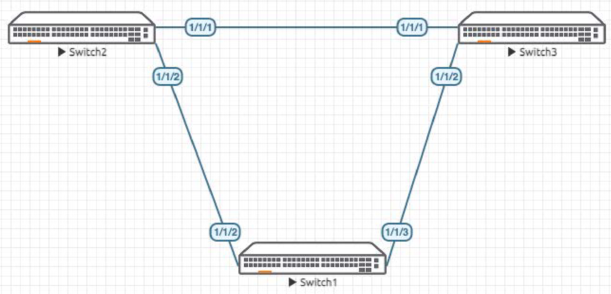
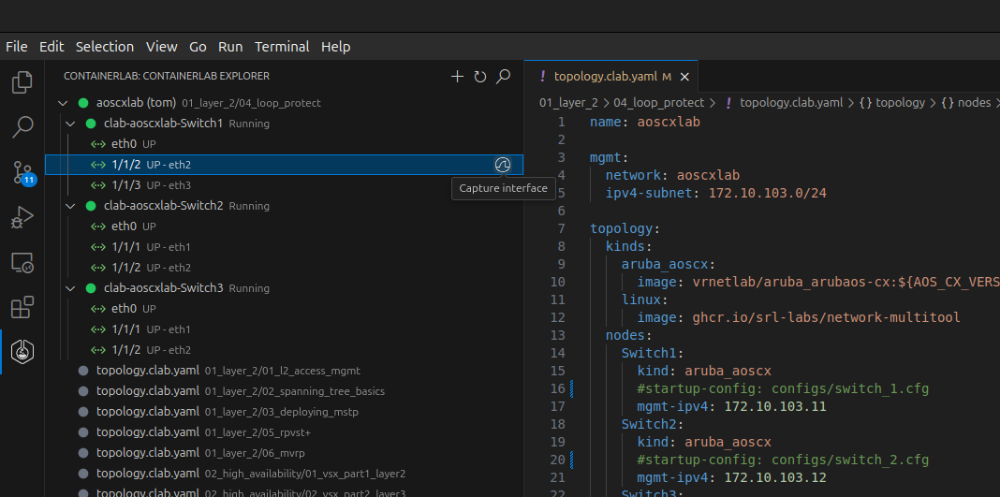
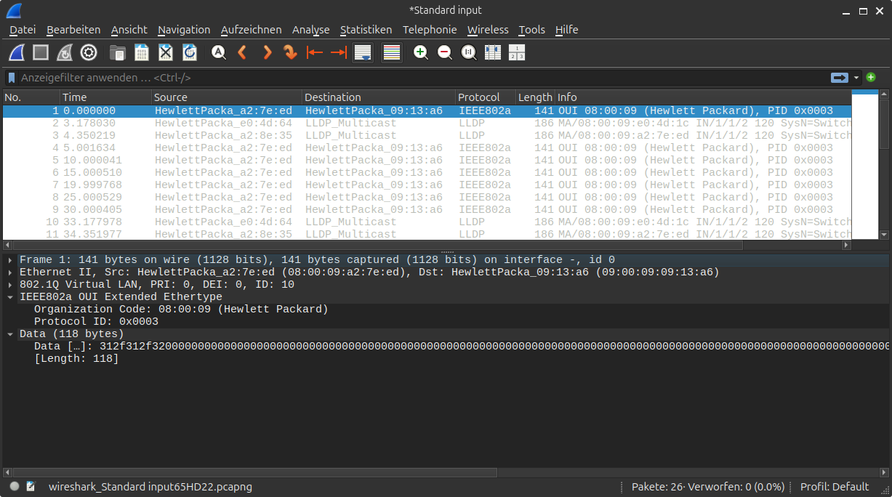

# Lab Guide: MSTP Fundamentals
> [!NOTE]
> This lab is based on the AOS-CX Switch Simulator Labs. A ```topology.clab.yaml``` file was added to use the lab with [containerlab](https://github.com/srl-labs/containerlab). 

> [!IMPORTANT]
> This guide assumes that the AOS-CX Switch Simulator is available as a docker container. You can use [vrnetlab](https://github.com/hellt/vrnetlab) to accomplish this.

> [!NOTE]
> This description is based on the AOS-CX Switch Simulator Lab Guide [Loop Protect](https://community.arubanetworks.com/HigherLogic/System/DownloadDocumentFile.ashx?DocumentFileKey=715a0eb9-e240-4016-8530-e06cda75a7b1) and includes all necessary changes to use the lab with [containerlab](https://github.com/srl-labs/containerlab).

## Lab Objective
This lab will provide hands on experience with the Loop Protect feature in AOS-CX.
Loop protect is helpful in environments where STP cannot be used to detect and prevent loops in an L2 network.

## Lab Network Layout

<a name="network-layout"></a>

_Figure 1: Lab topology_

## Lab Tasks

### Task 1: Lab Setup
For this lab refer to [Figure 1](#network-layout) for topology setup.
- Deploy the containerlab topology file: ```sudo containerlab deploy -t topology.clab.yaml```
  - All the connections between nodes are already set-up
  - Check that sufficient numbers of CPUs and RAM is available for three AOS-CX nodes (at least 1 vCPU and 2048 MB per node)
  - Ensure that the environment variable ```AOS_CX_VERSION``` is set to a value that matches the image version (default is ```latest```)
    - If ```AOS_CX_VERSION``` is not set, image ```vrnetlab/aruba_arubaos-cx:latest``` will be deployed
    - If ```AOS_CX_VERSION=20241115202521```, image ```vrnetlab/aruba_arubaos-cx:20241115202521``` will be deployed
- Open SSH session to each switch and log in with user 'admin' and password 'admin'.

On all devices, bring up required ports:
```
Switch[1-3]# configure terminal
Switch[1-3](config)#
```
Copy/Paste the configuration to Switch 1, Switch 2 and Switch 3:
```
int 1/1/1-1/1/6
  no shutdown
```
Leave configuration mode by pressing ```Ctrl-z```.

Validate LLDP neighbors appear as expected on each switch:

```
Switch1# sh lldp neighbor-info 

LLDP Neighbor Information 
=========================

Total Neighbor Entries          : 2
Total Neighbor Entries Deleted  : 0
Total Neighbor Entries Dropped  : 0
Total Neighbor Entries Aged-Out : 0

LOCAL-PORT  CHASSIS-ID         PORT-ID                      PORT-DESC                    TTL      SYS-NAME    
-----------------------------------------------------------------------------------------------------------
1/1/2       08:00:09:d8:ac:54  1/1/2                        1/1/2                        120      Switch2                            
1/1/3       08:00:09:dc:4d:e4  1/1/2                        1/1/2                        120      Switch3 

```
Check this also on Switch2 and Switch3.

### Task 2: Configure VLANs and Interfaces

Configure interfaces, 802.1q trunks and required VLANs on these three switches:

#### Switch1
Configure Switch 1 and leave configuration mode by pressing ```Ctrl-z```:
```
Switch1# configure terminal 
Switch1(config)# vlan 10-11
Switch1(config-vlan-<10-11>)# int 1/1/2-1/1/3
Switch1(config-if-<1/1/2-1/1/3>)# no routing 
Switch1(config-if-<1/1/2-1/1/3>)# vlan trunk allowed 10-11
Switch1(config-if-<1/1/2-1/1/3>)# int 1/1/3
Switch1(config-if)# shutdown
Switch1(config-if-<1/1/2-1/1/3>)# ^Z

Switch1# 
```
#### Switch2
Configure Switch 2 and leave configuration mode by pressing ```Ctrl-z```:
```
Switch2# configure terminal 
Switch2(config)# vlan 10-11
Switch2(config-vlan-<10-11>)# int 1/1/1-1/1/2
Switch2(config-if-<1/1/1-1/1/2>)# no routing 
Switch2(config-if-<1/1/1-1/1/2>)# vlan trunk allowed 10-11
Switch2(config-if-<1/1/1-1/1/2>)# ^Z

Switch2# 
```
#### Switch3
Configure Switch 3 and leave configuration mode by pressing ```Ctrl-z```.
```
Switch3# configure terminal 
Switch3(config)# vlan 10-11
Switch3(config-vlan-<10-11>)# int 1/1/1-1/1/2
Switch3(config-if-<1/1/1-1/1/2>)# no routing 
Switch3(config-if-<1/1/1-1/1/2>)# vlan trunk allowed 10-11```
Switch3(config-if-<1/1/1-1/1/2>)# ^Z

Switch3# 
```


### Task 3: Enable Loop Protect on Switch1
Enable loop protect on ports to other switches, enabling it on 1 VLAN will be sufficient to detect loops.
Configure Switch 1 and leave configuration mode by pressing ```Ctrl-z```:
```
Switch1# configure terminal 
Switch1(config)# int 1/1/2-1/1/3
Switch1(config-if-<1/1/2-1/1/3>)# loop-protect
Switch1(config-if-<1/1/2-1/1/3>)# loop-protect vlan 10
Switch1(config-if-<1/1/2-1/1/3>)# ^Z

Switch1# 
```
Verify loop protect on ports:
```
Switch1# show loop-protect 

Status and Counters - Loop Protection Information

Transmit Interval             : 5 (sec)
Port Re-enable Timer          : Disabled
Loop Detected Trap            : Disabled

Interface 1/1/2 
  Loop-protect enabled        : Yes
  Loop-Protect enabled VLANs  : 10
  Action on loop detection    : TX disable 
  Loop detected count         : 0
  Loop detected               : No
  Interface status            : up

Interface 1/1/3 
  Loop-protect enabled        : Yes
  Loop-Protect enabled VLANs  : 10
  Action on loop detection    : TX disable 
  Loop detected count         : 0
  Loop detected               : No
  Interface status            : down
```
Start packet capture on Switch1 interface 1/1/2 (connected to Switch2):

> [!NOTE] 
> This lab guide assumes that you are using Visual Studio Code together with the [vscode-containerlab extension](https://github.com/srl-labs/vscode-containerlab), available on [Visual Studio Marketplace](https://marketplace.visualstudio.com/items?itemName=srl-labs.vscode-containerlab) and [Open VSX Registry](https://open-vsx.org/extension/srl-labs/vscode-containerlab).

<a name="start-packet-capture"></a>

_Figure 2: Start Packet Capture_

You should see the protocol ID: 0x0003 packets being sent into the network that are used for loop protect detection with
source MAC info:

<a name="packet-capture"></a>

_Figure 2: Packet Capture Window_

### Task 4: Enable Loop and Verify Loop is Prevented on Switch1

On Switch1, unshut 1/1/3 to create loop  and leave configuration mode by pressing ```Ctrl-z```::
```
Switch1# configure terminal 
Switch1(config)# int 1/1/3
Switch1(config-if)# no shutdown 
Switch1(config-if)# ^Z

Switch1#
```
If a loop protect packet is received by the same switch that sent it, it indicates a loop exists and one of the following actions is
taken:
- Discovery of the loop is logged but port states are not changed
- The sending port is disabled
- The sending and receiving ports are both disabled

Verify loop is detected and prevented as 1 of the ports is disabled (default loop protect behaviour):
```
Switch1# sh loop-protect 

Status and Counters - Loop Protection Information

Transmit Interval             : 5 (sec)
Port Re-enable Timer          : Disabled
Loop Detected Trap            : Disabled

Interface 1/1/2 
  Loop-protect enabled        : Yes
  Loop-Protect enabled VLANs  : 10
  Action on loop detection    : TX disable 
  Loop detected count         : 0
  Loop detected               : No
  Interface status            : up

Interface 1/1/3 
  Loop-protect enabled        : Yes
  Loop-Protect enabled VLANs  : 10
  Action on loop detection    : TX disable 
  Loop detected count         : 1
  Loop detected               : Yes
    Detected on VLAN          : 10
    Detected at               : 2025-02-16T17:48:46
  Interface status            : down
```
As you can see, in this case interface 1/1/3 was disabled by loop protection.

## Appendix: Complete Configurations

- If you face issues during your lab, you can verify your configs with the configs listed in this section

### Switch1
```
hostname Switch1
user admin group administrators password ciphertext AQBapUukaNsR7U/C8Wq/qltVdSMlNWARu/4ulaWS0dS1WAO0YgAAAIx4oY7agyXB8RD1rL0OhQqm+HIdt1BpaFrpAC4Xdb5hp8VALmMymuD8wSpiRj190V4B+wlSNKwWS4OT3wUf8PX7fMC3HPnVeFW37qoddENuCnZsPtJEY6lJ8mbYscTa1XxA
ntp server pool.ntp.org minpoll 4 maxpoll 4 iburst
ntp enable
ntp vrf mgmt
!
!
!
!
!
!
ssh server vrf mgmt
vlan 1,10-11
interface mgmt
    no shutdown
    ip static 10.0.0.15/24
    default-gateway 10.0.0.2
interface 1/1/1
    no shutdown
interface 1/1/2
    no shutdown
    no routing
    vlan trunk native 1
    vlan trunk allowed 10-11
    loop-protect
    loop-protect vlan 10
interface 1/1/3
    no shutdown
    no routing
    vlan trunk native 1
    vlan trunk allowed 10-11
    loop-protect
    loop-protect vlan 10
interface 1/1/4
    no shutdown
interface 1/1/5
    no shutdown
interface 1/1/6
    no shutdown                                                
!
!
!
!
!
https-server vrf mgmt
```

### Switch2
```
hostname Switch2
user admin group administrators password ciphertext AQBapXrPFrnJXP4bTaIcGqQ5cPqniN6Mv+4u4eO6O7nL/ebXYgAAAKmtyXFbJYmKzGPwlNT1AsaO/NPIs37oguHl3HEFWGAqqlKxWAHErkDwIHb4CVCgxiF2g31utRsDVjhzNsSIB5LspfmKgqiBMXrnYG4K/o4bCqVJz7TEDQe4aRznnP+yASJS
ntp server pool.ntp.org minpoll 4 maxpoll 4 iburst
ntp enable
ntp vrf mgmt
!
!
!
!
!
!
ssh server vrf mgmt
vlan 1,10-11
interface mgmt
    no shutdown
    ip static 10.0.0.15/24
    default-gateway 10.0.0.2
interface 1/1/1
    no shutdown
    no routing
    vlan trunk native 1
    vlan trunk allowed 10-11
interface 1/1/2
    no shutdown
    no routing
    vlan trunk native 1
    vlan trunk allowed 10-11
interface 1/1/3
    no shutdown
interface 1/1/4
    no shutdown
interface 1/1/5
    no shutdown
interface 1/1/6
    no shutdown
!
!
!
!                                                              
!
https-server vrf mgmt
```

### Switch3
```
hostname Switch3
user admin group administrators password ciphertext AQBapR4lAOI6OBA9+CxrARQ3BbYeLA1BgvtUPQYz06SIhRmUYgAAAMNxEv9ulQsZy6AJU9N8tRqeikI7jSmSXBgHYejmkZ/jK5at5jCBRBBoCNS54v+Xk1nIt6V0KzlHatQ5VKF7GFUTZcpJGQQopa4IsF+J1ADz7sgqrzlN1h+sPCb00gHhQhUc
ntp server pool.ntp.org minpoll 4 maxpoll 4 iburst
ntp enable
ntp vrf mgmt
!
!
!
!
!
!
ssh server vrf mgmt
vlan 1,10-11
interface mgmt
    no shutdown
    ip static 10.0.0.15/24
    default-gateway 10.0.0.2
interface 1/1/1
    no shutdown
    no routing
    vlan trunk native 1
    vlan trunk allowed 10-11
interface 1/1/2
    no shutdown
    no routing
    vlan trunk native 1
    vlan trunk allowed 10-11
interface 1/1/3
    no shutdown
interface 1/1/4
    no shutdown
interface 1/1/5
    no shutdown
interface 1/1/6
    no shutdown
!
!
!
!                                                              
!
https-server vrf mgmt
```


