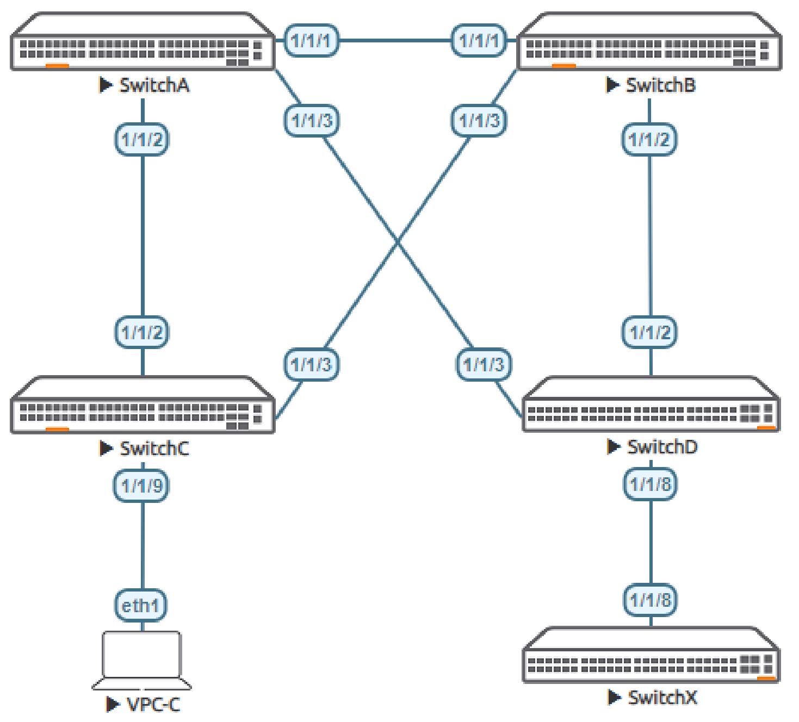
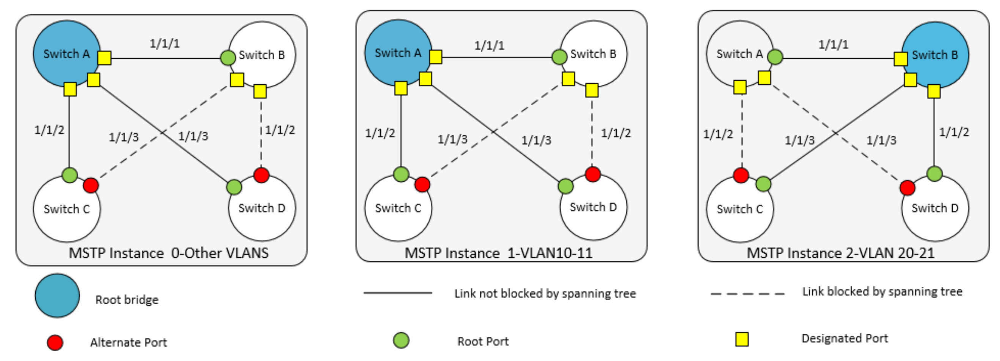
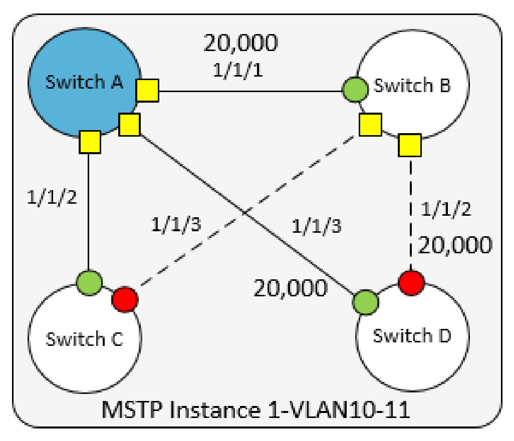

# Lab Guide: RPVST Fundamentals
> [!NOTE]
> This lab is based on the AOS-CX Switch Simulator Labs. A ```topology.clab.yaml``` file was added to use the lab with [containerlab](https://github.com/srl-labs/containerlab). 

> [!IMPORTANT]
> This guide assumes that the AOS-CX Switch Simulator is available as a docker container. You can use [vrnetlab](https://github.com/hellt/vrnetlab) to accomplish this.

>[!NOTE]
> This description is based on the AOS-CX Switch Simulator Lab Guide [RPVST Fundamentals](https://community.arubanetworks.com/HigherLogic/System/DownloadDocumentFile.ashx?DocumentFileKey=fccf8ab8-062b-43ba-b334-21ea9757fb6e) and includes all necessary changes to use the lab with [containerlab](https://github.com/srl-labs/containerlab).

## Lab Objective
At the end of this lab you will be able to implement the basic configuration of Rapid Per VLAN Spanning Tree (RPVST) and
show how RPVST creates a loop free VLAN topology with other Aruba CX switches.

The use case for RPVST is to provide a loop free redundant multipath Layer 2 network. RPVST is **not** the default Spanning Tree
Protocol for Aruba CX switches

For further details on RPVST please refer to the latest Aruba documentation located on https://asp.arubanetworks.com/

## Lab Overview
This lab set up is as shown in [Figure 1](#network-layout) and [Figure 2](#rpvst-topology).This will allow the reader to observe the behavior of RPVST
This lab covers configuration of the following:

- RPVST and associated VLANs
- Root bridge placement and Identification
- STP timers and edge ports
- STP protection mechanisms

## Lab Network Layout

<a name="network-layout"></a>

_Figure 1: RPVST Lab Topology_

## Lab Tasks

### Task 1: Lab Setup
For this lab refer to [Figure 1](#network-layout) for topology setup.
- Deploy the containerlab topology file: ```sudo containerlab deploy -t topology.clab.yaml```
  - All the connections between nodes are already set-up
  - Check that sufficient numbers of CPUs and RAM is available for three AOS-CX nodes (at least 1 vCPU and 2048 MB per node)
  - Ensure that the environment variable ```AOS_CX_VERSION``` is set to a value that matches the image version (default is ```latest```)
    - If ```AOS_CX_VERSION``` is not set, image ```vrnetlab/aruba_arubaos-cx:latest``` will be deployed
    - If ```AOS_CX_VERSION=20241115202521```, image ```vrnetlab/aruba_arubaos-cx:20241115202521``` will be deployed
- Open SSH session to each switch and log in with user 'admin' and password 'admin'.

Note: Switch X will be configured later in the lab. The Virtual PC (VPC-C) is not required to be configured and just shown to
represent an access port.

On Switch A and B bring up required ports:
```
Switch[A-B]# configure terminal
Switch[A-B](config)#
```
Copy/Paste the configuration to Switch A and Switch B:
```
int 1/1/1-1/1/3
  no routing
  no shutdown
``` 
Leave configuration mode by pressing ```Ctrl-z```.

On Switch C and D bring up required ports:
```
SwitchC# configure terminal
SwitchC(config)#
```
Copy/Paste the configuration to Switch C and Switch D:
```
int 1/1/2-1/1/3
  no routing
  no shutdown
```
Leave configuration mode by pressing ```Ctrl-z```.

Validate LLDP neighbors appear as expected on each switch. Here we show Switch A output only.

If all switches have been configured as shown in [Figure 1](#lab-network-layout) you should see Switch B, C and D via Switch A as shown
below using LLDP. It is left to the reader to check other switches respectively.

```
SwitchA# show lldp neighbor-info 

LLDP Neighbor Information 
=========================

Total Neighbor Entries          : 3
Total Neighbor Entries Deleted  : 0
Total Neighbor Entries Dropped  : 0
Total Neighbor Entries Aged-Out : 0

LOCAL-PORT  CHASSIS-ID         PORT-ID                      PORT-DESC                    TTL      SYS-NAME    
-----------------------------------------------------------------------------------------------------------
1/1/1       08:00:09:dc:d5:57  1/1/1                        1/1/1                        120      SwitchB                            
1/1/2       08:00:09:38:ce:cf  1/1/2                        1/1/2                        120      SwitchC                            
1/1/3       08:00:09:f1:5a:54  1/1/3                        1/1/3                        120      SwitchD  
```

### Task 2: Configure RPVST and VLANs
Now set up MSTP, Root bridges and map VLANs as per [Figure 2](#rpvst-topology):
- VLAN 10-11 assigned to MSTP instance 1, Root bridge Switch A, Secondary Root bridge Switch B
- VLAN 20-21 assigned to MSTP instance 2 Root bridge Switch B, Secondary Root bridge Switch A
- All other VLANs assigned to the default MSTP 0 as shown below Switch A

Each VLAN has its own independent topology and in the lab guide we set up RPVST, Root bridges and VLANs as per
[Figure 2](#rpvst-topology) below:
- VLAN 10 Root bridge Switch A, Secondary Root bridge Switch B
- VLAN 11 Root bridge Switch A, Secondary Root bridge Switch B
- VLAN 20 Root bridge Switch B, Secondary Root bridge Switch A
- VLAN 21 Root bridge Switch B, Secondary Root bridge Switch A

> [!NOTE] Having deterministic Root and Secondary Root bridges is a typically accepted design, these are placed at the Core of the Layer 2 domain, as shown in Figure 2, where Switch A and Switch B are the core/center of the Layer 2 domain as well as providing Root redundancy for one another.

<a name="rpvst-topology"></a>

_Figure 2: RPVST Topology_

On Switch A add VLAN 10-11 and 20-21. Configure RPVST making Switch A root for VLAN 10-11 and Secondary Root for 20-21, then trunk all VLANs for interface 1/1/1 to 1/1/3:

```
SwitchA# configure terminal
SwitchA(config)#
```
Copy/Paste the configuration to Switch A:
```
vlan 10-11,20-21
  exit
spanning-tree mode rpvst
spanning-tree
spanning-tree vlan 10-11,20-21
spanning-tree vlan 10-11 priority 1
spanning-tree vlan 20-21 priority 2
int 1/1/1-1/1/3
  vlan trunk allowed all
  vlan trunk native 1
  exit
```
Leave configuration mode by pressing ```Ctrl-z```.

Command description:
- ```spanning-tree rpvst``` => Enable RPVST
- ```spanning-tree vlan 10-11,20-21``` => Define VLANs for RPVSt
- ```spanning-tree vlan 10-11 priority 1```=> Make Switch A Root Bridge for VLANs
- ```spanning-tree vlan 20-21 priority 2```=> Make Switch A Secondary Root Bridge for VLANs

On Switch B add VLAN 10-11 and 20-21. Configure RPVST making Switch B Root for VLAN 20-21 and Secondary Root for 10-11 instance 1,then trunk all VLANs for interface 1/1/1 to 1/1/3:

```
SwitchB# configure terminal
SwitchB(config)#
```
Copy/Paste the configuration to Switch B:
```
vlan 10-11,20-21
  exit
spanning-tree mode rpvst
spanning-tree
spanning-tree vlan 10-11,20-21
spanning-tree vlan 10-11 priority 2
spanning-tree vlan 20-21 priority 1
int 1/1/1-1/1/3
  vlan trunk allowed all
  vlan trunk native 1
  exit
```
Leave configuration mode by pressing ```Ctrl-z```.

On Switch C and D define the VLANs for RPVST and trunk all:
```
Switch[C-D]# configure terminal
Switch[C-D](config)#
```
Copy/Paste the configuration to Switch C and Switch D:
```
vlan 10-11,20-21
  exit
spanning-tree mode rpvst
spanning-tree
spanning-tree vlan 10-11,20-21
int 1/1/2-1/1/3
  vlan trunk allowed all
  vlan trunk native 1
  exit
```
Leave configuration mode by pressing ```Ctrl-z```.

### Taks 3: Check Configurations and Output

- Examine and check RPVST
- Check System ID matches Root for the VLAN

```
SwitchA# show spanning-tree summary root 
STP status            : Enabled
Protocol              : RPVST
System ID             : 08:00:09:29:0b:2c

Root bridge for VLANs : 10,11

                                         Root Hello Max Fwd              
VLAN     Priority Root ID                cost  Time Age Dly    Root Port
-------- -------- ----------------- --------- ----- --- --- ------------
VLAN10       4096 08:00:09:29:0b:2c         0     2  20  15            0
VLAN11       4096 08:00:09:29:0b:2c         0     2  20  15            0
VLAN20       4096 08:00:09:dc:d5:57     20000     2  20  15        1/1/1
VLAN21       4096 08:00:09:dc:d5:57     20000     2  20  15        1/1/1
```
As shown above Switch A is Root for Instance 0 and 1 identified by the System ID, and Instance 2 Root is another device
which is expected to be Switch B based on previous configurations.

Examine switch B and check Root switches are as expected:

```
SwitchB# show spanning-tree summary root 
STP status            : Enabled
Protocol              : RPVST
System ID             : 08:00:09:dc:d5:57

Root bridge for VLANs : 20,21

                                         Root Hello Max Fwd              
VLAN     Priority Root ID                cost  Time Age Dly    Root Port
-------- -------- ----------------- --------- ----- --- --- ------------
VLAN10       4096 08:00:09:29:0b:2c     20000     2  20  15        1/1/1
VLAN11       4096 08:00:09:29:0b:2c     20000     2  20  15        1/1/1
VLAN20       4096 08:00:09:dc:d5:57         0     2  20  15            0
VLAN21       4096 08:00:09:dc:d5:57         0     2  20  15            0
```
As shown above Switch B is Root for VLAN 20 and 21 identified by the System ID, and VLAN 10 and 11 Root is Switch A identified by the Systrem ID.

Continue to check switch C and D in a similar fashion (not shown in this lab guide).

Now examine the behavior of ports and their state by examining spanning tree state. The logical topology in [Figure 2](#rpvst-topology) for each switch can be observed showing a loop free Layer 2 topology. Here we observe VLAN 10 only and see ports are as set out in [Figure 2](#rpvst-topology). The reader can look at other VLANs at their leisure.

Examine Switchh A output for VLAN 10:

```
SwitchA# show spanning-tree vlan 10

VLAN10
Spanning tree status : Enabled Protocol: RPVST
  Root ID    Priority   : 4096                
             MAC-Address: 08:00:09:29:0b:2c   
             This bridge is the root
             Hello time(in seconds):2  Max Age(in seconds):20
             Forward Delay(in seconds):15

  Bridge ID  Priority  : 4096                
             MAC-Address: 08:00:09:29:0b:2c   
             Hello time(in seconds):2  Max Age(in seconds):20
             Forward Delay(in seconds):15

Port         Role           State      Cost           Priority   Type       BPDU-Tx    BPDU-Rx    TCN-Tx     TCN-Rx
------------ -------------- ---------- -------------- ---------- ---------- ---------- ---------- ---------- ----------
1/1/1        Designated     Forwarding 20000          128        P2P        291        43         34         22
1/1/2        Designated     Forwarding 20000          128        P2P        288        19         40         12
1/1/3        Designated     Forwarding 20000          128        P2P        291        32         42         14

Number of topology changes    : 57
Last topology change occurred : 1 seconds ago
```
Above all ports shown on Switch A the Root Bridge for VLAN 10, are Designated Forwarding as expected.

Examine Switch B output for VLAN 10:

```
SwitchB# show spanning-tree vlan 10

VLAN10
Spanning tree status : Enabled Protocol: RPVST
  Root ID    Priority   : 4096                
             MAC-Address: 08:00:09:29:0b:2c   
             Hello time(in seconds):2  Max Age(in seconds):20
             Forward Delay(in seconds):15

  Bridge ID  Priority  : 8192                
             MAC-Address: 08:00:09:dc:d5:57   
             Hello time(in seconds):2  Max Age(in seconds):20
             Forward Delay(in seconds):15

Port         Role           State      Cost           Priority   Type       BPDU-Tx    BPDU-Rx    TCN-Tx     TCN-Rx
------------ -------------- ---------- -------------- ---------- ---------- ---------- ---------- ---------- ----------
1/1/1        Root           Forwarding 20000          128        P2P        90         231        52         27
1/1/2        Designated     Forwarding 20000          128        P2P        351        62         61         14
1/1/3        Designated     Forwarding 20000          128        P2P        356        52         73         11

Number of topology changes    : 85
Last topology change occurred : 4 seconds ago
```
Above on Switch B the Root Bridge for VLAN 10 is identified by its MAC address **08:00:09:29:0b:2c**, which is Switch A.
The port connecting to Switch A 1/1/1 is the Root port and Forwarding and other two ports are Designated Forwarding
leading to Switch C and D respectively. All ports follow the VLAN 10 topology as expected, as per [Figure 2](#rpvst-topology).

Finally examine Switch C output for VLAN 10. The reader can also observe Switch D, output not shown in this lab
guide:

```
SwitchC# show spanning-tree vlan 10

VLAN10
Spanning tree status : Enabled Protocol: RPVST
  Root ID    Priority   : 4096                
             MAC-Address: 08:00:09:29:0b:2c   
             Hello time(in seconds):2  Max Age(in seconds):20
             Forward Delay(in seconds):15

  Bridge ID  Priority  : 32768               
             MAC-Address: 08:00:09:38:ce:cf   
             Hello time(in seconds):2  Max Age(in seconds):20
             Forward Delay(in seconds):15

Port         Role           State      Cost           Priority   Type       BPDU-Tx    BPDU-Rx    TCN-Tx     TCN-Rx
------------ -------------- ---------- -------------- ---------- ---------- ---------- ---------- ---------- ----------
1/1/2        Root           Forwarding 20000          128        P2P        70         307        57         65
1/1/3        Alternate      Blocking   20000          128        P2P        109        339        26         75

Number of topology changes    : 49
Last topology change occurred : 51 seconds ago
```
Above on Switch C the Root Bridge for VLAN 10 is identified by its MAC address **08:00:09:29:0b:2c**, which is Switch A.
The port connecting to Switch A 1/1/2 is the Root port and Forwarding and other port 1/1/3 towards Switch B is Alternate
Blocking preventing a looped topology for VLAN 10.

The reader can continue to check switch D, as well as check other VLANs for their own understanding in a similar fashion
(not shown in this lab guide) and build a logical picture of the RPVST map as shown in F[Figure 2](#rpvst-topology).

### Task 4: Path Cost
Now examine path cost and the RPVST port state from Switch D perspective with VLAN 10.

- In Figure 3 below the Root port path cost to the Root Switch A from Switch D perspective is 20,000 via port 1/1/3
- The next alternate path is via 1/1/2 with the next lowest path being through Switch B port 1/1/1 . This next alternate
best path cost is 40,000 (_20,000 (Switch D interface 1/1/2) + 20,000 (Switch B interface 1/1/1)_) and is the
summation of associated link cost.

<a name="network-layout"></a>


_Figure 3: RPVST VLAN 10 path cost from Switch D_

Check the port roles and cost from Switch D perspective:

```
SwitchD# show spanning-tree vlan 10

VLAN10
Spanning tree status : Enabled Protocol: RPVST
  Root ID    Priority   : 4096                
             MAC-Address: 08:00:09:29:0b:2c   
             Hello time(in seconds):2  Max Age(in seconds):20
             Forward Delay(in seconds):15

  Bridge ID  Priority  : 32768               
             MAC-Address: 08:00:09:f1:5a:54   
             Hello time(in seconds):2  Max Age(in seconds):20
             Forward Delay(in seconds):15

Port         Role           State      Cost           Priority   Type       BPDU-Tx    BPDU-Rx    TCN-Tx     TCN-Rx
------------ -------------- ---------- -------------- ---------- ---------- ---------- ---------- ---------- ----------
1/1/2        Alternate      Blocking   20000          128        P2P        173        470        43         88
1/1/3        Root           Forwarding 20000          128        P2P        113        415        81         99

Number of topology changes    : 72
Last topology change occurred : 4 seconds ago
```
Above we see the local path costs on Switch D, port 1/1/3 being the Forwarding Root port and 1/1/2 being the Blocked
Alternate port.

Now manipulate the cost to change VLAN 10 topology from Switch D perspective, by changing the cost
on Root port. To influence a change in this topology we need to increase cost to greater than 40,000, based on our
earlier calculation:

```
SwitchD# configure terminal
SwitchD(config)#
```
Copy/Paste the configuration to Switch D:
```
int 1/1/3
  spanning-tree vlan 10 cost 40001
```
Leave configuration mode by pressing ```Ctrl-z```.

```
SwitchD# show spanning-tree vlan 10

VLAN10
Spanning tree status : Enabled Protocol: RPVST
  Root ID    Priority   : 4096                
             MAC-Address: 08:00:09:29:0b:2c   
             Hello time(in seconds):2  Max Age(in seconds):20
             Forward Delay(in seconds):15

  Bridge ID  Priority  : 32768               
             MAC-Address: 08:00:09:f1:5a:54   
             Hello time(in seconds):2  Max Age(in seconds):20
             Forward Delay(in seconds):15

Port         Role           State      Cost           Priority   Type       BPDU-Tx    BPDU-Rx    TCN-Tx     TCN-Rx
------------ -------------- ---------- -------------- ---------- ---------- ---------- ---------- ---------- ----------
1/1/2        Root           Forwarding 20000          128        P2P        205        549        53         101
1/1/3        Alternate      Blocking   40001          128        P2P        130        475        95         112

Number of topology changes    : 3
Last topology change occurred : 0 seconds ago
```
As shown above by manipulating the path cost the behavior of the ports roles were changed.

> [!NOTE] Default cost is calculated based on port link speed for the Aruba CX OVA the ports simulate 1GbEs and are set to
20,000. Please refer to Layer 2 bridging guide to get the path cost for various speed ports.

### Task 5: RPVST Timers and Tuning

Detailed information around STP timers is beyond the scope of this lab guide. However, it is possible to change some RPVST
timers to tune and improve convergence time. However, use of such parameters depends on design and architecture of a
network as it can impact switch resources under certain conditions. The timers are shown below:

- ```spanning-tree <vlan-list> forward-delay``` is the time spent in the listening and learning state. This time is
equal to 15 seconds by default, and can be tuned between 4 and 30 seconds
- ```spanning-tree <vlan-list> hello-time``` is the time between each Bridge Protocol Data Unit (BPDU) that are
sent on a port. The default is 2 seconds and can be tuned between 2 and 10 sec.
- ```spanning-tree <vlan-list> max-age``` is the interval, specified in the BPDU, that BPDU data remains valid after
its reception. The bridge re-computes the spanning tree topology if it does not receive a new BPDU before max-age
expiry. Default is 20 Seconds and can be changed between 6 and 20 Seconds.

The above three parameters are mentioned for completeness. For this lab guide we will explore:

- ```spanning-tree port-type admin-edge``` which is primarily designed to optimize ports that are connected to end
points to allow the ports to transition directly to forwarding, circumventing the learning and listening phase.

On Switch C configure the following:

```
SwitchC# configure terminal
SwitchC(config)#
```
Copy/Paste the configuration to Switch C:
```
int 1/1/9
  no shut
  no routing
  vlan access 10
```
Leave configuration mode by pressing ```Ctrl-z```.

Now examine the ports on Switch C:
```
SwitchC# show spanning-tree vlan 10

VLAN10
Spanning tree status : Enabled Protocol: RPVST
  Root ID    Priority   : 4096                
             MAC-Address: 08:00:09:29:0b:2c   
             Hello time(in seconds):2  Max Age(in seconds):20
             Forward Delay(in seconds):15

  Bridge ID  Priority  : 32768               
             MAC-Address: 08:00:09:38:ce:cf   
             Hello time(in seconds):2  Max Age(in seconds):20
             Forward Delay(in seconds):15

Port         Role           State      Cost           Priority   Type       BPDU-Tx    BPDU-Rx    TCN-Tx     TCN-Rx
------------ -------------- ---------- -------------- ---------- ---------- ---------- ---------- ---------- ----------
1/1/2        Root           Forwarding 20000          128        P2P        147        693        124        202
1/1/3        Alternate      Blocking   20000          128        P2P        297        769        67         200
1/1/9        Designated     Forwarding 20000          128        P2P        0          0          0          0

Number of topology changes    : 115
Last topology change occurred : 3 seconds ago
```
In the above output we can see the newly configured switch port act like a regular P2P port and we know that it will go into a
learning and listening phase which is undesirable for ports connected to endpoints.

On Switch C configure the following:

```
SwitchC# configure terminal
SwitchC(config)#
```
Copy/Paste the configuration to Switch C:
```
int 1/1/9
  spanning-tree port-type admin-edge
```
Leave configuration mode by pressing ```Ctrl-z```.

Now examine the ports on Switch C:
```
SwitchC# show spanning-tree vlan 10

VLAN10
Spanning tree status : Enabled Protocol: RPVST
  Root ID    Priority   : 4096                
             MAC-Address: 08:00:09:29:0b:2c   
             Hello time(in seconds):2  Max Age(in seconds):20
             Forward Delay(in seconds):15

  Bridge ID  Priority  : 32768               
             MAC-Address: 08:00:09:38:ce:cf   
             Hello time(in seconds):2  Max Age(in seconds):20
             Forward Delay(in seconds):15

Port         Role           State      Cost           Priority   Type       BPDU-Tx    BPDU-Rx    TCN-Tx     TCN-Rx
------------ -------------- ---------- -------------- ---------- ---------- ---------- ---------- ---------- ----------
1/1/2        Root           Forwarding 20000          128        P2P        392        2461       331        748
1/1/3        Alternate      Blocking   20000          128        P2P        995        2708       205        716
1/1/9        Designated     Forwarding 20000          128        P2P  Edge  1934       0          0          0

Number of topology changes    : 316
Last topology change occurred : 31 seconds ago
```
In the above we can now see the newly configured switch port is in a different mode 'P2P Edge'. This port will now go into
forwarding mode when an endpoint is connected.

### Task 6: Spanning Tree Protection

Various security mechanisms are in place to protect spanning true configurations from interference and protect from rouge
devices. We will explore both BPDU guard and Root guard.

**BPDU protection** secures the active MSTP topology by preventing spoofed BPDU packets from entering the MSTP
domain. Typically BPDU protection would be applied to edge ports connected to end user devices that do not run MSTP. If
MSTP BPDU packets are received on a protected port, this feature disables the port and an alerts can be sent out
accordingly.

On Switch D configure BPDU guard:
```
SwitchD# configure terminal
SwitchD(config)#
```
Copy/Paste the configuration to Switch D:
```
interface 1/1/8
  no shutdown
  no routing
  vlan access 10
  spanning-tree bpdu-guard
```
Leave configuration mode by pressing ```Ctrl-z```.

Activate console logging in SSH-session of Switch D:
```
SwitchD# terminal-monitor  
Terminal-monitor is enabled successfully
```

On Switch X configure the following:
```
SwitchX# configure terminal
SwitchX(config)#
```
Copy/Paste the configuration to Switch X:
```
spanning-tree
interface 1/1/8
  no shutdown
  no routing
  vlan access 1
  exit 
```
Leave configuration mode by pressing ```Ctrl-z```.

Observe the output on Switch D. It can be observed that the port 1/1/8 is disabled as we received a BPDU on port 1/1/8
from Switch X. Timeouts can be configured to re-enable the port, not covered in this guide.

```
2025-02-16T21:32:46.525407+0000 hpe-pvstd[9239] <WARN> Event|5004|LOG_WARN|AMM|1/1|Port 1/1/8 disabled - BPDU received on protected port on VLAN 10.```

Below port 1/1/8 is disabled due to “Bpdu-Error”:
```
SwitchD# show spanning-tree vlan 10

VLAN10
Spanning tree status : Enabled Protocol: RPVST
  Root ID    Priority   : 4096                
             MAC-Address: 08:00:09:29:0b:2c   
             Hello time(in seconds):2  Max Age(in seconds):20
             Forward Delay(in seconds):15

  Bridge ID  Priority  : 32768               
             MAC-Address: 08:00:09:f1:5a:54   
             Hello time(in seconds):2  Max Age(in seconds):20
             Forward Delay(in seconds):15

Port         Role           State      Cost           Priority   Type       BPDU-Tx    BPDU-Rx    TCN-Tx     TCN-Rx
------------ -------------- ---------- -------------- ---------- ---------- ---------- ---------- ---------- ----------
1/1/2        Root           Forwarding 20000          128        P2P        1097       2840       790        643
1/1/3        Alternate      Blocking   40001          128        P2P        646        2408       471        646
1/1/8        Disabled       Bpdu-Error 20000          128        P2P        33         0          0          0

Number of topology changes    : 560
Last topology change occurred : 5 seconds ago
```
Below observe the state of the interface 1/1/8 on Switch D is down as expected, due to Bpdu-Error:
```
SwitchD# show int 1/1/8

Interface 1/1/8 is down 
 Admin state is up
 ...
```
Deactivate console logging in SSH-session of Switch D:
```
SwitchD# no terminal-monitor  
```

> [!NOTE]
> On Switch X OVA Simulator toggle the port “shut” to “no shut” may be required to enable BPDU initially.

**Root Protection** secures the active MSTP topology by preventing other switches declaring their ability to propagate
superior BPDU, containing both better information on the root bridge and path cost to the root bridge,
which would normally replace the current root bridge selection.

In this lab setup enable Root guard on Switch A 1/1/2 and Switch B 1/1/3 respectively and then try and make Switch C the
Root VLAN 10 and observe the behavior:

```
SwitchA# configure terminal
SwitchA(config)#
```
Copy/Paste the configuration to Switch A:
```
interface 1/1/2
  spanning-tree root-guard
  exit
```
Leave configuration mode by pressing ```Ctrl-z```.

```
SwitchB# configure terminal
SwitchB(config)#
```
Copy/Paste the configuration to Switch B:
```
interface 1/1/3
  spanning-tree root-guard
  exit
```
Leave configuration mode by pressing ```Ctrl-z```.

```
SwitchC# configure terminal
SwitchC(config)#
```
Copy/Paste the configuration to Switch C:
```
spanning-tree vlan 10 priority 0
```
Leave configuration mode by pressing ```Ctrl-z```.

Below observe that VLAN 10 on both Switch A and B ports go into Root Inconsistent Alternate for instance 1. Thus
protecting the rest of the network from the information that Switch C is sending 'better' BPDUs, and maintaining Layer 2
stability.

> [!NOTE]
> Prior to Root Inconsistent the protected ports will go into Designated Blocking, and may also be observed depending
when show commands will be executed.
```
SwitchA# show spanning-tree vlan 10

VLAN10
Spanning tree status : Enabled Protocol: RPVST
  Root ID    Priority   : 4096                
             MAC-Address: 08:00:09:29:0b:2c   
             This bridge is the root
             Hello time(in seconds):2  Max Age(in seconds):20
             Forward Delay(in seconds):15

  Bridge ID  Priority  : 4096                
             MAC-Address: 08:00:09:29:0b:2c   
             Hello time(in seconds):2  Max Age(in seconds):20
             Forward Delay(in seconds):15

Port         Role           State      Cost           Priority   Type       BPDU-Tx    BPDU-Rx    TCN-Tx     TCN-Rx
------------ -------------- ---------- -------------- ---------- ---------- ---------- ---------- ---------- ----------
1/1/1        Designated     Forwarding 20000          128        P2P        3516       904        808        488
1/1/2        Alternate      Root-Inc   20000          128        P2P        3499       288        1065       223
1/1/3        Designated     Forwarding 20000          128        P2P        3450       476        896        311

Number of topology changes    : 1364
Last topology change occurred : 0 seconds ago
```

```
SwitchB# show spanning-tree vlan 10

VLAN10
Spanning tree status : Enabled Protocol: RPVST
  Root ID    Priority   : 4096                
             MAC-Address: 08:00:09:29:0b:2c   
             Hello time(in seconds):2  Max Age(in seconds):20
             Forward Delay(in seconds):15

  Bridge ID  Priority  : 8192                
             MAC-Address: 08:00:09:dc:d5:57   
             Hello time(in seconds):2  Max Age(in seconds):20
             Forward Delay(in seconds):15

Port         Role           State      Cost           Priority   Type       BPDU-Tx    BPDU-Rx    TCN-Tx     TCN-Rx
------------ -------------- ---------- -------------- ---------- ---------- ---------- ---------- ---------- ----------
1/1/1        Root           Forwarding 20000          128        P2P        1601       1984       996        452
1/1/2        Designated     Forwarding 20000          128        P2P        3926       846        903        421
1/1/3        Alternate      Root-Inc   20000          128        P2P        3913       841        1102       103

Number of topology changes    : 1304
Last topology change occurred : 4 seconds ago
```

## Appendix: Complete Configurations

- If you face issues during your lab, you can verify your configs with the configs listed in this section

### SwitchA
```
hostname SwitchA
user admin group administrators password ciphertext AQBapUQR5aG5AmOFUVLLiXR84tEBMsBnvO3TQ6HGmROC8DuTYgAAAKPvQnCjXDW49tLQ/rIJlzx3rRhZzAjWbI5lXavJMR+EIamGZmdOW842MuNRxwhLGNgd/xYCLYKzz3qAB8nj4QTOh7bCvuJWgC20lH7IBKE4nBz227DJKHo369dkk/ofDXom
ntp server pool.ntp.org minpoll 4 maxpoll 4 iburst
ntp enable
ntp vrf mgmt
!
!
!
!
!
!
ssh server vrf mgmt
vlan 1,10-11,20-21
spanning-tree mode rpvst
spanning-tree
spanning-tree vlan 10,11,20,21
spanning-tree vlan 10 priority 1
spanning-tree vlan 11 priority 1
spanning-tree vlan 20 priority 2
spanning-tree vlan 21 priority 2
interface mgmt
    no shutdown
    ip static 10.0.0.15/24
    default-gateway 10.0.0.2
interface 1/1/1
    no shutdown
    no routing
    vlan trunk native 1
    vlan trunk allowed all
interface 1/1/2
    no shutdown
    no routing
    vlan trunk native 1
    vlan trunk allowed all
    spanning-tree root-guard
interface 1/1/3
    no shutdown
    no routing
    vlan trunk native 1                                        
    vlan trunk allowed all
!
!
!
!
!
https-server vrf mgmt
```

### SwitchB
```
hostname SwitchB
user admin group administrators password ciphertext AQBapQFcOIoNGEli8eLiJ5+JR2zkbvzyk+fwkuwfulI3clbDYgAAALSKFiEUjmRNuR8gvKPdriUbBzCR6Yl9ktpOOVZyNeD2TSx5vfZvFul8eM5MFpHhZC+vRt3OC9OOLIbaZxBfL89vxn7VRLUN1iwbd9ScHo/XXYri+sCnQpLdfpWq8HIKTxWw
ntp server pool.ntp.org minpoll 4 maxpoll 4 iburst
ntp enable
ntp vrf mgmt
!
!
!
!
!
!
ssh server vrf mgmt
vlan 1,10-11,20-21
spanning-tree mode rpvst
spanning-tree
spanning-tree vlan 10,11,20,21
spanning-tree vlan 10 priority 2
spanning-tree vlan 11 priority 2
spanning-tree vlan 20 priority 1
spanning-tree vlan 21 priority 1
interface mgmt
    no shutdown
    ip static 10.0.0.15/24
    default-gateway 10.0.0.2
interface 1/1/1
    no shutdown
    no routing
    vlan trunk native 1
    vlan trunk allowed all
interface 1/1/2
    no shutdown
    no routing
    vlan trunk native 1
    vlan trunk allowed all
interface 1/1/3
    no shutdown
    no routing
    vlan trunk native 1
    vlan trunk allowed all
    spanning-tree root-guard
!
!
!
!
!
https-server vrf mgmt
```

### SwitchC
```
hostname SwitchC
user admin group administrators password ciphertext AQBapc9bH6VJsOxu7Rm824Tratig2JV2kIWYEuiiPhfjtCrjYgAAAGdwJLi1ekT3Oqq6KUd2G/1PTKuwAL9NzHk7bNe2I2Bf2mLI9Sg138Qu33ssb9jO4sej9khYssGrDbkIBE1dfudgX5mk9BlOfCd1J8HJcVBHf6a/j6KKj6OH7n+xl08C6Yfs
ntp server pool.ntp.org minpoll 4 maxpoll 4 iburst
ntp enable
ntp vrf mgmt
!
!
!
!
!
!
ssh server vrf mgmt
vlan 1,10-11,20-21
spanning-tree mode rpvst
spanning-tree
spanning-tree vlan 10,11,20,21
spanning-tree vlan 10 priority 0
interface mgmt
    no shutdown
    ip static 10.0.0.15/24
    default-gateway 10.0.0.2
interface 1/1/2
    no shutdown
    no routing
    vlan trunk native 1
    vlan trunk allowed all
interface 1/1/3
    no shutdown
    no routing
    vlan trunk native 1
    vlan trunk allowed all
interface 1/1/9
    no shutdown
    no routing
    vlan access 10
    spanning-tree port-type admin-edge
!
!
!
!
!
https-server vrf mgmt
```

### SwitchD
```
hostname SwitchD
user admin group administrators password ciphertext AQBapWIgFvX3NFlfBKGPsr6jlpwN0x8aXie9Fg1oKV7ZkeK4YgAAAIZHqOYaXT5gVtPno/IOBt+HngxkZZ/XDSjrS2GNvWVGQDbdnTl0Y5Qv/PfpzJ8CHo9uwKJwfMtX4Uzvba9Cfi5I6/dECjpFFppOhCNouZhrGVkcKzRxs20nX+x0EgHiNoI5
ntp server pool.ntp.org minpoll 4 maxpoll 4 iburst
ntp enable
ntp vrf mgmt
!
!
!
!
!
!
ssh server vrf mgmt
vlan 1,10-11,20-21
spanning-tree mode rpvst
spanning-tree
spanning-tree vlan 10,11,20,21
interface mgmt
    no shutdown
    ip static 10.0.0.15/24
    default-gateway 10.0.0.2
interface 1/1/2
    no shutdown
    no routing
    vlan trunk native 1
    vlan trunk allowed all
interface 1/1/3
    no shutdown
    no routing
    vlan trunk native 1
    vlan trunk allowed all
    spanning-tree vlan 10 cost 40001
interface 1/1/8
    no shutdown
    no routing
    vlan access 10
    spanning-tree bpdu-guard
!
!
!
!
!
https-server vrf mgmt
```
### SwitchX
```
hostname SwitchX
user admin group administrators password ciphertext AQBapTWmF0xgezYSNiayxZg68JQo9t1cGdN6MldSbu1pbZbMYgAAAK0VccCluyBJEM00xeCdS8q3yIbH+YytAvf117Q5cyESGnIsd6tWqqEMeUuLkuDeuf5rC6PooRWE0VDumrrs4bm2f7FtMWesgs3I0RgYK1VE/uV5bZV0ptAoigDrioluZlch
ntp server pool.ntp.org minpoll 4 maxpoll 4 iburst
ntp enable
ntp vrf mgmt
!
!
!
!
!
!
ssh server vrf mgmt
vlan 1
spanning-tree
interface mgmt
    no shutdown
    ip static 10.0.0.15/24
    default-gateway 10.0.0.2
interface 1/1/8
    no shutdown
    no routing
    vlan access 1
!
!
!
!
!
https-server vrf mgmt
```
