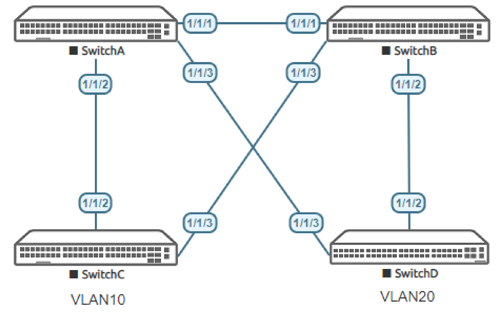
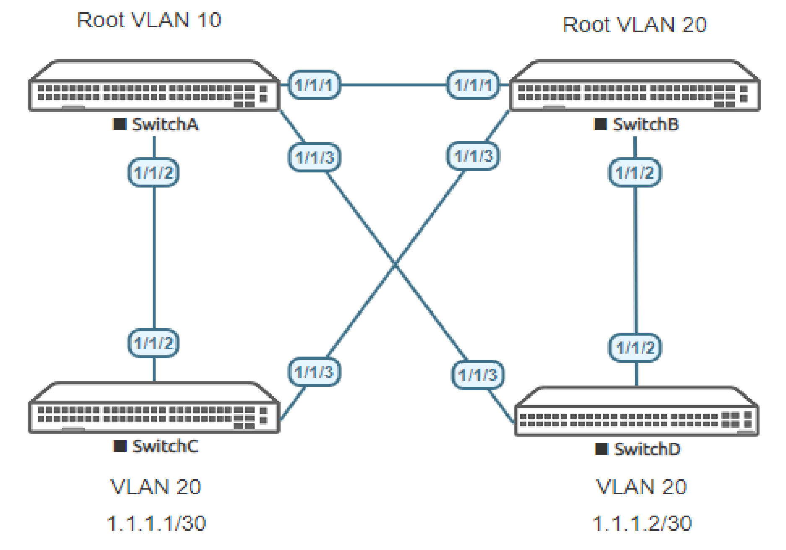
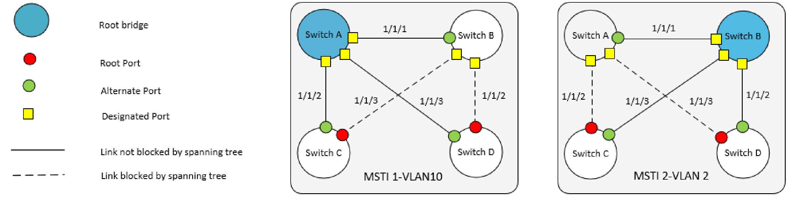

# Lab Guide: MVRP Fundamentals
> [!NOTE]
> This lab is based on the AOS-CX Switch Simulator Labs. A ```topology.clab.yaml``` file was added to use the lab with [containerlab](https://github.com/srl-labs/containerlab). 

> [!IMPORTANT]
> This guide assumes that the AOS-CX Switch Simulator is available as a docker container. You can use [vrnetlab](https://github.com/hellt/vrnetlab) to accomplish this.

>[!NOTE]
> This description is based on the AOS-CX Switch Simulator Lab Guide [MVRP Fundamentals](https://community.arubanetworks.com/HigherLogic/System/DownloadDocumentFile.ashx?DocumentFileKey=7ebb930f-f23d-4cda-85b3-91864ab2b148) and includes all necessary changes to use the lab with [containerlab](https://github.com/srl-labs/containerlab).

## Lab Objective
At the end of this lab you will be able to implement the basic configuration of MVRP (Multiple VLAN Registration Protocol)
and show how MVRP propagates local VLAN information to other Aruba CX switches.

The use case for MVRP is to simplify VLAN configuration and deployment in Layer 2 networks. MVRP provides a
mechanism of dynamically propagating VLAN information from a source switch to other switches in the Layer 2 LAN.

For further details on MVRP please refer to the latest Aruba documentation located on https://asp.arubanetworks.com/

## Lab Overview
This lab set up is as shown in [Figure 1](#network-layout-part_i) and [Figure 2](#network-layout-part_ii).This will allow you to observe the propagation of dynamic VLANs.

This lab is split into two parts:

Part I we will show MVRP in a simple scenario.

Part II we see MVRP in an MSTP environment and how it works in conjunction with MSTP, as well as coexistence with static vlans.

>[!NOTE]
> MVRP is not supported with RPVST.

## Lab Network Layout

<a name="network-layout-part_i"></a>

_Figure 1: Part I Lab topology Only Use Switch A, C and D_

## Part I: Lab Tasks

### Task 1: Lab Setup
For this lab refer to [Figure 1](#network-layout-part_1) for topology setup.
- Deploy the containerlab topology file: ```sudo containerlab deploy -t topology.clab.yaml``` (or use the [containerlab extension](https://containerlab.dev/manual/vsc-extension/) for Visual Studio Code)
  - All the connections between nodes are already set-up
  - Check that sufficient numbers of CPUs and RAM is available for three AOS-CX nodes (at least 1 vCPU and 2048 MB per node)
  - Ensure that the environment variable ```AOS_CX_VERSION``` is set to a value that matches the image version (default is ```latest```)
    - If ```AOS_CX_VERSION``` is not set, image ```vrnetlab/aruba_arubaos-cx:latest``` will be deployed
    - If ```AOS_CX_VERSION=20241115202521```, image ```vrnetlab/aruba_arubaos-cx:20241115202521``` will be deployed
- Open SSH session to each switch and log in with user 'admin' and password 'admin'.

Note: Switch X will be configured later in the lab. The Virtual PC (VPC-C) is not required to be configured and just shown to
represent an access port.

On Switch A, C and D bring up required ports:
```
Switch[A|C|D]# configure terminal
Switch[A|C|D](config)#
```
Copy/Paste the configuration to Switch A and Switch B:
```
int 1/1/2-1/1/3
  no routing
  no shutdown
``` 
Leave configuration mode by pressing ```Ctrl-z```.

Validate LLDP neighbors appear as expected on each switch. Here we show Switch A output only.

If all switches have been configured as shown in [Figure 1](#lab-network-layout-part_i) you should see Switch C and D through Switch A below using LLDP.

```
SwitchA# show lldp neighbor-info

LLDP Neighbor Information 
=========================

Total Neighbor Entries          : 2
Total Neighbor Entries Deleted  : 0
Total Neighbor Entries Dropped  : 0
Total Neighbor Entries Aged-Out : 0

LOCAL-PORT  CHASSIS-ID         PORT-ID                      PORT-DESC                    TTL      SYS-NAME    
-----------------------------------------------------------------------------------------------------------
1/1/2       08:00:09:67:62:cb  1/1/2                        1/1/2                        120      SwitchC                            
1/1/3       08:00:09:29:7e:d0  1/1/3                        1/1/3                        120      SwitchD 
```

### Task 2: Configure MVRP and native VLAN on Switch A and C

On Switch A enable MVRP globally with native VLAN on trunks and on Switch C enable MVRP globally with native VLAN and define a VLAN 10:

#### SwitchA
```
SwitchA# configure terminal
SwitchA(config)#
```
Copy/Paste the configuration to Switch A:
```
int 1/1/2-1/1/3
  vlan trunk native 1
  mvrp
  vlan trunk native 1
  exit
mvrp
```
Leave configuration mode by pressing ```Ctrl-z```.

#### SwitchC
```
SwitchC# configure terminal
SwitchC(config)#
```
Copy/Paste the configuration to Switch C:
```
int 1/1/2
  vlan trunk native 1
  mvrp
  exit
vlan 10
  exit
mvrp
``` 
Leave configuration mode by pressing ```Ctrl-z```.

Now observe the state on Switch A:
```
SwitchA# show vlan

------------------------------------------------------------------------------------------------------------------
VLAN  Name                              Status  Reason                  Type        Interfaces                    
------------------------------------------------------------------------------------------------------------------
1     DEFAULT_VLAN_1                    up      ok                      default     1/1/2-1/1/3
10    VLAN10                            up      ok                      dynamic     1/1/2
```
As shown above, VLAN 10 is dynamically present on Switch C.
```
SwitchA# show mvrp config 
Configuration and Status - MVRP
Global MVRP status : Enabled
Port       Status    Registration Join   Leave    LeaveAll Periodic
                     Type         Timer  Timer    Timer    Timer
---------- --------  --------     -----  -------  -------  --------
     1/1/2  Enabled    normal        20      300     1000       100
     1/1/3  Enabled    normal        20      300     1000       100
```
As shown above, MVRP is enabled on Switch A with default timers.
```
SwitchA# show mvrp state
Configuration and Status - MVRP state
Port        VLAN Registrar Applicant Forbid
                 State     State     Mode
----------  ---- --------- --------- ---------
1/1/2       1    IN        QA        No    
1/1/2       10   IN        VO        No    
1/1/3       1    MT        QA        No    
1/1/3       10   MT        QA        No 
```
- On Switch A we see the MVRP registrar and applicant state. Interface 1/1/2 is IN (Registered) and 1/1/3 is MT
(empty-Unregistered).
- Applicant states on 1/1/2 for VLAN 1 is QA (Quite Active), VLAN 10 is VO (Very Anxious Observer)
- Registrar and Applicant states on 1/1/3 are MT and QA (Quietly Active)

> [!NOTE]
> Registrar and Applicant states are as defined in IEEE Std 802.1Q 2011.

> [!NOTE]
> The MVRP **applicant state** can vary as this is continuously checked/refreshed and may be slightly different from the outputs shown above.

### Task 3: Configure MVRP and Native VLAN on Switch D

On Switch D enable MVRP globally with native VLAN and define a VLAN 20:

```
SwitchD# configure terminal
SwitchA(config)#
```
Copy/Paste the configuration to Switch D:
```
int 1/1/3
  vlan trunk native 1
  mvrp
  exit
vlan 20
  exit
mvrp
```
Leave configuration mode by pressing ```Ctrl-z```.
```
SwitchD# show vlan

------------------------------------------------------------------------------------------------------------------
VLAN  Name                              Status  Reason                  Type        Interfaces                    
------------------------------------------------------------------------------------------------------------------
1     DEFAULT_VLAN_1                    up      ok                      default     1/1/2-1/1/3
10    VLAN10                            up      ok                      dynamic     1/1/3
20    VLAN20                            up      ok                      static      1/1/3
```
In the above output the dynamic VLAN 10 present on Switch D.

On Switch A below both Dynamic VLAN 10 and 20 are observed:
```
SwitchA# show vlan 

------------------------------------------------------------------------------------------------------------------
VLAN  Name                              Status  Reason                  Type        Interfaces                    
------------------------------------------------------------------------------------------------------------------
1     DEFAULT_VLAN_1                    up      ok                      default     1/1/2-1/1/3
10    VLAN10                            up      ok                      dynamic     1/1/2
20    VLAN20                            up      ok                      dynamic     1/1/3
```
On Switch C below the Dynamic VLAN 20 is present, that was defined on Switch D:
```
SwitchC# show vlan

------------------------------------------------------------------------------------------------------------------
VLAN  Name                              Status  Reason                  Type        Interfaces                    
------------------------------------------------------------------------------------------------------------------
1     DEFAULT_VLAN_1                    up      ok                      default     1/1/2-1/1/3
10    VLAN10                            up      ok                      static      1/1/2
20    VLAN20                            up      ok                      dynamic     1/1/2
```
## Part II: Lab Tasks

<a name="network-layout-part_ii"></a>

_Figure 2: Part II Lab topology_

In Part II we configure MVRP deployment in two MSTI.

The assumption is made, that Part I has already been completed. This is a prerequisite for Part II.

MSTI is set up as detailed below
- VLAN 10 assigned to MSTI 1
- VLAN 20 assigned to MSTI 2

All other VLANs assigned to the default MSTI 0 make C Root, not shown in [Figure 3](#msti-topology).

<a name="msti-topology"></a>

_Figure 3: MSTI Topology_

### Task 4: Part II Lab Setup

First clear some of the VLAN Configurations, and enable all the relevant ports, as well as add Switch D as shown in
[Figure 2](#network-layout-part_ii).

A prerequisite to follow Part II lab steps below, the assumption is Part I lab has been completed already.

On Switch B bring up required ports:
```
SwitchB# configure terminal
SwitchB(config)#
```
Copy/Paste the configuration to Switch B:
```
int 1/1/1-1/1/3
  no routing
  no shutdown
```
Leave configuration mode by pressing ```Ctrl-z```.

On Switch A bring up required ports:
```
SwitchA# configure terminal
SwitchA(config)#
```
Copy/Paste the configuration to Switch A:
```
int 1/1/1
  no routing
  no shutdown
```
Leave configuration mode by pressing ```Ctrl-z```.

On Switch C bring up required ports and remove VLAN 10:
```
SwitchB# configure terminal
SwitchB(config)#
```
Copy/Paste the configuration to Switch C:
```
int 1/1/3
  no routing
  no shutdown
  exit
no vlan 10
``` 
Leave configuration mode by pressing ```Ctrl-z```.

On Switch D bring up required ports and remove VLAN 20:
```
SwitchD# configure terminal
SwitchD(config)#
```
Copy/Paste the configuration to Switch D:
```
int 1/1/2
  no routing
  no shutdown
  exit
no vlan 20
``` 
Leave configuration mode by pressing ```Ctrl-z```.

Validate LLDP neighbors appear as expected on each Switch A and B as shown below:
```
SwitchA# show lldp neighbor-info 

LLDP Neighbor Information 
=========================

Total Neighbor Entries          : 3
Total Neighbor Entries Deleted  : 0
Total Neighbor Entries Dropped  : 0
Total Neighbor Entries Aged-Out : 0

LOCAL-PORT  CHASSIS-ID         PORT-ID                      PORT-DESC                    TTL      SYS-NAME    
-----------------------------------------------------------------------------------------------------------
1/1/1       08:00:09:90:fb:a7  1/1/1                        1/1/1                        120      SwitchB                            
1/1/2       08:00:09:5b:eb:d3  1/1/2                        1/1/2                        120      SwitchC                            
1/1/3       08:00:09:5e:9b:dd  1/1/3                        1/1/3                        120      SwitchD   ```
```
```
SwitchB# show lldp neighbor-info 

LLDP Neighbor Information 
=========================

Total Neighbor Entries          : 3
Total Neighbor Entries Deleted  : 0
Total Neighbor Entries Dropped  : 0
Total Neighbor Entries Aged-Out : 0

LOCAL-PORT  CHASSIS-ID         PORT-ID                      PORT-DESC                    TTL      SYS-NAME    
-----------------------------------------------------------------------------------------------------------
1/1/1       08:00:09:17:5b:98  1/1/1                        1/1/1                        120      SwitchA                            
1/1/2       08:00:09:5e:9b:dd  1/1/2                        1/1/2                        120      SwitchD                            
1/1/3       08:00:09:5b:eb:d3  1/1/3                        1/1/3                        120      SwitchC                            
```

### Task 5: Configure MVRP and STP

On Switch A add VLAN 10, Configure STP making Switch A Root for instance 1 VLAN 10,and Secondary Root for
Instance 2, VLAN 20 and a add trunk to interface 1/1/1 with MVRP:

```
SwitchA# configure terminal
SwitchA(config)#
```
Copy/Paste the configuration to Switch A:
```
vlan 10
  exit
spanning-tree
spanning-tree config-name sp1
spanning-tree config-revision 1
spanning-tree instance 1 vlan 10
spanning-tree instance 2 vlan 20
spanning-tree instance 1 priority 0
spanning-tree instance 2 priority 1
int 1/1/1
  vlan trunk native 1
  mvrp
  exit
```
Leave configuration mode by pressing ```Ctrl-z```.

On Switch B add VLAN 20, configure STP making Switch B Root for Instance 2, VLAN 20, and Secondary Root for
Instance 1, VLAN 10, and add trunk to all interfaces with MVRP:

```
SwitchB# configure terminal
SwitchB(config)#
```
Copy/Paste the configuration to Switch B:
```
vlan 20
  exit
spanning-tree
spanning-tree config-name sp1
spanning-tree config-revision 1
spanning-tree instance 1 vlan 10
spanning-tree instance 2 vlan 20
spanning-tree instance 2 priority 0
spanning-tree instance 1 priority 1
interface 1/1/1-1/1/3
  no shutdown
  no routing
  vlan trunk native 1
  mvrp
exit
mvrp
```
Leave configuration mode by pressing ```Ctrl-z```.

On Switch C, remove VLAN 10, add STP making C Root for VLANs , and add a trunk to interface 1/1/3 with
MVRP. We also statically add VLAN 20 overriding dynamic allocation for this VLAN (Enables to observe differences in
MVRP outputs later):

```
SwitchC# configure terminal
SwitchC(config)#
```
Add VLAN 20 to Switch C:
```
vlan 20
```
Confirm the following message with ```y```:
```
VLAN 20 is a Dynamic VLAN.
Do you wish to convert it to static VLAN (y/n)? y     
```
Copy/Paste the configuration to Switch C:
```
exit
spanning-tree
spanning-tree priority 0
spanning-tree config-name sp1
spanning-tree config-revision 1
spanning-tree instance 1 vlan 10
spanning-tree instance 2 vlan 20
interface 1/1/3
  vlan trunk native 1
  mvrp
```
Leave configuration mode by pressing ```Ctrl-z```.


On Switch D Configure STP and add trunk to interfaces 1/1/2 with MVRP.

```
SwitchD# configure terminal
SwitchD(config)#
```
Copy/Paste the configuration to Switch D:
```
spanning-tree
spanning-tree config-name sp1
spanning-tree config-revision 1
spanning-tree instance 1 vlan 10
spanning-tree instance 2 vlan 20
interface 1/1/2
  vlan trunk native 1
  mvrp
```
Leave configuration mode by pressing ```Ctrl-z```.

### Task 6: Check Configurations and Output

Check the STP topology from Switch D. It can be seen from the output below that:
- MST1 mapped to VLAN 10 with Root port on interface 1/1/3
- MST2 mapped to VLAN 20 with Root port on interface 1/1/2

```
SwitchD# sh spanning-tree mst 1


#### MST1
Vlans mapped:  10
Bridge         Address:08:00:09:5e:9b:dd    Priority:32768
Root           Address:08:00:09:17:5b:98    Priority:0
               Port:1/1/3, Cost:20000, Rem Hops:19

Port           Role           State      Cost       Priority   Type             BPDU-Tx    BPDU-Rx    TCN-Tx     TCN-Rx
-------------- -------------- ---------- ---------- ---------- ---------------- ---------- ---------- ---------- ----------
1/1/2          Alternate      Blocking   20000      128        P2P              10         9          1          3
1/1/3          Root           Forwarding 20000      128        P2P              8          9          3          3

Topology change flag          : True
Number of topology changes    : 3
Last topology change occurred : 19 seconds ago
```
```
SwitchD# sh spanning-tree mst 2


#### MST2
Vlans mapped:  20
Bridge         Address:08:00:09:5e:9b:dd    Priority:32768
Root           Address:08:00:09:90:fb:a7    Priority:0
               Port:1/1/2, Cost:20000, Rem Hops:19

Port           Role           State      Cost       Priority   Type             BPDU-Tx    BPDU-Rx    TCN-Tx     TCN-Rx
-------------- -------------- ---------- ---------- ---------- ---------------- ---------- ---------- ---------- ----------
1/1/2          Root           Forwarding 20000      128        P2P              10         24         1          3
1/1/3          Alternate      Blocking   20000      128        P2P              8          24         3          3

Topology change flag          : True
Number of topology changes    : 2
Last topology change occurred : 46 seconds ago
```
The output below shows that both VLAN 10 and 20 are dynamically learned on Switch D aligned to STP interfaces as
expected:
```
SwitchD# show vlan

------------------------------------------------------------------------------------------------------------------
VLAN  Name                              Status  Reason                  Type        Interfaces                    
------------------------------------------------------------------------------------------------------------------
1     DEFAULT_VLAN_1                    up      ok                      default     1/1/2-1/1/3
10    VLAN10                            up      ok                      dynamic     1/1/3
20    VLAN20                            up      ok                      dynamic     1/1/2-1/1/3
```
Now check the MVRP state on Switch D:
```
SwitchD# show mvrp state
Configuration and Status - MVRP state
Port        VLAN Registrar Applicant Forbid
                 State     State     Mode
----------  ---- --------- --------- ---------
1/1/2       1    MT        AA        No    
1/1/2       10   MT        AA        No    
1/1/2       20   IN        QA        No    
1/1/3       1    IN        QA        No    
1/1/3       10   IN        VO        No    
1/1/3       20   IN        QA        No    
```
It can be observed above Switch D has IN Registrar for VLAN 10 on interface 1/1/3 and for VLAN 20 on interface
1/1/2. This follows the STP topology, and applicant states is in VO (Very Anxious Observer) for VLAN 10 an in QA (Quietly Active) state.

Now observe the VLANs and MVRP State and VLANS on Switch C:

```
SwitchC# show vlan

------------------------------------------------------------------------------------------------------------------
VLAN  Name                              Status  Reason                  Type        Interfaces                    
------------------------------------------------------------------------------------------------------------------
1     DEFAULT_VLAN_1                    up      ok                      default     1/1/2-1/1/3
10    VLAN10                            up      ok                      dynamic     1/1/2-1/1/3
20    VLAN20                            up      ok                      static      1/1/2-1/1/3
```
The output above shows a single dynamic VLAN 10 as we statically defined VLAN 20 on Switch C earlier.

The output below shows Registrar IN state for both VLAN 10 (on 1/1/2) and 20 (on 1/1/3) in the MVRP state. Both VLANs are in QA (Quietly
Active) state. As VLAN 20 was locally defined is on Switch C we only see VLAN 10 as dynamically learned.

```
SwitchC# show mvrp state
Configuration and Status - MVRP state
Port        VLAN Registrar Applicant Forbid
                 State     State     Mode
----------  ---- --------- --------- ---------
1/1/2       1    IN        QA        No    
1/1/2       10   IN        QA        No    
1/1/2       20   MT        VP        No    
1/1/3       1    IN        QA        No    
1/1/3       10   IN        QA        No    
1/1/3       20   IN        QA        No    
```
> [!NOTE]
> The MVRP **applicant state** can vary as this is continuously checked/refreshed and may be slightly different from
the outputs shown above.

### Task 7: Basic Connectivity Tests

> [!NOTE]
> When VLANs are added to SVI or access ports, dynamic VLANs cannot co-exist on the local switch.

Now we will observe some basic Layer 3 connectivity from Switch D to Switch C on Vlan 20.

Add VLAN interface 20 to Switch C with an IPV4 address:

```
SwitchC# configure terminal 
SwitchC(config)# 
```
Copy/Paste the configuration to Switch C:
```
int vlan 20
  ip address 1.1.1.1/30
```
Leave configuration mode by pressing ```Ctrl-z```.

On Switch D add VLAN interface 20, and then add an IPV4 address:
```
SwitchD# configure terminal 
SwitchD(config)# 
```
Add VLAN 20 to Switch D:
```
int vlan 20
Ignoring the operation on dynamic VLAN(s) 20.
SwitchD(config)# 
```
You will see the above message, you cannot add a VLAN interface or an access port VLAN to a dynamic defined
VLAN, MVRP is only supported on trunk ports on Aruba CX.

To use a dynamic VLAN locally you need to convert it to a static VLAN. When you convert a Dynamic VLAN to a
static VLAN you will be asked if you wish to do this:
```
SwitchD(config)# int vlan 20
Ignoring the operation on dynamic VLAN(s) 20.
SwitchD(config)# vlan 20
VLAN 20 is a Dynamic VLAN.
Do you wish to convert it to static VLAN (y/n)? y
SwitchD(config-vlan-20)# exit
SwitchD(config)# interface vlan 20
SwitchD(config-if-vlan)# ip address 1.1.1.2/30
SwitchD(config-if-vlan)# exit 
SwitchD(config)# 
```
Leave configuration mode by pressing ```Ctrl-z```.

It should now be possible to ping between SVI interfaces on VLAN 20 which will traverse the Core:

```
SwitchD# ping 1.1.1.1
PING 1.1.1.1 (1.1.1.1) 100(128) bytes of data.
108 bytes from 1.1.1.1: icmp_seq=1 ttl=64 time=97.7 ms
108 bytes from 1.1.1.1: icmp_seq=2 ttl=64 time=24.6 ms
108 bytes from 1.1.1.1: icmp_seq=3 ttl=64 time=15.6 ms
108 bytes from 1.1.1.1: icmp_seq=4 ttl=64 time=14.7 ms
108 bytes from 1.1.1.1: icmp_seq=5 ttl=64 time=20.2 ms

--- 1.1.1.1 ping statistics ---
5 packets transmitted, 5 received, 0% packet loss, time 4008ms
rtt min/avg/max/mdev = 14.651/34.548/97.683/31.767 ms
```

## Appendix: Complete Configurations

- If you face issues during your lab, you can verify your configs with the configs listed in this section

### Part I Configurations
#### SwitchA
```
hostname SwitchA
user admin group administrators password ciphertext AQBapUKAv3zTA012BpX5eQ8RiNFXCt/A3yZb1JzcP1GEvXQGYgAAAOPcDXYL4zSDR4OV17ixrR7T5SCXIZsXEfKEUAhTN13NLS/EpRFYw0kJjmPN64+qXxogimFDLUlg5CAcleJPFdo51ZCS58hYQQkH6uTmnCZ+6lP5lFTADzEBq6GxUwDIYUhH
mvrp
ntp server pool.ntp.org minpoll 4 maxpoll 4 iburst
ntp enable
ntp vrf mgmt
!
!
!
!
!
!
ssh server vrf mgmt
vlan 1
interface mgmt
    no shutdown
    ip static 10.0.0.15/24
    default-gateway 10.0.0.2
interface 1/1/2
    no shutdown
    no routing
    vlan trunk native 1
    vlan trunk allowed all
    mvrp
interface 1/1/3
    no shutdown
    no routing
    vlan trunk native 1
    vlan trunk allowed all
    mvrp
!
!
!
!
!
https-server vrf mgmt
```

#### SwitchC
```
hostname SwitchC
user admin group administrators password ciphertext AQBapfGDeXnGIC4wPpTXgaaM9jIgEur9XHwxCkEUgU5uLlPTYgAAACRv5CAHaVrJLlZSBTVb7EE9TpiWnkfvEqsLXrD1Y6tJpW5IuJn8sm3eAMRcDtgKamkWaP1E5x5xhk8iWVg9hbgYrP404PszW8HfkpI/doTldvGIUF4H2gpXxsXcmjFNcqAj
mvrp
ntp server pool.ntp.org minpoll 4 maxpoll 4 iburst
ntp enable
ntp vrf mgmt
!
!
!
!
!
!
ssh server vrf mgmt
vlan 1,10
interface mgmt
    no shutdown
    ip static 10.0.0.15/24
    default-gateway 10.0.0.2
interface 1/1/2
    no shutdown
    no routing
    vlan trunk native 1
    vlan trunk allowed all
    mvrp
!
!
!
!
!
https-server vrf mgmt
```

#### SwitchD
```
hostname SwitchD
user admin group administrators password ciphertext AQBapRUB0NIBWbSmHWyfd+yA4EoUmjog9aY3lb0yt2FSqWHRYgAAAFiRVDdpQTqmCZgskW21fBQUnORLAEciZea9dOfUGXYLdQzba07s5Az+9ycFGi6QNbusLQzeJGlozKd6yWVE9H7/d+7OUS1uHuvJBbKsi3RJVRXN50qply9QhS6vdJy1O+Ii
mvrp
ntp server pool.ntp.org minpoll 4 maxpoll 4 iburst
ntp enable
ntp vrf mgmt
!
!
!
!
!
!
ssh server vrf mgmt
vlan 1,20
interface mgmt
    no shutdown
    ip static 10.0.0.15/24
    default-gateway 10.0.0.2
interface 1/1/3
    no shutdown
    no routing
    vlan trunk native 1
    vlan trunk allowed all
    mvrp
!
!
!
!
!
https-server vrf mgmt
```

### Part II Configurations
#### SwitchA
```
hostname SwitchA
user admin group administrators password ciphertext AQBapZmlGXWjKWDpQBmMjdgwbL3ZCI2cl9AXpk7w5AWtywdMYgAAAEUQKoDMdNgm9L6SvHBrtQPmAHNK89iWy/4cyRWV5fe/5vyzHkFbK1LG/FnU3rBDF9Nb4HJK4HyRlsfxT0nGadUAJ/bK05acqTwEv1CT9uvv24H0YWedSYfnxthGhD0B1cZD
mvrp
ntp server pool.ntp.org minpoll 4 maxpoll 4 iburst
ntp enable
ntp vrf mgmt
!
!
!
!
!
!
ssh server vrf mgmt
vlan 1,10
spanning-tree
spanning-tree config-name sp1
spanning-tree config-revision 1
spanning-tree instance 1 vlan 10
spanning-tree instance 1 priority 0
spanning-tree instance 2 vlan 20
spanning-tree instance 2 priority 1
interface mgmt
    no shutdown
    ip static 10.0.0.15/24
    default-gateway 10.0.0.2
interface 1/1/1
    no shutdown
    no routing
    vlan trunk native 1
    vlan trunk allowed all
    mvrp
interface 1/1/2
    no shutdown
    no routing
    vlan trunk native 1
    vlan trunk allowed all
    mvrp
interface 1/1/3
    no shutdown
    no routing
    vlan trunk native 1
    vlan trunk allowed all                                     
    mvrp
!
!
!
!
!
https-server vrf mgmt
```

#### SwitchB
```
hostname SwitchB
user admin group administrators password ciphertext AQBapUcXRZ62RgQRk1YGfCwhlWNt7KDZ1tgHn4QfPYDv1PZQYgAAAMBQgTsijHubhORWbvkB/pdTYI3besM45xR9X3hcYwV5XvbVvhKbRmDrSB8xGRCWIxuyty8uCOFh8n78jamkW4TIMGoaIAvx6aKLTrP6tqG1BF5mLCwsQhPvUkYVBtOFEGn6
mvrp
ntp server pool.ntp.org minpoll 4 maxpoll 4 iburst
ntp enable
ntp vrf mgmt
!
!
!
!
!
!
ssh server vrf mgmt
vlan 1,20
spanning-tree
spanning-tree config-name sp1
spanning-tree config-revision 1
spanning-tree instance 1 vlan 10
spanning-tree instance 1 priority 1
spanning-tree instance 2 vlan 20
spanning-tree instance 2 priority 0
interface mgmt
    no shutdown
    ip static 10.0.0.15/24
    default-gateway 10.0.0.2
interface 1/1/1
    no shutdown
    no routing
    vlan trunk native 1
    vlan trunk allowed all
    mvrp
interface 1/1/2
    no shutdown
    no routing
    vlan trunk native 1
    vlan trunk allowed all
    mvrp
interface 1/1/3
    no shutdown
    no routing
    vlan trunk native 1
    vlan trunk allowed all
    mvrp
!
!
!
!
!
https-server vrf mgmt
```

#### SwitchC
```
hostname SwitchC
user admin group administrators password ciphertext AQBapa2WoAIzJmBo7/wJweyRnyND7KPMRMSesqasQFwoOserYgAAAO+2x3ndiA8BpNyiNwZWNjiRBjAifQOfUUYYt46/JCyfvlqjuGuu2S9+bsK7ui2i2kInFDI67SnQI6lGei3pFq3VPtlXX69BseT1GD+mgY/2lBm0VJ1/qpJ8hCHm5Oh+SJei
mvrp
ntp server pool.ntp.org minpoll 4 maxpoll 4 iburst
ntp enable
ntp vrf mgmt
!
!
!
!
!
!
ssh server vrf mgmt
vlan 1,20
spanning-tree
spanning-tree priority 0
spanning-tree config-name sp1
spanning-tree config-revision 1
spanning-tree instance 1 vlan 10
spanning-tree instance 2 vlan 20
interface mgmt
    no shutdown
    ip static 10.0.0.15/24
    default-gateway 10.0.0.2
interface 1/1/2
    no shutdown
    no routing
    vlan trunk native 1
    vlan trunk allowed all
    mvrp
interface 1/1/3
    no shutdown
    no routing
    vlan trunk native 1
    vlan trunk allowed all
    mvrp
interface vlan 20
    ip address 1.1.1.1/30
!
!
!
!
!
https-server vrf mgmt
```

#### SwitchD
```
hostname SwitchD
user admin group administrators password ciphertext AQBapfP5t89eKXM66l5JLba802Zi31Rg7ZG4UsaUusOBb7F0YgAAANrsALEYzz9b9/KRiGRe8KGV70sI2BhK5IvHqS+WaDQ3UDb3k68kL9r3jFPuL9CVtVQnLcNROdjFrL5tSEql6sv1/c9adT9O1XpKmp6JCmLCEeoWU+Ef5ieSH4IlljVdZjoe
mvrp
ntp server pool.ntp.org minpoll 4 maxpoll 4 iburst
ntp enable
ntp vrf mgmt
!
!
!
!
!
!
ssh server vrf mgmt
vlan 1,20
spanning-tree
spanning-tree config-name sp1
spanning-tree config-revision 1
spanning-tree instance 1 vlan 10
spanning-tree instance 2 vlan 20
interface mgmt
    no shutdown
    ip static 10.0.0.15/24
    default-gateway 10.0.0.2
interface 1/1/2
    no shutdown
    no routing
    vlan trunk native 1
    vlan trunk allowed all
    mvrp
interface 1/1/3
    no shutdown
    no routing
    vlan trunk native 1
    vlan trunk allowed all
    mvrp
interface vlan 20
    ip address 1.1.1.2/30
!
!
!
!
!
https-server vrf mgmt
```
