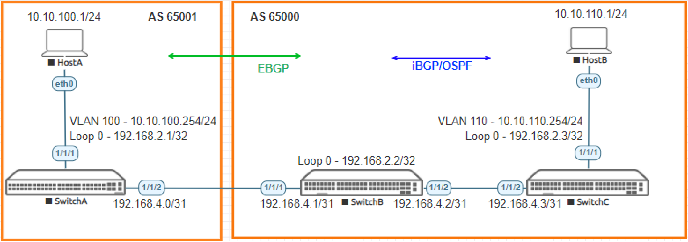

# Lab Guide: Deploying Basic BGP
> [!NOTE]
> This lab is based on the AOS-CX Switch Simulator Labs. A ```topology.clab.yaml``` file was added to use the lab with [containerlab](https://github.com/srl-labs/containerlab). 

> [!IMPORTANT]
> This guide assumes that the AOS-CX Switch Simulator is available as a docker container. You can use [vrnetlab](https://github.com/hellt/vrnetlab) to accomplish this.

>[!NOTE]
> This description is based on the AOS-CX Switch Simulator Lab Guide [Deploying Basic BGP](https://community.arubanetworks.com/HigherLogic/System/DownloadDocumentFile.ashx?DocumentFileKey=b7f3d72a-23ba-48e0-bfad-2b18836fef33) and includes all necessary changes to use the lab with [containerlab](https://github.com/srl-labs/containerlab).

## Lab Objective
At the end of this workshop, you will be able to implement the basic configuration to enable both iBGP and EBGP. The main goal
in to ensure Hosts within different Layer 3 autonomous systems (AS) can reach each other.

For stability, a best practice is to peer using loopbacks for iBGP. To achieve this, you will first configure an IGP protocol (OSPF)
to enable loopback reachability for iBGP peering. You will also need to ensure the host networks are advertised into the BGP
fabric. You will then create an EBGP peering relationship into another AS and ensure the hosts can communicate across ASs.

Finally, once the hosts can communicate across the ASs you will add a layer of security by creating a policy which blocks traffic
from a certain host. Once enabled you will see that the hosts cannot communicate, however the switches can still reach the
hosts across the ASs.

## Lab Overview
Border Gateway Protocol (BGP) is a standardized exterior gateway protocol designed to exchange routing and reachability
information among autonomous systems (AS) both on the Internet and even within and across enterprise organizations. BGP is
classified as a path-vector routing protocol, and it makes routing decisions based on paths, network policies, or rule-sets
configured by a network administrator.

BGP may be used for routing within an autonomous system. In this application it is referred to as Interior Border Gateway
Protocol, Internal BGP, or iBGP. In contrast, when routing between different autonomous systems the protocol may be referred
to as Exterior Border Gateway Protocol, External BGP, or eBGP.
The characteristics of BGP are:

- The current version of BGP is BGP version 4, based on RFC4271.
- BGP is the path-vector protocol that provides routing information for autonomous systems on the Internet via its AS-
Path attribute.
- BGP is a Layer 4 protocol that sits on top of TCP. It is much simpler than OSPF, because it doesn’t have to worry about
the things TCP will handle.
- Peers that have been manually configured to exchange routing information will form a TCP connection and begin
speaking BGP. There is no discovery in BGP.
- Medium-sized businesses usually get into BGP for the purpose of true multi-homing for their entire network.
- An important aspect of BGP is that the AS-Path itself is an anti-loop mechanism. Routers will not import any routes that
contain themselves in the AS-Path.

## Lab Network Layout

<a name="network-layout"></a>

_Figure 1: Lab topology and addresses_

> [!NOTE]
> With the AOS-CX Switch Simulator in the lab, after adding a route-map you will need to clear BGP from user mode to make the map take effect.

## Lab Tasks

### Task 1: Lab Setup
For this lab refer to [Figure 1](#network-layout) for topology an IP address details.

- Deploy the containerlab topology file: ```sudo containerlab deploy -t topology.clab.yaml``` (or use the [containerlab extension](https://containerlab.dev/manual/vsc-extension/) for Visual Studio Code)
  - All the connections between nodes are already set-up
  - Check that sufficient numbers of CPUs and RAM is available for three AOS-CX nodes (at least 1 vCPU and 2048 MB per node)
  - Ensure that the environment variable ```AOS_CX_VERSION``` is set to a value that matches the image version (default is ```latest```)
    - If ```AOS_CX_VERSION``` is not set, image ```vrnetlab/aruba_arubaos-cx:latest``` will be deployed
    - If ```AOS_CX_VERSION=20241115202521```, image ```vrnetlab/aruba_arubaos-cx:20241115202521``` will be deployed
- Open SSH session to each switch and log in with user 'admin' and password 'admin'.

Note: Switch X will be configured later in the lab. The Virtual PC (VPC-C) is not required to be configured and just shown to
represent an access port.

On all devices, bring up required ports:
```
Switch[A-C]# configure terminal
Switch[A-C](config)#
```
Copy/Paste the configuration to Switch A and Switch B:
```
int 1/1/1-1/1/2
  no shutdown
``` 
Leave configuration mode by pressing ```Ctrl-z```.

Validate LLDP neighbors appear as expected on each switch. Here we show Switch B output only.
```
SwitchB# show lldp neighbor-info 

LLDP Neighbor Information 
=========================

Total Neighbor Entries          : 2
Total Neighbor Entries Deleted  : 0
Total Neighbor Entries Dropped  : 0
Total Neighbor Entries Aged-Out : 0

LOCAL-PORT  CHASSIS-ID         PORT-ID                      PORT-DESC                    TTL      SYS-NAME    
-----------------------------------------------------------------------------------------------------------
1/1/1       08:00:09:46:61:7e  1/1/2                        1/1/2                        120      SwitchA                            
1/1/2       08:00:09:77:04:ee  1/1/2                        1/1/2                        120      SwitchC   
```

### Task 2: Configure Interfaces and Verify Direct Connectivity

Configure switch interfaces and ensure direct connectivity works:
- Apply proper IPv4 Addresses to all interfaces, including loopback
- On Switch A and C:
  - Create Host facing VLAN/Interface
  - Apply proper VLAN to host facing access interface
- Ensure direct connectivity works between each link

#### SwitchA
```
SwitchA# configure terminal
SwitchA(config)#
```
Copy/Paste the configuration to Switch A:
```
vlan 100
  description HostA VLAN
interface 1/1/1
  no shutdown
  no routing
  vlan access 100
interface 1/1/2
  no shutdown
  ip address 192.168.4.0/31
interface loopback 0
  ip address 192.168.2.1/32
interface vlan 100
  description Client Segment
  ip address 10.10.100.254/24
```
Leave configuration mode by pressing ```Ctrl-z```.

#### SwitchB
```
SwitchB# configure terminal
SwitchB(config)#
```
Copy/Paste the configuration to Switch B:
```
interface 1/1/1
  no shutdown
  ip address 192.168.4.1/31
interface 1/1/2
  no shutdown
  ip address 192.168.4.2/31
interface loopback 0
  ip address 192.168.2.2/32
``` 
Leave configuration mode by pressing ```Ctrl-z```.

#### SwitchC
```
SwitchC# configure terminal
SwitchC(config)#
```
Copy/Paste the configuration to Switch C:
```
vlan 110
  description HostB VLAN
interface 1/1/1
  no shutdown
  no routing
  vlan access 110
interface 1/1/2
  no shutdown
  ip address 192.168.4.3/31
interface loopback 0
  ip address 192.168.2.3/32
interface vlan 110
  description To Client Segment
  ip address 10.10.110.254/24
``` 
Leave configuration mode by pressing ```Ctrl-z```.

Check reachability from switch A:

```
SwitchA# ping 192.168.4.1 
PING 192.168.4.1 (192.168.4.1) 100(128) bytes of data.
108 bytes from 192.168.4.1: icmp_seq=1 ttl=64 time=24.0 ms
108 bytes from 192.168.4.1: icmp_seq=2 ttl=64 time=6.60 ms
108 bytes from 192.168.4.1: icmp_seq=3 ttl=64 time=6.36 ms
108 bytes from 192.168.4.1: icmp_seq=4 ttl=64 time=9.79 ms
108 bytes from 192.168.4.1: icmp_seq=5 ttl=64 time=6.42 ms

--- 192.168.4.1 ping statistics ---
5 packets transmitted, 5 received, 0% packet loss, time 4004ms
rtt min/avg/max/mdev = 6.355/10.628/23.988/6.803 ms

SwitchA# ping 10.10.100.1 
PING 10.10.100.1 (10.10.100.1) 100(128) bytes of data.
108 bytes from 10.10.100.1: icmp_seq=1 ttl=64 time=12.2 ms
108 bytes from 10.10.100.1: icmp_seq=2 ttl=64 time=2.07 ms
108 bytes from 10.10.100.1: icmp_seq=3 ttl=64 time=5.29 ms
108 bytes from 10.10.100.1: icmp_seq=4 ttl=64 time=2.19 ms
108 bytes from 10.10.100.1: icmp_seq=5 ttl=64 time=2.50 ms

--- 10.10.100.1 ping statistics ---
5 packets transmitted, 5 received, 0% packet loss, time 4004ms
rtt min/avg/max/mdev = 2.066/4.842/12.156/3.844 ms
```
### Task 3: Configure OSPF on SwitchB and SwitchC

- Create OSPF process 1 and area 0
- Create an OSPF IPv4 Router-ID (same as Loopback)
- Ensure interfaces are added to OSPF table
- Use OSPF point to point
- Ensure Loopback 0 and switch to switch interfaces on Switch B and C are advertised into OSPF
- Ensure VLAN 7 interface on Switch C is advertised into OSPF
- Verify OSPF peering is up between Switch B and C

#### SwitchB
```
SwitchB# configure terminal
SwitchB(config)#
```
Copy/Paste the configuration to Switch B:
```
router ospf 1
  router-id 192.168.2.2
  area 0.0.0.0
interface 1/1/2
  ip ospf 1 area 0.0.0.0
  ip ospf network point-to-point
interface loopback 0
  ip ospf 1 area 0.0.0.0
```
Leave configuration mode by pressing ```Ctrl-z```.

#### SwitchC
```
SwitchC# configure terminal
SwitchC(config)#
```
Copy/Paste the configuration to Switch C:
```
router ospf 1
  router-id 192.168.2.3
  area 0.0.0.0
interface 1/1/2
  ip ospf 1 area 0.0.0.0
  ip ospf network point-to-point
interface loopback 0
  ip ospf 1 area 0.0.0.0
interface vlan 110
  ip ospf 1 area 0.0.0.0
  ip ospf network point-to-point
```
Leave configuration mode by pressing ```Ctrl-z```.

#### SwitchB
```
SwitchB# show ip ospf neighbors 
VRF : default                          Process : 1
===================================================

Total Number of Neighbors : 1

Neighbor ID      Priority  State             Nbr Address       Interface
-------------------------------------------------------------------------
192.168.2.3      n/a       FULL              192.168.4.3        1/1/2   
```

### Task 4: Configure IBGP on SwitchB and SwitchC

- To prevent route flapping caused by port state changes, this example uses loopback interfaces to establish IBGP
connections
- Loopback interfaces are virtual interfaces. Therefore, use the update-source loopback command to specify the loopback
interface as the source interface for establishing BGP connections.
- Create a BGP router-ID
- Ensure HostB segment is added to the BGP table
- Add the neighbor default originate command to send a default route to SwitchC
- Verify BGP peering is up between SwitchB and C

#### SwitchB
```
SwitchB# configure terminal
SwitchB(config)#
```
Copy/Paste the configuration to Switch B:
```
router bgp 65000
  bgp router-id 192.168.2.2
  neighbor 192.168.2.3 remote-as 65000
  neighbor 192.168.2.3 update-source loopback 0
  address-family ipv4 unicast
    neighbor 192.168.2.3 activate
    neighbor 192.168.2.3 default-originate
  exit-address-family
```
Leave configuration mode by pressing ```Ctrl-z```.

#### SwitchC
```
SwitchC# configure terminal
SwitchC(config)#
```
Copy/Paste the configuration to Switch C:
```
router bgp 65000
  bgp router-id 192.168.2.3
  neighbor 192.168.2.2 remote-as 65000
  neighbor 192.168.2.2 update-source loopback 0
  address-family ipv4 unicast
    neighbor 192.168.2.2 activate
    network 10.10.110.0/24
  exit-address-family
```
Leave configuration mode by pressing ```Ctrl-z```.

#### SwitchC
```
SwitchC# show bgp ipv4 unicast summary 
Codes: * Dynamic Neighbor
VRF : default
BGP Summary
-----------
 Local AS               : 65000        BGP Router Identifier  : 192.168.2.3    
 Peers                  : 1            Log Neighbor Changes   : No             
 Cfg. Hold Time         : 180          Cfg. Keep Alive        : 60             
 Confederation Id       : 0              

 Neighbor                                Remote-AS MsgRcvd MsgSent   Up/Down Time State        AdminStatus
 192.168.2.2                             65000       4       4       00h:00m:08s  Established   Up  
```
### Task 5: Configure EBGP
- The EBGP peers, SwitchA and SwitchB are located in different ASs and usually belong to different carriers. Typically, their
loopback interfaces are not reachable to each other, so directly connected interfaces are used for establishing EBGP
sessions.
- Create a BGP router-ID for Switch A
- Verify BGP peering is up between Switch A and B
- Verify that HostA can reach HostB

#### SwitchA
```
SwitchA# configure terminal
SwitchA(config)#
```
Copy/Paste the configuration to Switch A:
```
router bgp 65001
  bgp router-id 192.168.2.1
  neighbor 192.168.4.1 remote-as 65000
  address-family ipv4 unicast
    neighbor 192.168.4.1 activate
    network 10.10.100.0/24
  exit-address-family
```
Leave configuration mode by pressing ```Ctrl-z```.

#### SwitchB
```
SwitchB# configure terminal
SwitchB(config)#
```
Copy/Paste the configuration to Switch B:
```
router bgp 65000
  neighbor 192.168.4.0 remote-as 65001
  address-family ipv4 unicast
    neighbor 192.168.4.0 activate
  exit-address-family
```
Leave configuration mode by pressing ```Ctrl-z```.

#### SwitchA
```
SwitchA# show bgp ipv4 unicast summary 
Codes: * Dynamic Neighbor
VRF : default
BGP Summary
-----------
 Local AS               : 65001        BGP Router Identifier  : 192.168.2.1    
 Peers                  : 1            Log Neighbor Changes   : No             
 Cfg. Hold Time         : 180          Cfg. Keep Alive        : 60             
 Confederation Id       : 0              

 Neighbor                                Remote-AS MsgRcvd MsgSent   Up/Down Time State        AdminStatus
 192.168.4.1                             65000       4       5       00h:00m:21s  Established   Up    
```
#### HostA
```
/ # ping -c 5 10.10.110.1
PING 10.10.110.1 (10.10.110.1) 56(84) bytes of data.
64 bytes from 10.10.110.1: icmp_seq=1 ttl=61 time=14.5 ms
64 bytes from 10.10.110.1: icmp_seq=2 ttl=61 time=8.79 ms
64 bytes from 10.10.110.1: icmp_seq=3 ttl=61 time=6.25 ms
64 bytes from 10.10.110.1: icmp_seq=4 ttl=61 time=5.93 ms
64 bytes from 10.10.110.1: icmp_seq=5 ttl=61 time=5.78 ms

--- 10.10.110.1 ping statistics ---
5 packets transmitted, 5 received, 0% packet loss, time 4004ms
rtt min/avg/max/mdev = 5.776/8.248/14.493/3.308 ms
```
#### HostB
```
/ # ping -c 5 10.10.100.1
PING 10.10.100.1 (10.10.100.1) 56(84) bytes of data.
64 bytes from 10.10.100.1: icmp_seq=1 ttl=61 time=10.7 ms
64 bytes from 10.10.100.1: icmp_seq=2 ttl=61 time=5.31 ms
64 bytes from 10.10.100.1: icmp_seq=3 ttl=61 time=5.14 ms
64 bytes from 10.10.100.1: icmp_seq=4 ttl=61 time=18.4 ms
64 bytes from 10.10.100.1: icmp_seq=5 ttl=61 time=4.05 ms

--- 10.10.100.1 ping statistics ---
5 packets transmitted, 5 received, 0% packet loss, time 4004ms
rtt min/avg/max/mdev = 4.049/8.711/18.353/5.348 ms
```

### Task 7: Finish by Adding a Layer of Security Which Blocks Unwanted Communication
- In this example, create a route-map which blocks HostB from communication into AS65001
- After the route-map has been applied to the IPv4 Address Family, move to user mode and clear the BGP session to its
neighbor 100.1.1.1. This will reset BGP and ensure the route-map is now working
- Once completed, HostA and HostB should not be able to communicate, however, SwitchB will still be able to reach HostA

#### SwitchA
```
SwitchA# configure terminal
SwitchA(config)#
```
Copy/Paste the configuration to Switch A:
```
ip prefix-list DENY seq 10 deny 10.10.110.1/32
!
route-map Deny deny seq 10
  match ip address prefix-list DENY
!
router bgp 65001
  address-family ipv4 unicast
    neighbor 192.168.4.1 route-map Deny in
  exit-address-family
```
Leave configuration mode by pressing ```Ctrl-z```.
```
SwitchA# clear bgp 192.168.4.1
```

#### HostA
```
/ # ping 10.10.110.254
PING 10.10.110.254 (10.10.110.254) 56(84) bytes of data.
From 10.10.100.254 icmp_seq=1 Destination Net Unreachable
From 10.10.100.254 icmp_seq=2 Destination Net Unreachable
From 10.10.100.254 icmp_seq=3 Destination Net Unreachable
From 10.10.100.254 icmp_seq=4 Destination Net Unreachable
^C
--- 10.10.110.254 ping statistics ---
7 packets transmitted, 0 received, +4 errors, 100% packet loss, time 6083ms```
```

#### HostB
```
/ # ping 10.10.100.254
PING 10.10.100.254 (10.10.100.254) 56(84) bytes of data.
^C
--- 10.10.100.254 ping statistics ---
6 packets transmitted, 0 received, 100% packet loss, time 5160ms
```

#### SwitchB
```
SwitchB# ping 10.10.100.1
PING 10.10.100.1 (10.10.100.1) 100(128) bytes of data.
108 bytes from 10.10.100.1: icmp_seq=1 ttl=63 time=2.50 ms
108 bytes from 10.10.100.1: icmp_seq=2 ttl=63 time=2.35 ms
108 bytes from 10.10.100.1: icmp_seq=3 ttl=63 time=3.31 ms
108 bytes from 10.10.100.1: icmp_seq=4 ttl=63 time=3.35 ms
108 bytes from 10.10.100.1: icmp_seq=5 ttl=63 time=3.72 ms

--- 10.10.100.1 ping statistics ---
5 packets transmitted, 5 received, 0% packet loss, time 4004ms
rtt min/avg/max/mdev = 2.347/3.046/3.718/0.529 ms
```

## Appendix: Complete Configurations

- If you face issues during your lab, you can verify your configs with the configs listed in this section

### SwitchA
```
hostname SwitchA
user admin group administrators password ciphertext AQBapdutAfOxbWyselM69CofcejhctlZsCmMA2r8zE5UvZ9LYgAAAKIpl0EJ8e8VsLU7Q8H7cdjecXQ1u/BADGtABVMIcHp1zDHZCEkfSsSA2/l54bHv21hmPEDSmbK9uUthP1PM6STTA1gLLPZgrNZ5rGs1A1r3RxMCmIn9UfRAAARYmnXGcqT9
ntp server pool.ntp.org minpoll 4 maxpoll 4 iburst
ntp enable
ntp vrf mgmt
!
!
!
!
!
!
ssh server vrf mgmt
vlan 1
vlan 100
    description HostA VLAN
interface mgmt
    no shutdown
    ip static 10.0.0.15/24
    default-gateway 10.0.0.2
interface 1/1/1
    no shutdown
    no routing
    vlan access 100
interface 1/1/2
    no shutdown
    ip address 192.168.4.0/31
interface loopback 0
    ip address 192.168.2.1/32
interface vlan 100
    description Client Segment
    ip address 10.10.100.254/24
ip prefix-list DENY seq 10 deny 10.10.110.1/32
!
!
!
!
route-map Deny deny seq 10
     match ip address prefix-list DENY
!
router bgp 65001
    bgp router-id 192.168.2.1
    neighbor 192.168.4.1 remote-as 65000
    address-family ipv4 unicast
        neighbor 192.168.4.1 route-map Deny in
        neighbor 192.168.4.1 activate
        network 10.10.100.0/24
    exit-address-family
!
https-server vrf mgmt
```

### SwitchB
```
hostname SwitchB
user admin group administrators password ciphertext AQBapR8wCeGB+RabYIcLjdOmX9b4tyo4WY4/i1HUMpuT0vNnYgAAAJ4EoYHWC0MGoXw53bFo+ldPRqvzK0HUtIK6oMrNj5qojyU3gffRY1D55d8HAnRmjhr8ovfmvEorXcyV2bM928TcAKSi/9/nT0XMKkHArn2KT26RpV9vMxz/U9bYqF5vytzF
ntp server pool.ntp.org minpoll 4 maxpoll 4 iburst
ntp enable
ntp vrf mgmt
!
!
!
!
!
!
ssh server vrf mgmt
vlan 1
interface mgmt
    no shutdown
    ip static 10.0.0.15/24
    default-gateway 10.0.0.2
interface 1/1/1
    no shutdown
    ip address 192.168.4.1/31
interface 1/1/2
    no shutdown
    ip address 192.168.4.2/31
    ip ospf 1 area 0.0.0.0
    ip ospf network point-to-point
interface loopback 0
    ip address 192.168.2.2/32
    ip ospf 1 area 0.0.0.0
!
!
!
!
!
router ospf 1
    router-id 192.168.2.2
    area 0.0.0.0
router bgp 65000
    bgp router-id 192.168.2.2
    neighbor 192.168.2.3 remote-as 65000
    neighbor 192.168.2.3 update-source loopback 0
    neighbor 192.168.4.0 remote-as 65001
    address-family ipv4 unicast
        neighbor 192.168.2.3 default-originate  
        neighbor 192.168.2.3 activate
        neighbor 192.168.4.0 activate
    exit-address-family
!
https-server vrf mgmt
```

### SwitchC
```
hostname SwitchC
user admin group administrators password ciphertext AQBapewg+EHehcZmghZjF0nLE806xQIXrstp8Cbc8/HyONyZYgAAADBhVHGcn4bni4hsanJ1PoSp8yfJsi+Cyq5cFK4+vxRaEWck7SgCjpYkLMXFRbyqMFRfLuvdtgJEmf+ZavQHCHY2o7b6hY3eMRKhCo357DNpD+kV3MSoCmHXHx/RDHju6OVi
ntp server pool.ntp.org minpoll 4 maxpoll 4 iburst
ntp enable
ntp vrf mgmt
!
!
!
!
!
!
ssh server vrf mgmt
vlan 1
vlan 110
    description HostB VLAN
interface mgmt
    no shutdown
    ip static 10.0.0.15/24
    default-gateway 10.0.0.2
interface 1/1/1
    no shutdown
    no routing
    vlan access 110
interface 1/1/2
    no shutdown
    ip address 192.168.4.3/31
    ip ospf 1 area 0.0.0.0
    ip ospf network point-to-point
interface loopback 0
    ip address 192.168.2.3/32
    ip ospf 1 area 0.0.0.0
interface vlan 110
    description To Client Segment
    ip address 10.10.110.254/24
    ip ospf 1 area 0.0.0.0
    ip ospf network point-to-point
!
!
!
!
!
router ospf 1
    router-id 192.168.2.3
    area 0.0.0.0
router bgp 65000
    bgp router-id 192.168.2.3
    neighbor 192.168.2.2 remote-as 65000
    neighbor 192.168.2.2 update-source loopback 0
    address-family ipv4 unicast
        neighbor 192.168.2.2 activate
        network 10.10.110.0/24
    exit-address-family                                        
!
https-server vrf mgmt
```
