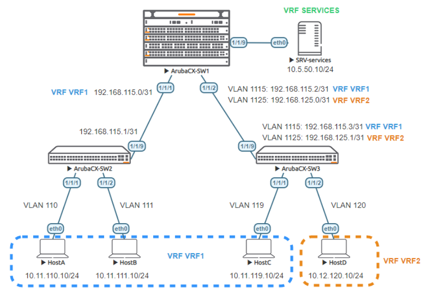

# Lab Guide: VRF Lab 1 - Static IVRL
> [!NOTE]
> This lab is based on the AOS-CX Switch Simulator Labs. A ```topology.clab.yaml``` file was added to use the lab with [containerlab](https://github.com/srl-labs/containerlab). 

> [!IMPORTANT]
> This guide assumes that the AOS-CX Switch Simulator is available as a docker container. You can use [vrnetlab](https://github.com/hellt/vrnetlab) to accomplish this.

>[!NOTE]
> This description is based on the AOS-CX Switch Simulator Lab Guide [VRF Part 1](https://community.arubanetworks.com/HigherLogic/System/DownloadDocumentFile.ashx?DocumentFileKey=39d1602b-f477-4eb1-87ed-19276d7a539c) and includes all necessary changes to use the lab with [containerlab](https://github.com/srl-labs/containerlab).

## Lab Objective

This lab will enable the reader to gain hands-on experience with VRF and inter VRF route leaking (IVRL).

## Lab Overview

This lab guide explains how to configure VRFs (Virtual Routing and Forwarding) on AOS-CX switch.

Please read the VRF section of the [AOS-CX 10.6 IP Routing Guide](https://www.arubanetworks.com/techdocs/AOS-CX/10.06/HTML/5200-7702/index.html#GUID-F2CC1540-2EFD-41FF-B3A8-9C38E9133488.html).
During this lab, you’ll be able to:

- Configure VRF and attach L3 interfaces to VRF
- Connect network nodes in a VRF-lite model
- Test traffic isolation between hosts in different VRFs
- Configure inter-VRF route leaking to allow communication between hosts and server.

The minimum required AOS-CX Switch Simulator version for this lab is 10.5. It is recommended to use later release 10.6.

## Lab Network Layout

<a name="network-layout"></a>

_Figure 1: VRF Lab Topology_

## Lab Tasks

### Task 1: Lab Setup
For this lab refer to [Figure 1](#network-layout) for topology setup.
- Deploy the containerlab topology file: ```sudo containerlab deploy -t topology.clab.yaml```
  - All the connections between nodes are already set-up
  - Check that sufficient numbers of CPUs and RAM is available for three AOS-CX nodes (at least 1 vCPU and 2048 MB per node)
  - Ensure that the environment variable ```AOS_CX_VERSION``` is set to a value that matches the image version (default is ```latest```)
    - If ```AOS_CX_VERSION``` is not set, image ```vrnetlab/aruba_arubaos-cx:latest``` will be deployed
    - If ```AOS_CX_VERSION=20241115202521```, image ```vrnetlab/aruba_arubaos-cx:20241115202521``` will be deployed
- Open SSH session to each switch and log in with user 'admin' and password 'admin'.
- Enter configuration mode from switch prompt
```
SW1# configure terminal
SW1(config)#
```
- Apply (copy/paste) the baseline configuration to each switch as proposed below

#### Baseline Configuration

- SW1
```
vlan 1
!
interface 1/1/1
  no shutdown
  description to SW2
interface 1/1/2
  no shutdown
  description to SW3
interface 1/1/9
  no shutdown
  description to SRV-services
```
 Leave configuration mode by pressing ```Ctrl-z```.
- SW2
```
vlan 1
!
interface 1/1/1
  no shutdown
  description to HostA
interface 1/1/2
  no shutdown
  description to HostB
interface 1/1/9
  no shutdown
  description to SW1
```
Leave configuration mode by pressing ```Ctrl-z```.
- SW3
```
vlan 1
!
interface mgmt
  no shutdown
  ip dhcp
interface 1/1/1
  no shutdown
  description to HostC
interface 1/1/2
  no shutdown
  description to HostD
interface 1/1/9
  no shutdown
  description to SW1
```
Leave configuration mode by pressing ```Ctrl-z```.

Verify the connectivity through LLDP neighbor information as follows:
- SW1
```
SW1# show lldp neighbor-info 

LLDP Neighbor Information 
=========================

Total Neighbor Entries          : 2
Total Neighbor Entries Deleted  : 0
Total Neighbor Entries Dropped  : 0
Total Neighbor Entries Aged-Out : 0

LOCAL-PORT  CHASSIS-ID         PORT-ID                      PORT-DESC                    TTL      SYS-NAME    
-----------------------------------------------------------------------------------------------------------
1/1/1       08:00:09:b0:ac:fa  1/1/9                        to SW1                       120      SW2                                
1/1/2       08:00:09:24:7c:cf  1/1/9                        to SW1                       120      SW3                                
```
- SW2
```
SW2# show lldp neighbor-info 

LLDP Neighbor Information 
=========================

Total Neighbor Entries          : 1
Total Neighbor Entries Deleted  : 0
Total Neighbor Entries Dropped  : 0
Total Neighbor Entries Aged-Out : 0

LOCAL-PORT  CHASSIS-ID         PORT-ID                      PORT-DESC                    TTL      SYS-NAME    
-----------------------------------------------------------------------------------------------------------
1/1/9       08:00:09:7b:5c:59  1/1/1                        to SW2                       120      SW1                                
```
- SW3
```
SW3# show lldp neighbor-info 

LLDP Neighbor Information 
=========================

Total Neighbor Entries          : 1
Total Neighbor Entries Deleted  : 0
Total Neighbor Entries Dropped  : 0
Total Neighbor Entries Aged-Out : 0

LOCAL-PORT  CHASSIS-ID         PORT-ID                      PORT-DESC                    TTL      SYS-NAME    
-----------------------------------------------------------------------------------------------------------
1/1/9       08:00:09:7b:5c:59  1/1/2                        to SW3                       120      SW1                                
```
### Task 2: Configure Layer 3 for VRF-lite
There are 2 ways to transport VRF in a VRF-lite architecture:
- through ROP (Routed Only Port): one VRF per interface in case of a single VRF or one VRF per sub-interface in case of
multiple VRFs (not yet supported on AOS-CX Simulator)
- through Transit VLANs, each Transit VLAN being associated to one VRF for multiple VRFs case.

Both methods are used in this lab for educational purpose. SW2 will use ROP with one VRF. SW3 will use Transit VLANs.

#### Step 1: Configure VRFs
**SW1** will host 3 VRFs:
- VRF1, for VRF-lite interconnectivity to SW1
- VRF2, for VRF-lite interconnectivity to SW2
- SERVICES, for hosting SRV-services server in the SERVICES VRF.

**SW2** will use only default VRF. Indeed, default VRF in access SW2 is mapped to VRF1 on SW1 interconnection. This is done for
simplification. An alternative would have been to configure VRF1 as well on SW2 and attach all L3 interfaces in VRF1. As there
is no other VRFs hosted in SW2, it is simpler to just use default VRF and bind it to VRF1 through the VRF attachment on SW1
interconnection.

**SW3** will host 2 VRFs:
- VRF1, for VRF-lite interconnectivity to SW1, and for hosting VRF1 endpoint: HostC.
- VRF2, for VRF-lite interconnectivity to SW1, and for hosting VRF2 endpoint: HostD

>[!NOTE]
>Enter configuration mode on each switch before adding the configuration below:
>```
>SW1# configure terminal
>SW1(config)#
>```

- SW1

```
vrf VRF1
vrf VRF2
vrf SERVICES
```
- SW3
```
vrf VRF1
vrf VRF2
```
>[!NOTE]
> There is no need for RD (route-distinguisher) in the VRF context as BGP is not used in this lab.

#### Step 2: Configure Host VLANs and Transit VLANs
VLANs are used for endpoint Hosts, and for Transit VLANs.
Transit VLAN 1115 is used for VRF1 and Transit VLAN 1125 is used for VRF2.
VLAN 110, 111, 119 are endpoints VLANs for VRF1, VLANs 110 and 111 used on SW2, VLAN 119 used on SW3.
VLAN 120 is the endpoint VLAN for VRF2 on SW3.

- SW1
```
vlan 1115,1125
!
interface 1/1/2
  no shutdown
  description to SW3
  no routing
  vlan trunk native 1
  vlan trunk allowed 1115,1125
```
- SW2
```
vlan 110-111
!
interface 1/1/1
  no shutdown
  description to HostA
  no routing
  vlan access 110
interface 1/1/2
  no shutdown
  description to HostB
  no routing
  vlan access 111
```
- SW3
```
vlan 119-120,1115,1125
!
interface 1/1/1
  no shutdown
  description to HostC
  no routing
  vlan access 119
interface 1/1/2
  no shutdown
  description to HostD
  no routing
  vlan access 120
interface 1/1/9
  no shutdown
  description to SW1
  no routing
  vlan trunk native 1
  vlan trunk allowed 1115,1125
```
#### Step 3: Configure Host VLANs and Transit VLANs
VRF binding is configured in this step. **Reminder:** it was chosen to not configure VRF in SW2 for simplicity and educational
purpose.
- SW1
```
interface vlan 1115
  vrf attach VRF1
  ip address 192.168.115.2/31
interface vlan 1125
  vrf attach VRF2
  ip address 192.168.125.0/31
```
- SW2
```
interface vlan 110
  ip address 10.11.110.1/24
interface vlan 111
  ip address 10.11.111.1/24
```
- SW3
```
interface vlan 119
  vrf attach VRF1
  ip address 10.11.119.1/24
interface vlan 120
  vrf attach VRF2
  ip address 10.12.120.1/24
interface vlan 1115
  vrf attach VRF1
  ip address 192.168.115.3/31
interface vlan 1125
  vrf attach VRF2
  ip address 192.168.125.1/31
```
#### Step 4: Configure ROP (Routed Only Port) L3 interface
On SW1, ROP to SW2 is attached to VRF1, whereas it is attached to default VRF on SW2.
On SW1, a ROP is used for Lab simplicity to connect the server SRV-services.
- SW1
```
interface 1/1/1
  no shutdown
  vrf attach VRF1
  description to SW2
  ip address 192.168.115.0/31
interface 1/1/9
  no shutdown
  vrf attach SERVICES
  description to SRV-services
  ip address 10.5.50.1/24
```
- SW2
```
interface 1/1/9
  no shutdown
  description to SW1
  ip address 192.168.115.1/31
```
#### Step 5: Verify VRF attachment
>[!NOTE]
>Before entering the following show commands, leave configuration mode by pressing ```Ctrl-z```, if necessary.
- SW1
```
SW1# show vrf
VRF Configuration:
------------------
VRF Name   : default
        Interfaces             Status
        -----------------------------
        1/1/3                    down
        1/1/4                    down
        1/1/5                    down
        1/1/6                    down
        1/1/7                    down
        1/1/8                    down
...

VRF Name   : SERVICES
        Interfaces             Status
        -----------------------------
        1/1/9                    up

VRF Name   : VRF1
        Interfaces             Status
        -----------------------------
        1/1/1                    up
        vlan1115                 up

VRF Name   : VRF2
        Interfaces             Status
        -----------------------------
        vlan1125                 up
```
- SW2
```
SW2# show vrf
VRF Configuration:
------------------
VRF Name   : default
        Interfaces             Status
        -----------------------------
        1/1/3                    down
        1/1/4                    down
        1/1/5                    down
        1/1/6                    down
        1/1/7                    down
        1/1/8                    down
        1/1/9                    up
...
        vlan110                  up
        vlan111                  up
```
- SW3
```
SW3# show vrf
VRF Configuration:
------------------
VRF Name   : default
        Interfaces             Status
        -----------------------------
        1/1/3                    down
        1/1/4                    down
        1/1/5                    down
        1/1/6                    down
        1/1/7                    down
        1/1/8                    down
...

VRF Name   : VRF1
        Interfaces             Status
        -----------------------------
        vlan119                  up
        vlan1115                 up

VRF Name   : VRF2
        Interfaces             Status
        -----------------------------
        vlan120                  up
        vlan1125                 up
```
#### Step 6: Routing
Static routing is used for this lab. More advanced routing configuration with BGP will be proposed in a future lab for route-
leaking.
On SW1, we need to create a route to reach 10.11.110.0/24 and 10.11.111.0/24. This is summarized with 10.11.96.0/20 with
Next-Hop being SW2 IP address. Similarly a route entry is created for 10.12.0.0/16 pointing to SW3 IP address as Next-Hop.
On SW2, a default route is enough. On SW3, a default route per VRF is used as well.
>[!NOTE]
>Enter configuration mode on each switch before adding the configuration below:
>```
>SW1# configure terminal
>SW1(config)#
>```

- SW1
```
ip route 10.11.96.0/20 192.168.115.1 vrf VRF1
ip route 10.11.119.0/24 192.168.115.3 vrf VRF1
ip route 10.12.0.0/16 192.168.125.1 vrf VRF2
```
- SW2
```
ip route 0.0.0.0/0 192.168.115.0
```
- SW3
```
ip route 0.0.0.0/0 192.168.115.2 vrf VRF1
ip route 0.0.0.0/0 192.168.125.0 vrf VRF2
```
Verify the routing table on each node. Here for SW1:

>[!NOTE]
>Before entering the following show commands, leave configuration mode by pressing ```Ctrl-z```, if necessary.

- SW1
```
SW1# show ip route

No ipv4 routes configured 
```
There is no route in default VRF in SW1 as expected.
- SW1
```
SW1# show ip route vrf VRF1

Displaying ipv4 routes selected for forwarding

Origin Codes: C - connected, S - static, L - local
              R - RIP, B - BGP, O - OSPF, D - DHCP
Type Codes:   E - External BGP, I - Internal BGP, V - VPN, EV - EVPN
              IA - OSPF internal area, E1 - OSPF external type 1
              E2 - OSPF external type 2

VRF: VRF1

Prefix              Nexthop                                  Interface     VRF(egress)       Origin/   Distance/    Age
                                                                                             Type      Metric
--------------------------------------------------------------------------------------------------------
10.11.96.0/20       192.168.115.1                            1/1/1         -                 S         [1/0]        00h:02m:27s  
10.11.119.0/24      192.168.115.3                            vlan1115      -                 S         [1/0]        00h:02m:27s  
192.168.115.0/31    -                                        1/1/1         -                 C         [0/0]        -            
192.168.115.0/32    -                                        1/1/1         -                 L         [0/0]        -            
192.168.115.2/31    -                                        vlan1115      -                 C         [0/0]        -            
192.168.115.2/32    -                                        vlan1115      -                 L         [0/0]        -            

Total Route Count : 6
```
For VRF1, there are local /32 entry, connected /31 entry and static routes to SW2 and SW3.
```
SW1# show ip route vrf VRF2

Displaying ipv4 routes selected for forwarding

Origin Codes: C - connected, S - static, L - local
              R - RIP, B - BGP, O - OSPF, D - DHCP
Type Codes:   E - External BGP, I - Internal BGP, V - VPN, EV - EVPN
              IA - OSPF internal area, E1 - OSPF external type 1
              E2 - OSPF external type 2

VRF: VRF2

Prefix              Nexthop                                  Interface     VRF(egress)       Origin/   Distance/    Age
                                                                                             Type      Metric
--------------------------------------------------------------------------------------------------------
10.12.0.0/16        192.168.125.1                            vlan1125      -                 S         [1/0]        00h:03m:03s  
192.168.125.0/31    -                                        vlan1125      -                 C         [0/0]        -            
192.168.125.0/32    -                                        vlan1125      -                 L         [0/0]        -            

Total Route Count : 3
```
Similarly for VRF2. And finally for VRF SERVICES:
```
SW1# show ip route vrf SERVICES

Displaying ipv4 routes selected for forwarding

Origin Codes: C - connected, S - static, L - local
              R - RIP, B - BGP, O - OSPF, D - DHCP
Type Codes:   E - External BGP, I - Internal BGP, V - VPN, EV - EVPN
              IA - OSPF internal area, E1 - OSPF external type 1
              E2 - OSPF external type 2

VRF: SERVICES

Prefix              Nexthop                                  Interface     VRF(egress)       Origin/   Distance/    Age
                                                                                             Type      Metric
--------------------------------------------------------------------------------------------------------
10.5.50.0/24        -                                        1/1/9         -                 C         [0/0]        -            
10.5.50.1/32        -                                        1/1/9         -                 L         [0/0]        -            

Total Route Count : 2
```
On SW2:
```
SW2# show ip route

Displaying ipv4 routes selected for forwarding

Origin Codes: C - connected, S - static, L - local
              R - RIP, B - BGP, O - OSPF, D - DHCP
Type Codes:   E - External BGP, I - Internal BGP, V - VPN, EV - EVPN
              IA - OSPF internal area, E1 - OSPF external type 1
              E2 - OSPF external type 2

VRF: default

Prefix              Nexthop                                  Interface     VRF(egress)       Origin/   Distance/    Age
                                                                                             Type      Metric
--------------------------------------------------------------------------------------------------------
0.0.0.0/0           192.168.115.0                            1/1/9         -                 S         [1/0]        00h:05m:46s  
10.11.110.0/24      -                                        vlan110       -                 C         [0/0]        -            
10.11.110.1/32      -                                        vlan110       -                 L         [0/0]        -            
10.11.111.0/24      -                                        vlan111       -                 C         [0/0]        -            
10.11.111.1/32      -                                        vlan111       -                 L         [0/0]        -            
192.168.115.0/31    -                                        1/1/9         -                 C         [0/0]        -            
192.168.115.1/32    -                                        1/1/9         -                 L         [0/0]        -            

Total Route Count : 7
```
On SW3:
```
SW3# show ip route

No ipv4 routes configured 


SW3# show ip route vrf VRF1

Displaying ipv4 routes selected for forwarding

Origin Codes: C - connected, S - static, L - local
              R - RIP, B - BGP, O - OSPF, D - DHCP
Type Codes:   E - External BGP, I - Internal BGP, V - VPN, EV - EVPN
              IA - OSPF internal area, E1 - OSPF external type 1
              E2 - OSPF external type 2

VRF: VRF1

Prefix              Nexthop                                  Interface     VRF(egress)       Origin/   Distance/    Age
                                                                                             Type      Metric
--------------------------------------------------------------------------------------------------------
0.0.0.0/0           192.168.115.2                            vlan1115      -                 S         [1/0]        00h:06m:32s  
10.11.119.0/24      -                                        vlan119       -                 C         [0/0]        -            
10.11.119.1/32      -                                        vlan119       -                 L         [0/0]        -            
192.168.115.2/31    -                                        vlan1115      -                 C         [0/0]        -            
192.168.115.3/32    -                                        vlan1115      -                 L         [0/0]        -            

Total Route Count : 5

SW3# show ip route vrf VRF2

Displaying ipv4 routes selected for forwarding

Origin Codes: C - connected, S - static, L - local
              R - RIP, B - BGP, O - OSPF, D - DHCP
Type Codes:   E - External BGP, I - Internal BGP, V - VPN, EV - EVPN
              IA - OSPF internal area, E1 - OSPF external type 1
              E2 - OSPF external type 2

VRF: VRF2

Prefix              Nexthop                                  Interface     VRF(egress)       Origin/   Distance/    Age
                                                                                             Type      Metric
--------------------------------------------------------------------------------------------------------
0.0.0.0/0           192.168.125.0                            vlan1125      -                 S         [1/0]        00h:06m:34s  
10.12.120.0/24      -                                        vlan120       -                 C         [0/0]        -            
10.12.120.1/32      -                                        vlan120       -                 L         [0/0]        -            
192.168.125.0/31    -                                        vlan1125      -                 C         [0/0]        -            
192.168.125.1/32    -                                        vlan1125      -                 L         [0/0]        -            

Total Route Count : 5
```
The main configuration on SW1, SW2 and SW3 is ready to start performing connectivity tests.
### Task 3: VRF Testing
As a reference, configuration of SW1/SW2/SW3 should look like:
- SW1
```
hostname SW1
vrf SERVICES
vrf VRF1
vrf VRF2
!
vlan 1,1115,1125
interface 1/1/1
    description to SW2
    no shutdown
    vrf attach VRF1
    ip address 192.168.115.0/31
interface 1/1/2
    description to SW3
    no shutdown
    no routing
    vlan trunk native 1
    vlan trunk allowed 1115,1125
interface 1/1/9
    description to SRV-services
    no shutdown
    vrf attach SERVICES
    ip address 10.5.50.1/24
interface vlan 1115
    vrf attach VRF1
    ip address 192.168.115.2/31
interface vlan 1125
    vrf attach VRF2
    ip address 192.168.125.0/31
ip route 10.11.96.0/20 192.168.115.1 vrf VRF1
ip route 10.11.119.0/24 192.168.115.3 vrf VRF1
ip route 10.12.0.0/16 192.168.125.1 vrf VRF2
```
- SW2
```
hostname SW2
!
vlan 1,110-111
interface 1/1/1
    description to HostA
    no shutdown
    no routing
    vlan access 110
interface 1/1/2
    description to HostB
    no shutdown
    no routing
    vlan access 111
interface 1/1/9
    description to SW1
    no shutdown
    ip address 192.168.115.1/31
interface vlan 110
    ip address 10.11.110.1/24
interface vlan 111
    ip address 10.11.111.1/24
ip route 0.0.0.0/0 192.168.115.0
```
- SW3
```
hostname SW3
vrf VRF1
vrf VRF2
!
vlan 1,119-120,1115,1125
interface 1/1/1
    description to HostC
    no shutdown
    no routing
    vlan access 119
interface 1/1/2
    description to HostD
    no shutdown
    no routing
    vlan access 120
interface 1/1/9
    description to SW1
    no shutdown
    no routing
    vlan trunk native 1
    vlan trunk allowed 1115,1125
interface vlan 119
    vrf attach VRF1
    ip address 10.11.119.1/24
interface vlan 120
    vrf attach VRF2
    ip address 10.12.120.1/24
interface vlan 1115
    vrf attach VRF1
    ip address 192.168.115.3/31
interface vlan 1125
    vrf attach VRF2
    ip address 192.168.125.1/31
ip route 0.0.0.0/0 192.168.115.2 vrf VRF1
ip route 0.0.0.0/0 192.168.125.0 vrf VRF2
```
#### Test 1: connectivity between Hosts
>[!NOTE]
>Configuration of ```HostA```, ```HostB```, ```HostC```, ```HostD``` and ```SRV-services``` was already done during deployment (refer to ```topolgy.clab.yaml```).

Configuration of Hosts:

```
...
   HostA:
      kind: linux
      mgmt-ipv4: 172.10.103.51
      exec:
        - ip address add 10.11.110.10/24 dev eth1
        - ip route add 10.0.0.0/8 via 10.11.110.1 dev eth1
        - ip route add 192.168.0.0/16 via 10.11.110.1 dev eth1
    HostB:
      kind: linux
      mgmt-ipv4: 172.10.103.52
      exec:
        - ip address add 10.11.111.10/24 dev eth1
        - ip route add 10.0.0.0/8 via 10.11.111.1 dev eth1
        - ip route add 192.168.0.0/16 via 10.11.111.1 dev eth1
    HostC:
      kind: linux
      mgmt-ipv4: 172.10.103.53
      exec:
        - ip address add 10.11.119.10/24 dev eth1
        - ip route add 10.0.0.0/8 via 10.11.119.1 dev eth1
        - ip route add 192.168.0.0/16 via 10.11.119.1 dev eth1
    HostD:
      kind: linux
      mgmt-ipv4: 172.10.103.54
      exec:
        - ip address add 10.12.120.10/24 dev eth1
        - ip route add 10.0.0.0/8 via 10.12.120.1 dev eth1
        - ip route add 192.168.0.0/16 via 10.12.120.1 dev eth1
    SRV-services:
      kind: linux
      mgmt-ipv4: 172.10.103.55
      exec:
        - ip address add 10.5.50.10/24 dev eth1
        - ip route add 10.0.0.0/8 via 10.5.50.1 dev eth1
        - ip route add 192.168.0.0/16 via 10.5.50.1 dev eth1
...
```
**Ping inside the same VRF:**
Ping ```HostB``` from ```HostA``` (VRF1):
```
[*]─[HostA]─[~]
└──> ping -c 3 10.11.111.10
PING 10.11.111.10 (10.11.111.10) 56(84) bytes of data.
64 bytes from 10.11.111.10: icmp_seq=1 ttl=63 time=5.24 ms
64 bytes from 10.11.111.10: icmp_seq=2 ttl=63 time=7.92 ms
64 bytes from 10.11.111.10: icmp_seq=3 ttl=63 time=2.99 ms

--- 10.11.111.10 ping statistics ---
3 packets transmitted, 3 received, 0% packet loss, time 2002ms
rtt min/avg/max/mdev = 2.990/5.382/7.923/2.016 ms
```
Ping ```HostC``` from ```HostA``` (VRF1):
```
[*]─[HostA]─[~]
└──> ping -c 3 10.11.119.10
PING 10.11.119.10 (10.11.119.10) 56(84) bytes of data.
64 bytes from 10.11.119.10: icmp_seq=1 ttl=61 time=19.0 ms
64 bytes from 10.11.119.10: icmp_seq=2 ttl=61 time=8.35 ms
64 bytes from 10.11.119.10: icmp_seq=3 ttl=61 time=6.90 ms

--- 10.11.119.10 ping statistics ---
3 packets transmitted, 3 received, 0% packet loss, time 2001ms
rtt min/avg/max/mdev = 6.898/11.428/19.034/5.410 ms
```
Ping ```SW1``` VRF2 IP address from ```HostD``` (VRF2):
```
[x]─[HostD]─[~]
└──> ping -c 3 192.168.125.0
PING 192.168.125.0 (192.168.125.0) 56(84) bytes of data.
64 bytes from 192.168.125.0: icmp_seq=1 ttl=63 time=5.04 ms
64 bytes from 192.168.125.0: icmp_seq=2 ttl=63 time=4.70 ms
64 bytes from 192.168.125.0: icmp_seq=3 ttl=63 time=7.50 ms

--- 192.168.125.0 ping statistics ---
3 packets transmitted, 3 received, 0% packet loss, time 2002ms
rtt min/avg/max/mdev = 4.695/5.746/7.504/1.250 ms
```
**Ping between VRFs:**
The purpose of VRFs is to isolate routing domains. As a consequence, without any inter-VRF route-leaking, hosts in VRF1
should not communicate with hosts in other VRFs.

Ping ```HostD``` (VRF2) from ```HostA``` (VRF1):
```
[*]─[HostA]─[~]
└──> ping -c 3 10.12.120.10
PING 10.12.120.10 (10.12.120.10) 56(84) bytes of data.
From 192.168.115.0 icmp_seq=1 Destination Net Unreachable
From 192.168.115.0 icmp_seq=2 Destination Net Unreachable
From 192.168.115.0 icmp_seq=3 Destination Net Unreachable

--- 10.12.120.10 ping statistics ---
3 packets transmitted, 0 received, +3 errors, 100% packet loss, time 2002ms
```
Ping ```SRV-services``` (SERVICES VRF) from ```HostA``` (VRF1):
```
[x]─[HostA]─[~]
└──> ping -c 3 10.5.50.10
PING 10.5.50.10 (10.5.50.10) 56(84) bytes of data.
From 192.168.115.0 icmp_seq=1 Destination Net Unreachable
From 192.168.115.0 icmp_seq=2 Destination Net Unreachable
From 192.168.115.0 icmp_seq=3 Destination Net Unreachable

--- 10.5.50.10 ping statistics ---
3 packets transmitted, 0 received, +3 errors, 100% packet loss, time 2002ms
```
Ping ```SRV-services``` (SERVICES VRF) from ```HostD``` (VRF2):
```
[*]─[HostD]─[~]
└──> ping -c 3 10.5.50.10
PING 10.5.50.10 (10.5.50.10) 56(84) bytes of data.

--- 10.5.50.10 ping statistics ---
3 packets transmitted, 0 received, 100% packet loss, time 2079ms
```
Between VRFs the network is unreachable or timeout, as expected.

The next section explains how to make communication between VRF1 and SERVICES, between VRF2 and SERVICES, and
maintaining isolation between VRF1 and VRF2.

#### Test 1: connectivity between Hosts

Here are the route-leaking lab objectives:

Hosts in VRF1 need to access server in SERVICES VRF.
- Hosts in VRF2 need to access server in SERVICES VRF.
- Hosts in VRF1 should not be able to communicate with hosts in VRF2.

The node in this lab to perform inter-VRF route leaking is SW1.

In order for VRF1 routing domain to know how to reach SRV-services, a static route has to be created in VRF1. As this route is a
connected route in the SERVICES VRF, the outgoing interface is used instead of Next-Hop IP address:
```
ip route 10.5.50.0/24 1/1/9 vrf VRF1
```
Similarly for VRF2:
```
ip route 10.5.50.0/24 1/1/9 vrf VRF2
```
In order for SERVICES routing domain to know how to reach hosts, a static route per subnet has to be created in SERVICES
VRF. Instead of using a Next-Hop IP address that is not in the SERVICES VRF, instead **the route is created by specifying the
outgoing interface**:

For hosts behind SW2: 
- ```ip route 10.11.96.0/20 1/1/1 vrf SERVICES```

For hosts behind SW3:
- ```ip route 10.11.119.0/24 vlan1115 vrf SERVICES```
- ```ip route 10.12.0.0/16 vlan1125 vrf SERVICES```

In summary, configure the following routes on SW1:
>[!NOTE]
>Enter configuration mode on each switch before adding the configuration below:
>```
>SW1# configure terminal
>SW1(config)#
>```

```
ip route 10.5.50.0/24 1/1/9 vrf VRF1
ip route 10.5.50.0/24 1/1/9 vrf VRF2
ip route 10.11.96.0/20 1/1/1 vrf SERVICES
ip route 10.11.119.0/24 vlan1115 vrf SERVICES
ip route 10.12.0.0/16 vlan1125 vrf SERVICES
```
Then check the routing table per VRF:
>[!NOTE]
>Before entering the following show commands, leave configuration mode by pressing ```Ctrl-z```, if necessary.
```
SW1# show ip route vrf VRF1

Displaying ipv4 routes selected for forwarding

Origin Codes: C - connected, S - static, L - local
              R - RIP, B - BGP, O - OSPF, D - DHCP
Type Codes:   E - External BGP, I - Internal BGP, V - VPN, EV - EVPN
              IA - OSPF internal area, E1 - OSPF external type 1
              E2 - OSPF external type 2

VRF: VRF1

Prefix              Nexthop                                  Interface     VRF(egress)       Origin/   Distance/    Age
                                                                                             Type      Metric
--------------------------------------------------------------------------------------------------------
10.5.50.0/24        -                                        1/1/9         SERVICES          S         [1/0]        00h:01m:52s  
10.11.96.0/20       192.168.115.1                            1/1/1         -                 S         [1/0]        00h:33m:36s  
10.11.119.0/24      192.168.115.3                            vlan1115      -                 S         [1/0]        00h:33m:36s  
192.168.115.0/31    -                                        1/1/1         -                 C         [0/0]        -            
192.168.115.0/32    -                                        1/1/1         -                 L         [0/0]        -            
192.168.115.2/31    -                                        vlan1115      -                 C         [0/0]        -            
192.168.115.2/32    -                                        vlan1115      -                 L         [0/0]        -            

Total Route Count : 7
```
You can see a route entry coming from the egress VRF SERVICES.
```
SW1# show ip route vrf VRF2

Displaying ipv4 routes selected for forwarding

Origin Codes: C - connected, S - static, L - local
              R - RIP, B - BGP, O - OSPF, D - DHCP
Type Codes:   E - External BGP, I - Internal BGP, V - VPN, EV - EVPN
              IA - OSPF internal area, E1 - OSPF external type 1
              E2 - OSPF external type 2

VRF: VRF2

Prefix              Nexthop                                  Interface     VRF(egress)       Origin/   Distance/    Age
                                                                                             Type      Metric
--------------------------------------------------------------------------------------------------------
10.5.50.0/24        -                                        1/1/9         SERVICES          S         [1/0]        00h:04m:00s  
10.12.0.0/16        192.168.125.1                            vlan1125      -                 S         [1/0]        00h:35m:44s  
192.168.125.0/31    -                                        vlan1125      -                 C         [0/0]        -            
192.168.125.0/32    -                                        vlan1125      -                 L         [0/0]        -            

Total Route Count : 4
```
Similarly for VRF2.
```
SW1# show ip route vrf SERVICES

Displaying ipv4 routes selected for forwarding

Origin Codes: C - connected, S - static, L - local
              R - RIP, B - BGP, O - OSPF, D - DHCP
Type Codes:   E - External BGP, I - Internal BGP, V - VPN, EV - EVPN
              IA - OSPF internal area, E1 - OSPF external type 1
              E2 - OSPF external type 2

VRF: SERVICES

Prefix              Nexthop                                  Interface     VRF(egress)       Origin/   Distance/    Age
                                                                                             Type      Metric
--------------------------------------------------------------------------------------------------------
10.5.50.0/24        -                                        1/1/9         -                 C         [0/0]        -            
10.5.50.1/32        -                                        1/1/9         -                 L         [0/0]        -            
10.11.96.0/20       -                                        1/1/1         VRF1              S         [1/0]        00h:04m:36s  
10.11.119.0/24      -                                        vlan1115      VRF1              S         [1/0]        00h:04m:36s  
10.12.0.0/16        -                                        vlan1125      VRF2              S         [1/0]        00h:04m:35s  

Total Route Count : 5
```
Finally, SERVICES routing table includes routes for egress VRFs VRF1 and VRF2.

Test again the connectivity between Hosts and then between hosts and server:

Ping ```HostD``` (VRF2) from ```HostA``` (VRF1):
```
[x]─[HostA]─[~]
└──> ping -c 3 10.12.120.10
PING 10.12.120.10 (10.12.120.10) 56(84) bytes of data.
From 192.168.115.0 icmp_seq=1 Destination Net Unreachable
From 192.168.115.0 icmp_seq=2 Destination Net Unreachable
From 192.168.115.0 icmp_seq=3 Destination Net Unreachable

--- 10.12.120.10 ping statistics ---
3 packets transmitted, 0 received, +3 errors, 100% packet loss, time 2003ms
```
Ping ```SRV-services``` (SERVICES VRF) from ```HostA``` (VRF1):
```
[x]─[HostA]─[~]
└──> ping -c 3 10.5.50.10
PING 10.5.50.10 (10.5.50.10) 56(84) bytes of data.
64 bytes from 10.5.50.10: icmp_seq=1 ttl=62 time=6.32 ms
64 bytes from 10.5.50.10: icmp_seq=2 ttl=62 time=12.9 ms
64 bytes from 10.5.50.10: icmp_seq=3 ttl=62 time=6.95 ms

--- 10.5.50.10 ping statistics ---
3 packets transmitted, 3 received, 0% packet loss, time 2002ms
rtt min/avg/max/mdev = 6.322/8.720/12.890/2.959 ms
```
The communication is now possible between Hosts in VRF1 and SRV-services in SERVICES VRF.

Similarly for HostD in VRF2:

Ping ```SRV-services``` (SERVICES VRF) from ```HostD``` (VRF2):
```
[x]─[HostD]─[~]
└──> ping -c 3 10.5.50.10
PING 10.5.50.10 (10.5.50.10) 56(84) bytes of data.
64 bytes from 10.5.50.10: icmp_seq=1 ttl=62 time=6.46 ms
64 bytes from 10.5.50.10: icmp_seq=2 ttl=62 time=5.52 ms
64 bytes from 10.5.50.10: icmp_seq=3 ttl=62 time=6.26 ms

--- 10.5.50.10 ping statistics ---
3 packets transmitted, 3 received, 0% packet loss, time 2003ms
rtt min/avg/max/mdev = 5.522/6.081/6.463/0.404 ms
```
This is the end of this lab.

## Appendix: Reference Configurations
If you face issues during your lab, you can verify your configuration with the configuration extract listed in this section.
- SW1
```
vrf SERVICES
vrf VRF1
vrf VRF2
!
vlan 1,1115,1125
!
interface 1/1/1
  no shutdown
  vrf attach VRF1
  description to SW2
  ip address 192.168.115.0/31
interface 1/1/2
  no shutdown
  description to SW3
  no routing
  vlan trunk native 1
  vlan trunk allowed 1115,1125
interface 1/1/9
  no shutdown
  vrf attach SERVICES
  description to SRV-services
  ip address 10.5.50.1/24
interface vlan 1115
  vrf attach VRF1
  ip address 192.168.115.2/31
interface vlan 1125
  vrf attach VRF2
  ip address 192.168.125.0/31
!
ip route 10.11.96.0/20 192.168.115.1 vrf VRF1
ip route 10.11.119.0/24 192.168.115.3 vrf VRF1
ip route 10.12.0.0/16 192.168.125.1 vrf VRF2
!
ip route 10.5.50.0/24 1/1/9 vrf VRF1
ip route 10.5.50.0/24 1/1/9 vrf VRF2
ip route 10.11.96.0/20 1/1/1 vrf SERVICES
ip route 10.11.119.0/24 vlan1115 vrf SERVICES
ip route 10.12.0.0/16 vlan1125 vrf SERVICES
```
- SW2
```
vlan 1,110-111
!
interface 1/1/1
  no shutdown
  description to HostA
  no routing
  vlan access 110
interface 1/1/2
  no shutdown
  description to HostB
  no routing
  vlan access 111
interface 1/1/9
  no shutdown
  description to SW1
  ip address 192.168.115.1/31
interface vlan 110
  ip address 10.11.110.1/24
interface vlan 111
  ip address 10.11.111.1/24
ip route 0.0.0.0/0 192.168.115.0

```
- SW2
```
vrf VRF1
vrf VRF2
! 
vlan 1,119-120,1115,1125
!
interface 1/1/1
  no shutdown
  description to HostC
  no routing
  vlan access 119
interface 1/1/2
  no shutdown
  description to HostD
  no routing
  vlan access 120
interface 1/1/9
  no shutdown
  description to SW1
  no routing
  vlan trunk native 1
  vlan trunk allowed 1115,1125
interface vlan 119
  vrf attach VRF1
  ip address 10.11.119.1/24
  interface vlan 120
  vrf attach VRF2
  ip address 10.12.120.1/24
interface vlan 1115
  vrf attach VRF1
  ip address 192.168.115.3/31
interface vlan 1125
  vrf attach VRF2
  ip address 192.168.125.1/31
!
ip route 0.0.0.0/0 192.168.115.2 vrf VRF1
ip route 0.0.0.0/0 192.168.125.0 vrf VRF2
```
