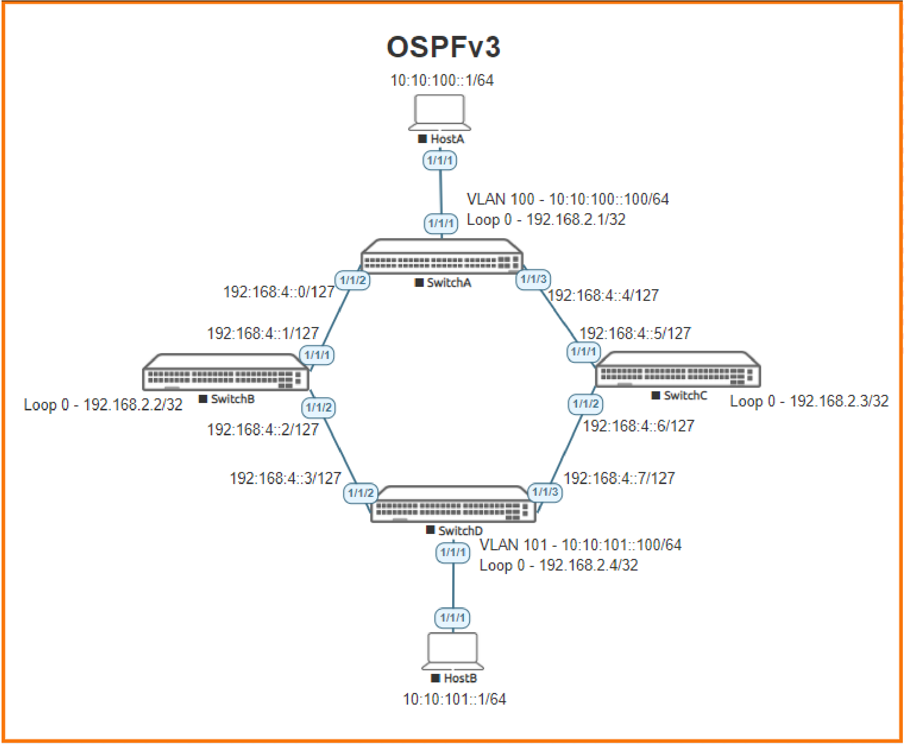

# Lab Guide: Deploying OSPFv3

## Lab Objective
At the end of this workshop, you will be able to implement the fundamentals of deploying an OSPFv3 network based on Aruba CX Switches. A successful deployment will show IPv6 HostA and IPv6 HostB have connectivity over the OSPFv3 fabric.

## Lab Overview
OSPFv3 is the IPv6 implementation of Open Shortest Path First protocol (OSPFv2 is the IPv4 implementation of this protocol). It is a link-state based IGP (Interior Gateway Protocol) routing protocol. It is widely used with medium to large sized enterprise networks.

The characteristics of OSPFv3 are:

- Provides a loop-free topology using SPF algorithm
- Allows hierarchical routing using area 0 (backbone area) as the top of the hierarchy
- Supports load balancing with equal cost routes for the same destination
- OSPFv2 is a classless protocol and allows for a hierarchical design with VLSM (Variable Length Subnet
- Masking) and route summarization
- Scales easily using the concept of OSPF areas
- Provides fast convergence with triggered, incremental updates via LSAs

Some OSPFv3 configurations are done in the global configuration context, while others are perfomed in the OSPFv3 router context or in the interface configuration context. OSPFv3 can be configured on routed ports, VLAN interfaces, LAG interfaces, and loopback interfaces. All such configurations work in the mentioned interfaces context.

## Lab Network Layout
<a name="network-layout"></a>

_Figure 1: Lab Topology and Addresses_

## Lab Tasks
To complete the lab, you should follow the following steps:
1. Lab set-up
2. Configure HostA and HostB
3. Configure switch to switch interfaces, loopbacks, and VLANs
4. Configure OSPFv2
5. Verify OSPF peering is up
6. Verify HostA to HostB connectivity

Notes:
- Many commands, except ‘show’ & ‘ping’, are configuration commands and need to be entered in the proper switch configuration mode. If a command does not work make sure you are in the right configuration context.

### Task 1 – Lab Setup

For this lab refer to [Figure 1](#network-layout) for topology setup.
- Deploy the containerlab topology file: ```sudo containerlab deploy -t topology.clab.yaml``` (or use the [containerlab extension](https://containerlab.dev/manual/vsc-extension/) for Visual Studio Code)
  - All the connections between nodes are already set-up
  - Check that sufficient numbers of CPUs and RAM is available for three AOS-CX nodes (at least 1 vCPU and 2048 MB per node)
  - Ensure that the environment variable ```AOS_CX_VERSION``` is set to a value that matches the image version (default is ```latest```)
    - If ```AOS_CX_VERSION``` is not set, image ```vrnetlab/aruba_arubaos-cx:latest``` will be deployed
    - If ```AOS_CX_VERSION=20241115202521```, image ```vrnetlab/aruba_arubaos-cx:20241115202521``` will be deployed
- Open SSH session to each switch and log in with user 'admin' and password 'admin'.

On all devices, bring up required ports:
```
Switch[A-D]# configure terminal
Switch[A-D](config)#
```
Copy/Paste the configuration to Switch A-D:
```
int 1/1/1-1/1/3
  no shutdown
```
Leave configuration mode by pressing ```Ctrl-z```.

Validate LLDP neighbors appear as expected on each switch. Here we show Switch B output only.

#### SwitchB
```
SwitchB# show lldp neighbor-info 

LLDP Neighbor Information 
=========================

Total Neighbor Entries          : 2
Total Neighbor Entries Deleted  : 0
Total Neighbor Entries Dropped  : 0
Total Neighbor Entries Aged-Out : 0

LOCAL-PORT  CHASSIS-ID         PORT-ID                      PORT-DESC                    TTL      SYS-NAME    
-----------------------------------------------------------------------------------------------------------
1/1/1       08:00:09:bc:5b:e1  1/1/2                        1/1/2                        120      SwitchA                            
1/1/2       08:00:09:88:26:0b  1/1/2                        1/1/2                        120      SwitchD  
```

### Task 2 - Configure HostA and HostB

Already done in containerlab topology file:
```
    HostA:
      kind: linux
      exec:
        - ip -6 address add 10:10:100::1/64 dev eth1
        - ip -6 route add 10:10:101::/64 via 10:10:100::100 dev eth1
    HostB:
      kind: linux
      exec:
        - ip -6 address add 10:10:101::1/64 dev eth1
        - ip -6 route add 10:10:100::/64 via 10:10:101::100 dev eth1
```

### Task 3: Deploy Global OSPF and Interface Configurations

Make sure to match configurations from the topology image in [Figure 1](#network-layout):
- Configure proper Loopback0 addresses for each switch
- Enable the OSPFv3 process 1 area 0
  - You can either create the OSPF process by using the _router ospfv3_ command, or you can apply the OSPFv3 area 0 to the loopback, in which case you will be asked if you want to create the OSPFv3 process.
- Configure an OSPF IPv4 Router-ID

#### SwitchA
```
SwitchA# configure terminal
SwitchA(config)# interface loopback 0
SwitchA(config-loopback-if)# ip address 192.168.2.1/32
SwitchA(config-loopback-if)# ipv6 ospfv3 1 area 0
OSPFv3 Process is not configured.
Do you want to create (y/n)? y
OSPFv3 Area is not configured.
Do you want to create (y/n)? y
```
Leave configuration mode by pressing ```Ctrl-z```.

#### SwitchB
```
SwitchB# configure terminal
SwitchB(config)# interface loopback 0
SwitchB(config-loopback-if)# ip address 192.168.2.2/32
SwitchB(config-loopback-if)# ipv6 ospfv3 1 area 0
OSPFv3 Process is not configured.
Do you want to create (y/n)? y
OSPFv3 Area is not configured.
Do you want to create (y/n)? y
```
Leave configuration mode by pressing ```Ctrl-z```.

#### SwitchC
```
SwitchC# configure terminal
SwitchC(config)# interface loopback 0
SwitchC(config-loopback-if)# ip address 192.168.2.3/32
SwitchC(config-loopback-if)# ipv6 ospfv3 1 area 0
OSPFv3 Process is not configured.
Do you want to create (y/n)? y
OSPFv3 Area is not configured.
Do you want to create (y/n)? y
```
Leave configuration mode by pressing ```Ctrl-z```.

#### SwitchD
```
SwitchD# configure terminal
SwitchD(config)# interface loopback 0
SwitchD(config-loopback-if)# ip address 192.168.2.4/32
SwitchD(config-loopback-if)# ipv6 ospfv3 1 area 0
OSPFv3 Process is not configured.
Do you want to create (y/n)? y
OSPFv3 Area is not configured.
Do you want to create (y/n)? y
```
Leave configuration mode by pressing ```Ctrl-z```.

### Task 4: Configure Switch to Switch Interfaces

- Ensure interfaces are unshut
- Apply proper IPv6 Global Unique Address
- Apply proper OSPFv3 and Area to each interface
- Configure point-to-point links (where needed)

#### SwitchA
```
SwitchA# configure terminal
SwitchA(config)#
```
Copy/Paste the configuration to Switch A:
```
interface 1/1/2
  no shutdown
  description To SwitchB
  ipv6 address 192:168:4::0/127
  ipv6 ospfv3 1 area 0
  ipv6 ospfv3 network point-to-point
  exit
interface 1/1/3
  no shutdown
  description To SwitchC
  ipv6 address 192:168:4::4/127
  ipv6 ospfv3 1 area 0
  ipv6 ospfv3 network point-to-point
  exit
```
Leave configuration mode by pressing ```Ctrl-z```.

#### SwitchB
```
SwitchB# configure terminal
SwitchB(config)#
```
Copy/Paste the configuration to Switch B:
```
interface 1/1/1
  no shutdown
  description To SwitchA
  ipv6 address 192:168:4::1/127
  ipv6 ospfv3 1 area 0
  ipv6 ospfv3 network point-to-point
  exit
interface 1/1/2
  no shutdown
  description To SwitchD
  ipv6 address 192:168:4::2/127
  ipv6 ospfv3 1 area 0
  ipv6 ospfv3 network point-to-point
  exit
```
Leave configuration mode by pressing ```Ctrl-z```.

#### SwitchC
```
SwitchC# configure terminal
SwitchC(config)#
```
Copy/Paste the configuration to Switch C:
```
interface 1/1/1
  no shutdown
  description To SwitchA
  ipv6 address 192:168:4::5/127
  ipv6 ospfv3 1 area 0
  ipv6 ospfv3 network point-to-point
  exit
interface 1/1/2
  no shutdown
  description To SwitchD
  ipv6 address 192:168:4::6/127
  ipv6 ospfv3 1 area 0
  ipv6 ospfv3 network point-to-point
  exit
```
Leave configuration mode by pressing ```Ctrl-z```.

#### SwitchD
```
SwitchD# configure terminal
SwitchD(config)#
```
Copy/Paste the configuration to Switch D:
```
interface 1/1/2
  no shutdown
  description To SwitchB
  ipv6 address 192:168:4::3/127
  ipv6 ospfv3 1 area 0
  ipv6 ospfv3 network point-to-point
  exit
interface 1/1/3
  no shutdown
  description To SwitchC
  ipv6 address 192:168:4::7/127
  ipv6 ospfv3 1 area 0
  ipv6 ospfv3 network point-to-point
  exit
```
Leave configuration mode by pressing ```Ctrl-z```.

### Task 5: Verify OSPFv3 Peering is Up

Verify that each switch can peer with neighbors:
#### SwitchA
```
SwitchA# show ipv6 ospfv3 neighbors 
VRF : default                          Process : 1
===================================================

Total Number of Neighbors: 2

Neighbor ID      Priority  State             Interface
-------------------------------------------------------
192.168.2.2      n/a       FULL              1/1/2             
  Neighbor address fe80::800:901:4cf:74ae

192.168.2.3      n/a       FULL              1/1/3             
  Neighbor address fe80::800:901:4af:a314
```

#### SwitchD
```
SwitchD# show ipv6 ospfv3 neighbors
VRF : default                          Process : 1
===================================================

Total Number of Neighbors: 2

Neighbor ID      Priority  State             Interface
-------------------------------------------------------
192.168.2.2      n/a       FULL              1/1/2             
  Neighbor address fe80::800:901:8cf:74ae

192.168.2.3      n/a       FULL              1/1/3             
  Neighbor address fe80::800:901:8af:a314
```

### Task6: Configure Host and Client segments
- Create VLANs
- Apply proper address
- Apply VLAN to proper host/client interfaces

#### SwitchA
```
SwitchA# configure terminal
SwitchA(config)#
```
Copy/Paste the configuration to Switch A:
```
vlan 100
  description HostA Segment
  exit
interface 1/1/1
  description HostA Interface
  no shutdown
  no routing
  vlan access 100
  exit
interface vlan100
  description HostA SVI
  ipv6 address 10:10:100::100/64
  ipv6 ospfv3 1 area 0
  exit
```
Leave configuration mode by pressing ```Ctrl-z```.

#### SwitchD
```
SwitchD# configure terminal
SwitchD(config)#
```
Copy/Paste the configuration to Switch D:
```
vlan 101
  description HostB Segment
  exit
interface 1/1/1
  description HostB Interface
  no shutdown
  no routing
  vlan access 101
  exit
interface vlan101
  description HostB SVI
  ipv6 address 10:10:101::100/64
  ipv6 ospfv3 1 area 0
  exit
```
Leave configuration mode by pressing ```Ctrl-z```.


### Task 7: Verify HostA and HostB Connectivity

#### HostA
```
/ # ping6 -c 5 10:10:101::1
PING 10:10:101::1(10:10:101::1) 56 data bytes
64 bytes from 10:10:101::1: icmp_seq=1 ttl=61 time=7.17 ms
64 bytes from 10:10:101::1: icmp_seq=2 ttl=61 time=5.69 ms
64 bytes from 10:10:101::1: icmp_seq=3 ttl=61 time=7.72 ms
64 bytes from 10:10:101::1: icmp_seq=4 ttl=61 time=5.47 ms
64 bytes from 10:10:101::1: icmp_seq=5 ttl=61 time=4.38 ms

--- 10:10:101::1 ping statistics ---
5 packets transmitted, 5 received, 0% packet loss, time 4004ms
rtt min/avg/max/mdev = 4.382/6.084/7.718/1.206 ms
```

#### HostB
```
/ # ping6 -c 5 10:10:100::1
PING 10:10:100::1(10:10:100::1) 56 data bytes
64 bytes from 10:10:100::1: icmp_seq=1 ttl=61 time=4.76 ms
64 bytes from 10:10:100::1: icmp_seq=2 ttl=61 time=4.46 ms
64 bytes from 10:10:100::1: icmp_seq=3 ttl=61 time=4.18 ms
64 bytes from 10:10:100::1: icmp_seq=4 ttl=61 time=12.3 ms
64 bytes from 10:10:100::1: icmp_seq=5 ttl=61 time=7.82 ms

--- 10:10:100::1 ping statistics ---
5 packets transmitted, 5 received, 0% packet loss, time 4005ms
rtt min/avg/max/mdev = 4.176/6.708/12.318/3.096 ms
```

#### SwitchA
```
SwitchA# show ipv6 ospfv3 routes 
Codes: i - Intra-area route, I - Inter-area route
       E1 - External type-1, E2 - External type-2

OSPFv3 Process ID 1 VRF default, Routing Table
-----------------------------------------------

Total Number of OSPFv3 Routes : 7

10:10:100::/64     (i) area:0.0.0.0
     directly attached to interface vlan100, cost 100 distance 110
10:10:101::/64     (i) area:0.0.0.0
     via fe80::800:901:4af:a314 interface 1/1/3, cost 300 distance 110
10:10:101::/64     (i) area:0.0.0.0
     via fe80::800:901:4cf:74ae interface 1/1/2, cost 300 distance 110
192:168:4::/127    (i) area:0.0.0.0
     directly attached to interface 1/1/2, cost 100 distance 110
192:168:4::2/127   (i) area:0.0.0.0
     via fe80::800:901:4cf:74ae interface 1/1/2, cost 200 distance 110
192:168:4::4/127   (i) area:0.0.0.0
     directly attached to interface 1/1/3, cost 100 distance 110
192:168:4::6/127   (i) area:0.0.0.0
     via fe80::800:901:4af:a314 interface 1/1/3, cost 200 distance 110
```

#### SwitchB
```
SwitchB# show ipv6 ospfv3 routes 
Codes: i - Intra-area route, I - Inter-area route
       E1 - External type-1, E2 - External type-2

OSPFv3 Process ID 1 VRF default, Routing Table
-----------------------------------------------

Total Number of OSPFv3 Routes : 6

10:10:100::/64     (i) area:0.0.0.0
     via fe80::800:901:8bc:5be1 interface 1/1/1, cost 200 distance 110
10:10:101::/64     (i) area:0.0.0.0
     via fe80::800:901:888:260b interface 1/1/2, cost 200 distance 110
192:168:4::/127    (i) area:0.0.0.0
     directly attached to interface 1/1/1, cost 100 distance 110
192:168:4::2/127   (i) area:0.0.0.0
     directly attached to interface 1/1/2, cost 100 distance 110
192:168:4::4/127   (i) area:0.0.0.0
     via fe80::800:901:8bc:5be1 interface 1/1/1, cost 200 distance 110
192:168:4::6/127   (i) area:0.0.0.0
     via fe80::800:901:888:260b interface 1/1/2, cost 200 distance 110
```


## Appendix - Complete Configurations

### SwitchA
```
hostname SwitchA
user admin group administrators password ciphertext AQBapcb7K4cXc0H8KbxuDv+kuYicXEQN+ldtMaIKVMELqKLTYgAAAMSl9NvNMqmjgS0rS7rOQVve0QyJdJ/3oIAp4knMVD6tOV951D/rytknA6XaqiGp7WH8HRe1CRGtE9ZMybA9mikSKZYxp6i6mKPao9sEKi9Vlz+FayGBLBjHyJgMarePrNhF
ntp server pool.ntp.org minpoll 4 maxpoll 4 iburst
ntp enable
ntp vrf mgmt
!
!
!
!
!
!
ssh server vrf mgmt
vlan 1
vlan 100
    description HostA Segment
interface mgmt
    no shutdown
    ip static 10.0.0.15/24
    default-gateway 10.0.0.2
interface 1/1/1
    description HostA Interface
    no shutdown
    no routing
    vlan access 100
interface 1/1/2
    description To SwitchB
    no shutdown
    ipv6 address 192:168:4::/127
    ipv6 ospfv3 1 area 0.0.0.0
    ipv6 ospfv3 network point-to-point
interface 1/1/3
    description To SwitchC
    no shutdown
    ipv6 address 192:168:4::4/127
    ipv6 ospfv3 1 area 0.0.0.0
    ipv6 ospfv3 network point-to-point
interface loopback 0
    ip address 192.168.2.1/32
    ipv6 ospfv3 1 area 0.0.0.0
interface vlan 100
    description HostA SVI
    ipv6 address 10:10:100::100/64
    ipv6 ospfv3 1 area 0.0.0.0
!
!
!
!
!
router ospfv3 1
    area 0.0.0.0
https-server vrf mgmt
```

### SwitchB
```
hostname SwitchB
user admin group administrators password ciphertext AQBapZjy1xCTPZbGWJNWGUe5K6JPBLHWWjJo/uzuj6LgpfMTYgAAAGmElz1Iv+kwQ51anyQeRU8QvkJsXl6KAFhP4riV1qfBq9yD6gO49Ndt/kMW3/exC4xdpnmG//CvNWZDBiWVlj/6Jg0MQnjpX/DN1E1gVquGgOSvW51Zii4uGA1rv3yMszH4
ntp server pool.ntp.org minpoll 4 maxpoll 4 iburst
ntp enable
ntp vrf mgmt
!
!
!
!
!
!
ssh server vrf mgmt
vlan 1
interface mgmt
    no shutdown
    ip static 10.0.0.15/24
    default-gateway 10.0.0.2
interface 1/1/1
    description To SwitchA
    no shutdown
    ipv6 address 192:168:4::1/127
    ipv6 ospfv3 1 area 0.0.0.0
    ipv6 ospfv3 network point-to-point
interface 1/1/2
    description To SwitchD
    no shutdown
    ipv6 address 192:168:4::2/127
    ipv6 ospfv3 1 area 0.0.0.0
    ipv6 ospfv3 network point-to-point
interface 1/1/3
    no shutdown
interface loopback 0
    ip address 192.168.2.2/32
    ipv6 ospfv3 1 area 0.0.0.0
!
!
!
!
!
router ospfv3 1
    area 0.0.0.0
https-server vrf mgmt
```

### SwitchC
```
hostname SwitchC
user admin group administrators password ciphertext AQBapeG7xkxX7dpNmOZqKuibXGG0O/Fed8tLelIl6iR0u3atYgAAAOsKC7tjxr2AkTZYCIa6uJHDg6BS1tvtk/UHZNaWC0CEtAWts7fCPQdL+MXJX4cLXE7Ds3oGy4+GdfugwAGiDG7NLWJj6oTVq9VMXYXxCVGbmL0xSM8WaoStkbKyyktVk56P
ntp server pool.ntp.org minpoll 4 maxpoll 4 iburst
ntp enable
ntp vrf mgmt
!
!
!
!
!
!
ssh server vrf mgmt
vlan 1
interface mgmt
    no shutdown
    ip static 10.0.0.15/24
    default-gateway 10.0.0.2
interface 1/1/1
    description To SwitchA
    no shutdown
    ipv6 address 192:168:4::5/127
    ipv6 ospfv3 1 area 0.0.0.0
    ipv6 ospfv3 network point-to-point
interface 1/1/2
    description To SwitchD
    no shutdown
    ipv6 address 192:168:4::6/127
    ipv6 ospfv3 1 area 0.0.0.0
    ipv6 ospfv3 network point-to-point
interface 1/1/3
    no shutdown
interface loopback 0
    ip address 192.168.2.3/32
    ipv6 ospfv3 1 area 0.0.0.0
!
!
!
!
!
router ospfv3 1
    area 0.0.0.0
https-server vrf mgmt
```

### SwitchD
```
hostname SwitchD
user admin group administrators password ciphertext AQBapWnRa+y7ojKuwEE6td6achqPkYVfTQzDWtIvmkaY07gWYgAAAAPLc0oOwmbZSYDe5aWHm8Ome4pnRHN4waZy0x87gDFXltsnT3yijMTOW3yx4OeOMncT+owndSalfrccSEVQVXARLUZxXpMaX3diwc/K8RlUFerPPc/500KAKjBG8klMW9aS
ntp server pool.ntp.org minpoll 4 maxpoll 4 iburst
ntp enable
ntp vrf mgmt
!
!
!
!
!
!
ssh server vrf mgmt
vlan 1
vlan 101
    description HostB Segment
interface mgmt
    no shutdown
    ip static 10.0.0.15/24
    default-gateway 10.0.0.2
interface 1/1/1
    description HostB Interface
    no shutdown
    no routing
    vlan access 101
interface 1/1/2
    description To SwitchB
    no shutdown
    ipv6 address 192:168:4::3/127
    ipv6 ospfv3 1 area 0.0.0.0
    ipv6 ospfv3 network point-to-point
interface 1/1/3
    description To SwitchC
    no shutdown
    ipv6 address 192:168:4::7/127
    ipv6 ospfv3 1 area 0.0.0.0
    ipv6 ospfv3 network point-to-point
interface loopback 0
    ip address 192.168.2.4/32
    ipv6 ospfv3 1 area 0.0.0.0
interface vlan 101
    description HostB SVI
    ipv6 address 10:10:101::100/64
    ipv6 ospfv3 1 area 0.0.0.0
!
!
!
!
!
router ospfv3 1
    area 0.0.0.0
https-server vrf mgmt
```

### HostA
Refer to topology file:
```
    HostA:
      kind: linux
      exec:
        - ip -6 address add 10:10:100::1/64 dev eth1
        - ip -6 route add 10:10:101::/64 via 10:10:100::100 dev eth1
```

### HostB
Refer to topology file:
```
    HostB:
      kind: linux
      exec:
        - ip -6 address add 10:10:101::1/64 dev eth1
        - ip -6 route add 10:10:100::/64 via 10:10:101::100 dev eth1
```

