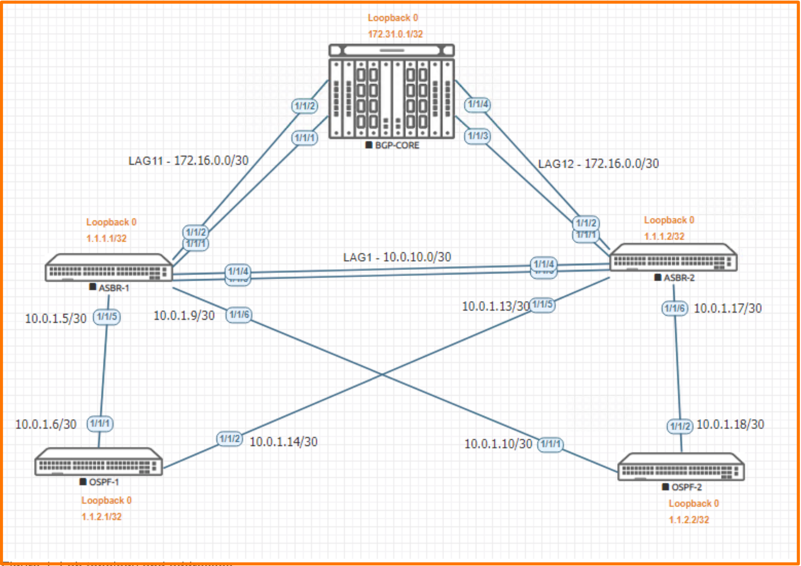

# Lab Guide: OSPF BGP Redistribution

> [!NOTE]
> This lab is based on the AOS-CX Switch Simulator Labs. A ```topology.clab.yaml``` file was added to use the lab with [containerlab](https://github.com/srl-labs/containerlab). 

> [!IMPORTANT]
> This guide assumes that the AOS-CX Switch Simulator is available as a docker container. You can use [vrnetlab](https://github.com/hellt/vrnetlab) to accomplish this.

>[!NOTE]
> This description is based on the AOS-CX Switch Simulator Lab Guide [OSPF-BGP Route Distribution](https://community.arubanetworks.com/HigherLogic/System/DownloadDocumentFile.ashx?DocumentFileKey=bffa2849-36ef-43d7-839f-51aa7ab28ce4) and includes all necessary changes to use the lab with [containerlab](https://github.com/srl-labs/containerlab).

## Lab Objective
At the end of this workshop, you will be able to implement the basic configuration to enable both OSPF and BGP. The main goal is to ensure a successful deployment of OSPF and BGP routes and route redistribution.

## Lab Overview
By default, switches only advertise and share routes with other switches running the same protocol.

So, if you have 2 switches and one runs OSPF and the other runs BGP and you want them to know about each others routes.

By default, they won't share routing information because they are not running the same protocol. But we can achieve using route
redistribution.

Route redistribution is a process that allows a network to use a routing protocol to dynamically route traffic based on information
learned from a different routing protocol like OSPF and BGP. Route redistribution helps increase accessibility and control routes
within networks. Basically, inject routes from a different routing protocol or AS Route redistribution helps increase accessibility within networks.

## Lab Network Layout
<a name="network-layout"></a>

_Figure 1: Lab Topology and Addresses_

## Lab Tasks

### Task 1: Lab Setup

For this lab refer to [Figure 1](#network-layout) for topology setup.
- Deploy the containerlab topology file: ```sudo containerlab deploy -t topology.clab.yaml``` (or use the [containerlab extension](https://containerlab.dev/manual/vsc-extension/) for Visual Studio Code)
  - All the connections between nodes are already set-up
  - Check that sufficient numbers of CPUs and RAM is available for three AOS-CX nodes (at least 1 vCPU and 2048 MB per node)
  - Ensure that the environment variable ```AOS_CX_VERSION``` is set to a value that matches the image version (default is ```latest```)
    - If ```AOS_CX_VERSION``` is not set, image ```vrnetlab/aruba_arubaos-cx:latest``` will be deployed
    - If ```AOS_CX_VERSION=20241115202521```, image ```vrnetlab/aruba_arubaos-cx:20241115202521``` will be deployed
- Open SSH session to each switch and log in with user 'admin' and password 'admin'.

On all devices, bring up required ports:
#### OSPF-1 and OSPF-2
```
OSPF[1-2]# configure terminal
OSPF[1-2](config)#
```
Copy/Paste the configuration to OSPF-1 and OSPF-2:
```
int 1/1/1-1/1/2
  no shutdown
```
Leave configuration mode by pressing ```Ctrl-z```.

#### ASBR-1 and ASBR-2
```
ASBR[1-2]# configure terminal
ASBR[1-2](config)#
```
Copy/Paste the configuration to ASBR-1 and ASBR-2:
```
int 1/1/1-1/1/6
  no shutdown
```
Leave configuration mode by pressing ```Ctrl-z```.

#### ASBR-1 and ASBR-2
```
BGP-CORE# configure terminal
BGP-CORE(config)#
```
Copy/Paste the configuration to BGP-CORE:
```
int 1/1/1-1/1/6
  no shutdown
```
Leave configuration mode by pressing ```Ctrl-z```.

Validate LLDP neighbors appear as expected on each device:

#### BGP-CORE
```
BGP-CORE# show lldp neighbor-info 

LLDP Neighbor Information 
=========================

Total Neighbor Entries          : 4
Total Neighbor Entries Deleted  : 0
Total Neighbor Entries Dropped  : 0
Total Neighbor Entries Aged-Out : 0

LOCAL-PORT  CHASSIS-ID         PORT-ID                      PORT-DESC                    TTL      SYS-NAME    
-----------------------------------------------------------------------------------------------------------
1/1/1       08:00:09:12:9b:f4  1/1/1                        1/1/1                        120      ASBR-1                             
1/1/2       08:00:09:12:9b:f4  1/1/2                        1/1/2                        120      ASBR-1                             
1/1/3       08:00:09:a6:0d:dd  1/1/1                        1/1/1                        120      ASBR-2                             
1/1/4       08:00:09:a6:0d:dd  1/1/2                        1/1/2                        120      ASBR-2  
```

#### ASBR-1
```
ASBR-1# show lldp neighbor-info 

LLDP Neighbor Information 
=========================

Total Neighbor Entries          : 6
Total Neighbor Entries Deleted  : 0
Total Neighbor Entries Dropped  : 0
Total Neighbor Entries Aged-Out : 0

LOCAL-PORT  CHASSIS-ID         PORT-ID                      PORT-DESC                    TTL      SYS-NAME    
-----------------------------------------------------------------------------------------------------------
1/1/1       08:00:09:85:30:09  1/1/1                        1/1/1                        120      BGP-CORE                           
1/1/2       08:00:09:85:30:09  1/1/2                        1/1/2                        120      BGP-CORE                           
1/1/3       08:00:09:a6:0d:dd  1/1/3                        1/1/3                        120      ASBR-2                             
1/1/4       08:00:09:a6:0d:dd  1/1/4                        1/1/4                        120      ASBR-2                             
1/1/5       08:00:09:5d:5f:7d  1/1/1                        1/1/1                        120      OSPF-1                             
1/1/6       08:00:09:7c:b9:a5  1/1/1                        1/1/1                        120      OSPF-2  
```

#### ASBR-2
```
ASBR-2# show lldp neighbor-info 

LLDP Neighbor Information 
=========================

Total Neighbor Entries          : 6
Total Neighbor Entries Deleted  : 0
Total Neighbor Entries Dropped  : 0
Total Neighbor Entries Aged-Out : 0

LOCAL-PORT  CHASSIS-ID         PORT-ID                      PORT-DESC                    TTL      SYS-NAME    
-----------------------------------------------------------------------------------------------------------
1/1/1       08:00:09:85:30:09  1/1/3                        1/1/3                        120      BGP-CORE                           
1/1/2       08:00:09:85:30:09  1/1/4                        1/1/4                        120      BGP-CORE                           
1/1/3       08:00:09:12:9b:f4  1/1/3                        1/1/3                        120      ASBR-1                             
1/1/4       08:00:09:12:9b:f4  1/1/4                        1/1/4                        120      ASBR-1                             
1/1/5       08:00:09:5d:5f:7d  1/1/2                        1/1/2                        120      OSPF-1                             
1/1/6       08:00:09:7c:b9:a5  1/1/2                        1/1/2                        120      OSPF-2   
```

#### OSPF-1
```
OSPF-1# show lldp neighbor-info 

LLDP Neighbor Information 
=========================

Total Neighbor Entries          : 2
Total Neighbor Entries Deleted  : 0
Total Neighbor Entries Dropped  : 0
Total Neighbor Entries Aged-Out : 0

LOCAL-PORT  CHASSIS-ID         PORT-ID                      PORT-DESC                    TTL      SYS-NAME    
-----------------------------------------------------------------------------------------------------------
1/1/1       08:00:09:12:9b:f4  1/1/5                        1/1/5                        120      ASBR-1                             
1/1/2       08:00:09:a6:0d:dd  1/1/5                        1/1/5                        120      ASBR-2 
```

#### OSPF-2
```
OSPF-2# show lldp neighbor-info 

LLDP Neighbor Information 
=========================

Total Neighbor Entries          : 2
Total Neighbor Entries Deleted  : 0
Total Neighbor Entries Dropped  : 0
Total Neighbor Entries Aged-Out : 0

LOCAL-PORT  CHASSIS-ID         PORT-ID                      PORT-DESC                    TTL      SYS-NAME    
-----------------------------------------------------------------------------------------------------------
1/1/1       08:00:09:12:9b:f4  1/1/6                        1/1/6                        120      ASBR-1                             
1/1/2       08:00:09:a6:0d:dd  1/1/6                        1/1/6                        120      ASBR-2  
```

### Task 2: Configure BGP-CORE

```
BGP-CORE# configure terminal
BGP-CORE(config)#
```

#### Configure LAG11 to ASBR-1

Copy/Paste the configuration to BGP-CORE:
```
interface lag 11
  no shutdown
  ip address 172.16.0.1/30
  lacp mode active
interface 1/1/1
  no shutdown
  lag 11
interface 1/1/2
  no shutdown
  lag 11
```

#### Configure LAG12 to ASBR-2

Copy/Paste the configuration to BGP-CORE:
```
interface lag 12
  no shutdown
  ip address 172.16.0.5/30
  lacp mode active
interface 1/1/3
  no shutdown
  lag 12
interface 1/1/4
  no shutdown
  lag 12
```
#### Configure Loopback

Copy/Paste the configuration to BGP-CORE:
```
interface loopback 0
  ip address 172.31.0.1/32
```

#### Configure BGP AS 65010
Copy/Paste the configuration to BGP-CORE:
```
router bgp 65010
  neighbor 172.16.0.2 remote-as 65011
  neighbor 172.16.0.6 remote-as 65011
  address-family ipv4 unicast
    neighbor 172.16.0.2 activate
    neighbor 172.16.0.6 activate
    network 172.16.0.0/30
    network 172.16.0.4/30
    network 172.31.0.1/32
  exit-address-family
```

Leave configuration mode by pressing ```Ctrl-z```.

### Task 3: Configure ASBR-1

```
ASBR-1# configure terminal
ASBR-1(config)#
```

#### Configure OSPF and BGP

Copy/Paste the configuration to ASBR-1:
```
router ospf 1
  router-id 1.1.1.1
  bfd all-interfaces
  redistribute bgp
  area 0.0.0.0
interface loopback 0
  ip address 1.1.1.1/32
  ip ospf 1 area 0.0.0.0
router bgp 65011
  neighbor 172.16.0.1 remote-as 65010
  address-family ipv4 unicast
    neighbor 172.16.0.1 activate
    neighbor 172.16.0.1 next-hop-self
    redistribute ospf
  exit-address-family
```

#### Configure Lag1 between ASBR’s

Copy/Paste the configuration to ASBR-1:
```
interface lag 1
  no shutdown
  ip address 10.0.1.1/30
  lacp mode active
  ip ospf 1 area 0.0.0.0
  ip ospf network point-to-point
interface 1/1/3
  no shutdown
  lag 1
interface 1/1/4
  no shutdown
  lag 1
```

#### Configure Lag11 to BGP-CORE

Copy/Paste the configuration to ASBR-1:
```
interface lag 11
  no shutdown
  ip address 172.16.0.2/30
  lacp mode active
interface 1/1/1
  no shutdown
  lag 11
interface 1/1/2
  no shutdown
  lag 11
```

#### Configure OSPF-1 and OSPF-2 connected interface

Copy/Paste the configuration to ASBR-1:
```
interface 1/1/5
  no shutdown
  ip address 10.0.1.5/30
  ip ospf 1 area 0.0.0.0
  ip ospf network point-to-point
interface 1/1/6
  no shutdown
  ip address 10.0.1.9/30
  ip ospf 1 area 0.0.0.0
  ip ospf network point-to-point
```

Leave configuration mode by pressing ```Ctrl-z```.

### Task 4: Configure ASBR-2

```
ASBR-2# configure terminal
ASBR-2(config)#
```

#### Configure OSPF and BGP

Copy/Paste the configuration to ASBR-2:
```
router ospf 1
  router-id 1.1.1.2
  bfd all-interfaces
  redistribute bgp
  area 0.0.0.0
interface loopback 0
  ip address 1.1.1.2/32
  ip ospf 1 area 0.0.0.0
router bgp 65011
  neighbor 172.16.0.5 remote-as 65010
  address-family ipv4 unicast
    neighbor 172.16.0.5 activate
    neighbor 172.16.0.5 next-hop-self
    redistribute ospf
  exit-address-family
```

#### Configure Lag1 between ASBR’s

Copy/Paste the configuration to ASBR-2:
```
interface lag 1
  no shutdown
  ip address 10.0.1.2/30
  lacp mode active
  ip ospf 1 area 0.0.0.0
  ip ospf network point-to-point
interface 1/1/3
  no shutdown
  lag 1
interface 1/1/4
  no shutdown
  lag 1
```

#### Configure Lag12 to BGP-CORE

Copy/Paste the configuration to ASBR-2:
```
interface lag 12
  no shutdown
  ip address 172.16.0.6/30
  lacp mode active
interface 1/1/1
  no shutdown
  lag 12
interface 1/1/2
  no shutdown
  lag 12
```

#### Configure OSPF-1 and OSPF-2 connected interface

Copy/Paste the configuration to ASBR-2:
```
interface 1/1/5
  no shutdown
  ip address 10.0.1.13/30
  ip ospf 1 area 0.0.0.0
  ip ospf network point-to-point
interface 1/1/6
  no shutdown
  ip address 10.0.1.17/30
  ip ospf 1 area 0.0.0.0
  ip ospf network point-to-point
```

Leave configuration mode by pressing ```Ctrl-z```.

### Task 5: Configure OSPF-1
```
OSPF-1# configure terminal
OSPF-1(config)#
```
#### Configure Loopback and OSPF

Copy/Paste the configuration to OSPF-1:
```
router ospf 1
  router-id 1.1.2.1
  area 0.0.0.0
interface loopback 0
  ip address 1.1.2.1/32
  ip ospf 1 area 0.0.0.0
```

#### Configure OSPF on connected interfaces

Copy/Paste the configuration to OSPF-1:
```
interface 1/1/1
  no shutdown
  ip address 10.0.1.6/30
  ip ospf 1 area 0.0.0.0
  ip ospf network point-to-point
interface 1/1/2
  no shutdown
  ip address 10.0.1.14/30
  ip ospf 1 area 0.0.0.0
  ip ospf network point-to-point
```

Leave configuration mode by pressing ```Ctrl-z```.

### Task 6: Configure OSPF-2

```
OSPF-2# configure terminal
OSPF-2(config)#
```

#### Configure Loopback and OSPF

Copy/Paste the configuration to OSPF-2:
```
router ospf 1
  router-id 1.1.2.2
  bfd all-interfaces
  area 0.0.0.0
interface loopback 0
  ip address 1.1.2.2/32
  ip ospf 1 area 0.0.0.0
```

#### Configure OSPF on connected interfaces

Copy/Paste the configuration to OSPF-2:
```
interface 1/1/1
  no shutdown
  ip address 10.0.1.10/30
  ip ospf 1 area 0.0.0.0
  ip ospf network point-to-point
interface 1/1/2
  no shutdown
  ip address 10.0.1.18/30
  ip ospf 1 area 0.0.0.0
  ip ospf network point-to-point
```

Leave configuration mode by pressing ```Ctrl-z```.

### Task 7: Validation

#### OSPF-1 Validation

```
OSPF-1# ping 172.31.0.1
PING 172.31.0.1 (172.31.0.1) 100(128) bytes of data.
108 bytes from 172.31.0.1: icmp_seq=1 ttl=62 time=25.4 ms
108 bytes from 172.31.0.1: icmp_seq=2 ttl=62 time=5.68 ms
108 bytes from 172.31.0.1: icmp_seq=3 ttl=62 time=25.0 ms
108 bytes from 172.31.0.1: icmp_seq=4 ttl=62 time=7.16 ms
108 bytes from 172.31.0.1: icmp_seq=5 ttl=62 time=8.09 ms

--- 172.31.0.1 ping statistics ---
5 packets transmitted, 5 received, 0% packet loss, time 4009ms
rtt min/avg/max/mdev = 5.678/14.264/25.413/8.960 ms
OSPF-1# 
OSPF-1# show ip route 172.31.0.1

VRF: default

   Prefix           : 172.31.0.1/32                                VRF(egress)        : -
   Nexthop          : 10.0.1.13                                    Interface          : 1/1/2
   Origin           : ospf                                         Type               : ospf_type2_ext
   Distance         : 110                                          Metric             : 25
   Age              : 00h:01m:36s                                  Tag                : 0
   Encap Type       : -                                            Encap Details      : -

   Prefix           : 172.31.0.1/32                                VRF(egress)        : -
   Nexthop          : 10.0.1.5                                     Interface          : 1/1/1
   Origin           : ospf                                         Type               : ospf_type2_ext
   Distance         : 110                                          Metric             : 25
   Age              : 00h:01m:36s                                  Tag                : 0
   Encap Type       : -                                            Encap Details      : -

OSPF-1# 
OSPF-1# show ip ospf neighbors 
VRF : default                          Process : 1
===================================================

Total Number of Neighbors : 2

Neighbor ID      Priority  State             Nbr Address       Interface
-------------------------------------------------------------------------
1.1.1.1          n/a       FULL              10.0.1.5           1/1/1          

1.1.1.2          n/a       FULL              10.0.1.13          1/1/2          

OSPF-1# 
OSPF-1# show ip route local

Displaying ipv4 routes selected for forwarding

Origin Codes: C - connected, S - static, L - local
              R - RIP, B - BGP, O - OSPF, D - DHCP
              U - Unnumbered
Type Codes:   E - External BGP, I - Internal BGP, V - VPN, EV - EVPN
              IA - OSPF internal area, E1 - OSPF external type 1
              E2 - OSPF external type 2

VRF: default

Prefix              Nexthop                                  Interface     VRF(egress)       Origin/   Distance/    Age
                                                                                             Type      Metric
--------------------------------------------------------------------------------------------------------
1.1.2.1/32          -                                        loopback0     -                 L         [0/0]        -            
10.0.1.6/32         -                                        1/1/1         -                 L         [0/0]        -            
10.0.1.14/32        -                                        1/1/2         -                 L         [0/0]        -            

Total Route Count : 3

OSPF-1#
OSPF-1# show ip route ospf

Displaying ipv4 routes selected for forwarding

Origin Codes: C - connected, S - static, L - local
              R - RIP, B - BGP, O - OSPF, D - DHCP
              U - Unnumbered
Type Codes:   E - External BGP, I - Internal BGP, V - VPN, EV - EVPN
              IA - OSPF internal area, E1 - OSPF external type 1
              E2 - OSPF external type 2

VRF: default

Prefix              Nexthop                                  Interface     VRF(egress)       Origin/   Distance/    Age
                                                                                             Type      Metric
--------------------------------------------------------------------------------------------------------
1.1.1.1/32          10.0.1.5                                 1/1/1         -                 O         [110/100]    00h:09m:02s  
1.1.1.2/32          10.0.1.13                                1/1/2         -                 O         [110/100]    00h:09m:03s  
1.1.2.2/32          10.0.1.13                                1/1/2         -                 O         [110/200]    00h:08m:38s  
                    10.0.1.5                                 1/1/1         -                           [110/200]    00h:08m:38s  
10.0.1.0/30         10.0.1.13                                1/1/2         -                 O         [110/150]    00h:09m:02s  
                    10.0.1.5                                 1/1/1         -                           [110/150]    00h:09m:02s  
10.0.1.8/30         10.0.1.5                                 1/1/1         -                 O         [110/200]    00h:09m:02s  
10.0.1.16/30        10.0.1.13                                1/1/2         -                 O         [110/200]    00h:09m:03s  
172.16.0.0/30       10.0.1.13                                1/1/2         -                 O/E2      [110/25]     00h:09m:03s  
172.16.0.4/30       10.0.1.5                                 1/1/1         -                 O/E2      [110/25]     00h:09m:02s  
172.31.0.1/32       10.0.1.13                                1/1/2         -                 O/E2      [110/25]     00h:09m:02s  
                    10.0.1.5                                 1/1/1         -                           [110/25]     00h:09m:02s  

Total Route Count : 9

OSPF-1# 
```

#### OSPF-2 Validation

```
OSPF-2# ping 172.31.0.1
PING 172.31.0.1 (172.31.0.1) 100(128) bytes of data.
108 bytes from 172.31.0.1: icmp_seq=1 ttl=62 time=11.2 ms
108 bytes from 172.31.0.1: icmp_seq=2 ttl=62 time=6.63 ms
108 bytes from 172.31.0.1: icmp_seq=3 ttl=62 time=5.60 ms
108 bytes from 172.31.0.1: icmp_seq=4 ttl=62 time=5.78 ms
108 bytes from 172.31.0.1: icmp_seq=5 ttl=62 time=5.58 ms

--- 172.31.0.1 ping statistics ---
5 packets transmitted, 5 received, 0% packet loss, time 4005ms
rtt min/avg/max/mdev = 5.581/6.949/11.161/2.140 ms
OSPF-2# 
OSPF-2# show ip ospf neighbors 
VRF : default                          Process : 1
===================================================

Total Number of Neighbors : 2

Neighbor ID      Priority  State             Nbr Address       Interface
-------------------------------------------------------------------------
1.1.1.1          n/a       FULL              10.0.1.9           1/1/1          

1.1.1.2          n/a       FULL              10.0.1.17          1/1/2          

OSPF-2# 
OSPF-2# show ip route local

Displaying ipv4 routes selected for forwarding

Origin Codes: C - connected, S - static, L - local
              R - RIP, B - BGP, O - OSPF, D - DHCP
              U - Unnumbered
Type Codes:   E - External BGP, I - Internal BGP, V - VPN, EV - EVPN
              IA - OSPF internal area, E1 - OSPF external type 1
              E2 - OSPF external type 2

VRF: default

Prefix              Nexthop                                  Interface     VRF(egress)       Origin/   Distance/    Age
                                                                                             Type      Metric
--------------------------------------------------------------------------------------------------------
1.1.2.2/32          -                                        loopback0     -                 L         [0/0]        -            
10.0.1.10/32        -                                        1/1/1         -                 L         [0/0]        -            
10.0.1.18/32        -                                        1/1/2         -                 L         [0/0]        -            

Total Route Count : 3

OSPF-2# 
OSPF-2# show ip route ospf 

Displaying ipv4 routes selected for forwarding

Origin Codes: C - connected, S - static, L - local
              R - RIP, B - BGP, O - OSPF, D - DHCP
              U - Unnumbered
Type Codes:   E - External BGP, I - Internal BGP, V - VPN, EV - EVPN
              IA - OSPF internal area, E1 - OSPF external type 1
              E2 - OSPF external type 2

VRF: default

Prefix              Nexthop                                  Interface     VRF(egress)       Origin/   Distance/    Age
                                                                                             Type      Metric
--------------------------------------------------------------------------------------------------------
1.1.1.1/32          10.0.1.9                                 1/1/1         -                 O         [110/100]    00h:10m:32s  
1.1.1.2/32          10.0.1.17                                1/1/2         -                 O         [110/100]    00h:10m:32s  
1.1.2.1/32          10.0.1.17                                1/1/2         -                 O         [110/200]    00h:10m:32s  
                    10.0.1.9                                 1/1/1         -                           [110/200]    00h:10m:32s  
10.0.1.0/30         10.0.1.17                                1/1/2         -                 O         [110/150]    00h:10m:32s  
                    10.0.1.9                                 1/1/1         -                           [110/150]    00h:10m:32s  
10.0.1.4/30         10.0.1.9                                 1/1/1         -                 O         [110/200]    00h:10m:32s  
10.0.1.12/30        10.0.1.17                                1/1/2         -                 O         [110/200]    00h:10m:32s  
172.16.0.0/30       10.0.1.17                                1/1/2         -                 O/E2      [110/25]     00h:10m:32s  
172.16.0.4/30       10.0.1.9                                 1/1/1         -                 O/E2      [110/25]     00h:10m:32s  
172.31.0.1/32       10.0.1.17                                1/1/2         -                 O/E2      [110/25]     00h:10m:32s  
                    10.0.1.9                                 1/1/1         -                           [110/25]     00h:10m:32s  

Total Route Count : 9

OSPF-2# 
OSPF-2# traceroute 172.31.0.1
traceroute to 172.31.0.1 (172.31.0.1), 1 hops min, 30 hops max, 3 sec. timeout, 3 probes
  1   10.0.1.9  19.997ms  20.066ms  32.932ms 
  2   172.31.0.1  75.097ms  21.736ms  27.191ms 
OSPF-2# 
```

#### ASBR-1 Validation

```
ASBR-1# show ip route ospf

Displaying ipv4 routes selected for forwarding

Origin Codes: C - connected, S - static, L - local
              R - RIP, B - BGP, O - OSPF, D - DHCP
              U - Unnumbered
Type Codes:   E - External BGP, I - Internal BGP, V - VPN, EV - EVPN
              IA - OSPF internal area, E1 - OSPF external type 1
              E2 - OSPF external type 2

VRF: default

Prefix              Nexthop                                  Interface     VRF(egress)       Origin/   Distance/    Age
                                                                                             Type      Metric
--------------------------------------------------------------------------------------------------------
1.1.1.2/32          10.0.1.2                                 lag1          -                 O         [110/50]     00h:13m:07s  
1.1.2.1/32          10.0.1.6                                 1/1/5         -                 O         [110/100]    00h:12m:33s  
1.1.2.2/32          10.0.1.10                                1/1/6         -                 O         [110/100]    00h:12m:02s  
10.0.1.12/30        10.0.1.2                                 lag1          -                 O         [110/150]    00h:13m:02s  
10.0.1.16/30        10.0.1.2                                 lag1          -                 O         [110/150]    00h:13m:02s  

Total Route Count : 5

ASBR-1# 
ASBR-1# show ip ospf neighbors 
VRF : default                          Process : 1
===================================================

Total Number of Neighbors : 3

Neighbor ID      Priority  State             Nbr Address       Interface
-------------------------------------------------------------------------
1.1.2.1          n/a       FULL              10.0.1.6           1/1/5          

1.1.2.2          n/a       FULL              10.0.1.10          1/1/6          

1.1.1.2          n/a       FULL              10.0.1.2           lag1           

ASBR-1# 
ASBR-1# show bgp ipv4 unicast summary 
Codes: * Dynamic Neighbor
VRF : default
BGP Summary
-----------
 Local AS               : 65011        BGP Router Identifier  : 1.1.1.1        
 Peers                  : 1            Log Neighbor Changes   : No             
 Cfg. Hold Time         : 180          Cfg. Keep Alive        : 60             
 Confederation Id       : 0              

 Neighbor                                Remote-AS MsgRcvd MsgSent   Up/Down Time State        AdminStatus
 172.16.0.1                              65010       21      24      00h:14m:23s  Established   Up         

ASBR-1# 
ASBR-1# show bgp ipv4 unicast         
Status codes: s suppressed, d damped, h history, * valid, > best, = multipath,
              i internal, e external S Stale, R Removed, a additional-paths
Origin codes: i - IGP, e - EGP, ? - incomplete

VRF : default
Local Router-ID 1.1.1.1

    Network                                     Nexthop                                 Metric     LocPrf     Weight Path
*>  1.1.1.2/32                                  10.0.1.2                                0          100        0       ?
*>  1.1.2.1/32                                  10.0.1.6                                0          100        0       ?
*>  1.1.2.2/32                                  10.0.1.10                               0          100        0       ?
*>  10.0.1.0/30                                 0.0.0.0                                 0          100        0       ?
*>  10.0.1.4/30                                 0.0.0.0                                 0          100        0       ?
*>  10.0.1.8/30                                 0.0.0.0                                 0          100        0       ?
*>  10.0.1.12/30                                10.0.1.2                                0          100        0       ?
*>  10.0.1.16/30                                10.0.1.2                                0          100        0       ?
*>  172.16.0.0/30                               10.0.1.2                                0          100        0       ?
* e 172.16.0.0/30                               172.16.0.1                              0          100        0       65010 i
*>e 172.16.0.4/30                               172.16.0.1                              0          100        0       65010 i
*>  172.31.0.1/32                               10.0.1.2                                0          100        0       ?
* e 172.31.0.1/32                               172.16.0.1                              0          100        0       65010 i
Total number of entries 13

ASBR-1# 
```

#### ASBR-2 Validation

```
ASBR-2# show  ip ospf neighbors 
VRF : default                          Process : 1
===================================================

Total Number of Neighbors : 3

Neighbor ID      Priority  State             Nbr Address       Interface
-------------------------------------------------------------------------
1.1.2.1          n/a       FULL              10.0.1.14          1/1/5          

1.1.2.2          n/a       FULL              10.0.1.18          1/1/6          

1.1.1.1          n/a       FULL              10.0.1.1           lag1           

ASBR-2# 
ASBR-2# show ip route ospf

Displaying ipv4 routes selected for forwarding

Origin Codes: C - connected, S - static, L - local
              R - RIP, B - BGP, O - OSPF, D - DHCP
              U - Unnumbered
Type Codes:   E - External BGP, I - Internal BGP, V - VPN, EV - EVPN
              IA - OSPF internal area, E1 - OSPF external type 1
              E2 - OSPF external type 2

VRF: default

Prefix              Nexthop                                  Interface     VRF(egress)       Origin/   Distance/    Age
                                                                                             Type      Metric
--------------------------------------------------------------------------------------------------------
1.1.1.1/32          10.0.1.1                                 lag1          -                 O         [110/50]     00h:15m:03s  
1.1.2.1/32          10.0.1.14                                1/1/5         -                 O         [110/100]    00h:14m:27s  
1.1.2.2/32          10.0.1.18                                1/1/6         -                 O         [110/100]    00h:14m:07s  
10.0.1.4/30         10.0.1.1                                 lag1          -                 O         [110/150]    00h:15m:03s  
10.0.1.8/30         10.0.1.1                                 lag1          -                 O         [110/150]    00h:15m:03s  

Total Route Count : 5

ASBR-2# 
ASBR-2# show bgp ipv4 unicast summary 
Codes: * Dynamic Neighbor
VRF : default
BGP Summary
-----------
 Local AS               : 65011        BGP Router Identifier  : 1.1.1.2        
 Peers                  : 1            Log Neighbor Changes   : No             
 Cfg. Hold Time         : 180          Cfg. Keep Alive        : 60             
 Confederation Id       : 0              

 Neighbor                                Remote-AS MsgRcvd MsgSent   Up/Down Time State        AdminStatus
 172.16.0.5                              65010       24      24      00h:15m:19s  Established   Up         

ASBR-2# 
ASBR-2# show bgp ipv4 unicast 
Status codes: s suppressed, d damped, h history, * valid, > best, = multipath,
              i internal, e external S Stale, R Removed, a additional-paths
Origin codes: i - IGP, e - EGP, ? - incomplete

VRF : default
Local Router-ID 1.1.1.2

    Network                                     Nexthop                                 Metric     LocPrf     Weight Path
*>  1.1.1.1/32                                  10.0.1.1                                0          100        0       ?
*>  1.1.2.1/32                                  10.0.1.14                               0          100        0       ?
*>  1.1.2.2/32                                  10.0.1.18                               0          100        0       ?
*>  10.0.1.0/30                                 0.0.0.0                                 0          100        0       ?
*>  10.0.1.4/30                                 10.0.1.1                                0          100        0       ?
*>  10.0.1.8/30                                 10.0.1.1                                0          100        0       ?
*>  10.0.1.12/30                                0.0.0.0                                 0          100        0       ?
*>  10.0.1.16/30                                0.0.0.0                                 0          100        0       ?
*>e 172.16.0.0/30                               172.16.0.5                              0          100        0       65010 i
*>  172.16.0.4/30                               10.0.1.1                                0          100        0       ?
* e 172.16.0.4/30                               172.16.0.5                              0          100        0       65010 i
*>  172.31.0.1/32                               10.0.1.1                                0          100        0       ?
* e 172.31.0.1/32                               172.16.0.5                              0          100        0       65010 i
Total number of entries 13

ASBR-2# 
```

#### BGP-CORE Validation

```
BGP-CORE# show ip route

Displaying ipv4 routes selected for forwarding

Origin Codes: C - connected, S - static, L - local
              R - RIP, B - BGP, O - OSPF, D - DHCP
              U - Unnumbered
Type Codes:   E - External BGP, I - Internal BGP, V - VPN, EV - EVPN
              IA - OSPF internal area, E1 - OSPF external type 1
              E2 - OSPF external type 2

VRF: default

Prefix              Nexthop                                  Interface     VRF(egress)       Origin/   Distance/    Age
                                                                                             Type      Metric
--------------------------------------------------------------------------------------------------------
1.1.1.1/32          172.16.0.6                               lag12         -                 B/E       [20/0]       00h:16m:34s  
1.1.1.2/32          172.16.0.2                               lag11         -                 B/E       [20/0]       00h:16m:37s  
1.1.2.1/32          172.16.0.6                               lag12         -                 B/E       [20/0]       00h:16m:00s  
                    172.16.0.2                               lag11         -                           [20/0]       00h:16m:00s  
1.1.2.2/32          172.16.0.6                               lag12         -                 B/E       [20/0]       00h:15m:37s  
                    172.16.0.2                               lag11         -                           [20/0]       00h:15m:37s  
10.0.1.0/30         172.16.0.6                               lag12         -                 B/E       [20/0]       00h:16m:35s  
                    172.16.0.2                               lag11         -                           [20/0]       00h:16m:35s  
10.0.1.4/30         172.16.0.6                               lag12         -                 B/E       [20/0]       00h:16m:34s  
                    172.16.0.2                               lag11         -                           [20/0]       00h:16m:34s  
10.0.1.8/30         172.16.0.6                               lag12         -                 B/E       [20/0]       00h:16m:34s  
                    172.16.0.2                               lag11         -                           [20/0]       00h:16m:34s  
10.0.1.12/30        172.16.0.6                               lag12         -                 B/E       [20/0]       00h:16m:29s  
                    172.16.0.2                               lag11         -                           [20/0]       00h:16m:29s  
10.0.1.16/30        172.16.0.6                               lag12         -                 B/E       [20/0]       00h:16m:29s  
                    172.16.0.2                               lag11         -                           [20/0]       00h:16m:29s  
172.16.0.0/30       -                                        lag11         -                 C         [0/0]        -            
172.16.0.1/32       -                                        lag11         -                 L         [0/0]        -            
172.16.0.4/30       -                                        lag12         -                 C         [0/0]        -            
172.16.0.5/32       -                                        lag12         -                 L         [0/0]        -            
172.31.0.1/32       -                                        loopback0     -                 L         [0/0]        -            

Total Route Count : 14

BGP-CORE# show bgp ipv4 unicast summary 
Codes: * Dynamic Neighbor
VRF : default
BGP Summary
-----------
 Local AS               : 65010        BGP Router Identifier  : 172.31.0.1     
 Peers                  : 2            Log Neighbor Changes   : No             
 Cfg. Hold Time         : 180          Cfg. Keep Alive        : 60             
 Confederation Id       : 0              

 Neighbor                                Remote-AS MsgRcvd MsgSent   Up/Down Time State        AdminStatus
 172.16.0.2                              65011       28      25      00h:17m:42s  Established   Up         
 172.16.0.6                              65011       25      26      00h:16m:53s  Established   Up         

BGP-CORE# 
BGP-CORE# show bgp ipv4 unicast         
Status codes: s suppressed, d damped, h history, * valid, > best, = multipath,
              i internal, e external S Stale, R Removed, a additional-paths
Origin codes: i - IGP, e - EGP, ? - incomplete

VRF : default
Local Router-ID 172.31.0.1

    Network                                     Nexthop                                 Metric     LocPrf     Weight Path
*>e 1.1.1.1/32                                  172.16.0.6                              0          100        0       65011 ?
*>e 1.1.1.2/32                                  172.16.0.2                              0          100        0       65011 ?
*>e 1.1.2.1/32                                  172.16.0.2                              0          100        0       65011 ?
*=e 1.1.2.1/32                                  172.16.0.6                              0          100        0       65011 ?
*>e 1.1.2.2/32                                  172.16.0.2                              0          100        0       65011 ?
*=e 1.1.2.2/32                                  172.16.0.6                              0          100        0       65011 ?
*>e 10.0.1.0/30                                 172.16.0.2                              0          100        0       65011 ?
*=e 10.0.1.0/30                                 172.16.0.6                              0          100        0       65011 ?
*>e 10.0.1.4/30                                 172.16.0.2                              0          100        0       65011 ?
*=e 10.0.1.4/30                                 172.16.0.6                              0          100        0       65011 ?
*>e 10.0.1.8/30                                 172.16.0.2                              0          100        0       65011 ?
*=e 10.0.1.8/30                                 172.16.0.6                              0          100        0       65011 ?
*>e 10.0.1.12/30                                172.16.0.2                              0          100        0       65011 ?
*=e 10.0.1.12/30                                172.16.0.6                              0          100        0       65011 ?
*>e 10.0.1.16/30                                172.16.0.2                              0          100        0       65011 ?
*=e 10.0.1.16/30                                172.16.0.6                              0          100        0       65011 ?
*>  172.16.0.0/30                               0.0.0.0                                 0          100        0       i
* e 172.16.0.0/30                               172.16.0.2                              0          100        0       65011 ?
*>  172.16.0.4/30                               0.0.0.0                                 0          100        0       i
* e 172.16.0.4/30                               172.16.0.6                              0          100        0       65011 ?
*>  172.31.0.1/32                               0.0.0.0                                 0          100        0       i
* e 172.31.0.1/32                               172.16.0.2                              0          100        0       65011 ?
* e 172.31.0.1/32                               172.16.0.6                              0          100        0       65011 ?
Total number of entries 23

BGP-CORE# 
BGP-CORE# show version
-----------------------------------------------------------------------------
AOS-CX
(c) Copyright Hewlett Packard Enterprise Development LP
-----------------------------------------------------------------------------
Version      : Virtual.10.15.0005                                            
Build Date   :                                                               
Build ID     : AOS-CX:Virtual.10.15.0005:9cbd3dc5ac24:202411152025           
Build SHA    : 9cbd3dc5ac24ede2d068ae6daf4585050ab6d68e                      
Hot Patches  :                                                               
Active Image :                               

Service OS Version :                               
BIOS Version       :                               
BGP-CORE# 
```

## Appendix - Complete Configurations

### BGP-CORE
```
hostname BGP-CORE
user admin group administrators password ciphertext AQBapX4HDY/8PgXObcuu768LLWPQwDJ1VxY9jbNVXo87aOWHYgAAAMTkSiABIwMf9bpMXq3mjaecN82avoQwahyM4O+8RLDOHlaS4B/o9ghstELuU+4u15cODDa0FJ8TNWbof9C85qe6LhXzlTQf1YhO9dBLXctJgWx9QAUL4YJ5PjJ4ZURcyRkE
ntp server pool.ntp.org minpoll 4 maxpoll 4 iburst
ntp enable
ntp vrf mgmt
!
!
!
!
!
!
ssh server vrf mgmt
vlan 1
interface mgmt
    no shutdown
    ip static 10.0.0.15/24
    default-gateway 10.0.0.2
interface lag 11
    no shutdown
    ip address 172.16.0.1/30
    lacp mode active
interface lag 12
    no shutdown
    ip address 172.16.0.5/30
    lacp mode active
interface 1/1/1
    no shutdown
    lag 11
interface 1/1/2
    no shutdown
    lag 11
interface 1/1/3
    no shutdown
    lag 12
interface 1/1/4
    no shutdown
    lag 12
interface 1/1/5
    no shutdown
interface 1/1/6
    no shutdown
interface loopback 0
    ip address 172.31.0.1/32
!
!
!
!
!
router bgp 65010
    neighbor 172.16.0.2 remote-as 65011
    neighbor 172.16.0.6 remote-as 65011
    address-family ipv4 unicast                                
        neighbor 172.16.0.2 activate
        neighbor 172.16.0.6 activate
        network 172.16.0.0/30
        network 172.16.0.4/30
        network 172.31.0.1/32
    exit-address-family
!
https-server vrf mgmt
```

### ASBR-1

```
hostname ASBR-1
user admin group administrators password ciphertext AQBapS1NGYMN2fBPlLKUIbMlFDZ30aWTm16NoQjnMcQ76MQQYgAAACuYGj/zp4WrscK0dUKhBN0ILQhd8caVO+WIl24PDj405DEhNBoQo4fGJrzhr6oQLpcNKplGHRdKRNCU+szrGFlgTzNe2gm2QGdTOM80GbXVSvzp6YW0VSlk/6+4M1IvhKyC
ntp server pool.ntp.org minpoll 4 maxpoll 4 iburst
ntp enable
ntp vrf mgmt
!
!
!
!
!
!
ssh server vrf mgmt
vlan 1
interface mgmt
    no shutdown
    ip static 10.0.0.15/24
    default-gateway 10.0.0.2
interface lag 1
    no shutdown
    ip address 10.0.1.1/30
    lacp mode active
    ip ospf 1 area 0.0.0.0
    ip ospf network point-to-point
interface lag 11
    no shutdown
    ip address 172.16.0.2/30
    lacp mode active
interface 1/1/1
    no shutdown
    lag 11
interface 1/1/2
    no shutdown
    lag 11
interface 1/1/3
    no shutdown
    lag 1
interface 1/1/4
    no shutdown
    lag 1
interface 1/1/5
    no shutdown
    ip address 10.0.1.5/30
    ip ospf 1 area 0.0.0.0
    ip ospf network point-to-point
interface 1/1/6
    no shutdown
    ip address 10.0.1.9/30
    ip ospf 1 area 0.0.0.0
    ip ospf network point-to-point
interface loopback 0
    ip address 1.1.1.1/32
    ip ospf 1 area 0.0.0.0                                     
!
!
!
!
!
router ospf 1
    router-id 1.1.1.1
    bfd all-interfaces
    redistribute bgp
    area 0.0.0.0
router bgp 65011
    neighbor 172.16.0.1 remote-as 65010
    address-family ipv4 unicast
        neighbor 172.16.0.1 next-hop-self
        neighbor 172.16.0.1 activate
        redistribute ospf
    exit-address-family
!
https-server vrf mgmt
```

### ASBR-2
```
hostname ASBR-2
user admin group administrators password ciphertext AQBapZb7HN9M7Xa1RIAHqApc1nuTnmQEiVN1np7giV4boeNTYgAAAHXig3xnq7pogrRwuMZ8x1fp9+OiJtixp4xpdZG1Ih3rHA/HfybLcWoFM3KhDUerp2SmA6KhBzcjZWPQ20sOsck23/QoHSFrtUkGLSAyWZYYyZUrEQ1Z/stRcQpbG9/thPML
ntp server pool.ntp.org minpoll 4 maxpoll 4 iburst
ntp enable
ntp vrf mgmt
!
!
!
!
!
!
ssh server vrf mgmt
vlan 1
interface mgmt
    no shutdown
    ip static 10.0.0.15/24
    default-gateway 10.0.0.2
interface lag 1
    no shutdown
    ip address 10.0.1.2/30
    lacp mode active
    ip ospf 1 area 0.0.0.0
    ip ospf network point-to-point
interface lag 12
    no shutdown
    ip address 172.16.0.6/30
    lacp mode active
interface 1/1/1
    no shutdown
    lag 12
interface 1/1/2
    no shutdown
    lag 12
interface 1/1/3
    no shutdown
    lag 1
interface 1/1/4
    no shutdown
    lag 1
interface 1/1/5
    no shutdown
    ip address 10.0.1.13/30
    ip ospf 1 area 0.0.0.0
    ip ospf network point-to-point
interface 1/1/6
    no shutdown
    ip address 10.0.1.17/30
    ip ospf 1 area 0.0.0.0
    ip ospf network point-to-point
interface loopback 0
    ip address 1.1.1.2/32
    ip ospf 1 area 0.0.0.0                                     
!
!
!
!
!
router ospf 1
    router-id 1.1.1.2
    bfd all-interfaces
    redistribute bgp
    area 0.0.0.0
router bgp 65011
    neighbor 172.16.0.5 remote-as 65010
    address-family ipv4 unicast
        neighbor 172.16.0.5 next-hop-self
        neighbor 172.16.0.5 activate
        redistribute ospf
    exit-address-family
!
https-server vrf mgmt
```

### OSPF-1
```
hostname OSPF-1
user admin group administrators password ciphertext AQBapWm2UNky1W2kiRTyXBnKFIxvsjJjLHYPlV1Q4zAQ3tKTYgAAAM1Th2FJC0nSoGlhQ3oFaNUz9u1NDxhdLTy/VmDdeSBy/MY+2iKhRpoKRf7uYf2NiH9B2l6yMe5DQdsy+K3Qt0k5g0p37Idzjl1KrHc8UX1yZcATTMIUVTiIHnvdYlxRhoNR
ntp server pool.ntp.org minpoll 4 maxpoll 4 iburst
ntp enable
ntp vrf mgmt
!
!
!
!
!
!
ssh server vrf mgmt
vlan 1
interface mgmt
    no shutdown
    ip static 10.0.0.15/24
    default-gateway 10.0.0.2
interface 1/1/1
    no shutdown
    ip address 10.0.1.6/30
    ip ospf 1 area 0.0.0.0
    ip ospf network point-to-point
interface 1/1/2
    no shutdown
    ip address 10.0.1.14/30
    ip ospf 1 area 0.0.0.0
    ip ospf network point-to-point
interface loopback 0
    ip address 1.1.2.1/32
    ip ospf 1 area 0.0.0.0
!
!
!
!
!
router ospf 1
    router-id 1.1.2.1
    area 0.0.0.0
https-server vrf mgmt
```

### OSPF-2
```
hostname OSPF-2
user admin group administrators password ciphertext AQBapYTwwVhe6dcY35kfYsowVUtTq/sHkjf8tXS0kKLPnwv8YgAAADqrnJX41JCH15K5B7/n62cw3eZmANT2WORwO2HlCpu6Ty5ULUr/8jjOJmAyj9HrFgpXeZ4fYx6QMlMJ6xZa0nVuquQ1ROXMMDLNxjSBDUlbSIX6ohPR+6mU94i8VOoh0O1m
ntp server pool.ntp.org minpoll 4 maxpoll 4 iburst
ntp enable
ntp vrf mgmt
!
!
!
!
!
!
ssh server vrf mgmt
vlan 1
interface mgmt
    no shutdown
    ip static 10.0.0.15/24
    default-gateway 10.0.0.2
interface 1/1/1
    no shutdown
    ip address 10.0.1.10/30
    ip ospf 1 area 0.0.0.0
    ip ospf network point-to-point
interface 1/1/2
    no shutdown
    ip address 10.0.1.18/30
    ip ospf 1 area 0.0.0.0
    ip ospf network point-to-point
interface loopback 0
    ip address 1.1.2.2/32
    ip ospf 1 area 0.0.0.0
!
!
!
!
!
router ospf 1
    router-id 1.1.2.2
    bfd all-interfaces
    area 0.0.0.0
https-server vrf mgmt
```

