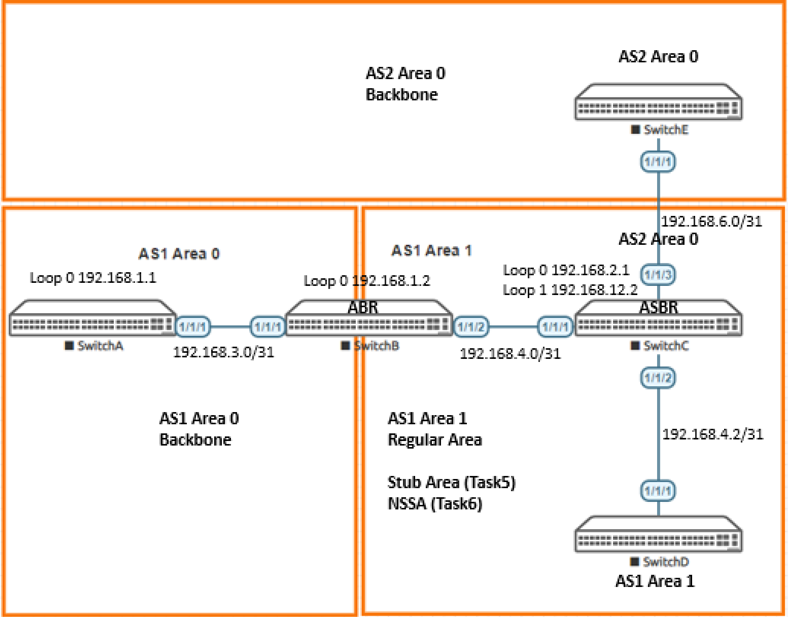

# Lab Guide: Deploying OSPFv2 Areas

> [!NOTE]
> This lab is based on the AOS-CX Switch Simulator Labs. A ```topology.clab.yaml``` file was added to use the lab with [containerlab](https://github.com/srl-labs/containerlab). 

> [!IMPORTANT]
> This guide assumes that the AOS-CX Switch Simulator is available as a docker container. You can use [vrnetlab](https://github.com/hellt/vrnetlab) to accomplish this.

>[!NOTE]
> This description is based on the AOS-CX Switch Simulator Lab Guide [OSPFv2 Areas Basics](https://community.arubanetworks.com/HigherLogic/System/DownloadDocumentFile.ashx?DocumentFileKey=b145c14d-8929-4695-912b-3d04be39eb3f) and includes all necessary changes to use the lab with [containerlab](https://github.com/srl-labs/containerlab).

## Lab Objective

The OSPF (Open Shortest Path Protocol) is one of the most popular routing protocols for IP Networks. It uses a link state
routing (LSR) algorithm which is performed by every switch router mode in the network. OSPF leverages areas and it is these
area concepts that form the basis of the LAB which introduces the ‘Backbone area’, ‘Regular Areas’ including Stub areas and
not so stubby areas.

This lab should be considered as a basic OSPFv2 lab as an introduction to the configuration and operation of OSPF on Aruba
CX switches.

At the end of this workshop you will be able to understand and configure ospf areas, understand basic ospf metric calculations of
routes, simple route redistributions and the use of stub areas and NSSAs (Not so stubby areas).

## Lab Overview
The lab comprises of two autonomous systems presented as AS1 and AS2. AS1 comprises of two areas , Area 0 & 1 with AS2
redistributing into AS1 and vice-versa.
### AS – Autonomous Systems
The two AS systems in this lab are discreet/separate routing systems each running its own LSR (Link State Routing) algorithm
for each router node to build a topology map of all available data paths in the network. The data is saved on each router in
database which is also referred to as a Link-State Database (LSDB).
Routing information Is not shared between OSPF Autonomous Systems unless explicitly configured with route redistribution for
each AS. This activity is covered in the lab between Switch C and Switch E where switch C is configured as an ASBR and
redistributes route between AS1 and AS2. .(An ASBR is an Autonomous System Boundary Router)
### Area 0 backbone
OSPF area 0 or backbone area is typically designed as a high-speed transit area for router traffic and is at the core of an OSPF
network. All other areas are connected to it and inter area traffic must traverse the backbone area. (If a single area only is
deployed there Is no requirement to have an area 0)
The lab has two Area backbones or Area 0 networks, One for AS1 & 1 for AS2
### OSPF areas (Not Area 0)
OSPF areas that are not the backbone are numbered other than 0 and are often referred to as _Regular Areas_ if they are not
configured as a _Stub Area_ or _Not So Stubby Area_ (NSSA)..
In this lab, AS1 has Area 0 and Area 1 connecting to it via Switch B which performs the function of an ABR (Area Border
Router).
The initial build of the lab for AS1 involves Area 0 and Area 1 as a regular area. Switch B and Switch C in Area 1 are re-
configured from a regular OSPF area to a ‘Stub’ area and then as a NSSA in subsequent lab tasks.
- A _Stub_ area is an area where there are no routers or areas beyond it and it does not advertise external routes (external link advertisements LSA Type 5).
- A _NSSA_ accepts external routes (in the form of external link advertisements LSA Type 7) and it is useful sometimes to
import external routes from one AS to another whilst still keeping some benefits of a stub area.

## Lab Network Layout
<a name="network-layout"></a>

_Figure 1: Lab Topology and Addresses_

## Lab Tasks

### Task 1: Lab Setup

For this lab refer to [Figure 1](#network-layout) for topology setup.
- Deploy the containerlab topology file: ```sudo containerlab deploy -t topology.clab.yaml``` (or use the [containerlab extension](https://containerlab.dev/manual/vsc-extension/) for Visual Studio Code)
  - All the connections between nodes are already set-up
  - Check that sufficient numbers of CPUs and RAM is available for three AOS-CX nodes (at least 1 vCPU and 2048 MB per node)
  - Ensure that the environment variable ```AOS_CX_VERSION``` is set to a value that matches the image version (default is ```latest```)
    - If ```AOS_CX_VERSION``` is not set, image ```vrnetlab/aruba_arubaos-cx:latest``` will be deployed
    - If ```AOS_CX_VERSION=20241115202521```, image ```vrnetlab/aruba_arubaos-cx:20241115202521``` will be deployed
- Open SSH session to each switch and log in with user 'admin' and password 'admin'.

On all devices, bring up required ports:
#### Switch A to Swutch E
```
Switch[A-E]# configure terminal
Switch[A-E](config)#
```
Copy/Paste the configuration to all devices:
```
interface 1/1/1-1/1/3
  no shutdown
```
Leave configuration mode by pressing ```Ctrl-z```.

Validate LLDP neighbors appear as expected on each device:

Issue command ```show lldp neighbor-info``` on all switches and compare results to connections in [Figure 1](#network-layout).

### Task 2: Configure Loopback 0 Interfaces on Switch A-E

Configure loopback addressing on loopback 0 on each switch:

#### Loopback0 ip addressing
- Switch A ip address 192.168.1.1
- Switch B ip address 192.168.1.2
- Switch C ip address 192.168.2.1
- Switch D ip address 192.168.2.2
- Switch E ip address 192.168.12.1

```
Switch[A-E]# configure terminal
Switch[A-E](config)#
```
Example for SwitchB:

```
SwitchB(config)# interface loopback 0
SwitchB(config-loopback-if)# ip address 192.168.1.2/32
```

### Task 3: Configure OSPF Area 0 and Area 1 for Switches A, B, C and D

The following tasks will be completed in task 3 to configure OSPF on switches A, B, C and D.

On each switch A, B, C, D:
- Configure a OSPF routing process with appropriate areas and assign a router-id which will be the IP address of interface loopback 0
- Configure appropriate switch interfaces with OSPF enabled and ensure connectivity is established
- Ensure neighbor adjacencies are formed between each device
- Review inter-area and intra-area routes in the ospf routing table
- Review the OSPF Cost of specific routes (switch A)

### Task 3.1: Configure OSPF Routing

- Configure OSPF routing on Switch A, B, C & D and assign a router-id with loopback 0 IP address
- Configure IP ospf interfaces

#### Switch A - Area 0
```
SwitchA# configure terminal
SwitchA(config)#
```
Copy/Paste the configuration to switch A:
```
router ospf 1
  router-id 192.168.1.1
  area 0.0.0.0
!
interface 1/1/1
  ip address 192.168.3.0/31
  ip ospf 1 area 0.0.0.0
  ip ospf network point-to-point
!
interface loopback 0
  ip ospf 1 area 0.0.0.0
```
Leave configuration mode by pressing ```Ctrl-z```.

#### Switch B - Area 0 / Area 1 - ABR Router
```
SwitchB# configure terminal
SwitchB(config)#
```
Copy/Paste the configuration to switch B:
```
router ospf 1
  router-id 192.168.1.2
  area 0.0.0.0
  area 0.0.0.1
!
interface 1/1/1
  ip address 192.168.3.1/31
  ip ospf 1 area 0.0.0.0
  ip ospf network point-to-point
!
interface 1/1/2
  ip address 192.168.4.0/31
  ip ospf 1 area 0.0.0.1
  ip ospf network point-to-point
!
interface loopback 0
  ip ospf 1 area 0.0.0.0
```
Leave configuration mode by pressing ```Ctrl-z```.

#### Switch C
```
SwitchC# configure terminal
SwitchC(config)#
```
Copy/Paste the configuration to switch C:
```
router ospf 1
  router-id 192.168.2.1
  area 0.0.0.1
!
interface 1/1/1
  ip address 192.168.4.1/31
  ip ospf 1 area 0.0.0.1
  ip ospf network point-to-point
!
interface 1/1/2
  ip address 192.168.4.2/31
  ip ospf 1 area 0.0.0.1
  ip ospf network point-to-point
!
interface loopback 0
  ip ospf 1 area 0.0.0.1
```
Leave configuration mode by pressing ```Ctrl-z```.

#### Switch D
```
SwitchD# configure terminal
SwitchD(config)#
```
Copy/Paste the configuration to switch D:
```
router ospf 1
  router-id 192.168.2.2
  area 0.0.0.1
!
interface 1/1/1
  ip address 192.168.4.3/31
  ip ospf 1 area 0.0.0.1
  ip ospf network point-to-point
!
interface loopback 0
  ip ospf 1 area 0.0.0.1
```
Leave configuration mode by pressing ```Ctrl-z```.

### Task 3.2: Validate Connectivity - Check OSPF Neighbor Adjacencies are Formed

#### Switch A OSPDF Neighbor(s)
```
SwitchA# show ip ospf neighbors 
VRF : default                          Process : 1
===================================================

Total Number of Neighbors : 1

Neighbor ID      Priority  State             Nbr Address       Interface
-------------------------------------------------------------------------
192.168.1.2      n/a       FULL              192.168.3.1        1/1/1  
```

#### Switch B OSPF Neighbor(s)
```
SwitchB# show ip ospf neighbors 
VRF : default                          Process : 1
===================================================

Total Number of Neighbors : 2

Neighbor ID      Priority  State             Nbr Address       Interface
-------------------------------------------------------------------------
192.168.1.1      n/a       FULL              192.168.3.0        1/1/1          

192.168.2.1      n/a       FULL              192.168.4.1        1/1/2 
```

Repeat for Switch C and D:
- Switch C will have neighbor adjacencies with switch B and D
- Switch E will be configured in subsequent tasks

### Task 3.3: Review Routing Tables on Switches
Review ospf routing table output on sample switches in area 0 and Area 1 and note the intra-area and inter area routes
presented.

#### Switch A
```
SwitchA# show ip ospf routes 
Codes: i - Intra-area route, I - Inter-area route
       E1 - External type-1, E2 - External type-2

OSPF Process ID 1 VRF default, Routing Table
---------------------------------------------

Total Number of Routes : 6

192.168.1.2/32     (i) area: 0.0.0.0
     via 192.168.3.1 interface 1/1/1, cost 100 distance 110
192.168.2.1/32     (I)
     via 192.168.3.1 interface 1/1/1, cost 200 distance 110
192.168.2.2/32     (I)
     via 192.168.3.1 interface 1/1/1, cost 300 distance 110
192.168.3.0/31     (i) area: 0.0.0.0
     directly attached to interface 1/1/1, cost 100 distance 110
192.168.4.0/31     (I)
     via 192.168.3.1 interface 1/1/1, cost 200 distance 110
192.168.4.2/31     (I)
     via 192.168.3.1 interface 1/1/1, cost 300 distance 110
```

Each switch has a loopback 0 ip address configured with an appropriate ospf area configuration. The loopback address are
injected into the ospf routing table, advertised and presented as a ‘reachable’ subnet on each switch receiving the ospf updates.

**Note the intra-area and inter area-routes from Switch A.**

_Intra-area routes_ refer to updates (routing) that are passed between ospf routers within the same area and do not need to
traverse the backbone (Area 0).

_Inter-area routes_ refer to updates that are passed between areas and required to traverse Area 0

External routes refer to updates passed from another routing protocol into the OSPF domain using an Autonomous System
Border Router. An example of external routes will be configured in subsequent steps.

#### Switch B
Switch B is an Area Border Router with area 0 and 1 configured.
```
SwitchB# show ip ospf routes 
Codes: i - Intra-area route, I - Inter-area route
       E1 - External type-1, E2 - External type-2

OSPF Process ID 1 VRF default, Routing Table
---------------------------------------------

Total Number of Routes : 6

192.168.1.1/32     (i) area: 0.0.0.0
     via 192.168.3.0 interface 1/1/1, cost 100 distance 110
192.168.2.1/32     (i) area: 0.0.0.1
     via 192.168.4.1 interface 1/1/2, cost 100 distance 110
192.168.2.2/32     (i) area: 0.0.0.1
     via 192.168.4.1 interface 1/1/2, cost 200 distance 110
192.168.3.0/31     (i) area: 0.0.0.0
     directly attached to interface 1/1/1, cost 100 distance 110
192.168.4.0/31     (i) area: 0.0.0.1
     directly attached to interface 1/1/2, cost 100 distance 110
192.168.4.2/31     (i) area: 0.0.0.1
     via 192.168.4.1 interface 1/1/2, cost 200 distance 110
```
As Switch B has interfaces in area 0 and area 1 configured, all routes are learnt as intra-area routes.

### Task 3.4: Review OSPF Path and link Costs

On Switch A routing output, note the OSPF costs between Switch A and Switch D. Use the loopback 0 address of 192.168.2.2
on switch D in the switch A routing table as a metric reference.

```
192.168.2.2/32     (I)
     via 192.168.3.1 interface 1/1/1, cost 300 distance 110
```
Route to 192.168.2.2/32 will be presented as a cost of _300_ from the output in Switch A’s route table (OSPF routing metric).
OSPF uses following formula to calculate the cost:

_Cost = Reference bandwidth / Interface bandwidth in bps_

Reference bandwidth was defined as arbitrary value in OSPF documentation (RFC 2338). Vendors need to use their own
reference bandwidth. Recent versions of the Aruba AOS-CX simulator use 100,000 Mbps as a reference bandwidth (100.000.000 bps).

Check SwitchA interface speed for interface 1/1/1:

Run ```show interface brief``` or ```show interface 1/1/1``` from the CLI to find the default interface speed.

Example shown with ```show interface brief``` command:
```
SwitchA# show interface brief 
--------------------------------------------------------------------------------------------------------
Port           Native  Mode   Type           Enabled Status  Reason                  Speed   Description
               VLAN                                                                  (Mb/s)             
--------------------------------------------------------------------------------------------------------
1/1/1          --      routed --             yes     up                              1000    --
...
```
Using the bandwidth formula we have ```100,000/1000 = 100``` (reference bandwidth in Mbps/interface bandwidth in Mbps = link cost of
100).

As we have standard default settings and common link costs across our lab network, we can ascertain that the route
192.168.2.2/32 has traversed x 3 links to reach Switch A from Switch D.

In a _live_ network, interface speeds will vary and may not be consistent which will impact the overall bandwidth cost of any given
route.

Confirm the ip ospf default link cost on switch A interface 1/1/1:
```
SwitchA# show ip ospf interface 1/1/1
Codes: DR - Designated router  BDR - Backup Designated router

Interface 1/1/1 is up, line protocol is up
-------------------------------------------

VRF                 : default                         Process             : 1
IP Address          : 192.168.3.0/31                  Area                : 0.0.0.0                         
Status              : Up                              Network Type        : Point-to-point                  
Hello Interval      : 10    sec                       Dead Interval       : 40    sec
Transit Delay       : 1     sec                       Retransmit Interval : 5     sec
BFD                 : Disabled                        Link Speed          : 1000 Mbps
Cost Configured     : NA                              Cost Calculated     : 100
State/Type          : Point-to-point                  Router Priority     : n/a
DR                  : No                              BDR                 : No
Link LSAs           : 0                               Checksum Sum        : 0    
Authentication      : No                              Passive             : No
```
Reference bandwidth ist 100,000 Mbps, link speed is 1000 Mbps, the calculated cost is 100 (100,000/1000 = 100).

The default reference speed can be changed in the respective ospf process configuration using the ```reference-bandwidth```
command.

```
SwitchA(config)# router ospf 1
SwitchA(config-ospf-1)# reference-bandwidth 
  <1-4000000>  Set reference bandwidth in Mbps. (Default: 100000Mbps) 
```
The ```no ip ospf cost``` command resets the cost value back to the default.

### Task 4: Create Different OSPF Autonomous Systems (AS) and Redistribute Routes

Importing routes and redistributing into OSPF is supported by creating an ASBR, an Autonomous System Boundary Router.

In this task you will create:
- A separate OSPF routing process on switch C in area 0 (process 2)
- A routing OSPF process in switch D in area 0
- Route redistribute OSPF routes (from OSPF process 2) into OSPF process 1 on switch C
- Route redistribute OSPF routes (from OSPF process 1) into OSPF process 2 on switch C
- Review ospf redistributed route metrics

### Task 4.1: Configure OSPF Routing Between Switch C and Switch D

#### Switch C

From the configuration context, create an additional loopback address for the router-id for ospf process 2:
```
SwitchC# configure terminal
SwitchC(config)#
```
Copy/Paste the configuration to switch C:
```
interface loopback 1
  ip address 192.168.12.2/32
```
Create an additional router OSPF process:
```
router ospf 2
  router-id 192.168.12.2
  area 0.0.0.0
```
Add Interface Loopback 1 to OSPF process 2:
```
interface loopback 1
  ip ospf 2 area 0.0.0.0
```
Configure OSPF on interface 1/1/3 to switch E:
```
interface 1/1/3
  ip address 192.168.6.0/31
  ip ospf 2 area 0.0.0.0
  ip ospf network point-to-point
```
Leave configuration mode by pressing ```Ctrl-z```.

#### Switch E

From the configuration context, create the OSPF routing process:
```
SwitchE# configure terminal
SwitchE(config)#
```
Copy/Paste the configuration to switch E:
```
router ospf 1
  router-id 192.168.12.1
  area 0.0.0.0
```
Add interface loopback 0 to OSPF process 1:
```
interface loopback 0
  ip ospf 1 area 0.0.0.0
```
Configure interface 1/1/1:
```
interface 1/1/1
  ip address 192.168.6.1/31
  ip ospf 1 area 0.0.0.0
  ip ospf network point-to-point
```
Leave configuration mode by pressing ```Ctrl-z```.

### Task 4.2: Validate OSPF Neighbors and Routes

#### Validate neighbor adjacency has been formed between Switch C and Switch D

Sample output switch E:
```
SwitchE# show ip ospf neighbors 
VRF : default                          Process : 1
===================================================

Total Number of Neighbors : 1

Neighbor ID      Priority  State             Nbr Address       Interface
-------------------------------------------------------------------------
192.168.12.2     n/a       FULL              192.168.6.0        1/1/1          
```

#### Review OSPF routing table
On switches B, C and D, use command ```show ip ospf routes```.

Sample output switch C:
```
SwitchC# show ip ospf routes 
Codes: i - Intra-area route, I - Inter-area route
       E1 - External type-1, E2 - External type-2

OSPF Process ID 1 VRF default, Routing Table
---------------------------------------------

Total Number of Routes : 6

192.168.1.1/32     (I)
     via 192.168.4.0 interface 1/1/1, cost 200 distance 110
192.168.1.2/32     (I)
     via 192.168.4.0 interface 1/1/1, cost 100 distance 110
192.168.2.2/32     (i) area: 0.0.0.1
     via 192.168.4.3 interface 1/1/2, cost 100 distance 110
192.168.3.0/31     (I)
     via 192.168.4.0 interface 1/1/1, cost 200 distance 110
192.168.4.0/31     (i) area: 0.0.0.1
     directly attached to interface 1/1/1, cost 100 distance 110
192.168.4.2/31     (i) area: 0.0.0.1
     directly attached to interface 1/1/2, cost 100 distance 110

OSPF Process ID 2 VRF default, Routing Table
---------------------------------------------

Total Number of Routes : 2

192.168.6.0/31     (i) area: 0.0.0.0
     directly attached to interface 1/1/3, cost 100 distance 110
192.168.12.1/32    (i) area: 0.0.0.0
     via 192.168.6.1 interface 1/1/3, cost 100 distance 110
```

- On switch B, the OSPF route table will not include routes learnt from switch C OSPF process ID 2 as these routes are
learnt within a different Autonomous System.
- On switch E, the OSPF route table will not include routes from OSPF process id 1 as they are again routes learnt within a
different Autonomous System.

### Task 4.3: Create an ASBR with Route Redistribute Commands

To include routes from different AS (Autonomous Systems) so they propagate within our routed lab network, we need to
redistribute routes on switch C and by doing so, we make switch C an ASBR (Autonomous System Boundary Router).

This is a 2-step process:
1. Redistribute routes from OSPF process 2 into OSPF process 1
2. Redistribute routes from OSPF process 1 into OSPF process 2

#### Switch C
First, we route redistribute OSPF routes (from OSPF process 2) into OSPF process 1 on switch C.
```
SwitchE# configure terminal
SwitchE(config)#
```
Within the ```router ospf 1``` context add the following commands:
Copy/Paste the configuration to switch E:
```
router ospf 1
  redistribute ospf 2
```
OSPF learnded routes from OSPF process 2 will be redistributed into OSPF process 1.

As second step, we repeat the process for ospf process 2, we route redistribute OSPF routes (from OSPF process 1) into OSPF
process 2 on switch C:

Within the ```router ospf 2``` context add the following commands#
Copy/Paste the configuration to switch E:
```
router ospf 2
  redistribute ospf 1 
```
Leave configuration mode by pressing ```Ctrl-z```.

### Task 4.4: Validate Neighbors and Route Redistribution on Switch B and Switch E
On switch C and E, run the ```show ip ospf neighbors``` command.

Sample output switch C – note the process id split on neighbors:

```
SwitchC# show ip ospf neighbors 
VRF : default                          Process : 1
===================================================

Total Number of Neighbors : 2

Neighbor ID      Priority  State             Nbr Address       Interface
-------------------------------------------------------------------------
192.168.1.2      n/a       FULL              192.168.4.0        1/1/1          

192.168.2.2      n/a       FULL              192.168.4.3        1/1/2          

VRF : default                          Process : 2
===================================================

Total Number of Neighbors : 1

Neighbor ID      Priority  State             Nbr Address       Interface
-------------------------------------------------------------------------
192.168.12.1     n/a       FULL              192.168.6.1        1/1/3          
```

On switch B and D run the ```sh ip ospf route``` command and note the output.

Switch B output:

```
SwitchB# show ip ospf routes 
Codes: i - Intra-area route, I - Inter-area route
       E1 - External type-1, E2 - External type-2

OSPF Process ID 1 VRF default, Routing Table
---------------------------------------------

Total Number of Routes : 8

192.168.1.1/32     (i) area: 0.0.0.0
     via 192.168.3.0 interface 1/1/1, cost 100 distance 110
192.168.2.1/32     (i) area: 0.0.0.1
     via 192.168.4.1 interface 1/1/2, cost 100 distance 110
192.168.2.2/32     (i) area: 0.0.0.1
     via 192.168.4.1 interface 1/1/2, cost 200 distance 110
192.168.3.0/31     (i) area: 0.0.0.0
     directly attached to interface 1/1/1, cost 100 distance 110
192.168.4.0/31     (i) area: 0.0.0.1
     directly attached to interface 1/1/2, cost 100 distance 110
192.168.4.2/31     (i) area: 0.0.0.1
     via 192.168.4.1 interface 1/1/2, cost 200 distance 110
192.168.6.0/31     (E2)
     via 192.168.4.1 interface 1/1/2, cost 100 distance 110
192.168.12.1/32    (E2)
     via 192.168.4.1 interface 1/1/2, cost 100 distance 110
```
Switch E output:
```
SwitchE# show ip ospf routes 
Codes: i - Intra-area route, I - Inter-area route
       E1 - External type-1, E2 - External type-2

OSPF Process ID 1 VRF default, Routing Table
---------------------------------------------

Total Number of Routes : 8

192.168.1.1/32     (E2)
     via 192.168.6.0 interface 1/1/1, cost 200 distance 110
192.168.1.2/32     (E2)
     via 192.168.6.0 interface 1/1/1, cost 100 distance 110
192.168.2.2/32     (E2)
     via 192.168.6.0 interface 1/1/1, cost 100 distance 110
192.168.3.0/31     (E2)
     via 192.168.6.0 interface 1/1/1, cost 200 distance 110
192.168.4.0/31     (E2)
     via 192.168.6.0 interface 1/1/1, cost 100 distance 110
192.168.4.2/31     (E2)
     via 192.168.6.0 interface 1/1/1, cost 100 distance 110
192.168.6.0/31     (i) area: 0.0.0.0
     directly attached to interface 1/1/1, cost 100 distance 110
192.168.12.2/32    (i) area: 0.0.0.0
     via 192.168.6.0 interface 1/1/1, cost 100 distance 110
```
The redistributed routes (from another AS ) are tagged as a type 5 LSA routes and are identified as an external router with the E
prefix.

E1 routes is the cost of the external metric and the additional internal cost within OSPF to reach that network.
- E1 route(s) include(s) the internal cost to the ASBR which is added to the external cost of the route

The cost of E2 routes is always the external metric value of the route and the internal cost to/from the ASBR is ignored.
- E2 route(s) do not include the internal cost of the ASBR. They will always have the same external cost.

Routes 192.168.1.1/32 & 192.168.3.0/31 via switch A have traversed 1x ABR (switch B) and 1 x ASBR (switch C) which collectively
provides the accumulated metric of _200_ on receipt at switch E.

### Task 5: Stub Area
This task will create a stub area between switch B and switch C for area 1. Switch B still operates as an ABR but the neighbor
relationship in area 1 is changed to _Stub_ for switch C.

Switch D and switch E are not required for this task: _shutdown_ interface 1/1/2 and 1/1/3 on switch C:

#### Switch B
On switch B, area 0.0.0.1 needs to be amended to include _stub_.
```
SwitchB# configure terminal
SwitchB(config)#
```
From within ```router ospf 1``` config context:
Copy/Paste the configuration to switch B:
```
router ospf 1
  area 0.0.0.1 stub
```
Leave configuration mode by pressing ```Ctrl-z```.

#### Switch C
On switch C, area 0.0.0.1 needs to be amended to include _stub_.
```
SwitchC# configure terminal
SwitchC(config)#
```
From within ```router ospf 1``` config context:
Copy/Paste the configuration to switch C:
```
router ospf 1
  area 0.0.0.1 stub
```
Leave configuration mode by pressing ```Ctrl-z```.

Check that neighbor adjacency has formed with switch B:
```
SwitchC# show ip ospf neighbors 
VRF : default                          Process : 1
===================================================

Total Number of Neighbors : 1

Neighbor ID      Priority  State             Nbr Address       Interface
-------------------------------------------------------------------------
192.168.1.2      n/a       FULL              192.168.4.0        1/1/1          

...       
```
Display switch C ospf routing table.

You should note a significant change in the ospf route table on switch C. Switch B, as the ABR, now injects a default route to
it’s neighbor switch B, as it is configured as a stub area .

Sample output:

```
SwitchC# show ip ospf routes 
Codes: i - Intra-area route, I - Inter-area route
       E1 - External type-1, E2 - External type-2

OSPF Process ID 1 VRF default, Routing Table
---------------------------------------------

Total Number of Routes : 6

0.0.0.0/0          (I)
     via 192.168.4.0 interface 1/1/1, cost 101 distance 110
192.168.1.1/32     (I)
     via 192.168.4.0 interface 1/1/1, cost 200 distance 110
192.168.1.2/32     (I)
     via 192.168.4.0 interface 1/1/1, cost 100 distance 110
192.168.3.0/31     (I)
     via 192.168.4.0 interface 1/1/1, cost 200 distance 110
192.168.4.0/31     (i) area: 0.0.0.1
     directly attached to interface 1/1/1, cost 100 distance 110
192.168.4.2/31     (i) area: 0.0.0.1
     directly attached to interface 1/1/2, cost 100 distance 110
...
```
As there is a default route advertised from Switch B as the ABR for area 1 _Stub_.
As Switch C has a single ingress and egress point, the route table can be reduced further by eliminating _Inter Area routes_.

On switch B, within ```router ospf 1``` config context, add:
```
SwitchB# configure terminal
SwitchB(config)#
```
Copy/Paste the configuration to switch B:
```
router ospf 1
  area 0.0.0.1 stub no-summary
```
Leave configuration mode by pressing ```Ctrl-z```.

Display switch C routing table:
```
SwitchC# show ip ospf routes 
Codes: i - Intra-area route, I - Inter-area route
       E1 - External type-1, E2 - External type-2

OSPF Process ID 1 VRF default, Routing Table
---------------------------------------------

Total Number of Routes : 3

0.0.0.0/0          (I)
     via 192.168.4.0 interface 1/1/1, cost 101 distance 110
192.168.4.0/31     (i) area: 0.0.0.1
     directly attached to interface 1/1/1, cost 100 distance 110
192.168.4.2/31     (i) area: 0.0.0.1
     directly attached to interface 1/1/2, cost 100 distance 110

...
```
Inter area routes are no longer present in the route table. The ```no-summary``` disables the summary of LSAs on each router that is
connected to the ABR in that area (in this case the summary routes are the host routes).

#### Stub Areas
- Stub areas typically have a single ingress egress point to connecting to the ABR
- External networks redistributed from other protocols into OSPF are not allowed to be advertised into a stub area. The
ABR, in this case switch B, stops LSA types 4 & 5
- Routing is based on the stub router receiving a default route from the ABR (0.0.0.0)
- All OSPF routers inside a stub area must be configured as a stub router
- Routers (stub areas) are required to connect to an ABR

For hub and spoke connectivity in large OSPF networks, the stub area is used extensively as they reduce the amount the of
LSAs advertised and processed and thereby reduce the overall size of the routing table and assist in keeping the overall routing
protocol convergence times down.

### Task 6: NSSA - Not So Stubby Area
A NSSA, _Not So Stubby Area_, is very similar to a standard stub area but has one major difference. It is less restrictive than a
stub area which cannot import external routes. NSSA can import external routes into OSPF from either another OSPF process or
another routing protocol.

In this task, area 1 between switch B and switch C is configured as a NSSA area and the routes learnt for OSPF process 2 (for
area 0 between switch C and switch E) are redistributed into NSSA area 1.

On Switch B remove the stub area configuration from ```router ospf 1```config context and add the NSSA configuration:

```
SwitchB# configure terminal
SwitchB(config)#
```
Copy/Paste the configuration to switch B:
```
router ospf 1
  no area 0.0.0.1 stub
  area 0.0.0.1 nssa no-summary
```
Leave configuration mode by pressing ```Ctrl-z```.

On switch C ```no shut``` interface 1/1/3:
```
SwitchC# configure terminal
SwitchC(config)#
```
Copy/Paste the configuration to switch B:
```
interface 1/1/3
  no shutdown
```
On switch C remove the stub area configuration from ```router ospf 1``` config context and add the NSSA configuration:
```
router ospf 1
  no area 0.0.0.1 stub
  area 0.0.0.1 nssa
```
Leave configuration mode by pressing ```Ctrl-z```.

Check that switch B & C have an ospf neighbor adjacency (```show ip ospf neighbors```).

On switch C, the redistribute commands into process ospf 1 and process opsf 2 should still be present:

```
SwitchC# show run 
...
!
router ospf 1
    router-id 192.168.2.1
    redistribute ospf 2
    area 0.0.0.1 nssa
router ospf 2
    router-id 192.168.12.2
    redistribute ospf 1
    area 0.0.0.0
...
```
On switch C, display the ip ospf route table:
```
SwitchC# show ip ospf routes 
Codes: i - Intra-area route, I - Inter-area route
       E1 - External type-1, E2 - External type-2

OSPF Process ID 1 VRF default, Routing Table
---------------------------------------------

Total Number of Routes : 3

0.0.0.0/0          (I)
     via 192.168.4.0 interface 1/1/1, cost 101 distance 110
192.168.4.0/31     (i) area: 0.0.0.1
     directly attached to interface 1/1/1, cost 100 distance 110
192.168.4.2/31     (i) area: 0.0.0.1
     directly attached to interface 1/1/2, cost 100 distance 110

OSPF Process ID 2 VRF default, Routing Table
---------------------------------------------

Total Number of Routes : 2

192.168.6.0/31     (i) area: 0.0.0.0
     directly attached to interface 1/1/3, cost 100 distance 110
192.168.12.1/32    (i) area: 0.0.0.0
     via 192.168.6.1 interface 1/1/3, cost 100 distance 110
```
The default advertised route from the switch B ABR is the same when the switches were configured for _Stub_. Switch C is re-
advertising routes between ospf processes 1 & 2.

On switch B, display the ip ospf route table:
```
SwitchB# show ip ospf routes 
Codes: i - Intra-area route, I - Inter-area route
       E1 - External type-1, E2 - External type-2

OSPF Process ID 1 VRF default, Routing Table
---------------------------------------------

Total Number of Routes : 7

192.168.1.1/32     (i) area: 0.0.0.0
     via 192.168.3.0 interface 1/1/1, cost 100 distance 110
192.168.2.1/32     (i) area: 0.0.0.1
     via 192.168.4.1 interface 1/1/2, cost 100 distance 110
192.168.3.0/31     (i) area: 0.0.0.0
     directly attached to interface 1/1/1, cost 100 distance 110
192.168.4.0/31     (i) area: 0.0.0.1
     directly attached to interface 1/1/2, cost 100 distance 110
192.168.4.2/31     (i) area: 0.0.0.1
     via 192.168.4.1 interface 1/1/2, cost 200 distance 110
192.168.6.0/31     (E2)
     via 192.168.4.1 interface 1/1/2, cost 100 distance 110
192.168.12.1/32    (E2)
     via 192.168.4.1 interface 1/1/2, cost 100 distance 110
```
External redistributed routes from switch C (OSPF process 2) are tagged as E2 routes and populated in the route table.

## Appendix - Complete Configurations

### Switch A
```
hostname SwitchA
user admin group administrators password ciphertext AQBapQWzSrWFo0TmmiO2gyzVqkQrUBVInHDwcykZuE3XGASEYgAAAOiM3DZ2g/Vk4BwKbelMISqULGak6ID4twFUc7TPt+HgSJBJD2f6eJJm7Mn5mMVrbU5FeDQjV3DfLwDvL4wPxvKmsSYtOVrSCU2IT9wQkMiAKHG1Kjv91gNM9LJLKe8Fe6TE
ntp server pool.ntp.org minpoll 4 maxpoll 4 iburst
ntp enable
ntp vrf mgmt
!
!
!
!
!
!
ssh server vrf mgmt
vlan 1
interface mgmt
    no shutdown
    ip static 10.0.0.15/24
    default-gateway 10.0.0.2
interface 1/1/1
    no shutdown
    ip address 192.168.3.0/31
    ip ospf 1 area 0.0.0.0
    ip ospf network point-to-point
interface 1/1/2
    no shutdown
interface 1/1/3
    no shutdown
interface loopback 0
    ip address 192.168.1.1/32
    ip ospf 1 area 0.0.0.0
!
!
!
!
!
router ospf 1
    router-id 192.168.1.1
    area 0.0.0.0
https-server vrf mgmt
```

### Switch B
```
hostname SwitchB
user admin group administrators password ciphertext AQBapVVvwr9VNDrwtZIvSDkzigK/Mz6mt4EWJK8zfE6T/lzmYgAAALAcebYeUalnTiab2VMA2mzeebzlwO2UxXaIJZwH6lLKlYNRBKdGoSG1bH1q+wTJClub+cy167VBG7JL5cSICF19ZhPsz9n220WsguPsNkkMdILTY65uzIH2y1a1lPwpMoJL
ntp server pool.ntp.org minpoll 4 maxpoll 4 iburst
ntp enable
ntp vrf mgmt
!
!
!
!
!
!
ssh server vrf mgmt
vlan 1
interface mgmt
    no shutdown
    ip static 10.0.0.15/24
    default-gateway 10.0.0.2
interface 1/1/1
    no shutdown
    ip address 192.168.3.1/31
    ip ospf 1 area 0.0.0.0
    ip ospf network point-to-point
interface 1/1/2
    no shutdown
    ip address 192.168.4.0/31
    ip ospf 1 area 0.0.0.1
    ip ospf network point-to-point
interface 1/1/3
    no shutdown
interface loopback 0
    ip address 192.168.1.2/32
    ip ospf 1 area 0.0.0.0
!
!
!
!
!
router ospf 1
    router-id 192.168.1.2
    area 0.0.0.0
    area 0.0.0.1 nssa no-summary
https-server vrf mgmt
```

### Switch C
```
hostname SwitchC
user admin group administrators password ciphertext AQBapX2Ep6BnzqP1g/ydASkPvy131ea/uZxGklLWedWx/qChYgAAAHBBJNPMDOlG1Od3laxujTAcHSazZDujJWng5pH62duk9xoHLE6EogsbJPn/BuInaQmAoCnSgnrj0CJeggt4Tv967qUxAw1ZktfpawjYNmyDq5LpW1o99FZeZVWPkYUCGCvy
ntp server pool.ntp.org minpoll 4 maxpoll 4 iburst
ntp enable
ntp vrf mgmt
!
!
!
!
!
!
ssh server vrf mgmt
vlan 1
interface mgmt
    no shutdown
    ip static 10.0.0.15/24
    default-gateway 10.0.0.2
interface 1/1/1
    no shutdown
    ip address 192.168.4.1/31
    ip ospf 1 area 0.0.0.1
    ip ospf network point-to-point
interface 1/1/2
    no shutdown
    ip address 192.168.4.2/31
    ip ospf 1 area 0.0.0.1
    ip ospf network point-to-point
interface 1/1/3
    no shutdown
    ip address 192.168.6.0/31
    ip ospf 2 area 0.0.0.0
    ip ospf network point-to-point
interface loopback 0
    ip address 192.168.2.1/32
    ip ospf 1 area 0.0.0.1
interface loopback 1
    ip address 192.168.12.2/32
    ip ospf 2 area 0.0.0.0
!
!
!
!
!
router ospf 1
    router-id 192.168.2.1
    redistribute ospf 2
    area 0.0.0.1 nssa
router ospf 2
    router-id 192.168.12.2
    redistribute ospf 1
    area 0.0.0.0
https-server vrf mgmt                                          
```

### Switch D
```
```hostname SwitchD
user admin group administrators password ciphertext AQBapXsDhPgpFIJKVC9ZCMSfftfmFf3vmYznqsyJplLwZJ+/YgAAAMapDWEaVuk4C6o89qMOfdOpKARSWSbDCro1rfVq0wdRg4h/Ojx7qWRf4YbkzS3egjAPhmLVSG6q2992FwDV9yBazPcHNLAeiBW4JTZFJjCfRDjb68HP+Tp5mp4yldLcIUiY
ntp server pool.ntp.org minpoll 4 maxpoll 4 iburst
ntp enable
ntp vrf mgmt
!
!
!
!
!
!
ssh server vrf mgmt
vlan 1
interface mgmt
    no shutdown
    ip static 10.0.0.15/24
    default-gateway 10.0.0.2
interface 1/1/1
    no shutdown
    ip address 192.168.4.3/31
    ip ospf 1 area 0.0.0.1
    ip ospf network point-to-point
interface 1/1/2
    no shutdown
interface 1/1/3
    no shutdown
interface loopback 0
    ip address 192.168.2.2/32
    ip ospf 1 area 0.0.0.1
!
!
!
!
!
router ospf 1
    router-id 192.168.2.2
    area 0.0.0.1
https-server vrf mgmt
```

### Switch E
```
hostname SwitchE
user admin group administrators password ciphertext AQBapbZksqQenod5TaLcpfpf5rG+vVwENk/oKGWQ5W3xbd9dYgAAAOLhdMpr7/hHl6tncETaP78bGNsRliaRVi1ekFeGLLlpYHdn1N+20g+4ROoLzqsq4bmU/OJdF7ep99hE4vWDThK5IMYbrFnINUDINPjOg0qyg207KIUcYZpt30nAOo8xDuwP
ntp server pool.ntp.org minpoll 4 maxpoll 4 iburst
ntp enable
ntp vrf mgmt
!
!
!
!
!
!
ssh server vrf mgmt
vlan 1
interface mgmt
    no shutdown
    ip static 10.0.0.15/24
    default-gateway 10.0.0.2
interface 1/1/1
    no shutdown
    ip address 192.168.6.1/31
    ip ospf 1 area 0.0.0.0
    ip ospf network point-to-point
interface 1/1/2
    no shutdown
interface 1/1/3
    no shutdown
interface loopback 0
    ip address 192.168.12.1/32
    ip ospf 1 area 0.0.0.0
!
!
!
!
!
router ospf 1
    router-id 192.168.12.1
    area 0.0.0.0
https-server vrf mgmt
```