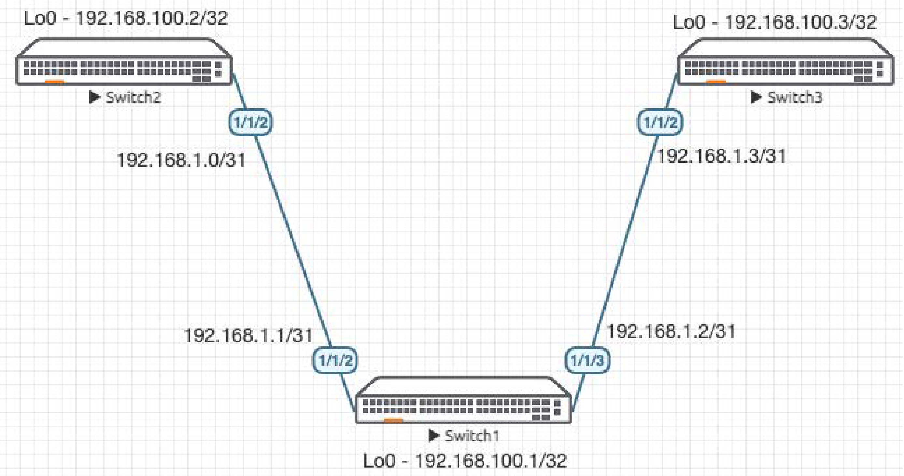
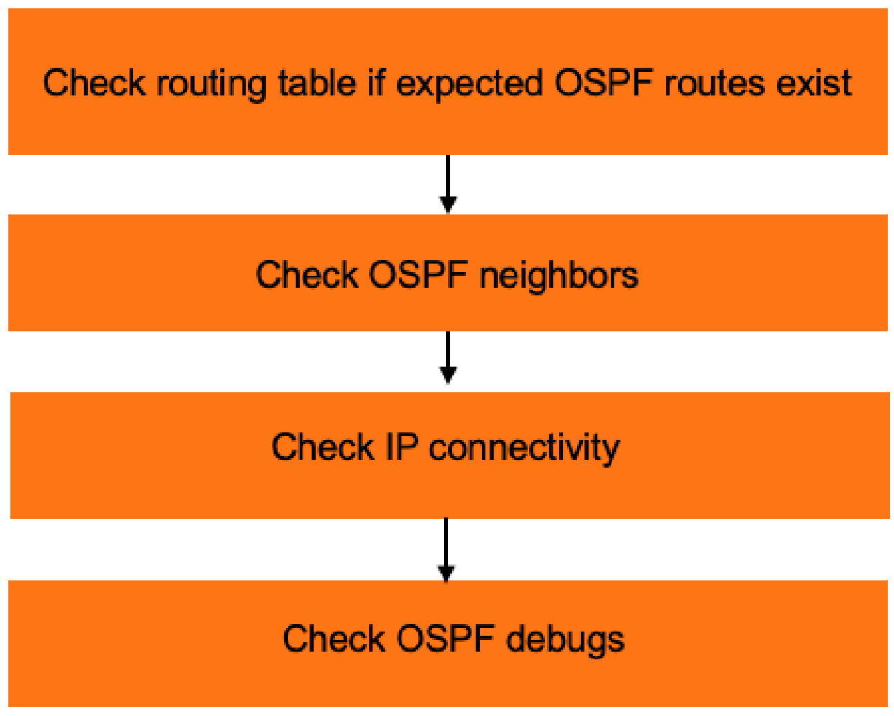

# Lab Guide: OSPF Troubleshooting

> [!NOTE]
> This lab is based on the AOS-CX Switch Simulator Labs. A ```topology.clab.yaml``` file was added to use the lab with [containerlab](https://github.com/srl-labs/containerlab). 

> [!IMPORTANT]
> This guide assumes that the AOS-CX Switch Simulator is available as a docker container. You can use [vrnetlab](https://github.com/hellt/vrnetlab) to accomplish this.

>[!NOTE]
> This description is based on the AOS-CX Switch Simulator Lab Guide [OSPF Troubleshooting](https://community.arubanetworks.com/HigherLogic/System/DownloadDocumentFile.ashx?DocumentFileKey=ec15f6b1-9578-49b7-acdf-f3205d192f42&forceDialog=0) and includes all necessary changes to use the lab with [containerlab](https://github.com/srl-labs/containerlab).

## Lab Objective
This lab will enable the reader to gain hands on experience with OSPF troubleshooting. This lab as shown in Figure 1 is
preconfigured with 2 problems, you will use the troubleshooting flowchart to perform verification steps to identify and fix the
problems.

## Lab Overview

This lab as shown in Figure 1 will allow you to route between Loopbacks on each switch via OSPF after the 2 problems are
identified and fixed.

/31 subnets are used between the switches.

>[!NOTE]
> The lab is preconfigured with the configurations shown in the appendix.

## Lab Network Layout
<a name="network-layout"></a>

_Figure 1: Lab Topology and Addresses_

## Lab Tasks

### Task 1: Lab Setup

For this lab refer to [Figure 1](#network-layout) for topology setup.
- Deploy the containerlab topology file: ```sudo containerlab deploy -t topology.clab.yaml``` (or use the [containerlab extension](https://containerlab.dev/manual/vsc-extension/) for Visual Studio Code)
  - All the connections between nodes are already set-up
  - Check that sufficient numbers of CPUs and RAM is available for three AOS-CX nodes (at least 1 vCPU and 2048 MB per node)
  - Ensure that the environment variable ```AOS_CX_VERSION``` is set to a value that matches the image version (default is ```latest```)
    - If ```AOS_CX_VERSION``` is not set, image ```vrnetlab/aruba_arubaos-cx:latest``` will be deployed
    - If ```AOS_CX_VERSION=20241115202521```, image ```vrnetlab/aruba_arubaos-cx:20241115202521``` will be deployed
- Open SSH session to each switch and log in with user 'admin' and password 'admin'.

<a name="ospf-troubleshooting-steps"></a>

_Figure 2: OSPF Troubleshooting Steps_

### Task 2: Check Routing Table if Expected OSPF Routes Exist

Start with Switch1 (in the middle). This way, you can check if routes exist from both neighbors at the same time:
```
Switch1# show ip route 

Displaying ipv4 routes selected for forwarding

Origin Codes: C - connected, S - static, L - local
              R - RIP, B - BGP, O - OSPF, D - DHCP
              U - Unnumbered
Type Codes:   E - External BGP, I - Internal BGP, V - VPN, EV - EVPN
              IA - OSPF internal area, E1 - OSPF external type 1
              E2 - OSPF external type 2

VRF: default

Prefix              Nexthop                                  Interface     VRF(egress)       Origin/   Distance/    Age
                                                                                             Type      Metric
--------------------------------------------------------------------------------------------------------
192.168.1.0/31      -                                        1/1/2         -                 C         [0/0]        -            
192.168.1.1/32      -                                        1/1/2         -                 L         [0/0]        -            
192.168.1.2/31      -                                        1/1/3         -                 C         [0/0]        -            
192.168.1.2/32      -                                        1/1/3         -                 L         [0/0]        -            
192.168.100.1/32    -                                        loopback0     -                 L         [0/0]        -            

Total Route Count : 5
```
Since only connected (C) and local (L) routes are seen, this means none of the expected OSPF routes exist.

### Task 3: Check OSPF Neighbors

Check if OSPF neighbors are up:
```
Switch1# show ip ospf neighbors 
No OSPF neighbor found on VRF default.
```
Since both neighbors are down, move onto next step.

### Task 4: Check IP Connectivity

Check that IP connectivity to both neighbors work as expected:

```
Switch1# ping 192.168.1.0
PING 192.168.1.0 (192.168.1.0) 100(128) bytes of data.
From 192.168.1.1 icmp_seq=1 Destination Host Unreachable
From 192.168.1.1 icmp_seq=2 Destination Host Unreachable
From 192.168.1.1 icmp_seq=3 Destination Host Unreachable
^C

Switch1# ping 192.168.1.3
PING 192.168.1.3 (192.168.1.3) 100(128) bytes of data.
108 bytes from 192.168.1.3: icmp_seq=1 ttl=64 time=25.5 ms
108 bytes from 192.168.1.3: icmp_seq=2 ttl=64 time=7.95 ms
108 bytes from 192.168.1.3: icmp_seq=3 ttl=64 time=6.41 ms
108 bytes from 192.168.1.3: icmp_seq=4 ttl=64 time=5.09 ms
108 bytes from 192.168.1.3: icmp_seq=5 ttl=64 time=4.29 ms

--- 192.168.1.3 ping statistics ---
5 packets transmitted, 5 received, 0% packet loss, time 4005ms
rtt min/avg/max/mdev = 4.294/9.842/25.467/7.910 ms
```

Since only 1 neighbor responded, next step would be to check debugs and fix issues on neighbors.

### Task 5: Check OSPF Debugs

Check that no debugs are currently enabled:

```
Switch1# show debug
Not configured
```
If debugs are configured, user ```no debug all``` to disable them.

Enable desired OSPF debugs:
```
debug ospfv2 all
```
Take note that debug destination uses buffer by default, check debug buffer:
```
show debug buffer
!snip
```
The first error you should see is regarding received source IP – the 192.168.10.0 IP configured on the neighbor is wrong:
```
2025-04-11:15:49:42.509269|hpe-routing|LOG_ERR|AMM|-|OSPFV2|OSPFv2_PACKET|OSPF 268698624 Received packet's source IP address was incorrect.
2025-04-11:15:49:42.509346|hpe-routing|LOG_ERR|AMM|-|OSPFV2|OSPFv2_PACKET|Source IP address = 192.168.10.0
2025-04-11:15:49:42.509401|hpe-routing|LOG_ERR|AMM|-|OSPFV2|OSPFv2_PACKET|Receiving interface's address = 192.168.1.1
2025-04-11:15:49:42.509442|hpe-routing|LOG_ERR|AMM|-|OSPFV2|OSPFv2_PACKET|Diagnostic information for support:
2025-04-11:15:49:42.509490|hpe-routing|LOG_ERR|AMM|-|OSPFV2|OSPFv2_PACKET|Packet data =
2025-04-11:15:49:42.509552|hpe-routing|LOG_ERR|AMM|-|OSPFV2|OSPFv2_PACKET|   45C00040 64D70000 0159A920 C0A80A00 E0000005 0201002C C0A86402 00000000
2025-04-11:15:49:42.509600|hpe-routing|LOG_ERR|AMM|-|OSPFV2|OSPFv2_PACKET|   0C4D0000 00000000 00000000 FFFFFFFE 000A0201 00000028 C0A80A00 00000000
2025-04-11:15:49:42.509635|hpe-routing|LOG_ERR|AMM|-|OSPFV2|OSPFv2_PACKET|
2025-04-11:15:49:42.509689|hpe-routing|LOG_ERR|AMM|-|OSPFV2|OSPFv2_PACKET|(End of Packet, OSPFv2 process Id = 1, VRF Name = default)
```
The second error you should see is regarding authentication type, this means both sides don’t have a matching authentication
type set:
```
2025-04-11:16:06:41.286099|hpe-routing|LOG_WARN|AMM|-|OSPFV2|OSPFv2_PACKET|OSPF 268698624 Packet received with unexpected authentication type 2.
2025-04-11:16:06:41.286162|hpe-routing|LOG_WARN|AMM|-|OSPFV2|OSPFv2_PACKET|Expected authentication type = 0.
2025-04-11:16:06:41.286183|hpe-routing|LOG_WARN|AMM|-|OSPFV2|OSPFv2_PACKET|Packet data =
2025-04-11:16:06:41.286195|hpe-routing|LOG_WARN|AMM|-|OSPFV2|OSPFv2_PACKET|   45C00050 64F70000 0159B1ED C0A80103 E0000005 0201002C C0A86403 00000000
2025-04-11:16:06:41.286204|hpe-routing|LOG_WARN|AMM|-|OSPFV2|OSPFv2_PACKET|   00000002 00000010 0000081E FFFFFFFE 000A0201 00000028 C0A80103 00000000
2025-04-11:16:06:41.286214|hpe-routing|LOG_WARN|AMM|-|OSPFV2|OSPFv2_PACKET|   214DD09E 628F01B9 4C6892AE D90EC76F
2025-04-11:16:06:41.286224|hpe-routing|LOG_WARN|AMM|-|OSPFV2|OSPFv2_PACKET|(End of Packet, OSPFv2 process Id = 1, VRF Name = default)
```
After getting the required info, disable all debugs:
```
Switch1# no debug all
```

### Task 6: Fix Issues

With the debug info found, you should be able to modify Switch2 (change 1/1/2 IP) and Switch3 (disable OSPF
authentication) configs so that Switch1 neighbors come up as expected:
```
Switch1# sh ip ospf neighbors 
VRF : default                          Process : 1
===================================================

Total Number of Neighbors : 2

Neighbor ID      Priority  State             Nbr Address       Interface
-------------------------------------------------------------------------
192.168.100.2    1         FULL/BDR          192.168.1.0        1/1/2          

192.168.100.3    1         FULL/DR           192.168.1.3        1/1/3   
```
Routes to remote loopbacks should now appear in Switch1:
```
Switch1# show ip route 

Displaying ipv4 routes selected for forwarding

Origin Codes: C - connected, S - static, L - local
              R - RIP, B - BGP, O - OSPF, D - DHCP
              U - Unnumbered
Type Codes:   E - External BGP, I - Internal BGP, V - VPN, EV - EVPN
              IA - OSPF internal area, E1 - OSPF external type 1
              E2 - OSPF external type 2

VRF: default

Prefix              Nexthop                                  Interface     VRF(egress)       Origin/   Distance/    Age
                                                                                             Type      Metric
--------------------------------------------------------------------------------------------------------
192.168.1.0/31      -                                        1/1/2         -                 C         [0/0]        -            
192.168.1.1/32      -                                        1/1/2         -                 L         [0/0]        -            
192.168.1.2/31      -                                        1/1/3         -                 C         [0/0]        -            
192.168.1.2/32      -                                        1/1/3         -                 L         [0/0]        -            
192.168.100.1/32    -                                        loopback0     -                 L         [0/0]        -            
192.168.100.2/32    192.168.1.0                              1/1/2         -                 O/E2      [110/25]     00h:01m:54s  
192.168.100.3/32    192.168.1.3                              1/1/3         -                 O/E2      [110/25]     00h:00m:47s  

Total Route Count : 7
```

## Appendix - Complete Configurations

Configs with problems are provided below.

### Switch1
```
hostname Switch1
user admin group administrators password ciphertext AQBapcjEwv3b0rmftYNoTbPn65a2+UdU2HMmeh6xVoWyBBFKYgAAAOBIPplFx2OxsSf17Tbxo+co/tdCW0vujStsxGd1Yo//nR8k00u+sCe5aUUUzwc7WxgHOGY6zbxbOOXfXka2HuXCYEEpHR1oE3Ar8vo81EF1zGt8XgFtKJyiEEys1W1mhmxI
ntp server pool.ntp.org minpoll 4 maxpoll 4 iburst
ntp enable
ntp vrf mgmt
!
!
!
!
!
!
ssh server vrf mgmt
vlan 1
interface mgmt
    no shutdown
    ip static 10.0.0.15/24
    default-gateway 10.0.0.2
interface 1/1/1
    no shutdown
interface 1/1/2
    no shutdown
    ip address 192.168.1.1/31
    ip ospf 1 area 0.0.0.0
interface 1/1/3
    no shutdown
    ip address 192.168.1.2/31
    ip ospf 1 area 0.0.0.0
interface 1/1/4
    no shutdown
interface 1/1/5
    no shutdown
interface 1/1/6
    no shutdown
interface loopback 0
    ip address 192.168.100.1/32
!
!
!
!
!
router ospf 1
    router-id 192.168.100.1
    redistribute local loopback
    area 0.0.0.0
https-server vrf mgmt
```

### Switch2
```
hostname Switch2
user admin group administrators password ciphertext AQBapVMpDw6uPw3R1T0FSRTY2SVN7ju5JbVU7n6EF4Iqh+unYgAAAHfTc3QaDbFqbS4wsbfzp3V8+zgKUcH+SBtmBaeNoJRamnQHX4jycE20T5Ni3tXrljpFkR1OMSEs4lvjgDt3GJ65GM/G9FQq30/BZGzQGmpFb7h0+IpEi0jM57+gEbF6ACNz
ntp server pool.ntp.org minpoll 4 maxpoll 4 iburst
ntp enable
ntp vrf mgmt
!
!
!
!
!
!
ssh server vrf mgmt
vlan 1
interface mgmt
    no shutdown
    ip static 10.0.0.15/24
    default-gateway 10.0.0.2
interface 1/1/1
    no shutdown
interface 1/1/2
    no shutdown
    ip address 192.168.10.0/31
    ip ospf 1 area 0.0.0.0
interface 1/1/3
    no shutdown
interface 1/1/4
    no shutdown
interface 1/1/5
    no shutdown
interface 1/1/6
    no shutdown
interface loopback 0
    ip address 192.168.100.2/32
!
!
!
!
!
router ospf 1
    router-id 192.168.100.2
    redistribute local loopback
    area 0.0.0.0
https-server vrf mgmt
```

### Switch3
```
hostname Switch3
user admin group administrators password ciphertext AQBapQgk5VHSEHqvKlg2uhKK/OfUX4Fa8dhnh/q67qdqAyDHYgAAAEKU6YWI2Aj1wVNYdiDdH06eLvAIqXr8zZ6qQKyHcw8zlM+G5YGPfHg6ac84yUXPQ39mzJA+S7Jq2IepeCk3H1yIpxty5XuWn4cWpVkdPAG+cacmdmUJ2/EUe+ZR3xOD36Q/
ntp server pool.ntp.org minpoll 4 maxpoll 4 iburst
ntp enable
ntp vrf mgmt
!
!
!
!
!
!
ssh server vrf mgmt
vlan 1
interface mgmt
    no shutdown
    ip static 10.0.0.15/24
    default-gateway 10.0.0.2
interface 1/1/1
    no shutdown
interface 1/1/2
    no shutdown
    ip address 192.168.1.3/31
    ip ospf 1 area 0.0.0.0
    ip ospf authentication message-digest
    ip ospf message-digest-key 1 md5 ciphertext AQBapVuqYeTJuT8/BoIlC2z4MxuT3VVmiduKtDwIP1jbCCxZCAAAAEe+Xod/lZX8
interface 1/1/3
    no shutdown
interface 1/1/4
    no shutdown
interface 1/1/5
    no shutdown
interface 1/1/6
    no shutdown
interface loopback 0
    ip address 192.168.100.3/32
!
!
!
!
!
router ospf 1
    router-id 192.168.100.3
    redistribute local loopback
    area 0.0.0.0
https-server vrf mgmt
```
