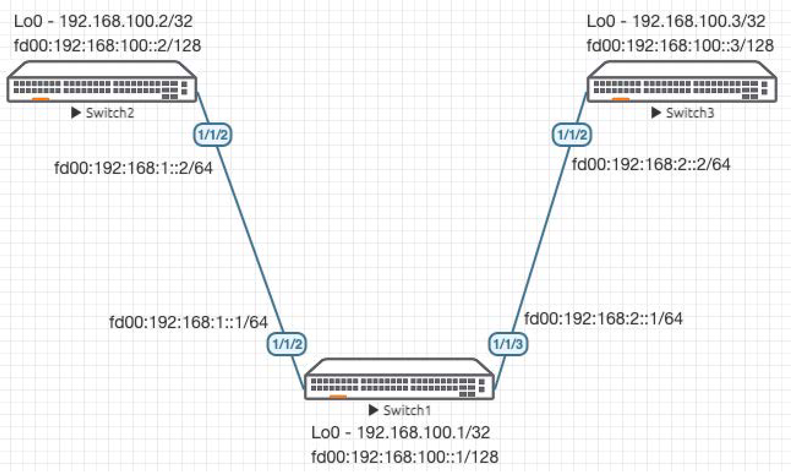
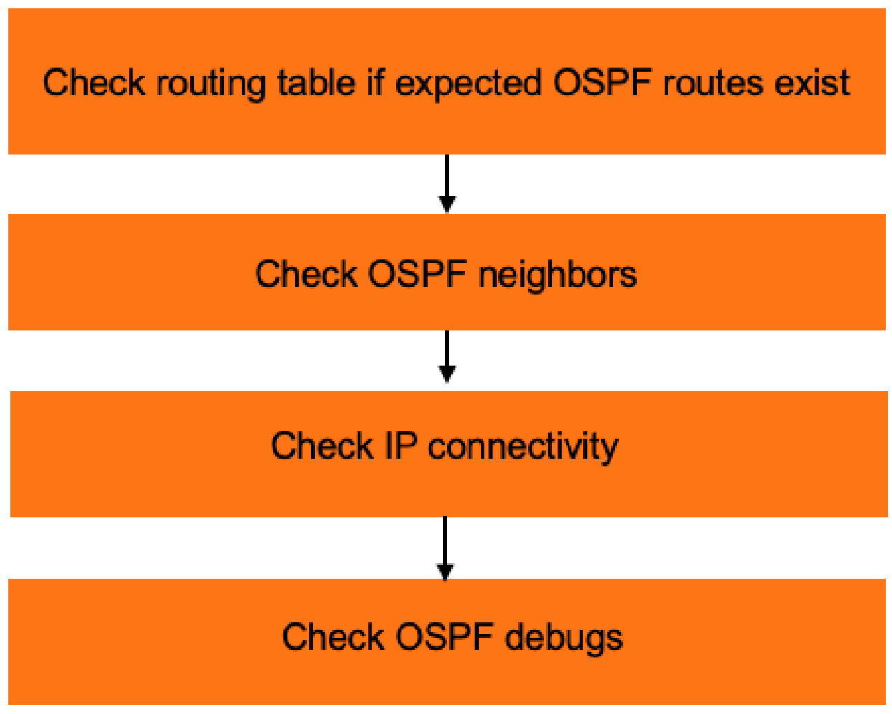

# Lab Guide: OSPFv3 Troubleshooting

> [!NOTE]
> This lab is based on the AOS-CX Switch Simulator Labs. A ```topology.clab.yaml``` file was added to use the lab with [containerlab](https://github.com/srl-labs/containerlab). 

> [!IMPORTANT]
> This guide assumes that the AOS-CX Switch Simulator is available as a docker container. You can use [vrnetlab](https://github.com/hellt/vrnetlab) to accomplish this.

>[!NOTE]
> This description is based on the AOS-CX Switch Simulator Lab Guide [OSPFv3 Troubleshooting](https://community.arubanetworks.com/HigherLogic/System/DownloadDocumentFile.ashx?DocumentFileKey=350a607a-2be0-45f9-97ac-003656521066) and includes all necessary changes to use the lab with [containerlab](https://github.com/srl-labs/containerlab).

## Lab Objective
This lab will enable the reader to gain hands on experience with OSPFv3 troubleshooting. This lab as shown in Figure 1 is
preconfigured with 2 problems, you will use the troubleshooting flowchart to perform verification steps to identify and fix the
problems.

## Lab Overview

This lab as shown in Figure 1 will allow you to route between /128 Loopbacks on each switch via OSPFv3 after the 2 problems are
identified and fixed.

/64 subnets are used between the switches.

>[!NOTE]
> The lab is preconfigured with the configurations shown in the appendix.

## Lab Network Layout
<a name="network-layout"></a>

_Figure 1: Lab Topology and Addresses_

## Lab Tasks

### Task 1: Lab Setup

For this lab refer to [Figure 1](#network-layout) for topology setup.
- Deploy the containerlab topology file: ```sudo containerlab deploy -t topology.clab.yaml``` (or use the [containerlab extension](https://containerlab.dev/manual/vsc-extension/) for Visual Studio Code)
  - All the connections between nodes are already set-up
  - Check that sufficient numbers of CPUs and RAM is available for three AOS-CX nodes (at least 1 vCPU and 2048 MB per node)
  - Ensure that the environment variable ```AOS_CX_VERSION``` is set to a value that matches the image version (default is ```latest```)
    - If ```AOS_CX_VERSION``` is not set, image ```vrnetlab/aruba_arubaos-cx:latest``` will be deployed
    - If ```AOS_CX_VERSION=20241115202521```, image ```vrnetlab/aruba_arubaos-cx:20241115202521``` will be deployed
- Open SSH session to each switch and log in with user 'admin' and password 'admin'.

<a name="ospf-troubleshooting-steps"></a>

_Figure 2: OSPF Troubleshooting Steps_

### Task 2: Check Routing Table if Expected OSPFv3 Routes Exist

Start with Switch1 (in the middle). This way, you can check if routes exist from both neighbors at the same time:
```
Switch1# show ipv6 route

Displaying ipv6 routes selected for forwarding

Origin Codes: C - connected, S - static, L - local
              R - RIP, B - BGP, O - OSPF, D - DHCP
              U - Unnumbered
Type Codes:   E - External BGP, I - Internal BGP, V - VPN, EV - EVPN
              IA - OSPF internal area, E1 - OSPF external type 1
              E2 - OSPF external type 2

VRF: default

Prefix                                       Nexthop                                  Interface     VRF(egress)       Origin/   Distance/    Age
                                                                                                                      Type      Metric
---------------------------------------------------------------------------------------------------------------------------------------------------------
fd00:192:168:1::/64                          -                                        1/1/2         -                 C         [0/0]        -            
fd00:192:168:1::1/128                        -                                        1/1/2         -                 L         [0/0]        -            
fd00:192:168:2::/64                          -                                        1/1/3         -                 C         [0/0]        -            
fd00:192:168:2::1/128                        -                                        1/1/3         -                 L         [0/0]        -            
fd00:192:168:100::1/128                      -                                        loopback0     -                 L         [0/0]        -            

Total Route Count : 5
```
Since only connected (C) and local (L) routes are seen, this means none of the expected OSPFv3 routes exist.

### Task 3: Check OSPFv3 Neighbors

Check if OSPF neighbors are up:
```
Switch1# show ipv6 ospfv3 neighbors 
VRF : default                          Process : 1
===================================================

Total Number of Neighbors: 1

Neighbor ID      Priority  State             Interface
-------------------------------------------------------
192.168.100.3    1         FULL/DR           1/1/3             
  Neighbor address fe80::800:901:840:a895
```
You will see only 1 neighbor is up (Switch3 neighbor ID is shown but no routes are learnt, will revisit this issue later).

Move onto next step to try to figure out why Switch2 neighbor is down.

### Task 4: Check IPv6 Connectivity with Directly Connected Neighbor

Check that Iv6 connectivity to Switch2 works as expected:

```
Switch1# ping6 fd00:192:168:1::2
PING fd00:192:168:1::2(fd00:192:168:1::2) 100 data bytes
108 bytes from fd00:192:168:1::2: icmp_seq=1 ttl=64 time=4.94 ms
108 bytes from fd00:192:168:1::2: icmp_seq=2 ttl=64 time=3.88 ms
108 bytes from fd00:192:168:1::2: icmp_seq=3 ttl=64 time=2.53 ms
108 bytes from fd00:192:168:1::2: icmp_seq=4 ttl=64 time=4.06 ms
108 bytes from fd00:192:168:1::2: icmp_seq=5 ttl=64 time=5.12 ms

--- fd00:192:168:1::2 ping statistics ---
5 packets transmitted, 5 received, 0% packet loss, time 4004ms
rtt min/avg/max/mdev = 2.531/4.106/5.123/0.922 ms
```

Neighbor Switch2 responded as expected.

### Task 5: Check OSPFV3 Is Enabled and Status Shows Up

Check Switch1 first, everything looks good here:

```
Switch1# show ipv6 ospfv3 
VRF : default                         Process : 1
--------------------------------------------------

RouterID               : 192.168.100.1    OSPFv3                 : Enabled
BFD                    : Disabled         SPF Start Interval     : 200   ms
SPF Hold Interval      : 1000  ms         SPF Max Wait Interval  : 5000  ms
LSA Start Time         : 5000  ms         LSA Hold Time          : 0     ms
LSA Max Wait Time      : 0     ms         LSA Arrival            : 1000  ms
External LSAs          : 2                Checksum Sum           : 117110
ECMP                   : 4                Reference Bandwidth    : 100000 Mbps
Area Border            : false            AS Border              : true
GR Status              : Enabled          GR Interval            : 120 sec
GR State               : inactive         GR Exit Status         : none
GR Helper              : Enabled          GR Strict LSA Check    : Enabled
GR Ignore Lost I/F     : Disabled         Internal Process ID    : 1 
Summary address:

Area      Total     Active    
------------------------------
Normal     1         1
Stub       0         0
NSSA       0         0

Area  : 0.0.0.0
----------------
Area Type              : Normal         Status               : Active         
Total Interfaces       : 3              Active Interfaces    : 3              
Passive Interfaces     : 0              Loopback Interfaces  : 1              
SPF Calculation Count  : 5              
Number of LSAs         : 5              Checksum Sum         : 220855
```
Check Switch2 next:
```
Switch2# show ipv6 ospfv3 
VRF : default                         Process : 1
--------------------------------------------------

RouterID               : 0.0.0.0          OSPFv3                 : Enabled
BFD                    : Disabled         SPF Start Interval     : 200   ms
SPF Hold Interval      : 1000  ms         SPF Max Wait Interval  : 5000  ms
LSA Start Time         : 5000  ms         LSA Hold Time          : 0     ms
LSA Max Wait Time      : 0     ms         LSA Arrival            : 1000  ms
External LSAs          : 0                Checksum Sum           : 0
ECMP                   : 4                Reference Bandwidth    : 100000 Mbps
Area Border            : false            AS Border              : true
GR Status              : Enabled          GR Interval            : 120 sec
GR State               : inactive         GR Exit Status         : none
GR Helper              : Enabled          GR Strict LSA Check    : Enabled
GR Ignore Lost I/F     : Disabled         Internal Process ID    : 1 
Summary address:

Area      Total     Active    
------------------------------
Normal     1         1
Stub       0         0
NSSA       0         0

Area  : 0.0.0.0
----------------
Area Type              : Normal         Status               : Active         
Total Interfaces       : 2              Active Interfaces    : 2              
Passive Interfaces     : 0              Loopback Interfaces  : 1              
SPF Calculation Count  : 0              
Number of LSAs         : 0              Checksum Sum         : 0


Switch2# show ipv6 ospfv3 int 1/1/2
Codes: DR - Designated router  BDR - Backup Designated router

Interface 1/1/2 is Up, Line Protocol is Up
-------------------------------------------
VRF                  : default                         Process              : 1
IPv6 address         : fe80::800:901:8d5:43e6          Area                 : 0.0.0.0
Status               : Down                            Network Type         : Broadcast
Hello Interval       : 10    sec                       Dead Interval        : 40    sec
Transit Delay        : 1     sec                       Retransmit Interval  : 5     sec
BFD                  : Disabled                        Link Speed           : 1000 Mbps
Cost Configured      : NA                              Cost Calculated      : 100
State/Type           : Down                            Router Priority      : 1
DR                   : No                              BDR                  : No
Link LSAs            : 0                               Checksum Sum         : 0
Authentication       : No                              Passive              : No
```
You will notice that status is down and routerID is 0.0.0.0 (that is the problem).

OSPFv3 requires a valid IPv4 routerID to function.

Add the required IPv4 address into Lo0 as shown in the diagram:
```
Switch2# configure terminal 
Switch2(config)# int loopback 0
Switch2(config-loopback-if)# ip add 192.168.100.2/32
Switch2(config-loopback-if)# ^Z

Switch2#
```
Check again:
```
Switch2# show ipv6 ospfv3 int 1/1/2
Codes: DR - Designated router  BDR - Backup Designated router

Interface 1/1/2 is Up, Line Protocol is Up
-------------------------------------------
VRF                  : default                         Process              : 1
IPv6 address         : fe80::800:901:8d5:43e6          Area                 : 0.0.0.0
Status               : Up                              Network Type         : Broadcast
Hello Interval       : 10    sec                       Dead Interval        : 40    sec
Transit Delay        : 1     sec                       Retransmit Interval  : 5     sec
BFD                  : Disabled                        Link Speed           : 1000 Mbps
Cost Configured      : NA                              Cost Calculated      : 100
State/Type           : BDR                             Router Priority      : 1
DR                   : 192.168.100.1                   BDR                  : 192.168.100.2
Link LSAs            : 2                               Checksum Sum         : 87193
Authentication       : No                              Passive              : No

Switch2# show ipv6 ospfv3 
VRF : default                         Process : 1
--------------------------------------------------

RouterID               : 192.168.100.2    OSPFv3                 : Enabled
BFD                    : Disabled         SPF Start Interval     : 200   ms
SPF Hold Interval      : 1000  ms         SPF Max Wait Interval  : 5000  ms
LSA Start Time         : 5000  ms         LSA Hold Time          : 0     ms
LSA Max Wait Time      : 0     ms         LSA Arrival            : 1000  ms
External LSAs          : 3                Checksum Sum           : 175665
ECMP                   : 4                Reference Bandwidth    : 100000 Mbps
Area Border            : false            AS Border              : true
GR Status              : Enabled          GR Interval            : 120 sec
GR State               : inactive         GR Exit Status         : none
GR Helper              : Enabled          GR Strict LSA Check    : Enabled
GR Ignore Lost I/F     : Disabled         Internal Process ID    : 1 
Summary address:

Area      Total     Active    
------------------------------
Normal     1         1
Stub       0         0
NSSA       0         0

Area  : 0.0.0.0
----------------
Area Type              : Normal         Status               : Active         
Total Interfaces       : 2              Active Interfaces    : 2              
Passive Interfaces     : 0              Loopback Interfaces  : 1              
SPF Calculation Count  : 3              
Number of LSAs         : 8              Checksum Sum         : 238059

Switch2# show ipv6 ospfv3 neighbors 
VRF : default                          Process : 1
===================================================

Total Number of Neighbors: 1

Neighbor ID      Priority  State             Interface
-------------------------------------------------------
192.168.100.1    1         FULL/DR           1/1/2             
  Neighbor address fe80::800:901:87f:b4d7
```
You should now see Switch1 /128 loopback learnt via OSPFv3:
```
Switch2# show ipv6 route 

Displaying ipv6 routes selected for forwarding

Origin Codes: C - connected, S - static, L - local
              R - RIP, B - BGP, O - OSPF, D - DHCP
              U - Unnumbered
Type Codes:   E - External BGP, I - Internal BGP, V - VPN, EV - EVPN
              IA - OSPF internal area, E1 - OSPF external type 1
              E2 - OSPF external type 2

VRF: default

Prefix                                       Nexthop                                  Interface     VRF(egress)       Origin/   Distance/    Age
                                                                                                                      Type      Metric
---------------------------------------------------------------------------------------------------------------------------------------------------------
fd00:192:168:1::/64                          -                                        1/1/2         -                 C         [0/0]        -            
fd00:192:168:1::2/128                        -                                        1/1/2         -                 L         [0/0]        -            
fd00:192:168:100::1/128                      fe80::800:901:87f:b4d7                   1/1/2         -                 O         [110/100]    00h:03m:35s  
fd00:192:168:100::2/128                      -                                        loopback0     -                 L         [0/0]        -            

Total Route Count : 4
```
And be able to ping it:
```
Switch2# ping6 fd00:192:168:100::1
PING fd00:192:168:100::1(fd00:192:168:100::1) 100 data bytes
108 bytes from fd00:192:168:100::1: icmp_seq=1 ttl=64 time=7.02 ms
108 bytes from fd00:192:168:100::1: icmp_seq=2 ttl=64 time=2.48 ms
108 bytes from fd00:192:168:100::1: icmp_seq=3 ttl=64 time=4.72 ms
108 bytes from fd00:192:168:100::1: icmp_seq=4 ttl=64 time=5.93 ms
108 bytes from fd00:192:168:100::1: icmp_seq=5 ttl=64 time=6.89 ms

--- fd00:192:168:100::1 ping statistics ---
5 packets transmitted, 5 received, 0% packet loss, time 4006ms
rtt min/avg/max/mdev = 2.480/5.406/7.024/1.680 ms
```

### Task 6: Check OSPFV3 Network Types Match Between Neighbors

We now revisit the issue between Switch1 and Switch3, we saw that even though neighbors are up, no routes are learnt:
```Switch1# show ipv6 ospfv3 int 1/1/3
Codes: DR - Designated router  BDR - Backup Designated router

Interface 1/1/3 is Up, Line Protocol is Up
-------------------------------------------
VRF                  : default                         Process              : 1
IPv6 address         : fe80::800:901:c7f:b4d7          Area                 : 0.0.0.0
Status               : Up                              Network Type         : Broadcast
Hello Interval       : 10    sec                       Dead Interval        : 40    sec
Transit Delay        : 1     sec                       Retransmit Interval  : 5     sec
BFD                  : Disabled                        Link Speed           : 1000 Mbps
Cost Configured      : NA                              Cost Calculated      : 100
State/Type           : DR-other                        Router Priority      : 1
DR                   : 192.168.100.3                   BDR                  : 192.168.100.3
Link LSAs            : 2                               Checksum Sum         : 60463
Authentication       : No                              Passive              : No
```
Notice that Switch3 has OSPFv3 network type set to point-to-point:
```
Switch3# show ipv6 ospfv3 int 1/1/2
Codes: DR - Designated router  BDR - Backup Designated router

Interface 1/1/2 is Up, Line Protocol is Up
-------------------------------------------
VRF                  : default                         Process              : 1
IPv6 address         : fe80::800:901:840:a895          Area                 : 0.0.0.0
Status               : Up                              Network Type         : Point-to-point
Hello Interval       : 10    sec                       Dead Interval        : 40    sec
Transit Delay        : 1     sec                       Retransmit Interval  : 5     sec
BFD                  : Disabled                        Link Speed           : 1000 Mbps
Cost Configured      : NA                              Cost Calculated      : 100
State/Type           : Point-to-point                  Router Priority      : n/a
DR                   : No                              BDR                  : No
Link LSAs            : 2                               Checksum Sum         : 60463
Authentication       : No                              Passive              : No
```
Fix this by setting both sides to the same network type (we will use point-to-point between Switch1 and Switch3 in this case):
```
Switch1# configure terminal 
Switch1(config)# int 1/1/3
Switch1(config-if)# ipv6 ospfv3 network point-to-point 
Switch1(config-if)# 

Switch1# 
```
You should now see the /128 loopback from Switch3 on Switch1:
```
Switch1# ping6 fd00:192:168:100::3
PING fd00:192:168:100::3(fd00:192:168:100::3) 100 data bytes
108 bytes from fd00:192:168:100::3: icmp_seq=1 ttl=64 time=18.8 ms
108 bytes from fd00:192:168:100::3: icmp_seq=2 ttl=64 time=4.27 ms
108 bytes from fd00:192:168:100::3: icmp_seq=3 ttl=64 time=3.80 ms
108 bytes from fd00:192:168:100::3: icmp_seq=4 ttl=64 time=9.19 ms
108 bytes from fd00:192:168:100::3: icmp_seq=5 ttl=64 time=6.81 ms

--- fd00:192:168:100::3 ping statistics ---
5 packets transmitted, 5 received, 0% packet loss, time 4005ms
rtt min/avg/max/mdev = 3.801/8.582/18.846/5.483 ms
```

## Appendix - Complete Configurations

Configs with problems are provided below.

### Switch1
```
hostname Switch1
user admin group administrators password ciphertext AQBapYUb4qutUAdSV1tprHPHv7Bp/lAPqFf4DxOlZSVs47yWYgAAALriiPs8cR76Ir7yxYHmAu2upblwpY2HdE2hfMPUSKVhvi25HOdnrROPuWY+xvxwYg7Z/cMZYAK7LxB4SNlYUgIvQCVpRCrJ+h6NjwiSdPnoZa15unQDRWypwvl7M5LXmrPK
ntp server pool.ntp.org minpoll 4 maxpoll 4 iburst
ntp enable
ntp vrf mgmt
!
!
!
!
!
!
ssh server vrf mgmt
vlan 1
interface mgmt
    no shutdown
    ip static 10.0.0.15/24
    default-gateway 10.0.0.2
interface 1/1/1
    no shutdown
interface 1/1/2
    no shutdown
    ipv6 address fd00:192:168:1::1/64
    ipv6 ospfv3 1 area 0.0.0.0
interface 1/1/3
    no shutdown
    ipv6 address fd00:192:168:2::1/64
    ipv6 ospfv3 1 area 0.0.0.0
interface 1/1/4
    no shutdown
interface 1/1/5
    no shutdown
interface 1/1/6
    no shutdown
interface loopback 0
    ip address 192.168.100.1/32
    ipv6 address fd00:192:168:100::1/128
    ipv6 ospfv3 1 area 0.0.0.0
!
!
!
!
!
router ospfv3 1
    redistribute local loopback
    area 0.0.0.0
https-server vrf mgmt
```

### Switch2
```
hostname Switch2
user admin group administrators password ciphertext AQBapURfvrBu+5oo43cj1NqKIyYdKkY/jsjcnbMExAh6Fx+VYgAAAAShCYX9/dh3cimaHyWoOW/rzHOeBteDpZIOqFjzPZQhA16RdcnhY4u/LOwKnUUGm9vO+JRMti8GbFjH+5OzgOq6WAp0P/7kQBBzG481Texe9rKTebw6x2zYnNrSBWKUiUBG
ntp server pool.ntp.org minpoll 4 maxpoll 4 iburst
ntp enable
ntp vrf mgmt
!
!
!
!
!
!
ssh server vrf mgmt
vlan 1
interface mgmt
    no shutdown
    ip static 10.0.0.15/24
    default-gateway 10.0.0.2
interface 1/1/1
    no shutdown
interface 1/1/2
    no shutdown
    ipv6 address fd00:192:168:1::2/64
    ipv6 ospfv3 1 area 0.0.0.0
interface 1/1/3
    no shutdown
interface 1/1/4
    no shutdown
interface 1/1/5
    no shutdown
interface 1/1/6
    no shutdown
interface loopback 0
    ipv6 address fd00:192:168:100::2/128
    ipv6 ospfv3 1 area 0.0.0.0
!
!
!
!
!
router ospfv3 1
    redistribute local loopback
    area 0.0.0.0
https-server vrf mgmt
```

### Switch3
```
hostname Switch3
user admin group administrators password ciphertext AQBapShwRSYvbcbCaN0xJ2BWBIcHtF1XLqRXkuq7LQ47RkuIYgAAAKUEeqSZE8Xhhr6OlFJ+XegFQeS7fKH2fxvBhOy8sjzLV35exmpQhJGsF6B7ymbvHDczFFpPKldOsBGs7YpSOsfJsvRPrHSt9Jmn8lzYhPI3AyZ4CXLg7H38g7DfMQaeC9ON
ntp server pool.ntp.org minpoll 4 maxpoll 4 iburst
ntp enable
ntp vrf mgmt
!
!
!
!
!
!
ssh server vrf mgmt
vlan 1
interface mgmt
    no shutdown
    ip static 10.0.0.15/24
    default-gateway 10.0.0.2
interface 1/1/1
    no shutdown
interface 1/1/2
    no shutdown
    ipv6 address fd00:192:168:2::2/64
    ipv6 ospfv3 1 area 0.0.0.0
    ipv6 ospfv3 network point-to-point
interface 1/1/3
    no shutdown
interface 1/1/4
    no shutdown
interface 1/1/5
    no shutdown
interface 1/1/6
    no shutdown
interface loopback 0
    ip address 192.168.100.3/32
    ipv6 address fd00:192:168:100::3/128
    ipv6 ospfv3 1 area 0.0.0.0
!
!
!
!
!
router ospfv3 1
    redistribute local loopback
    area 0.0.0.0
https-server vrf mgmt
```
