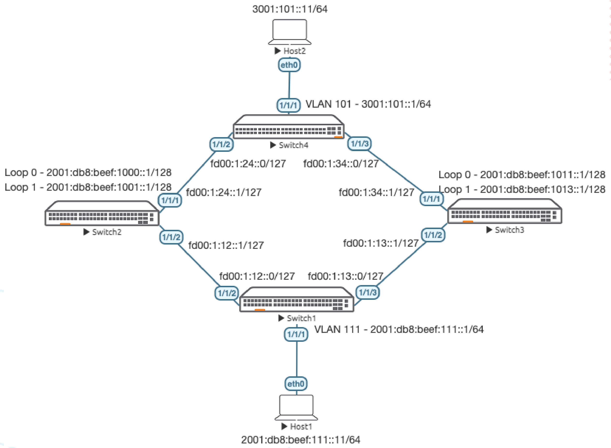

# Lab Guide: IPv6 Basics

> [!NOTE]
> This lab is based on the AOS-CX Switch Simulator Labs. A ```topology.clab.yaml``` file was added to use the lab with [containerlab](https://github.com/srl-labs/containerlab). 

> [!IMPORTANT]
> This guide assumes that the AOS-CX Switch Simulator is available as a docker container. You can use [vrnetlab](https://github.com/hellt/vrnetlab) to accomplish this.

>[!NOTE]
> This description is based on the AOS-CX Switch Simulator Lab Guide [IPv6 Basics](https://community.arubanetworks.com/HigherLogic/System/DownloadDocumentFile.ashx?DocumentFileKey=37f7349f-a1bb-4705-8c72-c80903e995ed) and includes all necessary changes to use the lab with [containerlab](https://github.com/srl-labs/containerlab).

## Lab Objective
This lab will provide hands on experience with IPv6 addressing, static routing and SLAAC.

Loopback, link local, unique local, global unicast, documentation addressing examples and route summarization are included as
part of this lab to help understand these basics.

## Lab Overview

This lab as shown in Figure 1 has the following different types of IPv6 addresses: loopback, link local, unique local, global
unicast, documentation addressing.

Refer to [IPv6 Address Types](https://www.ripe.net/manage-ips-and-asns/ipv6/ipv6-address-types) for an explanation of the different address types.

It’s recommended an IPv6 calculator such as [IPv4/IPv6 Subnet Calculator](http://www.gestioip.net/cgi-bin/subnet_calculator.cgi) be used to help understand
subnet summarization. User/device LAN subnets are standardized to subnets with /64 mask.

```3001:101::/64``` on Switch4 is considered a “Global Unicast Address” as it is part of the ```2000::/3``` range.

```2001:db8:beef:X::/128``` on Switch2 and Switch3 are considered part of the _Documentation_ ```2001:db8::/32``` range and are
_Loopbacks_ as they have /128 subnet mask.

```2001:db8:beef:111::/64``` on Switch1 is considered part of the _Documentation_ ```2001:db8::/32``` range.

```fd00:1:X::/127``` between Switches are part of the _Unique Local_ ```fc00::/7``` range, as a best practice /64 are reserved for inter switch
links but /127 are actually used, e.g. ```fd00:1:13::/64``` is reserved for Switch1 to Switch3 link, but ```fd00:1:13::/127``` is used as only 2
IPs are required on that link.

The objective of this lab is to:
- Provide IPv6 connectivity between the 2 hosts across the IPv6 network
- Implement static routes with summarized address to correctly provide network connectivity to the Loopbacks on Switch2
and Switch3 from the hosts

## Lab Network Layout
<a name="network-layout"></a>

_Figure 1: Lab Topology and Addresses_

## Lab Tasks

### Task 1: Lab Setup

For this lab refer to [Figure 1](#network-layout) for topology setup.
- Deploy the containerlab topology file: ```sudo containerlab deploy -t topology.clab.yaml``` (or use the [containerlab extension](https://containerlab.dev/manual/vsc-extension/) for Visual Studio Code)
  - All the connections between nodes are already set-up
  - Check that sufficient numbers of CPUs and RAM is available for three AOS-CX nodes (at least 1 vCPU and 2048 MB per node)
  - Ensure that the environment variable ```AOS_CX_VERSION``` is set to a value that matches the image version (default is ```latest```)
    - If ```AOS_CX_VERSION``` is not set, image ```vrnetlab/aruba_arubaos-cx:latest``` will be deployed
    - If ```AOS_CX_VERSION=20241115202521```, image ```vrnetlab/aruba_arubaos-cx:20241115202521``` will be deployed
- Open SSH session to each switch and log in with user 'admin' and password 'admin'.

On all devices, bring up required ports:
#### Switch 1 to 4
```
Switch[1-4]# configure terminal
Switch[1-4](config)#
```
Copy/Paste the configuration to all devices:
```
interface 1/1/1-1/1/6
  no shutdown
```
Leave configuration mode by pressing ```Ctrl-z```.

Validate LLDP neighbors appear as expected on each switch, e.g. Switch1:
```
Switch1# sh lldp neighbor-info 

LLDP Neighbor Information 
=========================

Total Neighbor Entries          : 2
Total Neighbor Entries Deleted  : 0
Total Neighbor Entries Dropped  : 0
Total Neighbor Entries Aged-Out : 0

LOCAL-PORT  CHASSIS-ID         PORT-ID                      PORT-DESC                    TTL      SYS-NAME    
-----------------------------------------------------------------------------------------------------------
1/1/2       08:00:09:19:c5:66  1/1/2                        1/1/2                        120      Switch2                            
1/1/3       08:00:09:b3:cd:88  1/1/2                        1/1/2                        120      Switch3 
```

### Task 2: Configure IPv6 Address and Interfaces

Configure interfaces, IPs and required VLANs on all four switches:

#### Switch 1

```
Switch1# configure terminal 
Switch1(config)# int 1/1/2
Switch1(config-if)# ipv6 address fd00:1:12::0/127
Switch1(config-if)# int 1/1/3
Switch1(config-if)# ipv6 address fd00:1:13::0/127
! You can think of /127 IPv6 links as equivalent to /31 IPv4 links
! Main difference is:
! IPv4 normally requires you to take a /24 and chop it into multiple /31s for each link
! IPv6 best practice is to reserve a unique /64 for each link and just use /127 to support
! 2 IPs on that link
Switch1(config)# vlan 111
Switch1(config-vlan-111)# int vlan 111
Switch1(config-if-vlan)# ipv6 address 2001:db8:beef:111::1/64
! User/device LAN subnets are standardized to /64 mask
Switch1(config-if-vlan)# no ipv6 nd suppress-ra dnssl
Switch1(config-if-vlan)# no ipv6 nd suppress-ra rdnss
! IPv6 Router Advertisements (RAs) are suppressed by default
! disable RA suppression so that IPv6 hosts are able to receive default gateway info
Switch1(config-if-vlan)# int 1/1/1
Switch1(config-if)# no routing
Switch1(config-if)# vlan access 111
```
Leave configuration mode by pressing ```Ctrl-z```.


#### Switch 2

```
Switch2(config)# int 1/1/2
Switch2(config-if)# ipv6 address fd00:1:12::1/127
Switch2(config-if)# int 1/1/1
Switch2(config-if)# ipv6 address fd00:1:24::1/127
Switch2(config-if)# int lo 0
Switch2(config-loopback-if)# ipv6 address 2001:db8:beef:1000::1/128
Switch2(config-loopback-if)# int lo 1
Switch2(config-loopback-if)# ipv6 address 2001:db8:beef:1001::1/128
```
Leave configuration mode by pressing ```Ctrl-z```.

#### Switch 3

```
Switch3(config)# int 1/1/2
Switch3(config-if)# ipv6 add fd00:1:13::1/127
Switch3(config-if)# int 1/1/1
Switch3(config-if)# ipv6 add fd00:1:34::1/127
Switch3(config-if)# int lo 0
Switch3(config-loopback-if)# ipv6 address 2001:db8:beef:1011::1/128
Switch3(config-loopback-if)# int lo 1
Switch3(config-loopback-if)# ipv6 address 2001:db8:beef:1013::1/128
```
Leave configuration mode by pressing ```Ctrl-z```.

#### Switch 4

```
Switch4(config)# int 1/1/2
Switch4(config-if)# ipv6 address fd00:1:24::0/127
Switch4(config-if)# int 1/1/3
Switch4(config-if)# ipv6 address fd00:1:34::0/127
Switch4(config-if)# vlan 101
Switch4(config-vlan-101)# int vlan 101
Switch4(config-if-vlan)# ipv6 address 3001:101::1/64
Switch4(config-if-vlan)# no ipv6 nd suppress-ra dnssl
Switch4(config-if-vlan)# no ipv6 nd suppress-ra rdnss
! RAs are suppressed by default
! disable RA suppression so that IPv6 hosts are able to receive default gateway info
Switch4(config-if-vlan)# int 1/1/1
Switch4(config-if)# no routing
Switch4(config-if)# vlan access 101
```
Leave configuration mode by pressing ```Ctrl-z```.

### Task 3: Verify Directly Connected IPs/Neighbors

On each switch, try to identify the different types of IPv6 addresses assigned.

> [!NOTE]
> Notice the link local address is based on MAC address of an interface, e.g. **08:00:09:92:a6:56** => fe80::**800**:**90**1:8**92**:**a656**/64/64

```
Switch4# show interface 1/1/2

Interface 1/1/2 is up 
 Admin state is up
 Link state: up for 33 minutes (since Sun Apr 13 16:39:50 UTC 2025)
 Link transitions: 0
 Description: 
 Persona: 
 Hardware: Ethernet, MAC Address: 
...
```
```
Switch4# show ipv6 interface 1/1/2
Interface 1/1/2 is up
 Admin state is up 
  IPv6 address:
    fd00:1:24::/127 [VALID]
  IPv6 link-local address: fe80::800:901:892:a656/64 [VALID]
 IPv6 virtual address configured: none
 IPv6 multicast routing: disable
 IPv6 Forwarding feature: enabled
 IPv6 multicast groups locally joined:
   ff02::1:ff92:a656  ff02::1  ff02::1:ff00:0  ff02::2  
...
```
Since IPv6 uses multicast instead of broadcast, identify the IPv6 multicast groups joined between switches, one of which is based on the link local address e.g. fe80::800:901:892:a656/64 => ff02::1:ff92:a656.

This link provides a good explanation of the notable [IPv6 multicast addresses](https://en.wikipedia.org/wiki/Multicast_address#Notable_IPv6_multicast_addresses)

On a neighbor switch, try pinging to the directly connected IP in the same subnet, both global unicast and link local should work.

```
Switch2# ping6 fd00:1:24::0
PING fd00:1:24::0(fd00:1:24::) 100 data bytes
108 bytes from fd00:1:24::: icmp_seq=1 ttl=64 time=34.7 ms
108 bytes from fd00:1:24::: icmp_seq=2 ttl=64 time=3.63 ms
108 bytes from fd00:1:24::: icmp_seq=3 ttl=64 time=2.90 ms
108 bytes from fd00:1:24::: icmp_seq=4 ttl=64 time=2.94 ms
108 bytes from fd00:1:24::: icmp_seq=5 ttl=64 time=2.94 ms

--- fd00:1:24::0 ping statistics ---
5 packets transmitted, 5 received, 0% packet loss, time 4005ms
rtt min/avg/max/mdev = 2.901/9.415/34.670/12.630 ms

Switch2# ping6 fe80::800:901:892:a656 source 1/1/1
ping6: Warning: source address might be selected on device other than: m1s1p1
PING fe80::800:901:892:a656(fe80::800:901:892:a656) from :: m1s1p1: 100 data bytes
108 bytes from fe80::800:901:892:a656%m1s1p1: icmp_seq=1 ttl=64 time=20.0 ms
108 bytes from fe80::800:901:892:a656%m1s1p1: icmp_seq=2 ttl=64 time=2.59 ms
108 bytes from fe80::800:901:892:a656%m1s1p1: icmp_seq=3 ttl=64 time=3.05 ms
108 bytes from fe80::800:901:892:a656%m1s1p1: icmp_seq=4 ttl=64 time=3.50 ms
108 bytes from fe80::800:901:892:a656%m1s1p1: icmp_seq=5 ttl=64 time=2.99 ms

--- fe80::800:901:892:a656 ping statistics ---
5 packets transmitted, 5 received, 0% packet loss, time 4004ms
rtt min/avg/max/mdev = 2.586/6.419/19.961/6.777 ms
```
You should also be able to view the ipv6 neighbor table:
```
Switch2# show ipv6 neighbors 

IPv6 Address                                   MAC                Port         Physical Port                                      State     
-------------------------------------------------------------------------------------------------------------------------------------------
fe80::2071:eff:fe10:bd5d                       22:71:0e:10:bd:5d  1/1/1        1/1/1                                             reachable  
fe80::a8c1:abff:fe61:68bf                      aa:c1:ab:61:68:bf  1/1/2        1/1/2                                             reachable  
fe80::800:901:892:a656                         08:00:09:92:a6:56  1/1/1        1/1/1                                             reachable  
fe80::148a:cdff:fe71:7ef8                      16:8a:cd:71:7e:f8  1/1/2        1/1/2                                             reachable  
fe80::a8c1:abff:fe47:12ac                      aa:c1:ab:47:12:ac  1/1/1        1/1/1                                             reachable  
fd00:1:24::                                    08:00:09:92:a6:56  1/1/1        1/1/1                                             reachable  

Total Number Of IPv6 Neighbors Entries Listed: 6.
-------------------------------------------------------------------------------------------------------------------------------------------
```

### Task 4: Configure Static Routes

On Switch2 and Switch3, configure static routes towards the host subnets:

#### Switch2
```
Switch2# configure terminal 
Switch2(config)# ipv6 route 3001:101::/64 fd00:1:24::
Switch2(config)# ipv6 route 2001:db8:beef:111::/64 fd00:1:12::
```
Leave configuration mode by pressing ```Ctrl-z```.


#### Switch3
```
Switch3# configure terminal 
Switch3(config)# ipv6 route 3001:101::/64 fd00:1:34::
Switch3(config)# ipv6 route 2001:db8:beef:111::/64 fd00:1:13::
```
Leave configuration mode by pressing ```Ctrl-z```.

On Switch1 and Switch4, configure remote host route and summary routes towards the loopbacks on Switch2 and Switch3.

Using the IPv6 calculator,
- Loopbacks on Switch2 could be summarized as ```2001:db8:beef:1000::/63``` or ```2001:db8:beef:1000::/62```
- Loopbacks on Switch3 could be summarized as ```2001:db8:beef:1010::/62``` or ```2001:db8:beef:1010::/61```
- Play around with the IPv6 calculator and utilize your preferred summarized route

#### Switch1
```
Switch1(config)# ipv6 route 2001:db8:beef:1000::/63 fd00:1:12::1
Switch1(config)# ipv6 route 2001:db8:beef:1010::/62 fd00:1:13::1
Switch1(config)# ipv6 route 3001:101::/64 fd00:1:12::1
Switch1(config)# ipv6 route 3001:101::/64 fd00:1:13::1
```
Leave configuration mode by pressing ```Ctrl-z```.


#### Switch4
```
Switch4(config)# ipv6 route 2001:db8:beef:111::/64 fd00:1:24::1
Switch4(config)# ipv6 route 2001:db8:beef:111::/64 fd00:1:34::1
Switch4(config)# ipv6 route 2001:db8:beef:1000::/63 fd00:1:24::1
Switch4(config)# ipv6 route 2001:db8:beef:1010::/62 fd00:1:34::1
```
Leave configuration mode by pressing ```Ctrl-z```.

Verify routes appear in routing table as expected on the switches, e.g. Switch4:
```
Switch4# show ipv6 route 

Displaying ipv6 routes selected for forwarding

Origin Codes: C - connected, S - static, L - local
              R - RIP, B - BGP, O - OSPF, D - DHCP
              U - Unnumbered
Type Codes:   E - External BGP, I - Internal BGP, V - VPN, EV - EVPN
              IA - OSPF internal area, E1 - OSPF external type 1
              E2 - OSPF external type 2

VRF: default

Prefix                                       Nexthop                                  Interface     VRF(egress)       Origin/   Distance/    Age
                                                                                                                      Type      Metric
---------------------------------------------------------------------------------------------------------------------------------------------------------
2001:db8:beef:111::/64                       fd00:1:24::1                             1/1/2         -                 S         [1/0]        00h:00m:59s  
                                             fd00:1:34::1                             1/1/3         -                           [1/0]        00h:00m:59s  
2001:db8:beef:1000::/63                      fd00:1:24::1                             1/1/2         -                 S         [1/0]        00h:00m:59s  
2001:db8:beef:1010::/62                      fd00:1:34::1                             1/1/3         -                 S         [1/0]        00h:00m:59s  
3001:101::/64                                -                                        vlan101       -                 C         [0/0]        -            
3001:101::1/128                              -                                        vlan101       -                 L         [0/0]        -            
fd00:1:24::/127                              -                                        1/1/2         -                 C         [0/0]        -            
fd00:1:24::/128                              -                                        1/1/2         -                 L         [0/0]        -            
fd00:1:34::/127                              -                                        1/1/3         -                 C         [0/0]        -            
fd00:1:34::/128                              -                                        1/1/3         -                 L         [0/0]        -            

Total Route Count : 9
```

### Task 5: Configure Hosts

>[!NOTE]
> Hosts are preconfigured according to [Figure 1](#network-layout)  (refer to ```topology.clab.yaml```).

#### Host1
```
[*]─[Host1]─[~]
└──> ip -6 address show
1: lo: <LOOPBACK,UP,LOWER_UP> mtu 65536 state UNKNOWN qlen 1000
    inet6 ::1/128 scope host 
       valid_lft forever preferred_lft forever
28: eth1@if29: <BROADCAST,MULTICAST,UP,LOWER_UP> mtu 9500 state UP 
    inet6 2001:db8:beef:111:a8c1:abff:fe88:c6e/64 scope global dynamic mngtmpaddr 
       valid_lft 2591613sec preferred_lft 604413sec
    inet6 2001:db8:beef:111::11/64 scope global 
       valid_lft forever preferred_lft forever
    inet6 fe80::a8c1:abff:fe88:c6e/64 scope link 
       valid_lft forever preferred_lft forever
[*]─[Host1]─[~]
└──> ip -6 route show
2001:db8:beef::/64 via 2001:db8:beef:111::1 dev eth1 metric 1024 pref medium
2001:db8:beef:111::/64 dev eth1 proto kernel metric 256 pref medium
3001:101::/64 via 2001:db8:beef:111::1 dev eth1 metric 1024 pref medium
fe80::/64 dev eth1 proto kernel metric 256 pref medium
default via fe80::800:980:6f30:1b3 dev eth1 proto ra metric 1024 expires 1434sec hoplimit 64 pref medium
```

#### Host2
```
[*]─[Host2]─[~]
└──> ip -6 address show
1: lo: <LOOPBACK,UP,LOWER_UP> mtu 65536 state UNKNOWN qlen 1000
    inet6 ::1/128 scope host 
       valid_lft forever preferred_lft forever
25: eth1@if24: <BROADCAST,MULTICAST,UP,LOWER_UP> mtu 9500 state UP 
    inet6 3001:101::a8c1:abff:fea6:926f/64 scope global dynamic mngtmpaddr 
       valid_lft 2591807sec preferred_lft 604607sec
    inet6 3001:101::11/64 scope global 
       valid_lft forever preferred_lft forever
    inet6 fe80::a8c1:abff:fea6:926f/64 scope link 
       valid_lft forever preferred_lft forever

[*]─[Host2]─[~]
└──> ip -6 route show
2001:db8:beef::/64 via 3001:101::1 dev eth1 metric 1024 pref medium
3001:101::/64 dev eth1 proto kernel metric 256 pref medium
fe80::/64 dev eth1 proto kernel metric 256 pref medium
default via fe80::800:980:6592:a656 dev eth1 proto ra metric 1024 expires 1597sec hoplimit 64 pref medium
```

### Task 6: Final Validation

Ensure unicast connectivity works between hosts and towards loopbacks, e.g. from Host1:

```
[*]─[Host1]─[~]
└──> ping6 3001:101::11
PING 3001:101::11(3001:101::11) 56 data bytes
64 bytes from 3001:101::11: icmp_seq=1 ttl=61 time=28.7 ms
64 bytes from 3001:101::11: icmp_seq=11 ttl=61 time=11.0 ms
64 bytes from 3001:101::11: icmp_seq=12 ttl=61 time=60.2 ms
^C
--- 3001:101::11 ping statistics ---
12 packets transmitted, 12 received, 0% packet loss, time 11012ms
rtt min/avg/max/mdev = 3.492/27.085/91.772/25.847 ms

[*]─[Host1]─[~]
└──> ping6 2001:db8:beef:1000::1
PING 2001:db8:beef:1000::1(2001:db8:beef:1000::1) 56 data bytes
64 bytes from 2001:db8:beef:1000::1: icmp_seq=1 ttl=63 time=5.51 ms
64 bytes from 2001:db8:beef:1000::1: icmp_seq=2 ttl=63 time=2.94 ms
64 bytes from 2001:db8:beef:1000::1: icmp_seq=3 ttl=63 time=2.97 ms
^C
--- 2001:db8:beef:1000::1 ping statistics ---
3 packets transmitted, 3 received, 0% packet loss, time 2003ms
rtt min/avg/max/mdev = 2.939/3.806/5.512/1.206 ms

[*]─[Host1]─[~]
└──> ping6 2001:db8:beef:1001::1
PING 2001:db8:beef:1001::1(2001:db8:beef:1001::1) 56 data bytes
64 bytes from 2001:db8:beef:1001::1: icmp_seq=1 ttl=63 time=9.11 ms
64 bytes from 2001:db8:beef:1001::1: icmp_seq=2 ttl=63 time=3.80 ms
64 bytes from 2001:db8:beef:1001::1: icmp_seq=3 ttl=63 time=2.51 ms
^C
--- 2001:db8:beef:1001::1 ping statistics ---
3 packets transmitted, 3 received, 0% packet loss, time 2002ms
rtt min/avg/max/mdev = 2.511/5.138/9.108/2.855 ms

[*]─[Host1]─[~]
└──> ping6 2001:db8:beef:1011::1
PING 2001:db8:beef:1011::1(2001:db8:beef:1011::1) 56 data bytes
64 bytes from 2001:db8:beef:1011::1: icmp_seq=1 ttl=63 time=19.8 ms
64 bytes from 2001:db8:beef:1011::1: icmp_seq=2 ttl=63 time=3.02 ms
64 bytes from 2001:db8:beef:1011::1: icmp_seq=3 ttl=63 time=3.95 ms
^C
--- 2001:db8:beef:1011::1 ping statistics ---
3 packets transmitted, 3 received, 0% packet loss, time 2002ms
rtt min/avg/max/mdev = 3.017/8.935/19.839/7.719 ms

[*]─[Host1]─[~]
└──> ping6 2001:db8:beef:1013::1
PING 2001:db8:beef:1013::1(2001:db8:beef:1013::1) 56 data bytes
64 bytes from 2001:db8:beef:1013::1: icmp_seq=1 ttl=63 time=2.43 ms
64 bytes from 2001:db8:beef:1013::1: icmp_seq=2 ttl=63 time=18.5 ms
64 bytes from 2001:db8:beef:1013::1: icmp_seq=3 ttl=63 time=2.62 ms
^C
--- 2001:db8:beef:1013::1 ping statistics ---
3 packets transmitted, 3 received, 0% packet loss, time 2003ms
rtt min/avg/max/mdev = 2.430/7.854/18.512/7.536 ms

[*]─[Host1]─[~]
└──> sudo traceroute -6 3001:101::11
traceroute to 3001:101::11 (3001:101::11), 30 hops max, 72 byte packets
 1  2001:db8:beef:111::1 (2001:db8:beef:111::1)  2.368 ms  2.709 ms  1.910 ms
 2  fd00:1:13::1 (fd00:1:13::1)  6.208 ms  fd00:1:12::1 (fd00:1:12::1)  5.511 ms  10.297 ms
 3  fd00:1:34:: (fd00:1:34::)  9.997 ms  15.048 ms  fd00:1:24:: (fd00:1:24::)  16.512 ms
 4  3001:101::11 (3001:101::11)  17.464 ms  30.706 ms  20.784 ms
```

### Task 7: SLAAC

You can also validate Stateless Address Autoconfiguration (SLAAC) IP assignment on your hosts by using:
```
[*]─[Host1]─[~]
└──> ip addr show
1: lo: <LOOPBACK,UP,LOWER_UP> mtu 65536 qdisc noqueue state UNKNOWN group default qlen 1000
    link/loopback 00:00:00:00:00:00 brd 00:00:00:00:00:00
    inet 127.0.0.1/8 scope host lo
       valid_lft forever preferred_lft forever
    inet6 ::1/128 scope host 
       valid_lft forever preferred_lft forever
2: eth0@if216: <BROADCAST,MULTICAST,UP,LOWER_UP> mtu 1500 qdisc noqueue state UP group default 
    link/ether 1e:33:55:8f:b3:21 brd ff:ff:ff:ff:ff:ff link-netnsid 0
    inet 172.19.0.4/16 brd 172.19.255.255 scope global eth0
       valid_lft forever preferred_lft forever
223: eth1@if222: <BROADCAST,MULTICAST,UP,LOWER_UP> mtu 9500 qdisc noqueue state UP group default 
    link/ether aa:c1:ab:8d:06:30 brd ff:ff:ff:ff:ff:ff link-netnsid 1
    inet6 2001:db8:beef:111:a8c1:abff:fe8d:630/64 scope global dynamic mngtmpaddr 
       valid_lft 2591817sec preferred_lft 604617sec
    inet6 2001:db8:beef:111::11/64 scope global 
       valid_lft forever preferred_lft forever
    inet6 fe80::a8c1:abff:fe8d:630/64 scope link 
       valid_lft forever preferred_lft forever
```
As you can see, not only the preconfigured IPv6 address ```2001:db8:beef:111::11/64``` is active. Also an EUI64 address ```2001:db8:beef:111:a8c1:abff:fe8d:630/64``` was automatically assigned by SLAAC: 2001:db8:beef:111:a8c1:ab**ff**:**fe**8d:630/64, built from interface MAC address ```aa:c1:ab:8d:06:30``` and IPv6 subnet prefix carried by the router advertisement ```2001:db8:beef:111::/64```.


## Appendix - Complete Configurations

If you face issues during your lab, you can verify your configs with the configs listed in this section.

If configs are the same, try powering off/powering on the switches to reboot them.

### Switch1
```
hostname Switch1
user admin group administrators password ciphertext AQBapYhC6Q7FsaR0kp7nDkdeykaYkuA1/3qkIRTa03AvV4CUYgAAALJ1l0RIcnAUlLhi7dHnZjipCjLDnaS53jsY7XKZnHdlJ2n1llSmaNjUhLtrgMSCQIt5f2lMi+FB7mQpj/ysFG9UsGOJBHtviB7OuNeHBmfCJ2NjFWEIvcn6O4d17d8oEM/u
ntp server pool.ntp.org minpoll 4 maxpoll 4 iburst
ntp enable
ntp vrf mgmt
!
!
!
!
!
!
ssh server vrf mgmt
vlan 1,111
interface mgmt
    no shutdown
    ip static 10.0.0.15/24
    default-gateway 10.0.0.2
interface 1/1/1
    no shutdown
    no routing
    vlan access 111
interface 1/1/2
    no shutdown
    ipv6 address fd00:1:12::/127
interface 1/1/3
    no shutdown
    ipv6 address fd00:1:13::/127
interface 1/1/4
    no shutdown
interface 1/1/5
    no shutdown
interface 1/1/6
    no shutdown
interface vlan 111
    ipv6 address 2001:db8:beef:111::1/64
    no ipv6 nd suppress-ra dnssl
    no ipv6 nd suppress-ra rdnss
ipv6 route 2001:db8:beef:1000::/63 fd00:1:12::1
ipv6 route 2001:db8:beef:1010::/62 fd00:1:13::1
ipv6 route 3001:101::/64 fd00:1:12::1
ipv6 route 3001:101::/64 fd00:1:13::1
!
!
!
!
!
https-server vrf mgmt
```

### Switch2
```
hostname Switch2
user admin group administrators password ciphertext AQBapQ4vCu+S8Bl4ZdchFq40S+fS8BA/uzKcjey1wLN0an2MYgAAAACb8k13mmd18WnoPkYT7MpcU8Rcdp7WqA5pCfY+Zwyx+2V424AO+pYks3KF8dRqrKdtamXuZb0a80sLthZn7DxNNocxAyPlcC9dSudx8UhGhvCORCZ4kifmdJ71IjVH3vsX
ntp server pool.ntp.org minpoll 4 maxpoll 4 iburst
ntp enable
ntp vrf mgmt
!
!
!
!
!
!
ssh server vrf mgmt
vlan 1
interface mgmt
    no shutdown
    ip static 10.0.0.15/24
    default-gateway 10.0.0.2
interface 1/1/1
    no shutdown
    ipv6 address fd00:1:24::1/127
interface 1/1/2
    no shutdown
    ipv6 address fd00:1:12::1/127
interface 1/1/3
    no shutdown
interface 1/1/4
    no shutdown
interface 1/1/5
    no shutdown
interface 1/1/6
    no shutdown
interface loopback 0
    ipv6 address 2001:db8:beef:1000::1/128
interface loopback 1
    ipv6 address 2001:db8:beef:1001::1/128
ipv6 route 2001:db8:beef:111::/64 fd00:1:12::
ipv6 route 3001:101::/64 fd00:1:24::
!
!
!
!
!
https-server vrf mgmt
```

### Switch3
```
hostname Switch3
user admin group administrators password ciphertext AQBapVFFWQXWN7VJGabI99hwRC5DpZa12DtrHxOqP2laAVNDYgAAAOfSAl592FkshreaLMZVpjJzmNpg7lNsC2S+9uJub2pWrC40S8vfPszhB51MwKAOrGFgN+0XZTI5nTA6llOt0bZyMpdfDEJ6XwajmUgUpqRqj5es2mlk4aOCfy7YOgnHD07j
ntp server pool.ntp.org minpoll 4 maxpoll 4 iburst
ntp enable
ntp vrf mgmt
!
!
!
!
!
!
ssh server vrf mgmt
vlan 1
interface mgmt
    no shutdown
    ip static 10.0.0.15/24
    default-gateway 10.0.0.2
interface 1/1/1
    no shutdown
    ipv6 address fd00:1:34::1/127
interface 1/1/2
    no shutdown
    ipv6 address fd00:1:13::1/127
interface 1/1/3
    no shutdown
interface 1/1/4
    no shutdown
interface 1/1/5
    no shutdown
interface 1/1/6
    no shutdown
interface loopback 0
    ipv6 address 2001:db8:beef:1011::1/128
interface loopback 1
    ipv6 address 2001:db8:beef:1013::1/128
ipv6 route 2001:db8:beef:111::/64 fd00:1:13::
ipv6 route 3001:101::/64 fd00:1:34::
!
!
!
!
!
https-server vrf mgmt
```

### Switch4
```
hostname Switch4
user admin group administrators password ciphertext AQBapQlOv/3UaZDag9/UcEHkoqk9dUTZ6sAcM9TrlLzChRTRYgAAAIdKE+ExL6fvCITE+BKILhs8tN/da64Q4RTeMj+wMAcEuS7QzFkqiVkHdFUzizebUypA5ZTPjOSNniQSGiAiJwKyEdy75QYro1dBZ6HCDRIL7FsGkzmCliJXXZjYH98lWK07
ntp server pool.ntp.org minpoll 4 maxpoll 4 iburst
ntp enable
ntp vrf mgmt
!
!
!
!
!
!
ssh server vrf mgmt
vlan 1,101
interface mgmt
    no shutdown
    ip static 10.0.0.15/24
    default-gateway 10.0.0.2
interface 1/1/1
    no shutdown
    no routing
    vlan access 101
interface 1/1/2
    no shutdown
    ipv6 address fd00:1:24::/127
interface 1/1/3
    no shutdown
    ipv6 address fd00:1:34::/127
interface 1/1/4
    no shutdown
interface 1/1/5
    no shutdown
interface 1/1/6
    no shutdown
interface vlan 101
    ipv6 address 3001:101::1/64
    no ipv6 nd suppress-ra dnssl
    no ipv6 nd suppress-ra rdnss
ipv6 route 2001:db8:beef:111::/64 fd00:1:24::1
ipv6 route 2001:db8:beef:111::/64 fd00:1:34::1
ipv6 route 2001:db8:beef:1000::/63 fd00:1:24::1
ipv6 route 2001:db8:beef:1010::/62 fd00:1:34::1
!
!
!
!
!
https-server vrf mgmt
```
